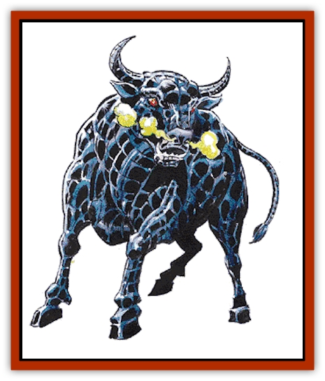

# Gorgon

| Statistic | **Gorgon** |
| --- | --- |
| **Activity Cycle:** | Day |
| **Alignment:** | Neutral |
| **Armor Class:** | 2 |
| **Climate/Terrain:** | Temperate or tropical/Wilderness or subterranean |
| **Damage/Attack:** | 2-12 |
| **Diet:** | Carnivore |
| **Frequency:** | Rare |
| **Hit Dice:** | 8 |
| **Intelligence:** | Animal (1) |
| **Magic Resistance:** | Nil |
| **Morale:** | Average (8-10) |
| **Movement:** | 12 |
| **No. Appearing:** | 1-4 |
| **No. of Attacks:** | 1 |
| **Organization:** | Group |
| **Size:** | L (8' tall) |
| **Special Attacks:** | See below |
| **Special Defenses:** | Nil |
| **THAC0:** | 13 |
| **Treasure:** | (E) |
| **XP Value:** | 1,400 |

Gorgons are fierce, bull-like beasts who make their lairs in dreary caverns or the fastness of a wilderness. They are aggressive by nature and usually attack any creature or person they encounter.

Monstrous black bulls, gorgons have hides of thick metal scales. Their breath is a noxious vapor that billows forth in great puffs from their wide, bull nostrils. Gorgons walk on two hooves, when necessary, but usually assume a four-hoofed stance. Despite their great size, they can move through even heavy forests with incredible speed, for they simply trample bushes and splinter smaller trees. Gorgons speak no languages but let out a roar of anger whenever they encounter other beings.

**Combat:** Four times per day gorgons can make a breath weapon attack (their preferred means of attack). Their breath shoots forth in a truncated cone, five feet wide at the base and 20 feet wide at its end, with a maximum range of 60 feet. Any creature caught in this cone must roll a saving throw vs. petrification. Those who fail are turned to stone immediately! The awareness of gorgons extends into the Astral and Ethereal planes, as do the effects of their breath weapon.

If necessary (i.e., their breath weapon fails) gorgons will engage in melee, charging forward to deliver a vicious head butt or horn gore. Gorgons fight with unrestricted ferocity, slashing and trampling all who challenge them until they themselves are slain.

**Habitat/Society:** It is believed that gorgons can actually devour the living statues they create with their breath weapon. Whether their flat iron teeth break up and pulverize the stone or their saliva returns the victim to flesh while they eat is a matter for conjecture.

Their primary prey are deer and elk, but gorgons won't hesitate to add other meats to their diet when hungry. Their sense of smell is acute and once they get on the trail gorgons are 75% likely to track their victim successfully. Once their victim is in sight, gorgons let out a scream of rage and then charge. Unless somehow evaded, a gorgon will pursue tirelessly, for days if necessary, until the prey either drops from exhaustion or is caught in the gorgon's deadly breath.

Gorgons have no use for treasure, hence gold and gems are often left petrified on the statue of the being that once wore them. Occasionally a gorgon in his haste will devour something of value; the items will later be left in the gorgon's droppings, somewhere near the entrance to its lair.

Gorgons are usually encountered in groups of three or four - one male bull with two or three females. Gorgon calves are raised by the females to the age of two, then the young bulls are turned out to make their own way. Females remain with the dominant bull.

About 25% of the time only a single gorgon is encountered. Lone gorgons are always rogue males in search of females.

The forest around a gorgon lair is usually a crisscrossing network of trails and paths they've made. Occasionally there are clearings where the grasses were trampled down in a battle and perhaps the shattered remains of a statue can be found.

**Ecology:** Gorgons have no natural enemies other than themselves. Bull gorgons are often called upon to defend their positions against rogue gorgons. These battles are not usually fatal, but even a gorgon can be felled by a well-aimed horn gore. The only other creature known to hunt these fierce predators is man.

Gorgon blood, properly prepared, can seal an area against ethereal or astral intrusion; their powdered scales are an ingredient in the ink used to create a *protection from petrification* scroll.

In addition, the hide of a gorgon can be fashioned, with considerable work and some magical enhancement, into a fine set of scale mail. This armor will provide the wearer with a +2 bonus to all saving throws vs. petrification or flesh-to-stone spells.

---
## Discovery & Documentation

**Source Publication:** MC2 Volume II (1993)
**Campaign Setting:** Advanced Dungeons & Dragons 2nd Edition
**Author(s):** Jay Batista, Scott Bennie, Grant Boucher, William W. Connors, Steve Gilbert, Heike Kubasch, James Lowder, David Edward Martin, Bruce Nesmith, Jean Rabe, Rick Swan, John J. Terra, Gary L. Thomas

### Other Creatures Found in This Source Book
   * [[Ant|Ant]]
   * [[Ant_Lion_Giant|Ant Lion, Giant]]
   * [[Ape_Carnivorous|Ape, Carnivorous]]
   * [[Baboon|Baboon]]
   * [[Badger|Badger]]
   * [[Barracuda|Barracuda]]
   * [[Beetle_Giant|Beetle, Giant]]
   * [[Bulette|Bulette]]
   * [[Bullywug|Bullywug]]
   * [[Dwarf_Duergar|Dwarf, Duergar]]
   * [[Dwarf_Gully|Dwarf, Gully]]
   * [[Eagle|Eagle]]
   * [[Eel|Eel]]
   * [[Elemental_Air_Kin|Elemental, Air Kin]]
   * [[Elemental_Water_Kin|Elemental, Water Kin]]
   * [[Elemental_Water_Kin_Water_Weird|Elemental, Water Kin, Water Weird]]
   * [[Firestar|Firestar]]
   * [[Firetail|Firetail]]
   * [[Fish_Giant|Fish, Giant]]
   * [[Frog|Frog]]
   * [[Hawk|Hawk]]
   * [[Heucuva|Heucuva]]
   * [[Hippocampus|Hippocampus]]
   * [[Hippogriff|Hippogriff]]
   * [[Kelpie|Kelpie]]
   * [[Kenku|Kenku]]
   * [[Killmoulis|Killmoulis]]
   * [[Kuo-Toa|Kuo-Toa]]
   * [[Lamia|Lamia]]
   * [[Lammasu|Lammasu]]
   * [[Lamprey|Lamprey]]
   * [[Leech|Leech]]
   * [[Leprechaun|Leprechaun]]
   * [[Leucrotta|Leucrotta]]
   * [[Locathah|Locathah]]
   * [[Lycanthrope_Wereboar|Lycanthrope, Wereboar]]
   * [[Lycanthrope_Werefox|Lycanthrope, Werefox]]
   * [[Mammal_Minimal|Mammal, Minimal]]
   * [[Mammal_Small|Mammal, Small]]
   * [[Mimic|Mimic]]
   * [[Morkoth|Morkoth]]
   * [[Muckdweller|Muckdweller]]
   * [[Myconid|Myconid]]
   * [[Naga|Naga]]
   * [[Obliviax|Obliviax]]
   * [[Octopus_Giant|Octopus, Giant]]
   * [[Otyugh|Otyugh]]
   * [[Piranha|Piranha]]
   * [[Plant_Dangerous_I|Plant, Dangerous I]]
   * [[Plant_Intelligent|Plant, Intelligent]]
   * [[Poltergeist|Poltergeist]]
   * [[Porcupine|Porcupine]]
   * [[Rat_Osquip|Rat, Osquip]]
   * [[Roc|Roc]]
   * [[Roper|Roper]]
   * [[Rot_Grub|Rot Grub]]
   * [[Rust_Monster|Rust Monster]]
   * [[Sahuagin|Sahuagin]]
   * [[Sea_Lion|Sea Lion]]
   * [[Sea_Horse_Giant|Sea Horse, Giant]]
   * [[Shambling_Mound|Shambling Mound]]
   * [[Shark|Shark]]
   * [[Sphinx|Sphinx]]
   * [[Squid_Giant|Squid, Giant]]
   * [[Stirge|Stirge]]
   * [[Swanmay|Swanmay]]
   * [[Tarrasque|Tarrasque]]
   * [[Tasloi|Tasloi]]
   * [[Triton|Triton]]
   * [[Troglodyte|Troglodyte]]
   * [[Urchin|Urchin]]
   * [[Urd|Urd]]
   * [[Weasel|Weasel]]
   * [[Wolverine|Wolverine]]
   * [[Yellow_Musk_Creeper|Yellow Musk Creeper]]
