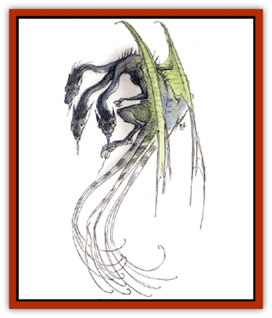

# Gorynych

| Statistic | **Gorynych** |
| --- | --- |
| **Activity Cycle:** | Any |
| **Alignment:** | Chaotic evil |
| **Armor Class:** | 4 |
| **Climate/Terrain:** | Temperate motmtains/subterranean |
| **Damage/Attack:** | 1d8 (&times;2)/1d12 (&times;3) |
| **Diet:** | Carnivore |
| **Frequency:** | Very rare |
| **Hit Dice:** | 9 |
| **Intelligence:** | Average (8-10) |
| **Magic Resistance:** | Nil |
| **Morale:** | Steady (11-12) |
| **Movement:** | 9, Fl 18 (E) |
| **No. Appearing:** | 1 |
| **No. of Attacks:** | 5 |
| **Organization:** | Solitary |
| **Size:** | G (50' long) |
| **Special Attacks:** | Tail capture, &ldquo;wishboning&rdquo; |
| **Special Defenses:** | Difficult to surprise |
| **THAC0:** | 11 |
| **Treasure:** | H |
| **XP Value:** | 2,000 |

The gorynych is unlikely to be mistaken for a true [[Dragon_General_Information|dragon]] if seen in good light. It has a long and supple body covered with tiny blue-green scales, and it has wings. However, it also has three wolfish heads and a multitude of tails, starting as three thick ones at the base of the spine, but eventually dividing out to as many as 12 whip-thin tails.

The gorynych is not well versed in speech and has no language of its own. If there is a race that is dominant in the regions around its lair, it will have a slight understanding of this race's tongue, no matter what it is, but that is the extent of the beast's linguistic knowledge. If its lair is in an empty tract of land, it has no language at all, as there would be no creatures with which to converse (and it doesn't talk to itself).

**Combat:** Although the gorynych has no breath weapon, it is a fearsome fighter. It first whips its flexible tails about in an attempt to entangle opponents, each tail striking as a separate attack. Then it uses two claws and three biting attacks on entrapped foes. The tails inflict no damage, but for every tail that holds a man-sized victim (smaller creatures are usually ignored), the gorynych jets a cumulative +1 attack bonus against that victim. Thus, if it wraps two tails around a fighter, the gorynych can attack at +2 that round, and if the fighter fails to eliminate or escape the two tails, it can wrap more tails around him at +2 to hit in the next round. Each tail sustains 2d6 damage before being severed, and none of these hit points are counted in the monster's hit-point total; even if rendered tailless, a gorynych will continue to fight if victory appears close. When first caught in one of these tails, the victim has a 10% chance of being held in such an awkward position that he can't attack the gorynych (25% on rare occasions when a smaller-than-man-sized creature is attacked).

Another attack form unique to the gorynych is called "wishboning". If the beast scores hits on a single opponent with at least two of its heads in a round, it will try to rip the victim in half between them, inflicting an additional 2d6 points of damage. It cannot do so automatically in subsequent rounds, as it must get a new grip (and make a new series of attacks).

The gorynych has only one personality divided between its three brains, and each one is capable of directing the entire body on its own. Thus, cutting off two of the heads will not disable its thinking or hinder its movements in any way.

Having six dragon-sharp ears to hear with, the gorynych is difficult to surprise, even when asleep; it gets a +2 bonus on all surprise rolls. In addition, since it has more than one head, it cannot be attacked from behind, as it p�rs in all directions.

**Habitat/Society:** The gorynych prefers windy and desolate regions. It lives in deep caverns, and the long, winding tunnels of its lair are full of evidence of its presence: scales scrapped off on the rocks, claw marks, the occasional coin or gem dropped from its mouth when stocking its hoard, and the rare bone that misses the periodic cleaning out of refuse. While the creature avoids areas where human incursions are frequent, it is intelligent enough to note any roadways, caravan paths, and isolated settlements within a few hours' flight of its cave, so it has little trouble finding food and treasure.

Gorynyches reproduce by laying eggs, but the young are forced out into the world as soon as possible after hatching. The young grow rapidly, attaining full growth in nine years and living for about 400 years total.

**Ecology:** Gorynyches are usually the most powerful carnivores in their local food chain. They rarely interact with other species, intelligent or not. However, they are often attacked by other highly competitive and magically powerful monsters such as dragons and [[Beholder_and_Beholder-kin_I|beholders]].

---
## Discovery & Documentation

**Source Publication:** Monstrous Compendium, 1994 Annual, Volume 1 (1995)
**Campaign Setting:** Advanced Dungeons & Dragons 2nd Edition
**Author(s):** David Wise

### Other Creatures Found in This Source Book
   * [[Abyss_Ant|Abyss Ant]]
   * [[Achaierai|Achaierai]]
   * [[Afanc|Afanc]]
   * [[Al-Jahar|Al-Jahar]]
   * [[Baelnorn|Baelnorn]]
   * [[Baneguard|Baneguard]]
   * [[Banelar|Banelar]]
   * [[Bird_Talking|Bird, Talking]]
   * [[Blazing_Bones|Blazing Bones]]
   * [[Campestri|Campestri]]
   * [[Caniquine|Caniquine]]
   * [[Cat_Winged|Cat, Winged]]
   * [[Crypt_Servant|Crypt Servant]]
   * [[Death's_Head_Tree|Death's Head Tree]]
   * [[Dog_Saluqi|Dog, Saluqi]]
   * [[Dragon_Electrum|Dragon, Electrum]]
   * [[Dragon_Fang|Dragon, Fang]]
   * [[Dragon_Linnorm_Corpse_Tearer|Dragon, Linnorm, Corpse Tearer]]
   * [[Dragon_Linnorm_Dread|Dragon, Linnorm, Dread]]
   * [[Dragon_Linnorm_Flame|Dragon, Linnorm, Flame]]
   * [[Dragon_Linnorm_Forest|Dragon, Linnorm, Forest]]
   * [[Dragon_Linnorm_Frost|Dragon, Linnorm, Frost]]
   * [[Dragon_Linnorm_Gray|Dragon, Linnorm, Gray]]
   * [[Dragon_Linnorm_Land|Dragon, Linnorm, Land]]
   * [[Dragon_Linnorm_Midgard|Dragon, Linnorm, Midgard]]
   * [[Dragon_Linnorm_Rain|Dragon, Linnorm, Rain]]
   * [[Dragon_Linnorm_Sea|Dragon, Linnorm, Sea]]
   * [[Dragon_Neutral_Jacinth|Dragon, Neutral, Jacinth]]
   * [[Dragon_Neutral_Jade|Dragon, Neutral, Jade]]
   * [[Dragon_Neutral_Pearl|Dragon, Neutral, Pearl]]
   * [[Dread|Dread]]
   * [[Dragon-kin|Dragon-kin]]
   * [[Elemental_Earth_Kin_Chrysmal|Elemental, Earth Kin, Chrysmal]]
   * [[Elemental_Earth_Kin_Earth_Weird|Elemental, Earth Kin, Earth Weird]]
   * [[Elemental_Fire_Kin_Azer|Elemental, Fire Kin, Azer]]
   * [[Elemental_Sandman|Elemental, Sandman]]
   * [[Elemental_Wind_Walker|Elemental, Wind Walker]]
   * [[Elemental_Vermin|Elemental Vermin]]
   * [[Feystag|Feystag]]
   * [[Flame_Skull|Flame Skull]]
   * [[Foulwing|Foulwing]]
   * [[Gambado|Gambado]]
   * [[Garbug|Garbug]]
   * [[Genie_Tasked_Administrator|Genie, Tasked, Administrator]]
   * [[Genie_Tasked_Deceiver|Genie, Tasked, Deceiver]]
   * [[Genie_Tasked_Harim_Servant|Genie, Tasked, Harim Servant]]
   * [[Genie_Tasked_Messenger|Genie, Tasked, Messenger]]
   * [[Genie_Tasked_Miner|Genie, Tasked, Miner]]
   * [[Genie_Tasked_Oathbinder|Genie, Tasked, Oathbinder]]
   * [[Gibbering_Mouther|Gibbering Mouther]]
   * [[Gnasher|Gnasher]]
   * [[Gnasher_Winged|Gnasher, Winged]]
   * [[Golem_Brain|Golem, Brain]]
   * [[Golem_Hammer|Golem, Hammer]]
   * [[Golem_Metagolem|Golem, Metagolem]]
   * [[Golem_Spiderstone|Golem, Spiderstone]]
   * [[Greelox|Greelox]]
   * [[Helmed_Horror|Helmed Horror]]
   * [[Jarbo|Jarbo]]
   * [[Laraken|Laraken]]
   * [[Lich_Psionic|Lich, Psionic]]
   * [[Living_Steel|Living Steel]]
   * [[Lock_Lurker|Lock Lurker]]
   * [[Loxo|Loxo]]
   * [[Lycanthrope_Loup_de_Noir|Lycanthrope, Loup de Noir]]
   * [[Lycanthrope_Werebadger|Lycanthrope, Werebadger]]
   * [[Lycanthrope_Werejaguar|Lycanthrope, Werejaguar]]
   * [[Lythlyx|Lythlyx]]
   * [[Magebane|Magebane]]
   * [[Marrashi|Marrashi]]
   * [[Metalmaster|Metalmaster]]
   * [[Mimic_House_Hunter|Mimic, House Hunter]]
   * [[Naga_Bone|Naga, Bone]]
   * [[Nautilus_Giant|Nautilus, Giant]]
   * [[Nightshade_Toril|Nightshade (Toril)]]
   * [[Nishruu|Nishruu]]
   * [[Noran|Noran]]
   * [[Opinicus|Opinicus]]
   * [[Ormyrr|Ormyrr]]
   * [[Parasite|Parasite]]
   * [[Pasari-Niml|Pasari-Niml]]
   * [[Plant_Vampire_Moss|Plant, Vampire Moss]]
   * [[Pteraman|Pteraman]]
   * [[Rautym|Rautym]]
   * [[Shadeling|Shadeling]]
   * [[Skum|Skum]]
   * [[Snake_Giant_Cobra|Snake, Giant Cobra]]
   * [[Snake_Stone|Snake, Stone]]
   * [[Spectral_Wizard|Spectral Wizard]]
   * [[Spell_Weaver|Spell Weaver]]
   * [[Spider_Brain|Spider, Brain]]
   * [[Suwyze|Suwyze]]
   * [[Tatalla|Tatalla]]
   * [[Tick_Heart|Tick, Heart]]
   * [[Tree_Dark|Tree, Dark]]
   * [[Tree_Singing|Tree, Singing]]
   * [[Tressym|Tressym]]
   * [[Troll_Snow|Troll, Snow]]
   * [[Tuyewera|Tuyewera]]
   * [[Ulitharid|Ulitharid]]
   * [[Undead_Dwarf|Undead Dwarf]]
   * [[Undead_Lake_Monster|Undead Lake Monster]]
   * [[Whipsting|Whipsting]]
   * [[Windghost|Windghost]]
   * [[Wolf_Dread|Wolf, Dread]]
   * [[Wolf_Stone|Wolf, Stone]]
   * [[Wolf_Vampiric|Wolf, Vampiric]]
   * [[Wraith_Shimmering|Wraith, Shimmering]]
   * [[Xantravar|Xantravar]]
   * [[Xaver|Xaver]]
