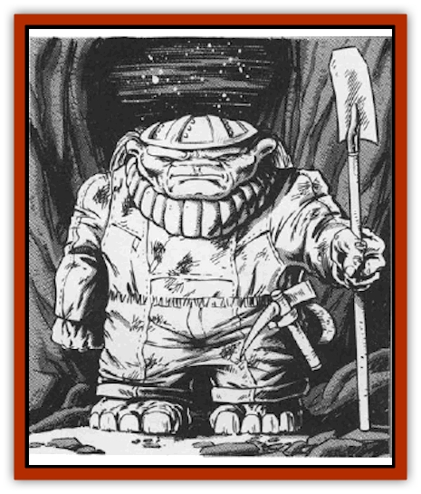

# Grav

| Statistic | **Grav** |
| --- | --- |
| **Activity Cycle:** | Any |
| **Alignment:** | Lawful neutral |
| **Armor Class:** | 10 (Elite: 6 (10)) |
| **Climate/Terrain:** | Any |
| **Damage/Attack:** | 1d8 (weapon) |
| **Diet:** | Omnivore |
| **Frequency:** | Uncommon (Elite: Rare) |
| **Hit Dice:** | 3+1 (Elite: 5+1) |
| **Intelligence:** | Low (6) (Elite: High (13)) |
| **Magic Resistance:** | Nil |
| **Morale:** | Steady (13) (Elite: Elite (14)) |
| **Movement:** | 9 |
| **No. Appearing:** | 6-60 (Elite: 1 per 30 miners) |
| **No. of Attacks:** | 1 |
| **Organization:** | Clan |
| **Size:** | S (3') |
| **Special Attacks:** | Gravity reduction |
| **Special Defenses:** | None |
| **THAC0:** | 17 (Elite: 15) |
| **Treasure:** | J (Elite: R (E)) |
| **XP Value:** | 270 (Elite: 650) |

Gravs are short, stocky humanoids who manipulate gravity. They mine ore and gems from unclaimed asteroids and moons. A grav is short, squat and square, with a small head in comparison to the rest of its body. Gravs are as tall as [[Dwarf|dwarves]] but are wider at the shoulders. Miners wear dingy gray clothes and mining gear such as helmets, gloves, and belts.

The Elite are thinner than their worker minions but are still squat. They wear refined, foppish clothing and seldom sully their hands with manual labor. Some Elite wear leather protection under their showy clothing - hence the lower Armor Class.

All gravs are dense, with three times the mass of a being of a similar size. This increases their air envelope, allowing them more time to search wildspace for potential mining sites.

**Combat:** Gravs are a peaceful race, intent on their mining and leaving other races alone. If provoked, however, gravs retaliate by reducing gravity beneath a target (and thus its weight). A grav can only affect one target at a time, with a range of 60'. However, the target can contain many objects; for instance, after mining gems, the grams move them into large crates and then float the crates aboard ship.

The grav can reduce the target's weight by 25% per round. After four rounds, the target begins to float. The grav can make the target hover or float away. When the target floats beyond the grav's range, it plummets to the nearest gravity plane.

The grav can just drop the target or gently lower it to the ground. If a grav's concentration is disrupted, as by a blow, the target drops immediately, taking normal falling damage.

Gravs use this power to intimidate and scare their opponents away. If confronted, a grav first demonstrates its power on an inanimate object. If this intimidation doesn't work, the grav suspends the opponent in the air, incapacitating it.

Though peaceful by nature, gravs hate [[Silatic|silatics]], which eat metal. Even the Elite attack silatics on sight.

**Habitat/Society:** In the strictly hierarchical grav society, the Elite order the Miners (workers), who obey almost without thinking. Miners who question this centuries-old structure are promptly "brought in for questioning" and "moved to a position better fitting their talents" - servitude to some minor Elite on the homeworld. This is ultimate shame.

If characters try to subvert Miners against their overseers, the Elite politely ask the characters to leave the area. If they persist, the gravs remove them without harm.

Elite gravs can use spells and advance to 9th level. The wizards power the Argosy, the grav's standard ship.

An Argosy resembles a small dwarves Citadel. The ship's stone surface is pitted like a moon; some craters are concealed portholes. One part is flattened, allowing it to land and take on precious cargo. (Most of the ship's interior is cargo space for ore and gems. Both Miners and their Elite overseers sleep in the cargo bays.) The Argosy's armaments are strictly for defense.

**Ecology:** The name and location of the grav homeworld are unknown. Conversations with Elite gravs reveal that their homeworld is divided into fiefdoms, each ruled by one Elite family. Family prestige depends on wealth.

Some say the scarcity of information about their homeworld represents the Elite's attempt to foil potential thieves. However, thievery is totally alien to the grav race. Any thought or suggestion of stealing merely puzzles a grav. The Elite may maintain secrecy to prevent outsiders from disrupting the social system that keeps them in power.

---
## Discovery & Documentation

**Source Publication:** MC9 Spelljammer Appendix II (1991)
**Campaign Setting:** Planescape
**Author(s):** Scott Davis, Newton Ewell, John Terra

### Other Creatures Found in This Source Book
   * [[Alchemy_Plant|Alchemy Plant]]
   * [[Allura|Allura]]
   * [[Aperusa|Aperusa]]
   * [[Autognome|Autognome]]
   * [[Bionoid|Bionoid]]
   * [[Bloodsac|Bloodsac]]
   * [[Buzzjewel|Buzzjewel]]
   * [[Constellate|Constellate]]
   * [[Contemplator|Contemplator]]
   * [[Dohwar|Dohwar]]
   * [[Dragon_Moon|Dragon, Moon]]
   * [[Dragon_Stellar|Dragon, Stellar]]
   * [[Dragon_Sun|Dragon, Sun]]
   * [[Dreamslayer|Dreamslayer]]
   * [[Dweomerborn|Dweomerborn]]
   * [[Fal|Fal]]
   * [[Feesu|Feesu]]
   * [[Fire_Bat|Fire Bat]]
   * [[Firebird|Firebird]]
   * [[Firelich|Firelich]]
   * [[Flowfiend|Flowfiend]]
   * [[Gadabout|Gadabout]]
   * [[Gammaroid|Gammaroid]]
   * [[Gonn|Gonn]]
   * [[Gossamer|Gossamer]]
   * [[Great_Dreamer|Great Dreamer]]
   * [[Greatswan|Greatswan]]
   * [[Grell_Colonial|Grell, Colonial]]
   * [[Gullion|Gullion]]
   * [[Insectare|Insectare]]
   * [[Lhee|Lhee]]
   * [[Mercurial_Slime|Mercurial Slime]]
   * [[Meteorspawn|Meteorspawn]]
   * [[Monitor|Monitor]]
   * [[Owl_Space|Owl, Space]]
   * [[Pristatic|Pristatic]]
   * [[Scro|Scro]]
   * [[Selkie_Star|Selkie, Star]]
   * [[Silatic|Silatic]]
   * [[Skullbird|Skullbird]]
   * [[Sleek|Sleek]]
   * [[Sluk|Sluk]]
   * [[Space_Swine|Space Swine]]
   * [[Sphinx_Astro-|Sphinx, Astro-]]
   * [[Spirit_Warrior|Spirit Warrior]]
   * [[Starfly_Plant|Starfly Plant]]
   * [[Stargazer|Stargazer]]
   * [[Undead_Stellar|Undead, Stellar]]
   * [[Witchlight_Marauder|Witchlight Marauder]]
   * [[Xixchil|Xixchil]]
   * [[Yitsan|Yitsan]]
   * [[Zurchin|Zurchin]]
