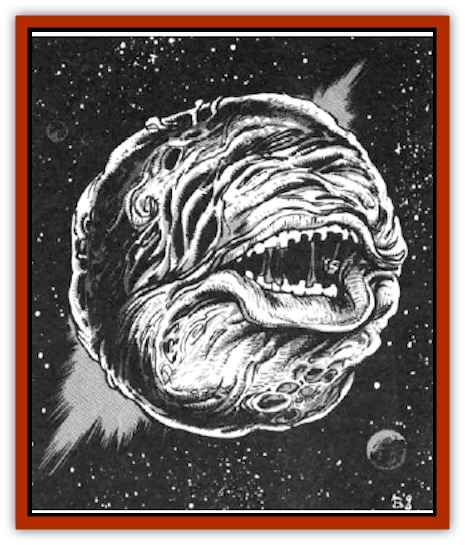

# Gravislayer

| Statistic | **Gravislayer** |
| --- | --- |
| **Activity Cycle:** | Constant |
| **Alignment:** | Neutral evil |
| **Armor Class:** | 0 |
| **Climate/Terrain:** | Wildspace, asteroid fiends |
| **Damage/Attack:** | Nil |
| **Diet:** | Nil |
| **Frequency:** | Very rare |
| **Hit Dice:** | 8+1 |
| **Intelligence:** | Semi- (2-4) |
| **Magic Resistance:** | Nil |
| **Morale:** | Steady (11-12) |
| **Movement:** | 24 |
| **No. Appearing:** | 1 |
| **No. of Attacks:** | 0 |
| **Organization:** | Solitary |
| **Size:** | M (6' diameter) |
| **Special Attacks:** | Gravity slam |
| **Special Defenses:** | Nil |
| **THAC0:** | 13 |
| **Treasure:** | Nil |
| **XP Value:** | 3,000 |

The gravislayer is a navigational hazard hated by spelljammers throughout the Known Sphere. Its unremarkable body hides one of the most destructive forces known.

The gravislayer's body is a sphere of flesh roughly six feet in diameter, scarred and pitted from the rigors of deep space patrolling. There are no eyes, ears, or other features readily visible on its grayish surface; there is a large mouth that opens up only during feeding. A gravislayer feeds on the crushed flesh and bone of unsuspecting spacefarers that are smashed to bits by the creature's deadly command of gravity.

**Combat:** The gravislayer's weapon is its ability to change gravity. It can turn any single object within 150 yards into a powerful gravity source. That object may be a living being, an asteroid, or even a character. The objects remains a gravity source for as long as the gravislayer concentrates.

The gravislayer's weapon relies on two things: the availability of objects to fall onto new gravity sources and how far those objects fall before impact.

Availability of Objects: Anything that falls for a period of time picks up great momentum and causes vast damage upon impact. A gravislayer usually turns its victims into gravity sources, hoping that asteroids will fall upon them to destroy them.

For purposes of gravislayer combat, asteroids are divided into three categories. Pebbles are stones weighing less than one pound. Boulders weigh in the neighborhood of 100-1,000 pounds. Finally, planetoids weigh more than 10,000 pounds. Note: Every object, be it an asteroid, piece of a spaceship, or a chest of gold, should be places into one of these categories.

The numbers and sizes of asteroids available to a gravislayer depend upon its immediate surroundings.

|  | Deep Space | Orbit | Rings | Asteroid Field |
| --- | --- | --- | --- | --- |
| Pebble | 1d4-2 | 1d4-1 | 2d6 | 2d6 |
| Boulder | 1d4-3 | 0 | 1d6 | 2d6 |
| Planetoid | 0 | 0 | 0 | 1d4-2 |

Falling Time: Each asteroid, regardless of size, takes 1d6 rounds to fall onto the target (roll for each asteroid). The damage caused depends on the asteroid size and on the number of rounds it fell. A successful saving throw vs. breath weapon negates all damage inflicted by pebbles and boulders and half damage from planetoids.

|  | 1 | 2 | 3 | 4 | 5 | 6 |
| --- | --- | --- | --- | --- | --- | --- |
| Pellet | 1d4 | 3d4 | 6d4 | 10d4 | 15d4 | 21d4 |
| Boulder | 1d6 | 3d6 | 6d6 | 10d6 | 15d6 | 21d6 |
| Planetoid | 1d12 | 3d12 | 6d12 | 10d12 | 15d12 | 21d12 |

|  | 1 | 2 | 3 | 4 | 5 | 6 |
| --- | --- | --- | --- | --- | --- | --- |
| Pellet | 1d4 | 2d4 | 3d4 | 4d4 | 5d4 | 6d4 |
| Boulder | 1d6 | 2d6 | 3d6 | 4d6 | 5d6 | 6d6 |
| Planetoid | 1d12 | 2d12 | 3d12 | 4d12 | 5d12 | 6d12 |

If the gravislayer is destroyed before the asteroids strike the target, those asteroids are then much easier to avoid (roll a saving throw vs. breath weapon against each, with a bonus of 5, plus 2 for every round until impact). Common tactics for ship crews is to immediately locate gravislayers and destroy them as quickly as possible, then deal with the falling asteroids.

**Habitat/Society:** Gravislayers have no known planet of origin or societal inclinations. Shipboard tales speak of a cult of nebulords, wizards of tremendous power, who were enemies of the [[Reigar|reigar]]. The nebulords created gravislayers for their own purposes, turning them loose throughout space.

**Ecology:** No gravislayers have ever been captured for examination, so their means of reproduction is uncertain. They may have none. A gravislayer is immune to the gravity that it creates. It is not, however, immune to naturally occurring gravity.

---
## Discovery & Documentation

**Source Publication:** MC7 Spelljammer Appendix I (1990)
**Campaign Setting:** Advanced Dungeons & Dragons 2nd Edition
**Author(s):** various

### Other Creatures Found in This Source Book
   * [[Aartuk|Aartuk]]
   * [[Albari|Albari]]
   * [[Ancient_Mariner|Ancient Mariner]]
   * [[Argos|Argos]]
   * [[Beholder_Abomination_Astereater|Beholder (Abomination), Astereater]]
   * [[Blazozoid|Blazozoid]]
   * [[Chattur|Chattur]]
   * [[Chevall|Chevall]]
   * [[Clockwork_Horror|Clockwork Horror]]
   * [[Colossus|Colossus]]
   * [[Delphinid|Delphinid]]
   * [[Dizantar|Dizantar]]
   * [[Dog|Dog]]
   * [[Dog_Bog_Hound|Dog, Bog Hound]]
   * [[Esthetic|Esthetic]]
   * [[Focoid|Focoid]]
   * [[Fractine|Fractine]]
   * [[Giant_Spacesea|Giant, Spacesea]]
   * [[Golem_Furnace|Golem, Furnace]]
   * [[Golem_Radiant|Golem, Radiant]]
   * [[Grommam|Grommam]]
   * [[Hadozee|Hadozee]]
   * [[Hamster_Giant_Space|Hamster, Giant Space]]
   * [[Jammer_Leech|Jammer Leech]]
   * [[Lakshu|Lakshu]]
   * [[Lumineaux|Lumineaux]]
   * [[Lutum|Lutum]]
   * [[Mimic_Space|Mimic, Space]]
   * [[Misi|Misi]]
   * [[Moon_Rogue|Moon, Rogue]]
   * [[Mortiss|Mortiss]]
   * [[Murderoid|Murderoid]]
   * [[Nay-Churr|Nay-Churr]]
   * [[Phlog-Crawler|Phlog-Crawler]]
   * [[Plasman|Plasman]]
   * [[Plasmoid_DeGleash|Plasmoid, DeGleash]]
   * [[Plasmoid_DelNoric|Plasmoid, DelNoric]]
   * [[Plasmoid_General_Information|Plasmoid, General Information]]
   * [[Plasmoid_Ontalak|Plasmoid, Ontalak]]
   * [[Puffer|Puffer]]
   * [[Q'nidar|Q'nidar]]
   * [[Rastipede|Rastipede]]
   * [[Reigar|Reigar]]
   * [[Rock_Hopper|Rock Hopper]]
   * [[Slinker|Slinker]]
   * [[Spider_Asteroid|Spider, Asteroid]]
   * [[Spiritjam|Spiritjam]]
   * [[Survivor|Survivor]]
   * [[Syllix|Syllix]]
   * [[Symbiont_Power|Symbiont, Power]]
   * [[Vine_Infinity|Vine, Infinity]]
   * [[Wiggle|Wiggle]]
   * [[Wizshade|Wizshade]]
   * [[Wryback|Wryback]]
   * [[Zard|Zard]]
   * [[Zodar|Zodar]]
