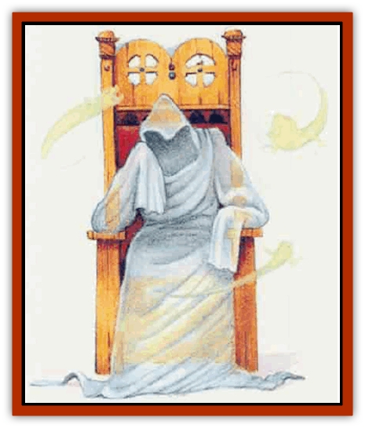

# Gray Philosopher

| Statistic | **Gray Philosopher** | **Malice** |
| --- | --- | --- |
| **Activity Cycle:** | Night | Night |
| **Alignment:** | Neutral evil | Neutral evil |
| **Armor Class:** | 4 | 1 |
| **Climate/Terrain:** | Any ruins | Any ruins |
| **Damage/Attack:** | Nil | 1d10, 1d8, or 1d6 (bite) |
| **Diet:** | None | None |
| **Frequency:** | Very rare | Very rare |
| **Hit Dice:** | 9 | 1 |
| **Intelligence:** | High (13-14) | Non- (0) |
| **Magic Resistance:** | Nil | Nil |
| **Morale:** | Fearless (20) | Champion (15) |
| **Movement:** | 0 | 15 |
| **No. Appearing:** | 1 | Special |
| **No. of Attacks:** | 0 | 1 |
| **Organization:** | Solitary | Cluster |
| **Size:** | M (5-6' tall) | T (1-2' long) |
| **Special Attacks:** | Shriek of fear | Attacks as 9 HD creature |
| **Special Defenses:** | See below | See below |
| **THAC0:** | 0 | 11 |
| **Treasure:** | Nil | Nil |
| **XP Value:** | 2,000 | 120 |

A gray philosopher is the undead spirit of an evil cleric who died with some important philosophical deliberation yet unresolved in his or her mind. In its undead state, this creature does noing but ponder these weighty matters.

The gray philosopher appears as a seated, smoke-colored, insubstantial figure swathed in robes. It always seems deep in thought. Flying through the air surrounding the philosopher are a number of tiny, luminous, wispy creatures known as malices. They have vaguely human faces, gaping maws, and spindly, clawed hands. These vindictive creatures are actually the philosopher's evil thoughts, which have taken on substance and a will of their own.

**Combat:** The gray philosopher cannot be turned by a cleric but has no attack of its own; it will not defend itself. Both the philosopher and its malices are immune to mind-affecting magic (charm, phantasmal force, etc.) and to attacks from non-magical weapons.

Unlike the philosopher, malices constantly search for victims on which to vent their petty but eternal spite. Malices do not stray more than 100 feet from their philosopher but may pass through the narrowest OF openings in their ceaseless flight.

When they find a victim, the malices immediately launch themselves at it. The creatures attack as 9 Hit Dice monsters, and the amount of damage their vicious bite inflicts depends on the victim's alignment: 1d10 for good characters (whom the malices especially despise), 1d8 for neutral characters, and 1d6 points of damage for evil characters. Clerics can turn malices as spectres. A malice normally attacks until destroyed or turned. However, all these creatures vanish instantly if their philosopher is destroyed.

Until that moment, the philosopher never breaks its concentration, even if attacked. However, in its final seconds, the philosopher looks up with an expression of malicious enlightenment on its face, then vanishes with a lingering shriek of evil delight. All those hearing this horrifying sound must make a successful saving throw vs. paralyzation or begin shaking with fear. Those characters so affected lose 1 point of Dexerity due to the tremors. This effect lasts until a remove fear or remove curse spell is cast on the character.

**Habitat/Society:** A gray philosopher never seems able to reach any sort of conclusion to the conundrum that has become the focus of its existence; instead, over the centuries, its evil thoughts have coalesced into the malices. A philosopher typically creates 2d4 malices for every century of its foul existence. It is unknown whether the philosopher is even aware of these venal children of its mind.

Gray philosophers are always found in isolated locations, especially the ruins of temples, libraries, monasteries, and other places of learning. The philosopher never takes an interest in its surroundings or anything else save its own evil contemplations. It does not even stir from its original place of thought for any reason; only its destruction can "move" a gray philosopher.

**Ecology:** Certain clerics and academicians speculate that any powerful evil cleric who, at death becomes a gray philosopher may have been attempting to become one of the Immortals. Such sages theorize that a few of the creatures do manage to resolve the philosophical dilemma upon which they ponder, which leads them to transcend their mortality finally tp become profoundly evil and immortal beings. Although these theories propose that it takes a gray philosopher at least 1,000 years to reach such a terrible understanding, the sages urge those who discovr these undead creatures to destroy them immediately, in case this frightening theory has merit.

---
## Discovery & Documentation

**Source Publication:** Mystara Appendix (1994)
**Campaign Setting:** Mystara
**Author(s):** John Nephew, Teeuwynn Woodruff, John Terra, Skip Williams

### Other Creatures Found in This Source Book
   * [[Actaeon|Actaeon]]
   * [[Agarat|Agarat]]
   * [[Ash_Crawler|Ash Crawler]]
   * [[Baldandar|Baldandar]]
   * [[Bargda|Bargda]]
   * [[Bhut|Bhut]]
   * [[Bird_Mystara|Bird (Mystara)]]
   * [[Blackball|Blackball]]
   * [[Choker|Choker]]
   * [[Coltpixie|Coltpixie]]
   * [[Crone_of_Chaos|Crone of Chaos]]
   * [[Darkhood|Darkhood]]
   * [[Darkwing|Darkwing]]
   * [[Decapus|Decapus]]
   * [[Deep_Glaurant|Deep Glaurant]]
   * [[Diabolus|Diabolus]]
   * [[Dimensional_Warper|Dimensional Warper]]
   * [[Dragon_Mystara_Crystalline|Dragon (Mystara), Crystalline]]
   * [[Dragon_Mystara_Jade|Dragon (Mystara), Jade]]
   * [[Dragon_Mystara_Onyx|Dragon (Mystara), Onyx]]
   * [[Dragon_Mystara_Ruby|Dragon (Mystara), Ruby]]
   * [[Drake_Mystara|Drake (Mystara)]]
   * [[Dragonfly|Dragonfly]]
   * [[Dusanu|Dusanu]]
   * [[Elemental_of_Chaos_Air_Earth|Elemental of Chaos, Air/Earth]]
   * [[Elemental_of_Chaos_Fire_Water|Elemental of Chaos, Fire/Water]]
   * [[Elemental_of_Law_Air_Earth|Elemental of Law, Air/Earth]]
   * [[Elemental_of_Law_Fire_Water|Elemental of Law, Fire/Water]]
   * [[Familiar_Mystara|Familiar (Mystara)]]
   * [[Frost_Salamander|Frost Salamander]]
   * [[Fundamental_Air_Earth|Fundamental, Air/Earth]]
   * [[Fundamental_Fire_Water|Fundamental, Fire/Water]]
   * [[Gargantua_Mystara|Gargantua (Mystara)]]
   * [[Geonid|Geonid]]
   * [[Ghostly_Horde|Ghostly Horde]]
   * [[Giant_Athach|Giant, Athach]]
   * [[Giant_Hephaeston|Giant, Hephaeston]]
   * [[Golem_Drolem|Golem, Drolem]]
   * [[Golem_Mystara_I|Golem (Mystara) I]]
   * [[Golem_Mystara_II|Golem (Mystara) II]]
   * [[Golem_Mystara_III|Golem (Mystara) III]]
   * [[Guardian_Warrior|Guardian Warrior]]
   * [[Gyerian|Gyerian]]
   * [[Herex|Herex]]
   * [[Hivebrood|Hivebrood]]
   * [[Horde|Horde]]
   * [[Hsiao|Hsiao]]
   * [[Huptzeen|Huptzeen]]
   * [[Hutaakan|Hutaakan]]
   * [[Imp_Mystara|Imp (Mystara)]]
   * [[Jellyfish_Giant_Mystara|Jellyfish, Giant (Mystara)]]
   * [[Kna|Kna]]
   * [[Kopru|Kopru]]
   * [[Lizard_Mystara|Lizard (Mystara)]]
   * [[Lizard-kin_Mystara|Lizard-kin (Mystara)]]
   * [[Lupin|Lupin]]
   * [[Lycanthrope_Werejaguar_Mystara|Lycanthrope, Werejaguar (Mystara)]]
   * [[Lycanthrope_Wereswine|Lycanthrope, Wereswine]]
   * [[Magen|Magen]]
   * [[Manikin|Manikin]]
   * [[Mek|Mek]]
   * [[Mujina|Mujina]]
   * [[Nagpa|Nagpa]]
   * [[Neh-thalggu|Neh-thalggu]]
   * [[Nightshade_Mystara|Nightshade (Mystara)]]
   * [[Nuckalavee|Nuckalavee]]
   * [[Pegataur|Pegataur]]
   * [[Phanaton|Phanaton]]
   * [[Plant_Dangerous_Mystara|Plant, Dangerous (Mystara)]]
   * [[Plasm|Plasm]]
   * [[Rakasta|Rakasta]]
   * [[Rock_Man|Rock Man]]
   * [[Sabreclaw|Sabreclaw]]
   * [[Sacrol|Sacrol]]
   * [[Scamille|Scamille]]
   * [[Shapeshifter|Shapeshifter]]
   * [[Shargugh|Shargugh]]
   * [[Shark-kin|Shark-kin]]
   * [[Sollux|Sollux]]
   * [[Spectral_Death|Spectral Death]]
   * [[Spectral_Hound|Spectral Hound]]
   * [[Spider-kin|Spider-kin]]
   * [[Spirit_Mystara|Spirit (Mystara)]]
   * [[Statue_Living|Statue, Living]]
   * [[Surtaki|Surtaki]]
   * [[Tabi|Tabi]]
   * [[Thoul|Thoul]]
   * [[Thunderhead|Thunderhead]]
   * [[Tiger_Ebon|Tiger, Ebon]]
   * [[Topi|Topi]]
   * [[Tortle|Tortle]]
   * [[Vampire_Velya|Vampire, Velya]]
   * [[White_Fang|White Fang]]
   * [[Worm_Mystara|Worm (Mystara)]]
   * [[Wyrd|Wyrd]]
   * [[Yowler|Yowler]]
   * [[Zombie_Lightning|Zombie, Lightning]]
