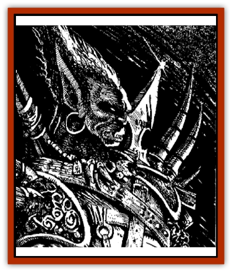
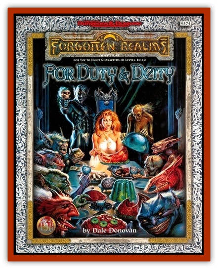

# Graz'zt

| Statistic | **Graz'zt** |
| --- | --- |
| **Activity Cycle:** | Any |
| **Alignment:** | Chaotic evil |
| **Armor Class:** | -9 |
| **Climate/Terrain:** | Abyss/Azzagrat |
| **Damage/Attack:** | 1d8+6 (Str)/1d4+4 acid (&times;2) or 1d6+6 (&times;4, fists) |
| **Diet:** | Carnivore |
| **Frequency:** | Unique |
| **Hit Dice:** | 41, 186 hp |
| **Intelligence:** | Supragenius (20) |
| **Magic Resistance:** | 70% |
| **Morale:** | Fearless (19) |
| **Movement:** | 12 |
| **No. Appearing:** | Unique |
| **No. of Attacks:** | 2 or 4 |
| **Organization:** | Planar ruler |
| **Size:** | L (8' tall) |
| **Special Attacks:** | Spells, summon demons |
| **Special Defenses:** | Immunities |
| **THAC0:** | 4 (hits any AC on 10+) |
| **Treasure:** | U,Z |
| **XP Value:** | 43,000 |

Each Abyssal lord is a single [[Tanar'ri_General_Information|tanar'ri]] unlike any other, a unique creature with its own interests, strengths, and weaknesses. Most lords rule an entire layer of the Abyss, though the least among them fight for control of a layer with other lords. Their talent for leadership, control, and planning sets these lords apart from their followers; though they still rage in battle, their urge for destruction is better hidden than that of lesser demons. When they do vent their anger, the sight is awesome to behold.

Graz'zt, an especially powerful Abyssal lord, rules the 45th, 46th, and 47th layers of that inhospitable plane. Also known as the Lord of Shadow or the Lord of the Triple Realm, Graz'zt is famous for his pride, unusual self-control, and coolness (quite uncommon among demons). Graz'zt prefers to appear as a very tall and heavily muscled ebon-skinned man with six fingers and six toes, glowing green eyes, pointed ears, and smallish fangs. His statistics in any form are S 18/00, D 17, C 19, I 20, W 19, Ch 18.

Graz'zt enjoys contrasts, clashes, and mismatches of all kinds. Others (nondemons, in most cases) may find his presentations disturbing or jarring, such as a severed head in the center of a banquet table or a painting of a sun-dappled field hung on a gore-strewn wall. The Lord of Shadow lives simply himself, preferring monstrosities as his entertainment, not his decor. Entire rooms of his palace are devoted instead to a single color or theme such as war, blood, or storms. Eight [[Tanar'ri_Lesser_Armanite|armanites]] (four black and four white of these twisted, centaurlike demons) pull his carriage.

Graz'zt favors garments of a radiant white and silver weapons, and he always carries several potent magical items. He speaks the languages of demons, devils, [[Yugoloth_General_Information|yugoloths]], [[Aasimon_Deva|devas]], [[Slaad|slaadi]], [[Githyanki|githyanki]], [[Githzerai|githzerai]], and the common human tongue. He also possesses the ability to speak telepathically with all sentient creatures.

**Combat:** Though he is a skilled and powerful swordsman, Graz'zt prefers to fight with magic when he can, using whatever magical items he has on his person first. He can also call on his own personal magic, which he casts as a 20th-level mage. The Lord of the Triple Realm can use each of the following spells once per round, at will unless otherwise noted: *chaos*, *continual darkness*, *disintegrate* (1/day), *dispel magic*, *duo-dimension*, *emotion*, *magic missile*, *mirror image*, *polymorph any object* (1/day), *polymorph other* (3/day), *polymorph self*, *read languages*, *read magic*, *telekinesis* (up to 1,500 lbs.), *teleport*, *trap the soul* (1/week), *vanish*, *veil* (1/day), and *water breathing*.

Graz'zt is rarely forced into combat, since he is constantly escorted by a bodyguard of 13 [[Tanar'ri_Greater_Babau|babau]]. When he does enter melee, Graz'zt is a truly fearsome opponent; he can transform any weapon he holds into an acid-dripping horror, striking twice per round for normal damage plus his Strength bonus and 1d4+4 points of acid damage. If unarmed, Graz'zt strikes four times per round with his lightning-fast fists, causing 1d6+6 points of damage with each hit.

Graz'zt can gate 1d2 [[Tanar'ri_True_Balor|balor]] (60% chance) or 1d4+1 [[Tanar'ri_Greater_Babau|babau]] (40%) at will while in the Abyss. This Abyssal lord has been known to use the following items: a *sword of sharpness*,*wand of frost*, *chime of opening*, *robe of eyes*, and a *cloak of displacement*. In addition, Graz.zt has access to many magical items taken in war or forged in Abyssal furnaces; he may use any item allowable to warriors, priests, or wizards.

**Followers and Resources:** Graz'zt has many followers, all driven to loyalty by fear of their master. The Lord of Shadows' fickle nature and impatience with failure are well known, and he is quick to change sides if events conspire against him. If his pawns succeed at tasks they are well rewarded, but failure results in mutilation or death.

With three Abyssal layers at his disposal, Graz'zt is one of the richest lords, though he is not renowned for greed. Graz'zt uses his wealth as a weapon, deploying it to best effect against his foes, whoever they may be. He can be generous after a fashion, offering items, wealth, or power to those who want such things - for a price. The cost of such gifts is always a debt of service, task, or term of servitude.

**Plots and Goals::** Graz'zt is the father of Iuz, a demigod responsible for much suffering and death on the prime-material world of Oerth. His charisma and flattery have helped him beget many other such demigods on the Prime. As noted above, he himself is not above doling out a bit of magic or a few minor servants to those who seek infernal aid. His price always inflicts a toll on the soul of the being, regardless of how the deal first appears. Thus is the Lord of Shadow responsible for much mortal suffering on the Prime.

Graz'zt schemes against other Abyssal lords more than against the [[Baatezu_General_Information|baatezu]] (or devils). He seems to care far less about the Blood War than other demon lords, seeking power on his own plane rather than the domination of another evil race. He is very wily and cunning, readier to make pacts than most demons but always twisting the wording of such pacts to his own advantage. He favors overcoming mortal opponents by guile, subtlety, and twisted words rather than simple brute force. The Lord of the Triple Realm always has three times the number of plots brewing than any other Abyssal lord, choosing to keep his options open rather than throw all his resources into any one effort.

Graz'zt's ultimate goal is to subvert and drag an entire crystal sphere from the Prime into the Abyss, thus giving him a fourth layer to rule and immeasurably more wealth, both in materials and in souls.

His current plan combines his interests in the Prime, his offspring, his desire to gain a new layer, and his "guest", the former Torilian goddess Waukeen. With Waukeen becoming less and less tractable to further negotiations regarding the terms of her release, Graz'zt hopes to use guile, trickery, or a threat against Waukeen's life to convince Lliira to surrender the mantle of Waukeen's divinity to him or one of his semidivine offspring. So doing would gain Graz'zt a tremendous foothold of power on Toril that could bring all of Realmspace to him in time.

Graz'zt will be tremendously upset if Waukeen is freed and escapes the Abyss, but he won't be so foolish as to chase her along the Infinite Staircase, let alone follow her onto the Outlands and to her home realm. Nevertheless, he'll refuse to give up on his plans to add a new layer to his holdings, and the Realms are his most likely prospect. (He doesn't want to lose face among the Abyssal lords, so his best bet is to continue with his plans to annex the Realms and claim that Waukeen became useless to his agenda.) Therefore, Graz'zt will soon turn his attentions to the Realms, themselves, as he explores his options and opportunities.

He'll begin by sending spies across the planar boundaries to learn what they can about strengths and weaknesses across the whole of Faer�n. A likely choice of operatives for this mission are [[Tanar'ri_True_Vrock|vrocks]], which look like vultures from a distance, so they can travel wide distances, observe unobtrusively from above, and don illusions of humans and demihumans if need be. (Of course, other demons can polymorph themselves into other forms as well, and thus serve Graz'zt's plans.) They will seek out the power bases and most obvious threats to an invasion, and they'll look for potential allies among groups such as the Zhentarim, Banites, and Red Wizards. Their presence my not even be detected unless Waukeen remains suspicious enough of Graz.zt that she personally watches for signs of his work. (In that case, her clergy may become involved in a cold war with his Abyssal forces.) The vrocks also may kill the wrong person or people and expose themselves in the process, in which case their capture could betray Graz'zt's plans.

The Realms may or may not be in danger of becoming another layer of the Abyss, but until Graz'zt's spies are soundly defeated or someone confronts and intimidates him directly, demonic incursions into the Realms are likely to go on for years (as they have for centuries due to many unrelated reasons).

---
## Discovery & Documentation

**Source Publication:** For Duty & Deity (1998)
**Campaign Setting:** Forgotten Realms
**Author(s):** Dale Donovan

### Other Creatures Found in This Source Book
   * [[Lillend|Lillend]]
   * [[Viper_Tree|Viper Tree]]
