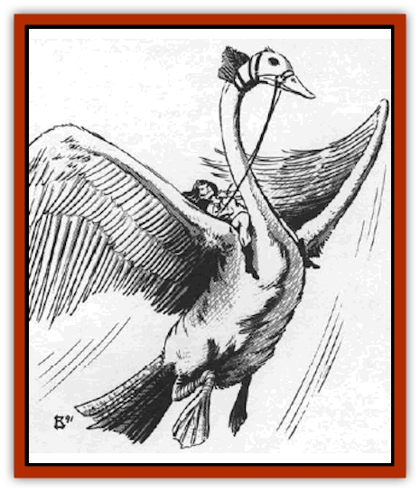

# Greatswan

| Statistic | **Greatswan** |
| --- | --- |
| **Activity Cycle:** | Any |
| **Alignment:** | Chaotic good |
| **Armor Class:** | 5 |
| **Climate/Terrain:** | Elven lands, wildspace |
| **Damage/Attack:** | 1d6/2d6 |
| **Diet:** | Herbivore, insectivore |
| **Frequency:** | Uncommon |
| **Hit Dice:** | 3+3 |
| **Intelligence:** | Low (5-7) |
| **Magic Resistance:** | Nil |
| **Morale:** | Elite (14) |
| **Movement:** | 6, F1 36 (B), (C) when mounted, Sw 18 |
| **No. Appearing:** | 1-6 |
| **No. of Attacks:** | 2 |
| **Organization:** | Flock |
| **Size:** | L (10' long, 28' wingspan) |
| **Special Attacks:** | Nil |
| **Special Defenses:** | Nil |
| **THAC0:** | 15 |
| **Treasure:** | Nil |
| **XP Value:** | 420 |

Greatswans are massive [[Bird|swans]] raised and trained by [[Elf|elves]] to act as guards and war mounts. Like normal groundling swans, greatswans are ferocious fighters, and many have a nasty temper.

As a rule, greatswans are found with any race of elves in wildspace. Greatswans sometimes ride aboard elven men-o-war (25% chance) and armadas (50%). Normally, there are 2d6 greatswans on the former and 4d6 on the latter. Each vessel also has a like number of elven swanrider cavalry. A greatswan can carry up to two elf-sized riders (the equivalent of about 240 pounds).

Greatswans are beautiful, graceful birds with characteristic long necks and snow-white plumage. The swans have no language.

Like their mundane counterparts, greatswan males are called "cobs", and the females are called "pens". Young greatswans are called "cygnets".

**Combat:** Though greatswans are gentle birds, they nevertheless fight with a strong strike of their beak (1d6 damage) and wing buffeting (2d6 damage). The wing buffet has a 50% chance of blinding and confusing the opponent for one round. There is a 25% chance that the sheer force of the wings knocks a man-sized or smaller foe backwards 2d10 feet.

If a greatswan is used as a mount, it cannot perform the wing buffet while in flight. However, an elven swanrider can urge his mount into what amounts to a power dive against an enemy; the elf's weapon and the greatswan's beak each gain a +2 bonus to THAC0 and do double damage. Elves use mostly medium lances for such attacks.

Greatswans have excellent senses, and have a 75% chance of detecting an intruder, even an invisible one. This makes them well suited for guard duties. Swans that spot an intruder raise a raucous call and close with the enemy, wings flailing madly.

Greatswans are immune to all forms of poison.

**Habitat/Society:** Greatswans wander exclusively in elves lands. The elves fear that introducing such large birds to normal environments may alter the balance of nature. Thus they keep the birds close at hand and watch their movements closely.

Greatswans are aquatic birds, and are excellent swimmers. This comes in handy when the elves are exploring water worlds in wildspace.

Unlike groundling swans, greatswans are not territorial. They become hostile only if intruders approach within 30' of either their nests or guardposts. Greatswans recognize the names their trainers give them and can learn command phrases, one command per point of Intelligence.

Greatswans are bred to require little air. A lustful of air lasts the bird 24 hours. A greatswan's personal gravity drags along enough air for two elf-sized riders to breathe for 5d10 turns.

Elves found with greatswans have the Airborne Riding nonweapon proficiency. Such elves are always at least 3rd-level fighters, armed with some sort of charging weapon (such as a spear, pike, lance) and a bow (long or short) in addition to their normal melee weapon. A great swan never carries any rider but an elf.Encountered without elves in attendance, an even number of greatswans are mated pairs. There are 1d2 cygnets and 1d4 eggs per pair.

**Ecology:** As mentioned earlier, the elves confine the greatswans to their own sylvan lands and cities, fearful that the birds' large appetites will upset the balance of nature. Greatswans eat green plants, especially water plants, and they eat large numbers of insects, digesting even the most poisonous insect without harm. Greatswans consider [[Feesu|feesu]], space moths, a delicacy. Elves use feesu as a reward during a cygnet's training.

Some elven mages use greatswan feathers to create *Quaa1's feather tokens*, *wings of flying*, and *winged boots*.

---
## Discovery & Documentation

**Source Publication:** MC9 Spelljammer Appendix II (1991)
**Campaign Setting:** Planescape
**Author(s):** Scott Davis, Newton Ewell, John Terra

### Other Creatures Found in This Source Book
   * [[Alchemy_Plant|Alchemy Plant]]
   * [[Allura|Allura]]
   * [[Aperusa|Aperusa]]
   * [[Autognome|Autognome]]
   * [[Bionoid|Bionoid]]
   * [[Bloodsac|Bloodsac]]
   * [[Buzzjewel|Buzzjewel]]
   * [[Constellate|Constellate]]
   * [[Contemplator|Contemplator]]
   * [[Dohwar|Dohwar]]
   * [[Dragon_Moon|Dragon, Moon]]
   * [[Dragon_Stellar|Dragon, Stellar]]
   * [[Dragon_Sun|Dragon, Sun]]
   * [[Dreamslayer|Dreamslayer]]
   * [[Dweomerborn|Dweomerborn]]
   * [[Fal|Fal]]
   * [[Feesu|Feesu]]
   * [[Fire_Bat|Fire Bat]]
   * [[Firebird|Firebird]]
   * [[Firelich|Firelich]]
   * [[Flowfiend|Flowfiend]]
   * [[Gadabout|Gadabout]]
   * [[Gammaroid|Gammaroid]]
   * [[Gonn|Gonn]]
   * [[Gossamer|Gossamer]]
   * [[Grav|Grav]]
   * [[Great_Dreamer|Great Dreamer]]
   * [[Grell_Colonial|Grell, Colonial]]
   * [[Gullion|Gullion]]
   * [[Insectare|Insectare]]
   * [[Lhee|Lhee]]
   * [[Mercurial_Slime|Mercurial Slime]]
   * [[Meteorspawn|Meteorspawn]]
   * [[Monitor|Monitor]]
   * [[Owl_Space|Owl, Space]]
   * [[Pristatic|Pristatic]]
   * [[Scro|Scro]]
   * [[Selkie_Star|Selkie, Star]]
   * [[Silatic|Silatic]]
   * [[Skullbird|Skullbird]]
   * [[Sleek|Sleek]]
   * [[Sluk|Sluk]]
   * [[Space_Swine|Space Swine]]
   * [[Sphinx_Astro-|Sphinx, Astro-]]
   * [[Spirit_Warrior|Spirit Warrior]]
   * [[Starfly_Plant|Starfly Plant]]
   * [[Stargazer|Stargazer]]
   * [[Undead_Stellar|Undead, Stellar]]
   * [[Witchlight_Marauder|Witchlight Marauder]]
   * [[Xixchil|Xixchil]]
   * [[Yitsan|Yitsan]]
   * [[Zurchin|Zurchin]]
