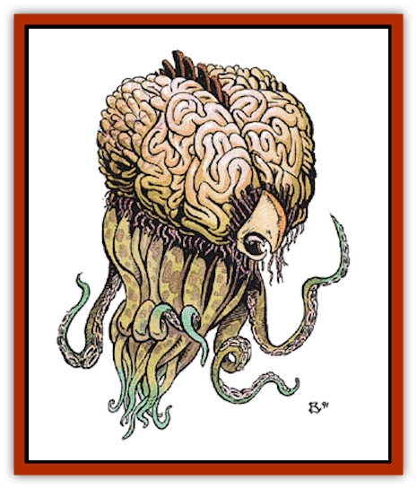

# Grell - Colonial

| Statistic | **Patriarch** | **Philosopher** | **Worker** |
| --- | --- | --- | --- |
| **Activity Cycle:** | Any | Any | Any |
| **Alignment:** | Neutral evil | Neutral evil | Neutral evil |
| **Armor Class:** | -10 (10) | 5 (0) | 5 |
| **Climate/Terrain:** | Any | Any | Any |
| **Damage/Attack:** | 1d8 hull points | 1d4(&times;10)/1-6 or by weapon | 1-4(&times;10)/1-6 or by weapon |
| **Diet:** | Carnivore | Carnivore | Carnivore |
| **Frequency:** | Very rare | Very rare | Rare |
| **Hit Dice:** | 9 | 7 | 5 |
| **Intelligence:** | Supra-genius (19) | Exceptional (15-16) | Average (8-10) |
| **Magic Resistance:** | Nil | Nil | Nil |
| **Morale:** | Fanatic (17) | Champion (15-16) | Elite (13-14) |
| **Movement:** | SR 9 | Fl 12 (D) | Fl 12 (D) |
| **No. Appearing:** | 1 | 1-2 | 1-10 |
| **No. of Attacks:** | 1 | 11 | 11 |
| **Organization:** | Hive | Hive | Hive |
| **Size:** | G (30' diameter) | M (4' diameter) | M (4' diameter) |
| **Special Attacks:** | See below | Magical items | Magical items |
| **Special Defenses:** | See below | Nil | Nil |
| **THAC0:** | 11 | 13 | 15 |
| **Treasure:** | H | W | U (see below) |
| **XP Value:** | 9,000 | 5,000 | 2,000 |

The "civilized" grell is a colonial (as the term is used for [[Ant|ants]] and other colony animals) version of the [[Grell_Wild|underground ravager of Oerth]]. It is similar in size and appearance to terrestrial grells. Unlike its solitary kin, however, it can speak via telepathic link with both grell philosophers and the highly intelligent grell patriarch.

The grell's arrogance surpasses all other intelligent beings. Spacegoing grells acknowledge no equals, regarding even terrestrial grells as lesser beings. "Lesser being" in the grell language, means the same thing as "food".

**Combat:** Grell battle tactics resemble those of their lesser kin; they use levitation ability to hide in the upper reaches of large chambers. However, their ability to function in groups lets them mount vicious assaults, wielding tip-spears and *lightning lances*. Tip-spears are edged metallic heads that fit by suction over the tips of a soldier-grell's tentacles. The grell can make slashing attacks doing 1-6 points of damage, or stab doing double damage.

Victims impaled on tip-spears are considered paralyzed, and subject to the same fate as those who are grappled, i.e., automatically hit by subsequent tentacles, etc. (See [[Grell_Wild|Grell, Wild]] for full information on grappling.) Anyone captured faces imprisonment and later consumption as part of the grell raiders' food supply.

The grell *lightning lances* deliver 3d6 electrical damage (save vs. spell for half damage). Each lance has 36 charges and can fire once per round.

In wildspace, grell ships do not spelljam so much as submerge and surface in space, traveling "underneath" space using some bizarre dimensional passage that the grill patriarch generates. When out in the flow, the front end of the ship opens, exposing a hollow tube that runs the length of the vessel. The grell ship then ignites the inrushing phlogiston, ejecting the exhaust gases from the rear in a motion similar to that of a squid. The spelljamming patriarch controls the size of the phlogiston burn.

In a hopeless situations the grell patriarch can transform the ship into a vaguely humanoid form via telekinesis. The giant armored fighter strikes with an oversized halberd for 1d10 hull points of damage. The halberd can loose an electric arc tor 3d6 hull points, but takes one round to recharge. The giant's fists can strike for 1d3 hull points each.

**Habitat/Society:** Grell have a distinct pyramidal hierarchy. The patriarch stands at the top, and a secondary caste, the philosophers, handles the lower castes. Each grell "family" occupies a ship.

*The Patriarch:* Each grell ship has a solitary patriarch who handles the workings and navigation of the ship. He is a sessile mass of flesh approximately 30' in diameter whose tentacles have grafted themxlves to the floor of his chamber. The patriarch's enormous brain controls the higher functions of all the shipboard family. All other castes serve the patriarch.

*Philosophers:* These grell serve as intermediaries between the patriarch and the workers. They have limited authority to lead the worker/soldier grell in organized combat. A grell philosopher may (20% chance) wear a ring of protection (AC 0). Some philosophers can use magic as 2nd-level wizards. There is one philosopher for every 10 worker/soldier grell.

*Workers/soldiers:* This common garden-variety grell, limited in intelligence, performs minor maintenance aboard ship. They make up most of a grell family or raiding party.

*Imperator:* Above all families stands the Imperator, who holds absolute sway over all grell families and can unite them as a single fighting force. Known as the Legion of Gold, due to the uniform golden color of their spaceships, this horde sweeps over space like locusts, leaving nothing but debris in its wake.

**Ecology:** Grell are the true wastrels of wildspace races. Arrogant and vicious, they hunt an area to exhaustion, then move on to more fertile regions. Their (re)discovery of human space means only a rich storehouse of meat to these monsters.

---
## Discovery & Documentation

**Source Publication:** MC9 Spelljammer Appendix II (1991)
**Campaign Setting:** Planescape
**Author(s):** Scott Davis, Newton Ewell, John Terra

### Other Creatures Found in This Source Book
   * [[Alchemy_Plant|Alchemy Plant]]
   * [[Allura|Allura]]
   * [[Aperusa|Aperusa]]
   * [[Autognome|Autognome]]
   * [[Bionoid|Bionoid]]
   * [[Bloodsac|Bloodsac]]
   * [[Buzzjewel|Buzzjewel]]
   * [[Constellate|Constellate]]
   * [[Contemplator|Contemplator]]
   * [[Dohwar|Dohwar]]
   * [[Dragon_Moon|Dragon, Moon]]
   * [[Dragon_Stellar|Dragon, Stellar]]
   * [[Dragon_Sun|Dragon, Sun]]
   * [[Dreamslayer|Dreamslayer]]
   * [[Dweomerborn|Dweomerborn]]
   * [[Fal|Fal]]
   * [[Feesu|Feesu]]
   * [[Fire_Bat|Fire Bat]]
   * [[Firebird|Firebird]]
   * [[Firelich|Firelich]]
   * [[Flowfiend|Flowfiend]]
   * [[Gadabout|Gadabout]]
   * [[Gammaroid|Gammaroid]]
   * [[Gonn|Gonn]]
   * [[Gossamer|Gossamer]]
   * [[Grav|Grav]]
   * [[Great_Dreamer|Great Dreamer]]
   * [[Greatswan|Greatswan]]
   * [[Gullion|Gullion]]
   * [[Insectare|Insectare]]
   * [[Lhee|Lhee]]
   * [[Mercurial_Slime|Mercurial Slime]]
   * [[Meteorspawn|Meteorspawn]]
   * [[Monitor|Monitor]]
   * [[Owl_Space|Owl, Space]]
   * [[Pristatic|Pristatic]]
   * [[Scro|Scro]]
   * [[Selkie_Star|Selkie, Star]]
   * [[Silatic|Silatic]]
   * [[Skullbird|Skullbird]]
   * [[Sleek|Sleek]]
   * [[Sluk|Sluk]]
   * [[Space_Swine|Space Swine]]
   * [[Sphinx_Astro-|Sphinx, Astro-]]
   * [[Spirit_Warrior|Spirit Warrior]]
   * [[Starfly_Plant|Starfly Plant]]
   * [[Stargazer|Stargazer]]
   * [[Undead_Stellar|Undead, Stellar]]
   * [[Witchlight_Marauder|Witchlight Marauder]]
   * [[Xixchil|Xixchil]]
   * [[Yitsan|Yitsan]]
   * [[Zurchin|Zurchin]]
