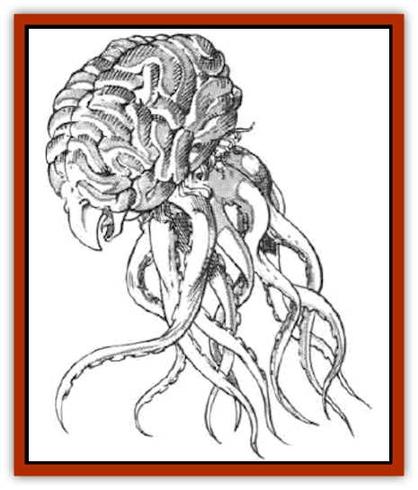

# Grell - Wild

| Statistic | **Grell, Wild** |
| --- | --- |
| **Activity Cycle:** | Night |
| **Alignment:** | Neutral evil |
| **Armor Class:** | 4 |
| **Climate/Terrain:** | Any/subteranean or ruins |
| **Damage/Attack:** | 1-4(&times;10)/1-4 |
| **Diet:** | Carnivore |
| **Frequency:** | Rare |
| **Hit Dice:** | 5 |
| **Intelligence:** | Average (8-10) |
| **Magic Resistance:** | Nil |
| **Morale:** | Elite (13-14) |
| **Movement:** | Fl 12 (D) |
| **No. Appearing:** | 1 |
| **No. of Attacks:** | 11 |
| **Organization:** | Solitary |
| **Size:** | M (5' diam.) |
| **Special Attacks:** | Paralyzation |
| **Special Defenses:** | Immune to electricity |
| **THAC0:** | 15 |
| **Treasure:** | Nil |
| **XP Value:** | 2,000 |

The grell is an underground-dwelling, levitating jellyfish. This fearsome carnivore is feared for its ability to strike quickly before any defense can be set up.

The body of a grell is basically spherical and about five feet in diameter. It is clearly divided into two lobes, left and right. Its drab olive colored flesh is streaked with white. Various lumps, ridges, and veins give the appearance of an exposed brain. A ten-inch-long beak protrudes from one side, just above the base and directly on the major division of the lobes.

The base of the body is fringed with hundreds of one- to three-inch-long tentacles. Ten six-foot-long tentacles trail from the bottom of the body. each pale green tentacle is as thick as a man's arm, and has many small spines along the inner surface.

The grell cannot talk, but it does emit bird-like squeaks and squawks. It is completely silent in motion and when attacking. It has a light, musky smell; its lair has a foul reek of stale carrion.

**Combat:** The grell has an average human intelligence, which it uses to decide on strategy and tactics in combat. It will not attack a party or individual that would obviously kill it.

Its most common strategy is to float up out of sight near a ceiling and wait. It can move sideways at a movement rate of 4 by waving its tentacles to create small air currents. If it can contact a surface, the extra purchase grants it the full movement rate. It rises or falls at its stated movement rate.

When a victim walks underneath it, the grell drops down silently, usually with surprise (-3 penalty to opponent's surprise roll). It attacks with all ten tentacles. Each tentacle that hits gets a grip on the victim and remains anchored. For each hit, the victim must roll a saving throw vs. paralysis, with a +4 bonus. if two or more tentacles are gripping the victim, the grell can lift its prey into the air (at half its normal movement rate). Once its prey is paralyzed, the grell floats up out of sight to devour it. The grell automatically hits paralyzed prey that is in its grasp without needing an attack roll. Captured prey lives for only a few rounds once paralyzed and whisked up out of sight.

During combat rounds in which its victim is not paralyzed, it will use a minimum of two tentacles to flay whomever is in its grasp, and the remainder to flail at any other attackers. It can attack with its beak, but only against paralyzed creatures in its grasp. Remember that the grell is smart enough to make good decisions about how to allocate its ten tentacles for combat.Any hit on a tentacle will sever it, or at least render it unusable. The tentacles are AC 4, just like the body. However, damage done to the tentacles do not count against the creature's hit points. If left alone, the grell can regenerate lost tentacles in one to two days.

The grell is immune to electrical attacks, such as lightning.

**Habitat/Society:** The grell chooses to live in underground realms or ruins. Its only known method of sight is by infravision, so it prefers areas of perpetual darkness. It is subject to the whims of strong air currents, so enclosed areas away from winds are sought.

The grell is a solitary creature choosing to live apart from others of its kind. The only time it is found with other grell is when mating. It never bargains with other creatures willingly, but it is smart enough to cut a deal if the alternative is death. The grell has no interest in treasure or other trappings of humanoid civilization. Its den is usually a cave or ledge well above the floor. Frequently the grell sits just outside its den waiting for prey.

---
## Discovery & Documentation

**Source Publication:** MC5 Greyhawk Appendix (1989)
**Campaign Setting:** Advanced Dungeons & Dragons 2nd Edition
**Author(s):** Grant Boucher, William W. Connors, Steve Gilbert, Bruce Nesmith, Chris Mortika, Skip Williams

### Other Creatures Found in This Source Book
   * [[Aspis|Aspis]]
   * [[Beastman|Beastman]]
   * [[Bonesnapper|Bonesnapper]]
   * [[Booka|Booka]]
   * [[Brownie_Buckawn|Brownie, Buckawn]]
   * [[Brownie_Quickling|Brownie, Quickling]]
   * [[Crystalmist|Crystalmist]]
   * [[Dragon_Cloud|Dragon, Cloud]]
   * [[Dragon_Oerth_Greyhawk|Dragon (Oerth), Greyhawk]]
   * [[Dragonfly_Giant|Dragonfly, Giant]]
   * [[Dragonnel|Dragonnel]]
   * [[Elf_Grugach|Elf, Grugach]]
   * [[Elf_Valley|Elf, Valley]]
   * [[Golem_Necrophidius|Golem, Necrophidius]]
   * [[Grung|Grung]]
   * [[Hobgoblin_Norker|Hobgoblin, Norker]]
   * [[Hook_Horror|Hook Horror]]
   * [[Horgar|Horgar]]
   * [[Hound_Yeth|Hound, Yeth]]
   * [[Iguana_Giant|Iguana, Giant]]
   * [[Ingundi|Ingundi]]
   * [[Kech|Kech]]
   * [[Kyuss_Son_of|Kyuss, Son of]]
   * [[Mite|Mite]]
   * [[Needleman|Needleman]]
   * [[Plant_Carnivorous_Oerth|Plant, Carnivorous (Oerth)]]
   * [[Plant_Carnivorous_Vampire_Cactus|Plant, Carnivorous, Vampire Cactus]]
   * [[Plasmoid_General_Information|Plasmoid, General Information]]
   * [[Rat_Oerth|Rat (Oerth)]]
   * [[Raven_Crow|Raven/Crow]]
   * [[Scarecrow|Scarecrow]]
   * [[Shadow_Slow|Shadow, Slow]]
   * [[Skulk|Skulk]]
   * [[Snail|Snail]]
   * [[Sprite|Sprite]]
   * [[Taer|Taer]]
   * [[Tentamort|Tentamort]]
   * [[Turtle_Giant|Turtle, Giant]]
   * [[Tyrg|Tyrg]]
   * [[Wolf_Mist|Wolf, Mist]]
   * [[Wraith_Oerth|Wraith (Oerth)]]
   * [[Zygom|Zygom]]
