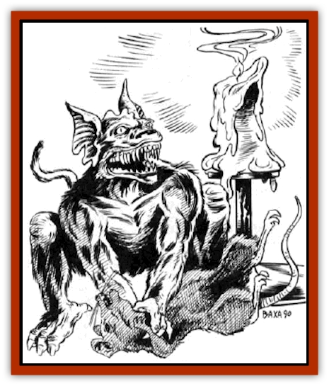

# Gremishka

| Statistic | **Gremishka** |
| --- | --- |
| **Activity Cycle:** | Night |
| **Alignment:** | Chaotic evil |
| **Armor Class:** | 4 |
| **Climate/Terrain:** | Ravenloft |
| **Damage/Attack:** | 1-3 |
| **Diet:** | Omnivore |
| **Frequency:** | Rare |
| **Hit Dice:** | ½ (1-4 hit points) |
| **Intelligence:** | High (13-14) |
| **Magic Resistance:** | Nil |
| **Morale:** | Unsteady (5-7) |
| **Movement:** | 12 |
| **No. Appearing:** | 3-18 (3d6) |
| **No. of Attacks:** | 1 |
| **Organization:** | Swarm |
| **Size:** | T (2' tall) |
| **Special Attacks:** | Swarm |
| **Special Defenses:** | +4 on saving throws |
| **THAC0:** | 20 |
| **Treasure:** | Z |
| **XP Value:** | 35 |

Like their close cousins, the [[Gremlin|gremlins]], these diminutive humanoids are parasites and nuisances. They live under buildings and steal from the inhabitants.

From a distance, a gremishka might be mistaken for a small dog or a large cat. It is furry, with pointed ears and a protruding muzzle. The fur can be of any color or pattern. The mouth is overly large for the face, as are the yellow eyes, which have vertical pupils like those of a cat. Unlike a gremlin, the gremishka has no wings. These creatures can manipulate any tool with their dexterous fingers. A gremishka rarely carries a weapon around for more than an hour before dropping it or hiding it, however. They wear no armor or clothing, although they understand the uses of both.

Gremishka speak the languages of normal gremlins as well as their own. It is not uncommon for one of these beasts to know a half-dozen or more human tongues as well.

**Combat:** Gremishka do not engage in hand-to-hand combat unless they are trapped or cornered. They are extremely fast and nimble, able to slip between legs or around their opponents. This speed gives them their unusually high Armor Class and a +4 bonus to saving throws caused by attacks with an area effect. They gain a +2 bonus on attack rolls against any opponent over 4' tall, because such foes make nice, big targets.

As a group, gremishka employ a tactic of swarming. They climb onto an opponent en masse, biting and tearing at him for 1d3 points of damage each. They must make a successful attack roll to get a good grip. but each round after that, damage is automatic. Half the gremishka in the swarm will gnaw through straps, open clasps, or filch anything that is not tied down.

Anyone who attacks a swarming gremishka may harm the character beneath the creatures. If the attacker inflicts more damage than is needed to kill the gremishka, the character beneath the swarm takes the extra damage.

The gremishka's low morale may cause them to retreat if any great show of force is made. Anything the creatures manage to filch will be taken back to their lair.

**Habitat/Society:** Gremishka are not fond of sunlight, but it does not harm them. They live in basements and under buildings, usually large homes. If possible, they choose a lair that gives them easy access to many parts of the building.

Gremishka keep the spoils of their raids in their lairs. Treasure is always a random collection of stolen trinkets, some with real value. They love to take things, although their taste in treasure is dubious at best.

Gremishka seem to derive extreme pleasure from the rage and frustration of larger humanoids. They enjoy playing vicious, destructive pranks on their hosts. They recognize no leaders among their own kind. They may cooperate to cause mischief, however, and follow the cue and instructions of the gremishka that suggested a prank. Some of their traps get very elaborate, owing to their high intelligence. They hide in the walls and under floorboards to watch and listen for potential victims. When a victim discovers the prank or activates their trap, he often hears the gremishka's high, chittering laughter.

**Ecology:** Gremishka eat anything. They trap small creatures such as rats, cats, or dogs. They have been known to form a temporary attachment to children who are their size and live near their lairs. Gremishka are hunted by just about anything that can find and catch them, including large [[Snake|snakes]], [[Dog|dogs]], giant [[Spider|spiders]], [[Kobold|kobolds]], and many more - especially humans.

---
## Discovery & Documentation

**Source Publication:** Ravenloft Appendix III (1991)
**Campaign Setting:** Ravenloft
**Author(s):** Kirk Botulla

### Other Creatures Found in This Source Book
   * [[Akikage|Akikage]]
   * [[Animator_Common|Animator, Common]]
   * [[Animator_Greater|Animator, Greater]]
   * [[Animator_Minor|Animator, Minor]]
   * [[Animator_General_Information|Animator, General Information]]
   * [[Bakhna_Rakhna|Bakhna Rakhna]]
   * [[Baobhan_Sith|Baobhan Sith]]
   * [[Beetle_Scarab|Beetle, Scarab]]
   * [[Boneless|Boneless]]
   * [[Boowray|Boowray]]
   * [[Bruja|Bruja]]
   * [[Carrionette|Carrionette]]
   * [[Carrion_Stalker|Carrion Stalker]]
   * [[Cat_Midnight|Cat, Midnight]]
   * [[Cat_Skeletal|Cat, Skeletal]]
   * [[Cloaker_Resplendent|Cloaker, Resplendent]]
   * [[Cloaker_Shadow|Cloaker, Shadow]]
   * [[Cloaker_Undead|Cloaker, Undead]]
   * [[Corpse_Candle|Corpse Candle]]
   * [[Death's_Head_Tree|Death's Head Tree]]
   * [[Doppelganger_Ravenloft|Doppelganger (Ravenloft)]]
   * [[Familiar_Pseudo-|Familiar, Pseudo-]]
   * [[Familiar_Undead|Familiar, Undead]]
   * [[Feathered_Serpent|Feathered Serpent]]
   * [[Fenhound|Fenhound]]
   * [[Figurine_Ceramic|Figurine, Ceramic]]
   * [[Figurine_Crystal|Figurine, Crystal]]
   * [[Figurine_Ivory|Figurine, Ivory]]
   * [[Figurine_Obsidian|Figurine, Obsidian]]
   * [[Figurine_Porcelain|Figurine, Porcelain]]
   * [[Figurine_General_Information|Figurine, General Information]]
   * [[Fleas_of_Madness|Fleas of Madness]]
   * [[Furies|Furies]]
   * [[Geist|Geist]]
   * [[Ghost_Animal|Ghost, Animal]]
   * [[Golem_Flesh_Ravenloft|Golem, Flesh (Ravenloft)]]
   * [[Golem_Mist_Ravenloft|Golem, Mist (Ravenloft)]]
   * [[Golem_Wax_Ravenloft|Golem, Wax (Ravenloft)]]
   * [[Hag_Spectral|Hag, Spectral]]
   * [[Head_Hunter|Head Hunter]]
   * [[Hearth_Fiend|Hearth Fiend]]
   * [[Hebi-No-Onna|Hebi-No-Onna]]
   * [[Hound_Phantom|Hound, Phantom]]
   * [[Hound_Skeletal|Hound, Skeletal]]
   * [[Imp_Wishing|Imp, Wishing]]
   * [[Ivy_Crawling|Ivy, Crawling]]
   * [[Jack_Frost|Jack Frost]]
   * [[Jolly_Roger|Jolly Roger]]
   * [[Kizoku|Kizoku]]
   * [[Lashweed|Lashweed]]
   * [[Leech_Magical|Leech, Magical]]
   * [[Leech_Psionic|Leech, Psionic]]
   * [[Lich_Defiler|Lich, Defiler]]
   * [[Lich_Drow|Lich, Drow]]
   * [[Lich_Elemental|Lich, Elemental]]
   * [[Lich_Psionic|Lich, Psionic]]
   * [[Living_Tattoo|Living Tattoo]]
   * [[Lycanthrope_Loup-garou|Lycanthrope, Loup-garou]]
   * [[Lycanthrope_Werejackal|Lycanthrope, Werejackal]]
   * [[Lycanthrope_Werejaguar_Ravenloft|Lycanthrope, Werejaguar (Ravenloft)]]
   * [[Lycanthrope_Wereleopard|Lycanthrope, Wereleopard]]
   * [[Lycanthrope_Wereray|Lycanthrope, Wereray]]
   * [[Mist_Ferryman|Mist Ferryman]]
   * [[Moor_Man|Moor Man]]
   * [[Obedient|Obedient]]
   * [[Odem|Odem]]
   * [[Paka|Paka]]
   * [[Plant_Blood_Rose|Plant, Blood Rose]]
   * [[Plant_Fearweed|Plant, Fearweed]]
   * [[Radiant_Spirit|Radiant Spirit]]
   * [[Recluse|Recluse]]
   * [[Remnant_Aquatic|Remnant, Aquatic]]
   * [[Rushlight|Rushlight]]
   * [[Sea_Spawn_Master|Sea Spawn, Master]]
   * [[Sea_Spawn_Minion|Sea Spawn, Minion]]
   * [[Shadow_Asp|Shadow Asp]]
   * [[Shattered_Brethren|Shattered Brethren]]
   * [[Skeleton_Archer|Skeleton, Archer]]
   * [[Skeleton_Insectoid|Skeleton, Insectoid]]
   * [[Skin_Thief|Skin Thief]]
   * [[Spirit_Psionic|Spirit, Psionic]]
   * [[Strahd_Skeleton|Strahd Skeleton]]
   * [[Strahd_Zombie|Strahd Zombie]]
   * [[Unicorn_Shadow|Unicorn, Shadow]]
   * [[Vampire_Drow|Vampire, Drow]]
   * [[Vampire_Nosferatu|Vampire, Nosferatu]]
   * [[Vampire_Oriental|Vampire, Oriental]]
   * [[Virus_General_Information|Virus, General Information]]
   * [[Virus_I|Virus I]]
   * [[Virus_II|Virus II]]
   * [[Virus_III|Virus III]]
   * [[Vorlog|Vorlog]]
   * [[Will_O'Dawn|Will O'Dawn]]
   * [[Will_O'Deep|Will O'Deep]]
   * [[Will_O'Mist|Will O'Mist]]
   * [[Will_O'Sea|Will O'Sea]]
   * [[Zombie_Cannibal|Zombie, Cannibal]]
   * [[Zombie_Desert|Zombie, Desert]]
   * [[Zombie_Wolf|Zombie Wolf]]
   * [[Zombie_Fog|Zombie Fog]]
