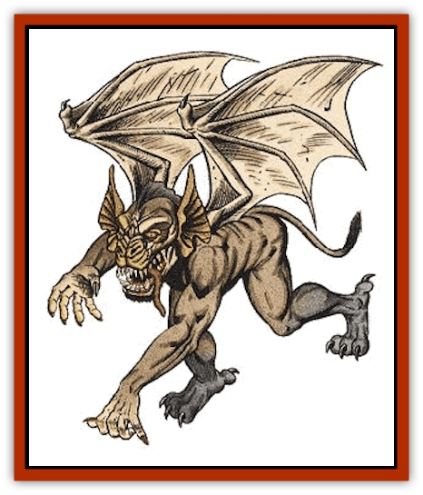

# Gremlin

| Statistic | **Fremlin** | **Galltrit** | **Gremlin** | **Mite** | **Snyad** |
| --- | --- | --- | --- | --- | --- |
| **Activity Cycle:** | Day | Night | Night | Any | Any |
| **Alignment:** | Chaotic neutral | Chaotic evil | Chaotic evil | Lawful evil | Neutral |
| **Armor Class:** | 6 | 2 | 4 | 8 | -4 |
| **Climate/Terrain:** | Any land | Any land | Any land | Subterranean | Subterranean |
| **Damage/Attack:** | 1-4 | 1-2 | 1-4 | 1-3 | Nil |
| **Diet:** | Herbivore | Blood | Omnivore | Omnivore | Omnivore |
| **Frequency:** | Very rare | Very rare | Very rare | Rare | Uncommon |
| **Hit Dice:** | 3+6 | 2 hp | 4 | 1-1 | 1-1 |
| **Intelligence:** | Average (8-10) | Average <nobr>(8-10)</nobr> | Very (11-12) | Low (5-7) | Low (5-7) |
| **Magic Resistance:** | Nil | Nil | 25% | Nil | See below |
| **Morale:** | Unsteady (5-7) | Average <nobr>(8-10)</nobr> | Unsteady (5-7) | Average <nobr>(8-10)</nobr> | Average <nobr>(8-10)</nobr> |
| **Movement:** | 6, Fl 12 (B) | 6, Fl 18 (B) | 6, Fl 18 (B) | 3 | 21 |
| **No. Appearing:** | 1-4 | 1-4 | 1-6 | 6-24 | 1-8 |
| **No. of Attacks:** | 1 | 1 | 1 | 1 | Nil |
| **Organization:** | Pack | Pack | Pack | Tribe | Family |
| **Size:** | T (1') | T (6&rdquo;) | T (18&rdquo;) | T (2') | T (2') |
| **Special Attacks:** | Nil | Blood drain | Nil | Nil | Nil |
| **Special Defenses:** | +1 weapon needed to hit | Nil | +1 weapon needed to hit | Nil | See below |
| **THAC0:** | 17 | 20 | 17 | 20 | 20 |
| **Treasure:** | X | Q | Q,X | K (C) | J (I) |
| **XP Value:** | 270 | 65 | 650 | 35 | 65 |

Often mistaken for [[Imp|imps]], gremlins are small, winged goblinoids. There are many varieties of gremlins, and most are chaotic and mischievous. Their skin color ranges from brown to black to gray, frequently in a mottled blend. Their ears are very large and pointed, giving them a 65% chance to hear noise. A pair of bat-like wings enables them to fly or glide. Gremlins never wear clothing or ornamentation.

**Combat:** Gremlins are worthless in real combat; at every opportunity they flee rather than fight face-to-face. What gremlins like to do best is cause trouble. The angrier their victims are, the happier the gremlins. Their favorite tactic is to set up a trap to humiliate opponents and maybe even cause them to damage a valued possession or hurt a loved one. If the opponent gets hurt as well, that's just fine. For example, the gremlin may set a trip wire across a doorway that pulls down a fragile vase onto the victim's head. A building infested by a gremlin pack can be reduced to shambles in a single night.

In melee, gremlins have only their weak bite for attacks (1d4 points of damage). They can fly quite well (MC B), but they usually stay close to the ground or well over their opponents' heads, where they are difficult to reach. They can be hit only by magical weapons, and are 25% resistant to magic. Despite these defenses, they are cowards and fight only if cornered.

**Habitat/Society:** Gremlins are magical creatures that originated in an unknown plane of existence. They are highly susceptible to mutation and can interbreed with any goblinoid species. This has resulted in several different gremlin races, each with slightly different abilities and natures.

Gremlins travel in small packs, and they have a highly organized social order. Each gremlin knows who is above him in social rank, and who is below. As a rule, this is ordered by hit points, but an aggressive gremlin with lower hit points may be above larger gremlins in the social standing. Males and females are indistinguishable to all but other gremlins. Both sexes participate equally in all things. Offspring are left to fend for themselves from birth, which they are fully capable of doing. Within a month, the gremlin is a fully matured adult. Fortunately, they do not mate often.

These obnoxious creatures usually look for a building or estate to infest. Although they flee individual combat, they will not leave the building or grounds they infest until it is no longer fun (when everything is broken and the inhabitants have fled), or until their lives are in danger. Since the gremlins take great pains to not be seen, except as fleeting shadows, the inhabitants are frequently convinced that the place is haunted.

**Ecology:** Gremlins are not a natural part of the ecology. Their immunity to normal weapons protects them from normal predators. Unmolested, they live for centuries.

**Fremlin**

  These friendly gremlins are quite harmless. They tend to be plump, whiny, and lazy, but otherwise look like small, slate colored gremlins. Occasionally, they become tolerable companions, if they take a liking to someone and are well fed and entertained. Even in this case, they never assist in combat and may in fact hinder it by giving away the location of hiding characters or making other such blunders.

**Galltrit**

  These nasty little stone-gray creatures live in areas of dung, carrion, or offal. Because of their small size and coloration, they are detected only on a 1 in 8 chance (1 in 6 for elves). They attack anything that disturbs them. Galltrit attempt to gain surprise and bite (with a +3 bonus to the attack roll if they have surprise) somewhere unobtrusive. An anesthetic in their saliva prevents their victims from feeling the bite, rather like a vampire [[Bat|bat]].

Once locked on, galltrits suck 1 hit point of blood per round for a full turn, if undisturbed. If challenged in any way, the galltrits flee. This loss of blood reduces the victim's Constitution by 1 point for every 4 hit points of blood lost. If the victim loses 3 or more points of Constitution, usually due to multiple galltrits, he faints from the sudden blood loss. It takes two full turns to awaken and two weeks to regain the lost Constitution points.

**Mite**

  Mites are tiny, mischievous, wingless gremlins that waylay dungeon adventurers for fun and profit. Mites have hairless, warty skin varying in color from light gray to bright violet. Their heads are triangular, with bat-like ears and a long, hooked nose. Male mites sport a bone ridge down the center of their skulls and short goatee beards. Many wear filthy rags stolen from previous victims. Their voices are high-pitched and twittery, conveying only the simplest ideas to each other; nongremlin races cannot make sense of their language.

Mites try to catch lone travelers and stragglers using pit traps (1d6 points of damage to the victim), nets (successful saving throw vs. paralysis or the victim is caught), and trip wires (successful Dexterity check or the victim falls prone). Mites swarm over prone or netted victims, and pummel them with weighted clubs (2% cumulative chance, per club, of stunning the victim, but only if the victim is in armor worse than splint mail). The mites bind their unconscious victims head and foot, and drag them into their lair. Once inside the lair, the victims are teased and chattered at for one to four days until the mites get bored. The mites then stun their victim again, steal all their possessions and deposit them at a random place - often one that causes the victims great discomfort or embarrassment.

Mite lairs consist of dozens of interconnecting corridors built above and below main dungeon corridors. Numerous entrances connect the mite tunnels to the dungeon, but all are hidden by carefully placed stones (check for secret doors to find a mite tunnel entrance). Mite corridors are tiny by human and demi-human standards; man-sized and larger creatures suffer a -4 attack roll penalty and a +4 Armor Class penalty when fighting in a mite tunnel.

Mites are small and quick. They scurry to and fro through their tunnels, stopping briefly to spy on the main tunnel, always chattering and twittering to themselves.

Deep inside the mite tunnel system is a single, large chamber with a low-ceiling. The mite king lives here, sitting on his tiny throne, dressed in baggy clothes stolen from previous victims. The mite king is a fierce (by mite standards) warrior with 1+1 Hit Dice. His bite causes 1d4 points of damage. Also in the chamber are 4d6 mite females and 4d6 mite children. The women have 1-2 Hit Dice and bite for 1-2 points of damage. The children are non-combatants.

The chamber itself is filthy and strewn with captured weapons, armor, and clothes. Coins and such are carelessly thrown about, but mites love bright, shiny gems. These are kept by the king, who is allowed to play with them anytime he wants. Mites are mischievous and curious. They pore for hours over every little stolen item, poking and prodding, bending and tasting, until either they grow bored, or, more likely, the item breaks. They delight in wearing clothes several dozen sizes too large. Mites are fond of bones, and they sometimes drag the skulls of great monsters into their lair.

Mites hunt vermin and other pests, but they love to eat iron rations which they consider a delicacy. Mites are viewed as bite-sized snacks by most monsters. Evil giants sometimes feature them as appetizers.

**Snyad**

  Snyads are distant relatives of mites. Their love of treasure often compels them to steal from humans and demihumans. Snyads resemble mites, but they are slightly larger (2½ feet tall), have full, though messy, heads of hair, and are light brown in color.

Snyads speak no known language but seem to communicate with mites successfully. These two creatures sometimes team up, with the mites distracting the victim, while the snyads dart in and grab things. Snyads steal with great skill, surprising their targets 90% of the time, often snatching items directly from a person's hand (the victim gets a successful Wisdom check to hold onto the item), then zipping back into their holes and hiding until the pursuers leave. Spotting the entrance to a snyad lair requires a successful search roll: a 1-in-3 chance for elves and a 1-in-4 chance for all others.

Snyads never attack, relying on their amazingly quick reflexes to escape combat. They are not particularly strong, and any human or demi-human character with a Strength greater than 11 can capture a snyad with a successful attack roll. Captured snyads kick and scream, squirming and twisting to get away, but never bite, (for fear that the captor might bite back). Because of their high Dexterity, snyads gain a +3 bonus to their saving throws vs. non-area-effect spells. Snyads live in immediate families, marrying for life.

---
## Discovery & Documentation

**Source Publication:** Monstrous Manual (1995)
**Campaign Setting:** Advanced Dungeons & Dragons 2nd Edition
**Author(s):** Tim Beach

### Other Creatures Found in This Source Book
   * [[Aarakocra|Aarakocra]]
   * [[Aboleth|Aboleth]]
   * [[Ankheg|Ankheg]]
   * [[Arcane|Arcane]]
   * [[Argos|Argos]]
   * [[Aurumvorax|Aurumvorax]]
   * [[Baatezu_Lesser_Abishai|Baatezu, Lesser, Abishai]]
   * [[Baatezu_General_Information|Baatezu, General Information]]
   * [[Baatezu_Greater_Pit_Fiend|Baatezu, Greater, Pit Fiend]]
   * [[Banshee|Banshee]]
   * [[Basilisk|Basilisk]]
   * [[Bat|Bat]]
   * [[Bear|Bear]]
   * [[Beetle_Giant|Beetle, Giant]]
   * [[Behir|Behir]]
   * [[Beholder_and_Beholder-kin_I|Beholder and Beholder-kin I]]
   * [[Beholder_and_Beholder-kin_II|Beholder and Beholder-kin II]]
   * [[Bird|Bird]]
   * [[Brain_Mole|Brain Mole]]
   * [[Broken_One|Broken One]]
   * [[Brownie|Brownie]]
   * [[Bugbear|Bugbear]]
   * [[Bulette|Bulette]]
   * [[Bullywug|Bullywug]]
   * [[Carrion_Crawler|Carrion Crawler]]
   * [[Cat_Great|Cat, Great]]
   * [[Catoblepas|Catoblepas]]
   * [[Cat_Small|Cat, Small]]
   * [[Cave_Fisher|Cave Fisher]]
   * [[Centaur|Centaur]]
   * [[Centipede|Centipede]]
   * [[Chimera|Chimera]]
   * [[Cloaker|Cloaker]]
   * [[Cockatrice|Cockatrice]]
   * [[Couatl|Couatl]]
   * [[Crabman|Crabman]]
   * [[Crawling_Claw|Crawling Claw]]
   * [[Crocodile|Crocodile]]
   * [[Crustacean_Giant|Crustacean, Giant]]
   * [[Crypt_Thing|Crypt Thing]]
   * [[Death_Knight|Death Knight]]
   * [[Deepspawn|Deepspawn]]
   * [[Dinosaur_I|Dinosaur I]]
   * [[Displacer_Beast|Displacer Beast]]
   * [[Dog|Dog]]
   * [[Dog_Moon|Dog, Moon]]
   * [[Dolphin|Dolphin]]
   * [[Doppelganger|Doppelganger]]
   * [[Dracolich|Dracolich]]
   * [[Dragon_Brown|Dragon, Brown]]
   * [[Dragon_Chromatic_Black|Dragon, Chromatic, Black]]
   * [[Dragon_Chromatic_Blue|Dragon, Chromatic, Blue]]
   * [[Dragon_Chromatic_Green|Dragon, Chromatic, Green]]
   * [[Dragon_Cloud|Dragon, Cloud]]
   * [[Dragon_Chromatic_Red|Dragon, Chromatic, Red]]
   * [[Dragon_Chromatic_White|Dragon, Chromatic, White]]
   * [[Dragon_Deep|Dragon, Deep]]
   * [[Dragon_Gem_Amethyst|Dragon, Gem, Amethyst]]
   * [[Dragon_Gem_Crystal|Dragon, Gem, Crystal]]
   * [[Dragon_Gem_Emerald|Dragon, Gem, Emerald]]
   * [[Dragon_Gem_Sapphire|Dragon, Gem, Sapphire]]
   * [[Dragon_Gem_Topaz|Dragon, Gem, Topaz]]
   * [[Dragon_Metallic_Brass|Dragon, Metallic, Brass]]
   * [[Dragon_Metallic_Bronze|Dragon, Metallic, Bronze]]
   * [[Dragon_Metallic_Copper|Dragon, Metallic, Copper]]
   * [[Dragon_Mercury|Dragon, Mercury]]
   * [[Dragon_Metallic_Gold|Dragon, Metallic, Gold]]
   * [[Dragon_Mist|Dragon, Mist]]
   * [[Dragon_Metallic_Silver|Dragon, Metallic, Silver]]
   * [[Dragon_General_Information|Dragon, General Information]]
   * [[Dragon_Shadow|Dragon, Shadow]]
   * [[Dragon_Steel|Dragon, Steel]]
   * [[Dragon_Yellow|Dragon, Yellow]]
   * [[Dragonne|Dragonne]]
   * [[Dragon_Turtle|Dragon Turtle]]
   * [[Dragonet_Faerie_Dragon|Dragonet, Faerie Dragon]]
   * [[Dragonet_Fire_Drake|Dragonet, Fire Drake]]
   * [[Dragonet_Pseudodragon|Dragonet, Pseudodragon]]
   * [[Dryad|Dryad]]
   * [[Dwarf_Derro|Dwarf, Derro]]
   * [[Dwarf|Dwarf]]
   * [[Elemental_Athas_General_Information|Elemental (Athas), General Information]]
   * [[Elemental_Air_Kin|Elemental, Air Kin]]
   * [[Elemental_Earth_Kin|Elemental, Earth Kin]]
   * [[Elemental_Fire_Kin|Elemental, Fire Kin]]
   * [[Elemental_Water_Kin|Elemental, Water Kin]]
   * [[Elemental_of_Chaos_Air_Earth|Elemental of Chaos, Air/Earth]]
   * [[Elemental_of_Chaos_Fire_Water|Elemental of Chaos, Fire/Water]]
   * [[Elemental_Composite|Elemental, Composite]]
   * [[Elemental_Air_Earth|Elemental, Air/Earth]]
   * [[Elemental_Fire_Water|Elemental, Fire/Water]]
   * [[Elemental_General_Information|Elemental, General Information]]
   * [[Elephant|Elephant]]
   * [[Elf|Elf]]
   * [[Elf_Aquatic|Elf, Aquatic]]
   * [[Elf_Drow|Elf, Drow]]
   * [[Ettercap|Ettercap]]
   * [[Eyewing|Eyewing]]
   * [[Feyr|Feyr]]
   * [[Fish|Fish]]
   * [[Frog|Frog]]
   * [[Fungus|Fungus]]
   * [[Galeb_Duhr|Galeb Duhr]]
   * [[Gargantua|Gargantua]]
   * [[Gargoyle_I|Gargoyle I]]
   * [[Genie|Genie]]
   * [[Ghost|Ghost]]
   * [[Ghoul|Ghoul]]
   * [[Giant_Cloud|Giant, Cloud]]
   * [[Giant_Cyclops|Giant, Cyclops]]
   * [[Giant_Desert|Giant, Desert]]
   * [[Giant_Ettin|Giant, Ettin]]
   * [[Giant_Firbolg|Giant, Firbolg]]
   * [[Giant_Fire|Giant, Fire]]
   * [[Giant_Fog|Giant, Fog]]
   * [[Giant_Fomorian|Giant, Fomorian]]
   * [[Giant_Frost|Giant, Frost]]
   * [[Giant_Hill|Giant, Hill]]
   * [[Giant_Jungle|Giant, Jungle]]
   * [[Giant_Mountain|Giant, Mountain]]
   * [[Giant_Reef|Giant, Reef]]
   * [[Giant_Stone|Giant, Stone]]
   * [[Giant_Storm|Giant, Storm]]
   * [[Giant_Verbeeg|Giant, Verbeeg]]
   * [[Giant_Wood|Giant, Wood]]
   * [[Gibberling|Gibberling]]
   * [[Giff|Giff]]
   * [[Gith|Gith]]
   * [[Gith_Pirate_of|Gith, Pirate of]]
   * [[Githyanki|Githyanki]]
   * [[Githzerai|Githzerai]]
   * [[Gloomwing|Gloomwing]]
   * [[Gnoll|Gnoll]]
   * [[Gnome|Gnome]]
   * [[Gnome_Spriggan|Gnome, Spriggan]]
   * [[Goblin|Goblin]]
   * [[Golem_General_Information|Golem, General Information]]
   * [[Golem_I_Greater_Golem|Golem I (Greater Golem)]]
   * [[Golem_II_Lesser_Golem|Golem II (Lesser Golem)]]
   * [[Golem_III|Golem III]]
   * [[Golem_IV|Golem IV]]
   * [[Golem_V|Golem V]]
   * [[Golem_VI_Stone_Variants|Golem VI (Stone Variants)]]
   * [[Gorgon|Gorgon]]
   * [[Grell_Colonial|Grell, Colonial]]
   * [[Gremlin_Jermlaine|Gremlin, Jermlaine]]
   * [[Griffon|Griffon]]
   * [[Grimlock|Grimlock]]
   * [[Grippli|Grippli]]
   * [[Hag|Hag]]
   * [[Halfling|Halfling]]
   * [[Harpy|Harpy]]
   * [[Hatori|Hatori]]
   * [[Haunt|Haunt]]
   * [[Hell_Hound|Hell Hound]]
   * [[Heucuva|Heucuva]]
   * [[Hippocampus|Hippocampus]]
   * [[Hippogriff|Hippogriff]]
   * [[Hobgoblin|Hobgoblin]]
   * [[Homunculus|Homunculus]]
   * [[Hook_Horror|Hook Horror]]
   * [[Horse|Horse]]
   * [[Human|Human]]
   * [[Hydra|Hydra]]
   * [[Imp|Imp]]
   * [[Insect_Giant|Insect, Giant]]
   * [[Insect_Swarm|Insect Swarm]]
   * [[Intellect_Devourer|Intellect Devourer]]
   * [[Invisible_Stalker|Invisible Stalker]]
   * [[Ixitxachitl|Ixitxachitl]]
   * [[Jackalwere|Jackalwere]]
   * [[Kenku|Kenku]]
   * [[Ki-rin|Ki-rin]]
   * [[Kirre|Kirre]]
   * [[Kobold|Kobold]]
   * [[Kuo-Toa|Kuo-Toa]]
   * [[Lamia|Lamia]]
   * [[Lammasu|Lammasu]]
   * [[Leech|Leech]]
   * [[Leprechaun|Leprechaun]]
   * [[Leucrotta|Leucrotta]]
   * [[Lich|Lich]]
   * [[Living_Wall|Living Wall]]
   * [[Lizard|Lizard]]
   * [[Lizard_Man|Lizard Man]]
   * [[Locathah|Locathah]]
   * [[Lurker|Lurker]]
   * [[Lycanthrope_General_Information|Lycanthrope, General Information]]
   * [[Lycanthrope_Seawolf|Lycanthrope, Seawolf]]
   * [[Lycanthrope_Werebear|Lycanthrope, Werebear]]
   * [[Lycanthrope_Wereboar|Lycanthrope, Wereboar]]
   * [[Lycanthrope_Werebat|Lycanthrope, Werebat]]
   * [[Lycanthrope_Werefox|Lycanthrope, Werefox]]
   * [[Lycanthrope_Wererat|Lycanthrope, Wererat]]
   * [[Lycanthrope_Wereraven|Lycanthrope, Wereraven]]
   * [[Lycanthrope_Weretiger|Lycanthrope, Weretiger]]
   * [[Lycanthrope_Werewolf|Lycanthrope, Werewolf]]
   * [[Mammal|Mammal]]
   * [[Mammal_Giant|Mammal, Giant]]
   * [[Mammal_Herd_I|Mammal, Herd I]]
   * [[Mammal_Small|Mammal, Small]]
   * [[Manscorpion|Manscorpion]]
   * [[Manticore|Manticore]]
   * [[Medusa_Maedar|Medusa, Maedar]]
   * [[Medusa|Medusa]]
   * [[Mephit_General_Information|Mephit, General Information]]
   * [[Merman|Merman]]
   * [[Mimic|Mimic]]
   * [[Mind_Flayer|Mind Flayer]]
   * [[Minotaur|Minotaur]]
   * [[Mist_Crimson_Death|Mist, Crimson Death]]
   * [[Mist_Vampiric|Mist, Vampiric]]
   * [[Mold_I|Mold I]]
   * [[Moldman|Moldman]]
   * [[Mongrelman|Mongrelman]]
   * [[Morkoth|Morkoth]]
   * [[Muckdweller|Muckdweller]]
   * [[Mudman|Mudman]]
   * [[Mummy_Greater|Mummy, Greater]]
   * [[Mummy|Mummy]]
   * [[Myconid|Myconid]]
   * [[Naga|Naga]]
   * [[Naga_Dark|Naga, Dark]]
   * [[Neogi|Neogi]]
   * [[Nightmare|Nightmare]]
   * [[Nymph|Nymph]]
   * [[Octopus_Giant|Octopus, Giant]]
   * [[Ogre|Ogre]]
   * [[Ogre_Half-|Ogre, Half-]]
   * [[Ooze_Slime_Jelly_I|Ooze/Slime/Jelly I]]
   * [[Ooze_Slime_Jelly_II|Ooze/Slime/Jelly II]]
   * [[Ooze_Slime_Jelly_Slithering_Tracker|Ooze/Slime/Jelly, Slithering Tracker]]
   * [[Orc|Orc]]
   * [[Otyugh|Otyugh]]
   * [[Owlbear_I|Owlbear I]]
   * [[Pegasus|Pegasus]]
   * [[Peryton|Peryton]]
   * [[Phantom|Phantom]]
   * [[Phoenix|Phoenix]]
   * [[Piercer|Piercer]]
   * [[Plant_Dangerous_I|Plant, Dangerous I]]
   * [[Plant_Intelligent|Plant, Intelligent]]
   * [[Poltergeist|Poltergeist]]
   * [[Pudding_Deadly|Pudding, Deadly]]
   * [[Quaggoth|Quaggoth]]
   * [[Rakshasa|Rakshasa]]
   * [[Rat|Rat]]
   * [[Rat_Osquip|Rat, Osquip]]
   * [[Remorhaz|Remorhaz]]
   * [[Revenant|Revenant]]
   * [[Roc|Roc]]
   * [[Roper|Roper]]
   * [[Rust_Monster|Rust Monster]]
   * [[Sahuagin|Sahuagin]]
   * [[Satyr|Satyr]]
   * [[Scorpion|Scorpion]]
   * [[Sea_Lion|Sea Lion]]
   * [[Selkie|Selkie]]
   * [[Shadow|Shadow]]
   * [[Shedu|Shedu]]
   * [[Sirine|Sirine]]
   * [[Skeleton|Skeleton]]
   * [[Skeleton_Giant|Skeleton, Giant]]
   * [[Skeleton_Warrior|Skeleton, Warrior]]
   * [[Slaad|Slaad]]
   * [[Slug_Giant|Slug, Giant]]
   * [[Snake|Snake]]
   * [[Snake_Winged|Snake, Winged]]
   * [[Spectre|Spectre]]
   * [[Sphinx|Sphinx]]
   * [[Spider|Spider]]
   * [[Sprite|Sprite]]
   * [[Squid_Giant|Squid, Giant]]
   * [[Stirge|Stirge]]
   * [[Su-Monster|Su-Monster]]
   * [[Swanmay|Swanmay]]
   * [[Tabaxi|Tabaxi]]
   * [[Tako|Tako]]
   * [[Tanar'ri_True_Balor|Tanar'ri, True, Balor]]
   * [[Tanar'ri_True_Marilith|Tanar'ri, True, Marilith]]
   * [[Tarrasque|Tarrasque]]
   * [[Tasloi|Tasloi]]
   * [[Thought_Eater|Thought Eater]]
   * [[Thri-kreen|Thri-kreen]]
   * [[Titan|Titan]]
   * [[Toad_Giant|Toad, Giant]]
   * [[Treant|Treant]]
   * [[Triton|Triton]]
   * [[Troglodyte|Troglodyte]]
   * [[Troll|Troll]]
   * [[Umber_Hulk|Umber Hulk]]
   * [[Unicorn|Unicorn]]
   * [[Urchin|Urchin]]
   * [[Vampire|Vampire]]
   * [[Wemic|Wemic]]
   * [[Whale|Whale]]
   * [[Wight|Wight]]
   * [[Will_O'Wisp|Will O'Wisp]]
   * [[Wolf|Wolf]]
   * [[Wolfwere|Wolfwere]]
   * [[Worm|Worm]]
   * [[Wraith|Wraith]]
   * [[Wyvern|Wyvern]]
   * [[Xorn|Xorn]]
   * [[Yeti|Yeti]]
   * [[Yuan-ti_Histachii|Yuan-ti, Histachii]]
   * [[Yuan-ti|Yuan-ti]]
   * [[Yugoloth_Guardian|Yugoloth, Guardian]]
   * [[Zaratan|Zaratan]]
   * [[Zombie|Zombie]]
