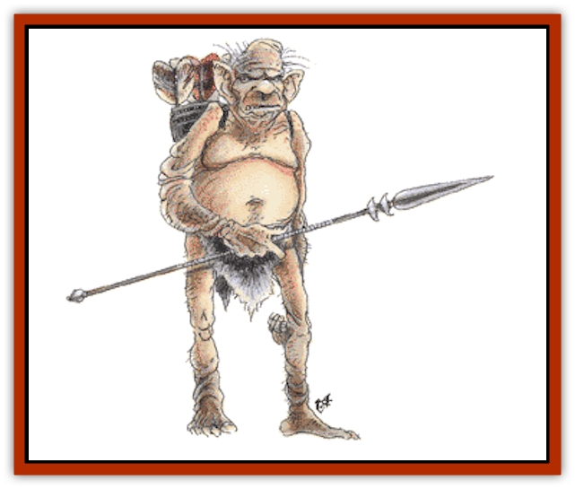

# Gremlin - Jermlaine

| Statistic | **Gremlin, Jermlaine** |
| --- | --- |
| **Activity Cycle:** | Any |
| **Alignment:** | Neutral evil (slight lawful tendencies) |
| **Armor Class:** | 7 |
| **Climate/Terrain:** | Subterranean |
| **Damage/Attack:** | 1-2 or 1-4 |
| **Diet:** | Omnivore |
| **Frequency:** | Uncommon |
| **Hit Dice:** | 1-4 hp |
| **Intelligence:** | Average (Genius cunning) (8-10) |
| **Magic Resistance:** | See below |
| **Morale:** | Steady (12) |
| **Movement:** | 15 |
| **No. Appearing:** | 12-48 |
| **No. of Attacks:** | 1 |
| **Organization:** | Clan |
| **Size:** | T (1'+) |
| **Special Attacks:** | See below |
| **Special Defenses:** | See below |
| **THAC0:** | 20 |
| **Treasure:** | Per 10 individuals O,Q; in lair C,Q(&times;5),S,T |
| **XP Value:** | Normal: 15 / Elder: 65 |

Jermlaine are a diminutive humanoid race that dwells in tunnels and ambushes hapless adventurers. They are known by a variety of names such as jinxkin or bane-midges.

Jermlaine appear to be tiny humans dressed in baggy clothing and leather helmets. In fact the "clothing" is their own saggy skin and pointed heads. The limbs are knottily muscled. The fingernails and toenails are thick and filthy, although the fingers and toes are very nimble. Their gray-brown, warty hide blends in with natural earth and stone. When they wear rags or scraps as clothing, such items are also camouflage colored.

They speak in high-pitched squeaks and twitters. This speech may be mistaken for the sounds of a bat or rat. They can also converse with all sorts of rats, both normal and monstrous. Each jermlaine has a 10% chance to understand common, dwarvish, gnomish, goblin, or orc (roll separately for each language).

**Combat:** Jermlaine are cowards who have made an art of the ambush. They only attack when they feel there is no serious opposition. They prefer to attack injured, ill, or sleeping victims. They avoid directly confronting strong, alert parties, although they may try to injure them out of sheer maliciousness.

Jermlaine possess weak eyes and infravision that only extends for 30 yards, but their keen smell and hearing enable them to detect even invisible creatures 50% of the time. Jermlaine move silently and quickly, with a scuttling gait (this stealth causes opponents to suffer a -5 penalty to their surprise rolls).

They are 75% undetectable, even if listened or watched for, unless the jermlaine purposefully reveal their presence.

Jermlaine typically arm themselves with needle-sharp darts; they can hurl these 120 yards for 1-2 points of damage. They also carry a miniature pike; these 1½-foot-long sticks with sharp tips inflict 1d4 points of damage. If the jermlaines are out to capture a victim, they are also armed with blackjacks.

The jermlaines' favorite tactic is capturing victims with nets or pits. In little-used passages the creatures prepare pits covered by camouflaged doors or string nets overhead. In more-traveled passages, the jermlaine stretch trip cords. When a victim falls afoul of a trap, the jermlaine swarm over him. Some pummel him with blackjacks while others tie him with ropes and cords. Such beatings have a cumulative 2% chance per blow of causing the victim to lapse into unconsciousness. If a victim is wearing splint, banded, or plate mail, these pummeling attacks are ineffective. Knowing this, the jermlaine attack well-armored victims with acid or flaming oil missiles.

Slain victims and 5% of subdued victims are later devoured by the jermlaine and their rats. Most captives are robbed, stripped, shaved totally hairless, and left trussed in a passageway. If an unsuspecting victim pauses near a lurking band of jermlaine, they dart out and cut straps, belts, packs, and pouches. Each jermlaine in the band makes one such attack before fleeing back into the shadows. Such attacks are usually not noticed till 1d12 turns later, when the slashed items begin to fall apart. They also try to steal, damage, or befoul victims' possessions.

When encountered, 25% of jermlaine are accompanied by 1d6 rats and 50% are accompanied by 1d6 [[Rat|giant rats]] (only one type of rat per group of jermlaine). Groups of 35 or more jermlaine are accompanied by an elder - a very old jermlaine with the magical ability to drain the magic from most magical items if he can handle such an object for 1d4 rounds. Artifacts and relics are immune to such attacks.

Jermlaine are treated as 4-Hit Die monsters for purposes of saving throws and magical attacks. Due to their diminutive size, they escape all damage from attacks that normally do half damage if the saving throw is successful.

**Habitat/Society:** Jermlaine are extremely distant relatives of the [[Gnome|gnomes]]. Their deeply rooted sense of inferiority at their own diminutive size has become a malicious need to humiliate normal-sized humanoids. They make a good living preying on hapless adventurers, who provide riches, sadistic amusement, and an occasional meal. Jermlaine acquire a wide variety of treasure, although such items tend to be small objects.

The jermlaine life span is one third that of humans. Reproduction is identical to other humanoids, although cross breeding is impossible. Jermlaine females give birth to one or two babies at a time. Most (75%) of the offspring are male, although the dangers of their hostile life reduces the male numerical superiority to an even male-female mix among the adults.

Jermlaine society is divided among clans whose members are united by blood. Each clan consists of 4d4 families. The clan chief is normally the strongest or most clever of the elders. The chief both instructs the young jermlaine in the art of the ambush and leads important attacks (albeit from a secure location in the rear). The families center around the mothers, as the fathers may be unknown, off hunting, or dead. If a female jermlaine has dependent children, she normally concentrates on raising such children rather than participating in attacks. As the children mature, she and the clan chief take the young on practice attacks on potential victims and participate in the humiliation of captives.

Jermlaine lairs are cunningly hidden and physically impassable by most humanoids, as they are usually a series of small chambers and tunnels scaled to their tiny occupants. The typical jermlaine lair is a filthy cave or burrow a short distance from a larger cavern complex. The only areas that can be easily reached by a human-sized being are the areas in which living captives are held and dead victims butchered for food. Access past this area is controlled by small, one-foot-high corridors or thin, normally impassable cracks in the rock walls. The corridors lead directly to living areas and communal chambers. The living areas are furnished with crude furniture and items scavenged from past victims.

Each jermlaine family has a personal section that half resembles a nest, half a junk yard. Treasures are concealed throughout the lair. Each family maintains a series of small, personal caches, while the communal hoard is hidden in a series of small chambers at the end of cunningly concealed crawl ways. No one larger than a jermlaine can reach such treasure chambers.

Jermlaine get along well with rats of all types. They can speak all rat-related languages. They are 75% likely to be accompanied by rats and 50% likely to share their lair with rats. This cohabitation extends to all forms of mutual cooperation and defense. There is a 10% chance that the jermlaine colony has a mutual cooperation pact with [[Rat_Osquip|osquips]] rather than normal rats.

The diet is an omnivorous mixture of insects, fresh meat, carrion, fungi, and molds. Humanoids are a delicacy reserved for special occasions. Lizards form the bulk of the meat intake. Jermlaine cherish foods from the surface, even the hardtack and iron rations carried by adventurers. If the jermlaine can identify which of the adventurers' bags carry food, these are stolen as enthusiastically as the treasure pouches.

Jermlaine have a fondness for rarities such as sugar, candy, and preserved fruits. Such items can be used to entice the normally malevolent jermlaine to leave an adventurer alone, at least temporarily.

**Ecology:** Jermlaine are opportunistic brigands who prey on unwary travelers in the subterranean regions. They are well aware of any such travelers, including a party's size, composition, and general condition. Jermlaine may be persuaded, for a suitable fee, to share such knowledge with adventurers. Jermlaine may deal with "giants" (any race bigger than they are) if they are bribed or given access to a plentiful flow of victims or riches. They never ally themselves with truly good-aligned adventurers, although they may, in a moment of craftiness, pretend to enter such an alliance. Regardless of their spoken intentions, 75% of jermlaine eventually either lie to or turn against their larger "allies". They may make their lairs near the established territories of such races as drow, trolls, or troglodytes. Although they are careful to avoid direct conflict with such evil beings, the jermlaine happily prey on the victims of their neighbors, as well as scavenging the scenes of their neighbors' battles. Jermlaine may act as watchmen for their neighbors, provided suitable terms can be agreed upon.

They unintentionally act as garbagemen, cleaning the subterranean regions. Dead animals may be used as food or supplies, while dead humanoids are taken away to be searched for valuables or used as food. Because of this, adventurers seeking the remains of a slain companion may seek out the local jermlaines since they may be aware of where the remains are located.

---
## Discovery & Documentation

**Source Publication:** Monstrous Manual (1995)
**Campaign Setting:** Advanced Dungeons & Dragons 2nd Edition
**Author(s):** Tim Beach

### Other Creatures Found in This Source Book
   * [[Aarakocra|Aarakocra]]
   * [[Aboleth|Aboleth]]
   * [[Ankheg|Ankheg]]
   * [[Arcane|Arcane]]
   * [[Argos|Argos]]
   * [[Aurumvorax|Aurumvorax]]
   * [[Baatezu_Lesser_Abishai|Baatezu, Lesser, Abishai]]
   * [[Baatezu_General_Information|Baatezu, General Information]]
   * [[Baatezu_Greater_Pit_Fiend|Baatezu, Greater, Pit Fiend]]
   * [[Banshee|Banshee]]
   * [[Basilisk|Basilisk]]
   * [[Bat|Bat]]
   * [[Bear|Bear]]
   * [[Beetle_Giant|Beetle, Giant]]
   * [[Behir|Behir]]
   * [[Beholder_and_Beholder-kin_I|Beholder and Beholder-kin I]]
   * [[Beholder_and_Beholder-kin_II|Beholder and Beholder-kin II]]
   * [[Bird|Bird]]
   * [[Brain_Mole|Brain Mole]]
   * [[Broken_One|Broken One]]
   * [[Brownie|Brownie]]
   * [[Bugbear|Bugbear]]
   * [[Bulette|Bulette]]
   * [[Bullywug|Bullywug]]
   * [[Carrion_Crawler|Carrion Crawler]]
   * [[Cat_Great|Cat, Great]]
   * [[Catoblepas|Catoblepas]]
   * [[Cat_Small|Cat, Small]]
   * [[Cave_Fisher|Cave Fisher]]
   * [[Centaur|Centaur]]
   * [[Centipede|Centipede]]
   * [[Chimera|Chimera]]
   * [[Cloaker|Cloaker]]
   * [[Cockatrice|Cockatrice]]
   * [[Couatl|Couatl]]
   * [[Crabman|Crabman]]
   * [[Crawling_Claw|Crawling Claw]]
   * [[Crocodile|Crocodile]]
   * [[Crustacean_Giant|Crustacean, Giant]]
   * [[Crypt_Thing|Crypt Thing]]
   * [[Death_Knight|Death Knight]]
   * [[Deepspawn|Deepspawn]]
   * [[Dinosaur_I|Dinosaur I]]
   * [[Displacer_Beast|Displacer Beast]]
   * [[Dog|Dog]]
   * [[Dog_Moon|Dog, Moon]]
   * [[Dolphin|Dolphin]]
   * [[Doppelganger|Doppelganger]]
   * [[Dracolich|Dracolich]]
   * [[Dragon_Brown|Dragon, Brown]]
   * [[Dragon_Chromatic_Black|Dragon, Chromatic, Black]]
   * [[Dragon_Chromatic_Blue|Dragon, Chromatic, Blue]]
   * [[Dragon_Chromatic_Green|Dragon, Chromatic, Green]]
   * [[Dragon_Cloud|Dragon, Cloud]]
   * [[Dragon_Chromatic_Red|Dragon, Chromatic, Red]]
   * [[Dragon_Chromatic_White|Dragon, Chromatic, White]]
   * [[Dragon_Deep|Dragon, Deep]]
   * [[Dragon_Gem_Amethyst|Dragon, Gem, Amethyst]]
   * [[Dragon_Gem_Crystal|Dragon, Gem, Crystal]]
   * [[Dragon_Gem_Emerald|Dragon, Gem, Emerald]]
   * [[Dragon_Gem_Sapphire|Dragon, Gem, Sapphire]]
   * [[Dragon_Gem_Topaz|Dragon, Gem, Topaz]]
   * [[Dragon_Metallic_Brass|Dragon, Metallic, Brass]]
   * [[Dragon_Metallic_Bronze|Dragon, Metallic, Bronze]]
   * [[Dragon_Metallic_Copper|Dragon, Metallic, Copper]]
   * [[Dragon_Mercury|Dragon, Mercury]]
   * [[Dragon_Metallic_Gold|Dragon, Metallic, Gold]]
   * [[Dragon_Mist|Dragon, Mist]]
   * [[Dragon_Metallic_Silver|Dragon, Metallic, Silver]]
   * [[Dragon_General_Information|Dragon, General Information]]
   * [[Dragon_Shadow|Dragon, Shadow]]
   * [[Dragon_Steel|Dragon, Steel]]
   * [[Dragon_Yellow|Dragon, Yellow]]
   * [[Dragonne|Dragonne]]
   * [[Dragon_Turtle|Dragon Turtle]]
   * [[Dragonet_Faerie_Dragon|Dragonet, Faerie Dragon]]
   * [[Dragonet_Fire_Drake|Dragonet, Fire Drake]]
   * [[Dragonet_Pseudodragon|Dragonet, Pseudodragon]]
   * [[Dryad|Dryad]]
   * [[Dwarf_Derro|Dwarf, Derro]]
   * [[Dwarf|Dwarf]]
   * [[Elemental_Athas_General_Information|Elemental (Athas), General Information]]
   * [[Elemental_Air_Kin|Elemental, Air Kin]]
   * [[Elemental_Earth_Kin|Elemental, Earth Kin]]
   * [[Elemental_Fire_Kin|Elemental, Fire Kin]]
   * [[Elemental_Water_Kin|Elemental, Water Kin]]
   * [[Elemental_of_Chaos_Air_Earth|Elemental of Chaos, Air/Earth]]
   * [[Elemental_of_Chaos_Fire_Water|Elemental of Chaos, Fire/Water]]
   * [[Elemental_Composite|Elemental, Composite]]
   * [[Elemental_Air_Earth|Elemental, Air/Earth]]
   * [[Elemental_Fire_Water|Elemental, Fire/Water]]
   * [[Elemental_General_Information|Elemental, General Information]]
   * [[Elephant|Elephant]]
   * [[Elf|Elf]]
   * [[Elf_Aquatic|Elf, Aquatic]]
   * [[Elf_Drow|Elf, Drow]]
   * [[Ettercap|Ettercap]]
   * [[Eyewing|Eyewing]]
   * [[Feyr|Feyr]]
   * [[Fish|Fish]]
   * [[Frog|Frog]]
   * [[Fungus|Fungus]]
   * [[Galeb_Duhr|Galeb Duhr]]
   * [[Gargantua|Gargantua]]
   * [[Gargoyle_I|Gargoyle I]]
   * [[Genie|Genie]]
   * [[Ghost|Ghost]]
   * [[Ghoul|Ghoul]]
   * [[Giant_Cloud|Giant, Cloud]]
   * [[Giant_Cyclops|Giant, Cyclops]]
   * [[Giant_Desert|Giant, Desert]]
   * [[Giant_Ettin|Giant, Ettin]]
   * [[Giant_Firbolg|Giant, Firbolg]]
   * [[Giant_Fire|Giant, Fire]]
   * [[Giant_Fog|Giant, Fog]]
   * [[Giant_Fomorian|Giant, Fomorian]]
   * [[Giant_Frost|Giant, Frost]]
   * [[Giant_Hill|Giant, Hill]]
   * [[Giant_Jungle|Giant, Jungle]]
   * [[Giant_Mountain|Giant, Mountain]]
   * [[Giant_Reef|Giant, Reef]]
   * [[Giant_Stone|Giant, Stone]]
   * [[Giant_Storm|Giant, Storm]]
   * [[Giant_Verbeeg|Giant, Verbeeg]]
   * [[Giant_Wood|Giant, Wood]]
   * [[Gibberling|Gibberling]]
   * [[Giff|Giff]]
   * [[Gith|Gith]]
   * [[Gith_Pirate_of|Gith, Pirate of]]
   * [[Githyanki|Githyanki]]
   * [[Githzerai|Githzerai]]
   * [[Gloomwing|Gloomwing]]
   * [[Gnoll|Gnoll]]
   * [[Gnome|Gnome]]
   * [[Gnome_Spriggan|Gnome, Spriggan]]
   * [[Goblin|Goblin]]
   * [[Golem_General_Information|Golem, General Information]]
   * [[Golem_I_Greater_Golem|Golem I (Greater Golem)]]
   * [[Golem_II_Lesser_Golem|Golem II (Lesser Golem)]]
   * [[Golem_III|Golem III]]
   * [[Golem_IV|Golem IV]]
   * [[Golem_V|Golem V]]
   * [[Golem_VI_Stone_Variants|Golem VI (Stone Variants)]]
   * [[Gorgon|Gorgon]]
   * [[Grell_Colonial|Grell, Colonial]]
   * [[Gremlin|Gremlin]]
   * [[Griffon|Griffon]]
   * [[Grimlock|Grimlock]]
   * [[Grippli|Grippli]]
   * [[Hag|Hag]]
   * [[Halfling|Halfling]]
   * [[Harpy|Harpy]]
   * [[Hatori|Hatori]]
   * [[Haunt|Haunt]]
   * [[Hell_Hound|Hell Hound]]
   * [[Heucuva|Heucuva]]
   * [[Hippocampus|Hippocampus]]
   * [[Hippogriff|Hippogriff]]
   * [[Hobgoblin|Hobgoblin]]
   * [[Homunculus|Homunculus]]
   * [[Hook_Horror|Hook Horror]]
   * [[Horse|Horse]]
   * [[Human|Human]]
   * [[Hydra|Hydra]]
   * [[Imp|Imp]]
   * [[Insect_Giant|Insect, Giant]]
   * [[Insect_Swarm|Insect Swarm]]
   * [[Intellect_Devourer|Intellect Devourer]]
   * [[Invisible_Stalker|Invisible Stalker]]
   * [[Ixitxachitl|Ixitxachitl]]
   * [[Jackalwere|Jackalwere]]
   * [[Kenku|Kenku]]
   * [[Ki-rin|Ki-rin]]
   * [[Kirre|Kirre]]
   * [[Kobold|Kobold]]
   * [[Kuo-Toa|Kuo-Toa]]
   * [[Lamia|Lamia]]
   * [[Lammasu|Lammasu]]
   * [[Leech|Leech]]
   * [[Leprechaun|Leprechaun]]
   * [[Leucrotta|Leucrotta]]
   * [[Lich|Lich]]
   * [[Living_Wall|Living Wall]]
   * [[Lizard|Lizard]]
   * [[Lizard_Man|Lizard Man]]
   * [[Locathah|Locathah]]
   * [[Lurker|Lurker]]
   * [[Lycanthrope_General_Information|Lycanthrope, General Information]]
   * [[Lycanthrope_Seawolf|Lycanthrope, Seawolf]]
   * [[Lycanthrope_Werebear|Lycanthrope, Werebear]]
   * [[Lycanthrope_Wereboar|Lycanthrope, Wereboar]]
   * [[Lycanthrope_Werebat|Lycanthrope, Werebat]]
   * [[Lycanthrope_Werefox|Lycanthrope, Werefox]]
   * [[Lycanthrope_Wererat|Lycanthrope, Wererat]]
   * [[Lycanthrope_Wereraven|Lycanthrope, Wereraven]]
   * [[Lycanthrope_Weretiger|Lycanthrope, Weretiger]]
   * [[Lycanthrope_Werewolf|Lycanthrope, Werewolf]]
   * [[Mammal|Mammal]]
   * [[Mammal_Giant|Mammal, Giant]]
   * [[Mammal_Herd_I|Mammal, Herd I]]
   * [[Mammal_Small|Mammal, Small]]
   * [[Manscorpion|Manscorpion]]
   * [[Manticore|Manticore]]
   * [[Medusa_Maedar|Medusa, Maedar]]
   * [[Medusa|Medusa]]
   * [[Mephit_General_Information|Mephit, General Information]]
   * [[Merman|Merman]]
   * [[Mimic|Mimic]]
   * [[Mind_Flayer|Mind Flayer]]
   * [[Minotaur|Minotaur]]
   * [[Mist_Crimson_Death|Mist, Crimson Death]]
   * [[Mist_Vampiric|Mist, Vampiric]]
   * [[Mold_I|Mold I]]
   * [[Moldman|Moldman]]
   * [[Mongrelman|Mongrelman]]
   * [[Morkoth|Morkoth]]
   * [[Muckdweller|Muckdweller]]
   * [[Mudman|Mudman]]
   * [[Mummy_Greater|Mummy, Greater]]
   * [[Mummy|Mummy]]
   * [[Myconid|Myconid]]
   * [[Naga|Naga]]
   * [[Naga_Dark|Naga, Dark]]
   * [[Neogi|Neogi]]
   * [[Nightmare|Nightmare]]
   * [[Nymph|Nymph]]
   * [[Octopus_Giant|Octopus, Giant]]
   * [[Ogre|Ogre]]
   * [[Ogre_Half-|Ogre, Half-]]
   * [[Ooze_Slime_Jelly_I|Ooze/Slime/Jelly I]]
   * [[Ooze_Slime_Jelly_II|Ooze/Slime/Jelly II]]
   * [[Ooze_Slime_Jelly_Slithering_Tracker|Ooze/Slime/Jelly, Slithering Tracker]]
   * [[Orc|Orc]]
   * [[Otyugh|Otyugh]]
   * [[Owlbear_I|Owlbear I]]
   * [[Pegasus|Pegasus]]
   * [[Peryton|Peryton]]
   * [[Phantom|Phantom]]
   * [[Phoenix|Phoenix]]
   * [[Piercer|Piercer]]
   * [[Plant_Dangerous_I|Plant, Dangerous I]]
   * [[Plant_Intelligent|Plant, Intelligent]]
   * [[Poltergeist|Poltergeist]]
   * [[Pudding_Deadly|Pudding, Deadly]]
   * [[Quaggoth|Quaggoth]]
   * [[Rakshasa|Rakshasa]]
   * [[Rat|Rat]]
   * [[Rat_Osquip|Rat, Osquip]]
   * [[Remorhaz|Remorhaz]]
   * [[Revenant|Revenant]]
   * [[Roc|Roc]]
   * [[Roper|Roper]]
   * [[Rust_Monster|Rust Monster]]
   * [[Sahuagin|Sahuagin]]
   * [[Satyr|Satyr]]
   * [[Scorpion|Scorpion]]
   * [[Sea_Lion|Sea Lion]]
   * [[Selkie|Selkie]]
   * [[Shadow|Shadow]]
   * [[Shedu|Shedu]]
   * [[Sirine|Sirine]]
   * [[Skeleton|Skeleton]]
   * [[Skeleton_Giant|Skeleton, Giant]]
   * [[Skeleton_Warrior|Skeleton, Warrior]]
   * [[Slaad|Slaad]]
   * [[Slug_Giant|Slug, Giant]]
   * [[Snake|Snake]]
   * [[Snake_Winged|Snake, Winged]]
   * [[Spectre|Spectre]]
   * [[Sphinx|Sphinx]]
   * [[Spider|Spider]]
   * [[Sprite|Sprite]]
   * [[Squid_Giant|Squid, Giant]]
   * [[Stirge|Stirge]]
   * [[Su-Monster|Su-Monster]]
   * [[Swanmay|Swanmay]]
   * [[Tabaxi|Tabaxi]]
   * [[Tako|Tako]]
   * [[Tanar'ri_True_Balor|Tanar'ri, True, Balor]]
   * [[Tanar'ri_True_Marilith|Tanar'ri, True, Marilith]]
   * [[Tarrasque|Tarrasque]]
   * [[Tasloi|Tasloi]]
   * [[Thought_Eater|Thought Eater]]
   * [[Thri-kreen|Thri-kreen]]
   * [[Titan|Titan]]
   * [[Toad_Giant|Toad, Giant]]
   * [[Treant|Treant]]
   * [[Triton|Triton]]
   * [[Troglodyte|Troglodyte]]
   * [[Troll|Troll]]
   * [[Umber_Hulk|Umber Hulk]]
   * [[Unicorn|Unicorn]]
   * [[Urchin|Urchin]]
   * [[Vampire|Vampire]]
   * [[Wemic|Wemic]]
   * [[Whale|Whale]]
   * [[Wight|Wight]]
   * [[Will_O'Wisp|Will O'Wisp]]
   * [[Wolf|Wolf]]
   * [[Wolfwere|Wolfwere]]
   * [[Worm|Worm]]
   * [[Wraith|Wraith]]
   * [[Wyvern|Wyvern]]
   * [[Xorn|Xorn]]
   * [[Yeti|Yeti]]
   * [[Yuan-ti_Histachii|Yuan-ti, Histachii]]
   * [[Yuan-ti|Yuan-ti]]
   * [[Yugoloth_Guardian|Yugoloth, Guardian]]
   * [[Zaratan|Zaratan]]
   * [[Zombie|Zombie]]
