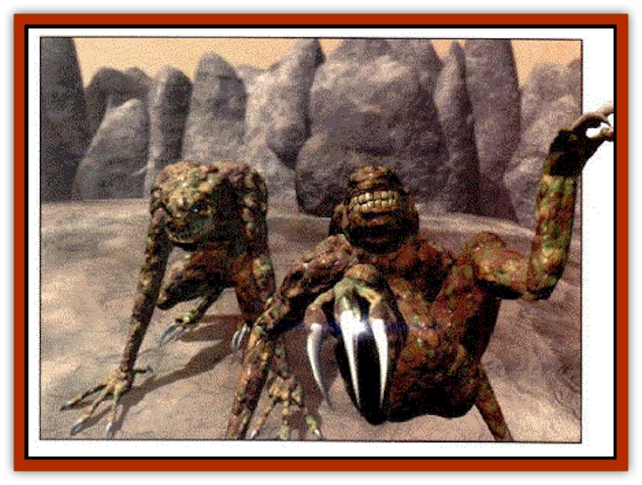

# Grillig

| Statistic | **Grillig** |
| --- | --- |
| **Activity Cycle:** | Any |
| **Alignment:** | Neutral evil |
| **Armor Class:** | 8 |
| **Climate/Terrain:** | Any angled terrain |
| **Damage/Attack:** | 1-3/1-3/1-3/1-3 |
| **Diet:** | Carnivore |
| **Frequency:** | Uncommon |
| **Hit Dice:** | 2+1 |
| **Intelligence:** | Semi(2-4) |
| **Magic Resistance:** | Nil |
| **Morale:** | Fearless (19- 20) or Unreliable (2-4) |
| **Movement:** | 12 |
| **No. Appearing:** | 1 or 2-12 |
| **No. of Attacks:** | 4 |
| **Organization:** | Herd |
| **Size:** | M (4'-5' tall) |
| **Special Attacks:** | Nil |
| **Special Defenses:** | Immune to edged weapons |
| **THAC0:** | 19 |
| **Treasure:** | Nil |
| **XP Value:** | 175 |

Grilligs are small, scaled beasts with long arms and hunched legs. Their movement resembles a gorilla's, as the grillig uses its arms to propel itself along. All four of a grillig's limbs end in three talons, which are considered valuable spell components (see below). Grilligs are vicious pests and can be lethal if they encounter an expedition unprepared for them.

Legend has it that grilligs were born from two-dimensional angles; whatever their origin, they cannot be hurt by any edged weapon. Arrows, spears, swords, and other such weapons pass through a grillig harmlessly.

Grilligs can be found· in almost any rugged, angular terrain. Chasms, caves, and mountainous areas have been known to run thick with them.

Grilligs always gang up on victims. If all except one of the grilligs attacking a target is killed, the remaining Grillig will either immediately flee combat or join another group of Grilligs attacking another victim. If cornered before it can flee, the grillig hisses and gnashes its teeth, but it does not defend itself from attackers.

**Combat:** Grilligs prefer to weaken a target with ambushes and traps, then attack in groups until their prey is dead. In battle, they raise themselves on their forelimbs, then lash out with their foot talons, shredding the target with lightning speed.

**Habitat/Society:** The bariaur call grilligs "pests that hunt their hunters." They have a pack mentality, and their society revolves around finding something larger and meaner than themselves, killing it, then moving onto a larger, meaner creature. If they can't find one, they will settle for lesser prey.

Usually, a grillig is encoW1tered singly, scouting for a victim. If it finds one, it flees and gathers its pack, which then stalks the target. They soften their prey with ambushes or crude traps  (pushing boulders off ledges, causing avalanches, stampeding other creatures over the victim, and so on). When it comes to these ambushes, grillig display cunning equal to an average human. There is evidence to suggest that these creatures simply live to hunt, favoring it over their own survival.

Although grilligs send out lone scouts in search of victims, grilligs never attack or kill alone--there is always more than one present. Some sages speculate this may have something to do with a need to have superior numbers, but one yugoloth scholar scoffed at this, claiming it's because it "takes more than one point to make an angle."

**Ecology:** It is not known how grilligs breed-more seem to appear when their numbers become too thin. The bariaur root out these pests whenever they find them, but no matter how many they kill, more appear in the later seasons. If actively hunted, the grillig lie low for a while, then emerge when the hunters relax their guard.

Grilligs are the reason why bariaur tribes on the Outlands carry bludgeoning weapons. Local myths claim that grilligs can appear through sharp angles in buildings or terrain, but this has never been confirmed.

Mages are seeking ways to skin grilligs and use their hides as proof against angled attacks. The protection is thought to be in the grilligs' na ture rather than in their physiology, for no one has succeeded in preserving a grillig's skin after death. When a grillig dies, its lizardlike skin becomes brittle, eventually turning to dust. If a way to preserve a grillig's hide was found, grilligs would become the most popular prey in the Planes.

---
## Discovery & Documentation

**Source Publication:** Dragon262 (1999)
**Campaign Setting:** Dragon Magazine
**Author(s):** Chris Avellone

### Other Creatures Found in This Source Book
   * [[Gronk|Gronk]]
   * [[Sohmien|Sohmien]]
   * [[Trelon|Trelon]]
