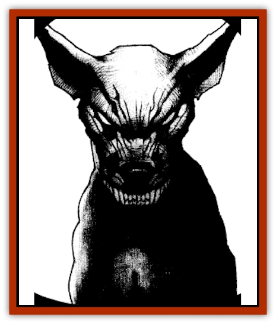

# Grim

| Statistic | **Grim** |
| --- | --- |
| **Activity Cycle:** | Night |
| **Alignment:** | Neutral good |
| **Armor Class:** | 0 |
| **Climate/Terrain:** | Any Ravenloft |
| **Damage/Attack:** | 2d8 (bite) or 2d4/2d4/1d4+1 (talon/talon/beak) or 1d2/1d2/1d4 (claw/claw/bite) |
| **Diet:** | Nil |
| **Frequency:** | Very Rare |
| **Hit Dice:** | 4+3 |
| **Intelligence:** | Average (9) |
| **Magic Resistance:** | 25% |
| **Morale:** | Fearless (20) |
| **Movement:** | 18 (black dog), 21 (cat), or fly 36 (A) (owl) |
| **No. Appearing:** | 1 |
| **No. of Attacks:** | 1 (black dog) or 3 (owl, cat) |
| **Organization:** | Solitary |
| **Size:** | M (2' tall at shoulder) |
| **Special Attacks:** | Howl, surprise, turns undead |
| **Special Defenses:** | Ethereal by day, never surprised, +1 or better magical weapon to hit, <i>protection from evil</i> aura, <i>detect evil</i> |
| **THAC0:** | 17 |
| **Treasure:** | Nil |
| **XP Value:** | 975 |

A grim is a guardian creature bound to a particular spot and charged with protecting it from all evil creatures. A grim never abandons its spot, even if it becomes dilapidated and desolate. It attacks any evil thing that enters its precinct, howling to warn of the approaching danger.

Grim can take three forms: that of a great black [[Dog|dog]], a huge black [[Cat_Small|cat]], or a black [[Owl|owl]]. However, it must stay in the same form for an entire night, becoming ethereal at daybreak and waiting until nightfall before it can choose another form. Of course, in the Shadow Rift, sunrise never comes; hence any grim encountered here will be frozen in a single form. Of the three, the watchdog form is the most common and the cat the rarest.

**Combat:** While not as powerful as some creatures in the Shadow Rift, the grim is a determined opponent well able to drive off most trespassers. In dog form it can bite every round for 2d8 points of damage. In owl form it can swoop down, clawing and pecking at the faces of its foes; each talon does 2d4 points and the beak does 1d4+1. These attacks are generally aimed at the eyes of its opponent. In cat form it attacks with its front claws for 1d2 points each and bites for 1d4; if both claw attacks hit, then it rakes with its back claws for 1d3/1d3 additional points.

In addition to their physical attacks, grim are able to turn undead as if 9th-level clerics, gaining a +2 bonus to their rolls against evil extraplanar creatures. They can only be hit by magical weapons of +1 or greater bonus. Grim radiate a *protection from evil* aura with a radius of ten feet and can *detect evil* within seventy feet, even if disguised by some spell or magical item. Thus they are never surprised by evil creatures. Their semi-ethereal form and superior senses enable them to surprise opponents at double the normal chance of success. If it detects evil approaching, a grim gives voice with a ghostly but deep howl; evil creatures hearing this menacing yowl must check morale each round or flee.

**Habitat/Society:** Grim are solitary creatures so do not interact with others except in the pursuit of their duty. Most visitors to a site protected by a grim will never be aware of its presence. Those it saves find that it completely ignores them, although it will give warning if danger approaches and join in battle against any evil creatures who trespass. During daylight (in areas which have daylight, that is) they fade totally from view and become completely intangible, rematerializing the following sunset with any damage suffered the night before completely healed. The magic that summons and binds these creatures has long since been lost, and the sites most guard are now forgotten ruins. None are known to guard populated areas, and some have speculated that the constant presence of large numbers of people somehow breaks the spell that keeps these sleepless incorruptible guardians in place.

**Ecology:** The grim exists only to fulfill its mission of ceaseless vigilance. It neither eats nor sleeps, and only harms evil creatures who trespass its boundaries. While heroes may find it a valuable unexpected ally, any interaction it has with others comes only when they impinge upon the rules that govern its existence.

---
## Discovery & Documentation

**Source Publication:** The Shadow Rift (1998)
**Campaign Setting:** Ravenloft
**Author(s):** William W. Connors, John D. Rateliff, Cindi Rice

### Other Creatures Found in This Source Book
   * [[Arak_General_Information|Arak, General Information]]
   * [[Arak_Alven|Arak, Alven]]
   * [[Arak_Brag|Arak, Brag]]
   * [[Arak_Fir|Arak, Fir]]
   * [[Arak_Muryan|Arak, Muryan]]
   * [[Arak_Portune|Arak, Portune]]
   * [[Arak_Powrie|Arak, Powrie]]
   * [[Arak_Shee|Arak, Shee]]
   * [[Arak_Sith|Arak, Sith]]
   * [[Arak_Teg|Arak, Teg]]
   * [[Avanc|Avanc]]
   * [[Changeling_Kin|Changeling (Kin)]]
   * [[Crimson_Bones|Crimson Bones]]
   * [[Saugh_Dearg-Due|Saugh, Dearg-Due]]
   * [[Saugh_Gossamer|Saugh, Gossamer]]
   * [[Treant_Evil_Blackroot|Treant, Evil (Blackroot)]]
