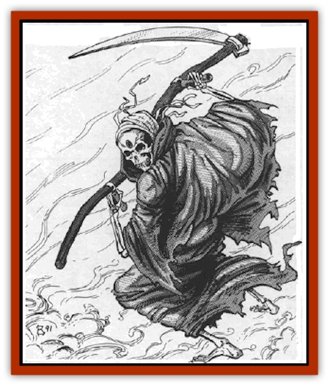

# Grim Reaper

| Statistic | **Grim Reaper** |
| --- | --- |
| **Activity Cycle:** | Any |
| **Alignment:** | Neutral |
| **Armor Class:** | 0 |
| **Climate/Terrain:** | Any Ravenloft |
| **Damage/Attack:** | See below |
| **Diet:** | Special |
| **Frequency:** | Very rare |
| **Hit Dice:** | 5 |
| **Intelligence:** | High (13-14) |
| **Magic Resistance:** | See below |
| **Morale:** | Fearless (20) |
| **Movement:** | Fl 9 (A) |
| **No. Appearing:** | 1 |
| **No. of Attacks:** | 1 |
| **Organization:** | Solitary |
| **Size:** | M (7' tall) |
| **Special Attacks:** | See below |
| **Special Defenses:** | See below |
| **THAC0:** | 15 |
| **Treasure:** | Nil |
| **XP Value:** | 4,000 |

The grim reaper (or death spirit) is a creature from the negative material plane that appears only in Ravenloft. It is drawn to the ebbing life energies of a creature on the verge of death (i.e., at or below 0 hit points) and seems, in some way, to feed upon those essences. Despite its apparent nature, a death spirit is not undead.

A grim reaper has the appearance of a bleached skeleton shrouded in a dark robe. It is always carrying a scythe in its boney hands and stands well over six feet in height.

No death spirit has ever been known to speak to the living on their own terms, but rumors persist that such a creature can be contacted by the use of a *speak to dead* spell. In such cases, language does not seem to be a factor.

**Combat:** A death spirit has little need to enter combat in most cases. Typically, it will be drawn into battle only when an attempt is made to prevent it from feeding on the spirit of a dying person. In such cases, its wrath is great and its power terrible.

When the spirit arrives to feed, it is *invisible* and can thus be  attacked effectively only by those able to *see invisible* objects. In addition, it is hit only by +3 or better magical weapons and is immune to all mind and life affecting spells (including *sleep*, *charm*, *suggestion*, *fear*, *finger of death*, *cause light wounds*, etc).

As already mentioned, the death spirit is not truly undead; it is, therefore, immune to any attempts to turn it as well as the effects of spells like control or detect undead. Similarly, it is immune to all manner of cold-, fire-, or electricity-based spells. A *negative plane protection* spell cast upon the intended victim of the death spirit will prevent the feeding and inflict damage to the reaper normally.

When the death spirit attacks a creature other than the one it has come to feed upon, it does so in three ways. On the first round of any combat, it will strike with its scythe (if possible). This ethereal weapon hits as if it were a normal polearm, but inflicts only 1d4 points of physical damage. Anyone hit by this blade must, however, save vs. death magic or be instantly slain. In the second round, it will fix its gaze on one of its attackers, forcing him to make a horror check or be overwhelmed by the creature's aura of death. On the third round, it strikes again with its scythe, this time using the shaft as if it were a quarterstaff. Anyone hit by this attack suffers 1d4 points of damage and affected as if by a feign *death spell*. The effects of this spell will fade if the creature is driven off. On the next round, this cycle begins again with the normal scythe attack.

If, at any time during the combat, the creature is able to strike at its intended victim, it does so with its scythe. No attack roll is required and no physical damage is done; rather, the life essence of the victim is drained away. As soon as this is done, the spirit fades away into the Mists of Ravenloft. Any attempt at *resurrection* or *reincarnation* of the victim is doomed to fail unless the powers attempting it are divine in nature.

If the reaper is reduced to 0 hit points, it is driven off. The intended victim benefits from this, and instantly regains 10% of his original hit point score. Similarly, if healing magic is used on the dying person at any point during the encounter, he is rescued from the brink of death and the reaper is driven off.

**Habitat/Society:** There are those who say that death spirits are agents of the Dark Powers of Ravenloft and that thwarting them earns the wrath of these mighty forces. No evidence exists to support that claim, but some connection between the two seems almost a certainty.

The chance that any mortally wounded individual (one reduced to 0 or fewer hit points) will attract the attention of a death spirit is equal to 5% per character experience level. Thus, a 15th level character on his death bed has a 75% chance of being visited by a grim reaper.

**Ecology:** Being creatures of the negative material plane, these nightmares seem to have no place in the physical world. There are those who contend, however, that they play a vital link in the balance between life and death that is central to all neutral-aligned philosophies.

---
## Discovery & Documentation

**Source Publication:** MC10 Ravenloft Appendix I (1989)
**Campaign Setting:** Planescape
**Author(s):** William W. Connors

### Other Creatures Found in This Source Book
   * [[Bastellus|Bastellus]]
   * [[Bat_Ravenloft|Bat (Ravenloft)]]
   * [[Bowlyn|Bowlyn]]
   * [[Broken_One|Broken One]]
   * [[Bussengeist|Bussengeist]]
   * [[Darkling|Darkling]]
   * [[Doom_Guard|Doom Guard]]
   * [[Doppelganger_Plant|Doppelganger Plant]]
   * [[Elemental_Ravenloft|Elemental (Ravenloft)]]
   * [[Ermordenung|Ermordenung]]
   * [[Ghoul_Lord|Ghoul Lord]]
   * [[Goblyn|Goblyn]]
   * [[Golem_III|Golem III]]
   * [[Golem_IV|Golem IV]]
   * [[Golem_Ravenloft|Golem (Ravenloft)]]
   * [[Human_Abber_Nomad|Human, Abber Nomad]]
   * [[Human_Ravenloft|Human (Ravenloft)]]
   * [[Imp_Assassin|Imp, Assassin]]
   * [[Impersonator|Impersonator]]
   * [[Lycanthrope_Werebat|Lycanthrope, Werebat]]
   * [[Lycanthrope_Wereraven|Lycanthrope, Wereraven]]
   * [[Mist_Horror|Mist Horror]]
   * [[Mummy_Greater|Mummy, Greater]]
   * [[Quevari|Quevari]]
   * [[Quickwood|Quickwood]]
   * [[Ravenkin|Ravenkin]]
   * [[Reaver|Reaver]]
   * [[Scarecrow_Ravenloft|Scarecrow (Ravenloft)]]
   * [[Shadow_Fiend|Shadow Fiend]]
   * [[Skeleton_Giant|Skeleton, Giant]]
   * [[Strahd's_Skeletal_Steed|Strahd's Skeletal Steed]]
   * [[Treant_Evil|Treant, Evil]]
   * [[Treant_Undead|Treant, Undead]]
   * [[Valpurgeist|Valpurgeist]]
   * [[Vampire_Dwarf|Vampire, Dwarf]]
   * [[Vampire_Elf|Vampire, Elf]]
   * [[Vampire_Gnome|Vampire, Gnome]]
   * [[Vampire_Halfling|Vampire, Halfling]]
   * [[Vampire_General_Information|Vampire, General Information]]
   * [[Vampire_Kender|Vampire, Kender]]
   * [[Vampyre|Vampyre]]
   * [[Widow_Red|Widow, Red]]
   * [[Wolfwere_Greater|Wolfwere, Greater]]
   * [[Zombie_Lord|Zombie Lord]]
