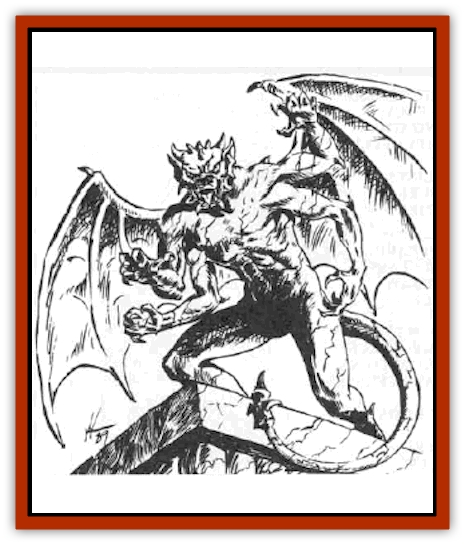
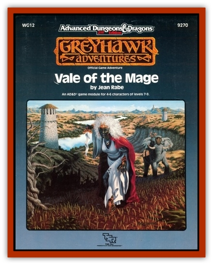

# Grist

| Statistic | **Grist** |
| --- | --- |
| **Activity Cycle:** | Any |
| **Alignment:** | Neutral |
| **Armor Class:** | 0 |
| **Climate/Terrain:** | Any stone building or rocky mountainside |
| **Damage/Attack:** | 1-8/1-8/1-10/1-8 |
| **Diet:** | Special |
| **Frequency:** | Very rare |
| **Hit Dice:** | 8+4 (42 hps) |
| **Intelligence:** | Semi- (2-4) |
| **Magic Resistance:** | 20% |
| **Morale:** | Fearless (19) |
| **Movement:** | 9, Fl 12 (B) |
| **No. Appearing:** | 2-8 |
| **No. of Attacks:** | 4 (sometimes 6) |
| **Organization:** | Solitary |
| **Size:** | L (12') |
| **Special Attacks:** | Fear gaze, snatch |
| **Special Defenses:** | +1 or better weapon needed to hit |
| **THAC0:** | 11 |
| **Treasure:** | L,M,N |
| **XP Value:** | 7,000 |

The grist, or *true gargoyle*, is a rock-like creature that resembles a [[Gargoyle_I|gargoyle]] or [[Gargoyle_I|margoyie]], but it is considerably larger and much more fearsome. Grists were created by Jason Krimeah, the Exalted One, by taking a statue resembling a gargoyle and casting *wish*, *stone shape*, *polymorph any object*, *fear*, *fly* and *geas* spells upon it. Grists are semi-intelligent and thus able to follow only the simplest of instructions. But they follow these instructions to the letter. It is unknown how many grists the mage created, but several dozen are believed to exist. Krimeah termed his creation "true gargoyles," as they fit his vision of what a gargoyle should be.

A grist has been enchanted to give it a resistance to magic and an immunity to normal weapons. Its skin looks like the exterior of the stone building or rocky mountainside it attaches itself to, and its dense rock make-up causes the grist to weigh between one and three tons. Despite its weight, a grist moves at a rate of 9 on the ground and 12 in the air. The wings are not needed for flight, but they are used to help it maneuver while in the air. If the wings become damaged, the maneuverability class of the grist worsens by one.

A grist can effortlessly cling to the sides of buildings and rocky mountainsides. It can only bond itself to stone, brick, or rock. When in place, the grist looks like an unmovable statue of a stone gargoyle that is part of the building.

**Combat:** A grist remains in place on the side of a building or mountain until the conditions of its orders are met, such as "prevent any armored humans from entering this building". A grist with this order would remain in its statue-like pose until a human attempts to enter its building or tries to attack it, at which time it animates. Until that time, only a *detect life* spell will register the grist as a living creature. A *detect magic* spell will show that the grist is enchanted.

Once a grist is animated, it fights fearlessly until destroyed. It prefers to fight from the air, as it can maneuver better. When attacking, a grist prefers to direct all of its blows against a single target in an attempt to dispatch that target and then move on to the next. It attacks with its claws, bite, and a tail swat. The tail of a grist is usually spiked like a maul. In addition, some grists have four arms instead of two, giving them six attacks per round. If two of a grist's claws hit the same opponent during a single round, the grist has successfully snatched its opponent. Such an opponent is usually taken into the air to be hurled back down to the ground in an attempt to quickly dispatch it.

Once every ten minutes the grist can generate a *fear* gaze. This cone-shaped gaze appears as a gray beam emitted from the creature's eyes. The cone is two feet wide at its point of origin, 30 feet wide at the base, and 60 feet long. Creatures caught in the gaze must roll successful saving throws vs. spell or be affected as by a *fear* spell.

The grist is immune to normal and magical fire and cold. In addition, it has a 20% magic resistance to all other spells. The grist is not affected by poisons.

**Habitat/Society:** The grist does not speak, as it has no vocal cords. It follows the orders of its master and is incapable of independent thought.

A wounded grist repairs itself by reattaching to its assigned structure and drawing minerals from it. It heals at a rate of 24 hit points a day.

There are no males or females of the species; grists are created magically and cannot reproduce. Nor do grists change size, remaining throughout their existence at the same height and weight they were given at their creation.

Grists are found in groups of 2d4, the more numerous they are, the more important the item being guarded. Grists have no real treasure of their own. However, if defeated grists are shattered, gems and coins occasionally can be found inside them - they consume rocks and minerals found on their victims, which includes ore, coins, and gems and jewelry.

**Ecology:** Grists are found attached to the inside or outside of buildings, as well as along columns, roofs, and rocky mountainsides. They have not been encountered elsewhere. They are not believed to communicate with each other.

---
## Discovery & Documentation

**Source Publication:** WG12 Vale of the Mage (1989)
**Campaign Setting:** Greyhawk
**Author(s):** Jean Rabe

### Other Creatures Found in This Source Book
   * [[Griveling|Griveling]]
   * [[Jakar|Jakar]]
   * [[Jaleeda_Bird|Jaleeda Bird]]
