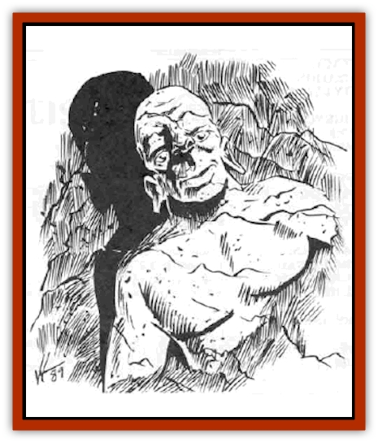

# Griveling

| Statistic | **Griveling** |
| --- | --- |
| **Activity Cycle:** | Any |
| **Alignment:** | Neutral Good |
| **Armor Class:** | 2 (-1) |
| **Climate/Terrain:** | Any cavern or mountain |
| **Damage/Attack:** | 1-8/1-4 |
| **Diet:** | Minerals |
| **Frequency:** | Very rare |
| **Hit Dice:** | 5+2 |
| **Intelligence:** | High (13-14) |
| **Magic Resistance:** | Nil |
| **Morale:** | Steady (12) |
| **Movement:** | 9, 12 (through stone) |
| **No. Appearing:** | 2 or 2-24 |
| **No. of Attacks:** | 2 |
| **Organization:** | Clan |
| **Size:** | M (6') |
| **Special Attacks:** | Spells |
| **Special Defenses:** | Spells, +1 or better weapon needed to hit |
| **THAC0:** | 15 |
| **Treasure:** | Special |
| **XP Value:** | 1,400 |

Grivelings are creatures believed to be natives of the elemental plane of Earth. It is unknown, even to the grivelings, whether they wandered through a portal to this plane or were transported here by mages. The grivelings cannot plane travel, and therefore are bound to Oerth. They have not been seen outside the Barrier Peaks and the Valley of the Mage.

Grivelings are found either in pairs or in clans of 2d12. They have a humanoid form - two legs, two arms, and a head. In their normal state they do not possess the defined features of humanoids, such as distinctive muscles, fingers, ears, eyes, and mouths. However, grivelings that are used to dealing with or observing humans and demihumans alter their forms via a limited, yet natural, *stone shape* ability so they appear to have human-like facial features, digits, and clothes, mimicking the humans and demihumans they have seen.

Many of the grivelings that live in the Bamer Peaks have the visages of Zurt, Summerstorm, Endoble, the First Protector, and the various guises of the Exalted One. Often the grivelings are not able to duplicate a humanoid face correctly, and the result is unusual or humorous, with eyes placed below mouths or odd-shaped ears in incorrect locations. Males and females are indistinguishable.

The grivelings, like the humans and demihumans in the Valley of the Mage, are believed to serve Jason Krimeah, the Exalted One. Grivelings range between four and six feet tall and weigh 1,000 to 3,500 pounds.

**Combat:** Grivelings are not fond of fighting, preferring to find peaceful solutions to differences between themselves and others. However, when pressed to fight, they fight relentlessly, using their heavy stone fists to batter opponents into submission. Grivelings attempt to kiu opponents only when their own lives seem in danger.

Because grivelings can see through rock and dirt as easily as others see through the air, they lie in wait inside the wall of a cave or other stone or dirt structure, and move part of their body out of the structure to fight, usually surprising opponents from behind or beneath. When grivelings remain attached to a stone wall, such as the side of a cavern, their Armor Class is -1. When they separate from the wall to engage opponents in melee or if they are attached to the earth, their Armor Class is reduced to 2.

When possible, grivelings use their surroundings to the utmost advantage during combat. For example, grivelings surprising their opponents often strike during one round of combat, and then move into the stone wall the next - only to emerge the following round from a different place in an attempt to surprise their opponents again.

Grivelings also use their spell-like abilities during combat. A griveling can perform any of the following, once per day: *stoneskin*, *transmute rock to mud*, *transmute mud to rock*, and *dig* as if it were an 8th-level wizard.

Because grivelings are not affected by the climate, they are not affected by normal cold or fire attacks or cold-based spells. However, magical heat and fire spells affect them. Further, because of their hard skins, +1 or better weapons are needed to injure them.

**Habitat/Society:** Grivelings dwell inside the stone walls of caverns and inside mountains. In addition, they can live outside these surroundings, such as in caves, wooded areas, or in other terrains, but they prefer to be surrounded by rocks or dirt. They are not affected by a change in climate.

Grivelings are friendly and curious, spending much of their time watching the creatures in the vale who travel next to the Barrier Peaks and questioning them about what is happening deeper in the valley. Because they have observed the occupants of the vale for so long, they have acquired the common tongue, which they speak in slow, gravely tones. In addition, they speak a smattering of mountain [[Dwarf|dwarf]] and their own language. When their curiosity gets the best of them, they travel from their rock homes and into the wilderness. These trips are short and infrequent.

Members of a griveling clan rarely act without consulting others, as grivelings respect each others' counsel. Grivelings are very protective of their peers and share all of their accumulated wealth.

A mated pair of grivelings produces one offspring every six to 12 years, with the sex of the offspring chosen by the parents.

**Ecology:** Grivelings eat very little because of their incredibly slow metabolisms. Their diet consists of minerals, such as iron, silica, lead, and magnesium, which makes them a bane to miners. The average life span of a griveling is 1,500 years.

---
## Discovery & Documentation

**Source Publication:** WG12 Vale of the Mage (1989)
**Campaign Setting:** Greyhawk
**Author(s):** Jean Rabe

### Other Creatures Found in This Source Book
   * [[Grist|Grist]]
   * [[Jakar|Jakar]]
   * [[Jaleeda_Bird|Jaleeda Bird]]
