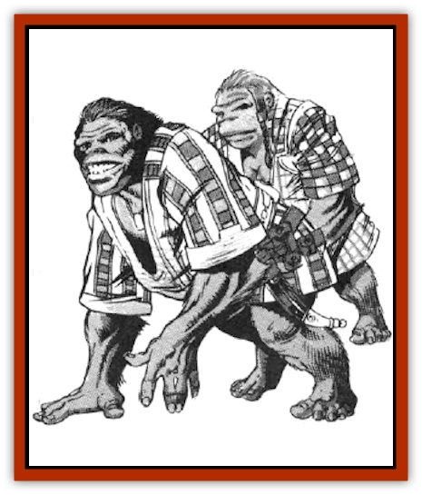

# Grommam

| Statistic | **Grommam** |
| --- | --- |
| **Activity Cycle:** | Day |
| **Alignment:** | Lawful good |
| **Armor Class:** | 5 (10) |
| **Climate/Terrain:** | Temperate and tropical/Forests |
| **Damage/Attack:** | By weapon or spell type |
| **Diet:** | Omnivore |
| **Frequency:** | Very rare |
| **Hit Dice:** | 2+1 (males), 1+1 (females), or by class/level |
| **Intelligence:** | Very (11-12) |
| **Magic Resistance:** | Nil |
| **Morale:** | Elite (13-14) |
| **Movement:** | 9, 15 in trees |
| **No. Appearing:** | 10-120 |
| **No. of Attacks:** | 1 or 2 |
| **Organization:** | Clan |
| **Size:** | M (5' tall; see below) |
| **Special Attacks:** | Spells, missiles. and magical devices possible |
| **Special Defenses:** | Spells, missiles, and magical devices possible |
| **THAC0:** | By Hit Dice or class/level |
| **Treasure:** | 50% chance each of J,K,M (D in community) |
| **XP Value:** | Varies |

Grommams are gorilla-like apes with heavy upper-body musculature. Their legs are short and their feet are roughly soled and their toes have a limited ability to grasp objects. Grommams have short, rough, copper-red fur all over their bodies except on their faces, the palms of their hands, and the soles of their feet. Their skin is a rich chocolate brown. Most grammars are five feet tall and have arm spans up to nine feet wide. Males weigh 350-500 lbs., while females weigh half as much.

Grommams use a gestural and finger-sign language. Body postures, facial expressions, and a variety of vocal hoots, screams, grunts, and calls add to the basic language, called "grommish" by other races.

Grommams prefer to wear loose, brightly colored clothing, particularly short-sleeved kimonos. They are fond of belts, arm straps, and leg straps, to which they attach weapons and tools that are tied down.

**Combat:** Grommams prefer to use weapons when attacking, though some enjoy wrestling and similar martial arts. Almost any melee weapon that a human can use can also be used by a grommam without change. Chain mail is uses almost exclusively for its light weight and flexibility. Shields can be used, but most grommets take advantage of their ambidexterity and use a weapon in either hand.

**Habitat/Society:** Grommams are a close-knit people. Grommams make their home in forests, but they enjoy the same sorts of climates as humans. They climb extremely well and some build treehouses, but most grommams are ground dwellers. A grommam family usually consists of one adult male, 1-2 adult females, and 1d4 children. One female generally cooks, cleans, and manages the children, while the other directs all household affairs such as finances, purchases, and dealings with other grammar families. The male performs heavy labor either for the family or for a local guild or business. Several dozen related families form a clan, the basic social unit, and 2d4 clans form a house, which is led by a demigod (see below). In most clans, only the "director" female is allowed to vote on political issues. Unmarried males form the backbone of the military forces, and more than a few become adventurers.

Like other races, grommams have gods - but their gods (of demigod level) openly live among the grommams themselves as their rulers and ad visors. (Typical statistics for a demigod: AC 2; MV 12 (15 in trees); F15/T15/C12; hp 100; THAC0 5: #AT 1 or 2; Dmg by spell or weapon type; abilities near maximum levels; ML 18; AL LG.) These statistics vary widely by sex and among individuals. Grommams are highly religious and organized, and most are lawful good.

Though most adult grommams have a standard 2+1 Hit Dice, one in eight is able to adopt a character class. A fairly young race, grammars have limited options. Males may become fighters or thieves (up to 20th level), and both sexes may become clerics (up to 10th level); they cannot be multiclassed. All grommams can climb walls at 85%, +1% per class level to 99%. Being very antimagical, grommams have a 40% chance for magical-item malfunction, as per dwarves (2nd Edition Player's Handbook, page 21). Their characteristics are generated as for humans, though with modifications; Males have Strengths of 2d4+10 (18/00 maximum) and suffer a -2 penalty to all rolls for Intelligence and Wisdom; females have Strengths of 2d6+4 and gain a +2 bonus to all rolls for Intelligence and Wisdom (18 maximum). All grommams have their Charisma scores lowered by two when dealing with any races but their own and other ape-like species.

Grammar spelljammer ships (usually purchased from humans) are altered to appear powerful and dramatic, with bright colors and wild designs, but they work just like any other ships. Because grammars are so adept at climbing, they make heavy use of ropes, riggings, and swing bars.

**Ecology:** Grommams are omnivorous, eating almost any sort of fruits, vegetables, nuts, roots, and small game animals. They have no trouble eating the food of any human or demihuman race. Grommams have little effect on the affair of other races.

---
## Discovery & Documentation

**Source Publication:** MC7 Spelljammer Appendix I (1990)
**Campaign Setting:** Advanced Dungeons & Dragons 2nd Edition
**Author(s):** various

### Other Creatures Found in This Source Book
   * [[Aartuk|Aartuk]]
   * [[Albari|Albari]]
   * [[Ancient_Mariner|Ancient Mariner]]
   * [[Argos|Argos]]
   * [[Beholder_Abomination_Astereater|Beholder (Abomination), Astereater]]
   * [[Blazozoid|Blazozoid]]
   * [[Chattur|Chattur]]
   * [[Chevall|Chevall]]
   * [[Clockwork_Horror|Clockwork Horror]]
   * [[Colossus|Colossus]]
   * [[Delphinid|Delphinid]]
   * [[Dizantar|Dizantar]]
   * [[Dog|Dog]]
   * [[Dog_Bog_Hound|Dog, Bog Hound]]
   * [[Esthetic|Esthetic]]
   * [[Focoid|Focoid]]
   * [[Fractine|Fractine]]
   * [[Giant_Spacesea|Giant, Spacesea]]
   * [[Golem_Furnace|Golem, Furnace]]
   * [[Golem_Radiant|Golem, Radiant]]
   * [[Gravislayer|Gravislayer]]
   * [[Hadozee|Hadozee]]
   * [[Hamster_Giant_Space|Hamster, Giant Space]]
   * [[Jammer_Leech|Jammer Leech]]
   * [[Lakshu|Lakshu]]
   * [[Lumineaux|Lumineaux]]
   * [[Lutum|Lutum]]
   * [[Mimic_Space|Mimic, Space]]
   * [[Misi|Misi]]
   * [[Moon_Rogue|Moon, Rogue]]
   * [[Mortiss|Mortiss]]
   * [[Murderoid|Murderoid]]
   * [[Nay-Churr|Nay-Churr]]
   * [[Phlog-Crawler|Phlog-Crawler]]
   * [[Plasman|Plasman]]
   * [[Plasmoid_DeGleash|Plasmoid, DeGleash]]
   * [[Plasmoid_DelNoric|Plasmoid, DelNoric]]
   * [[Plasmoid_General_Information|Plasmoid, General Information]]
   * [[Plasmoid_Ontalak|Plasmoid, Ontalak]]
   * [[Puffer|Puffer]]
   * [[Q'nidar|Q'nidar]]
   * [[Rastipede|Rastipede]]
   * [[Reigar|Reigar]]
   * [[Rock_Hopper|Rock Hopper]]
   * [[Slinker|Slinker]]
   * [[Spider_Asteroid|Spider, Asteroid]]
   * [[Spiritjam|Spiritjam]]
   * [[Survivor|Survivor]]
   * [[Syllix|Syllix]]
   * [[Symbiont_Power|Symbiont, Power]]
   * [[Vine_Infinity|Vine, Infinity]]
   * [[Wiggle|Wiggle]]
   * [[Wizshade|Wizshade]]
   * [[Wryback|Wryback]]
   * [[Zard|Zard]]
   * [[Zodar|Zodar]]
