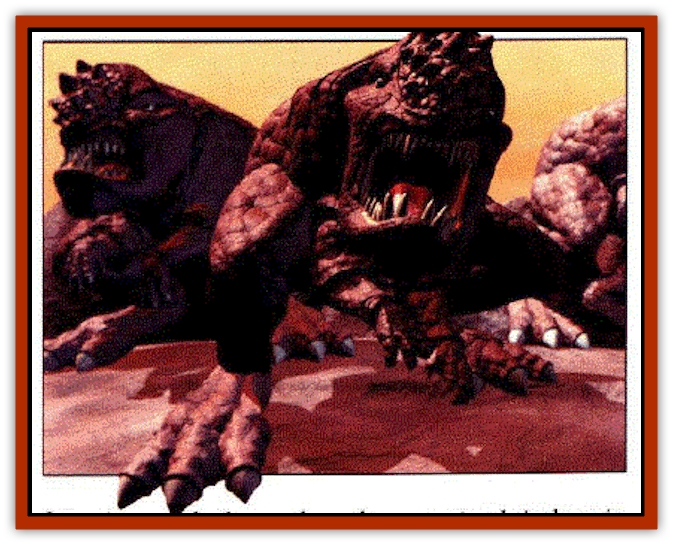

# Gronk

| Statistic | **Gronk** |
| --- | --- |
| **Activity Cycle:** | Day |
| **Alignment:** | Neutral |
| **Armor Class:** | 6 |
| **Climate/Terrain:** | Any land |
| **Damage/Attack:** | 2-12 |
| **Diet:** | Unknown (see below) |
| **Frequency:** | Uncommon |
| **Hit Dice:** | 4+2 |
| **Intelligence:** | Animal(l) |
| **Magic Resistance:** | Nil |
| **Morale:** | Fearless (19-20) |
| **Movement:** | 12 (Charge 18) |
| **No. Appearing:** | 1 or 2-12 (see below) |
| **No. of Attacks:** | 1 |
| **Organization:** | Solitary or Herd (see below) |
| **Size:** | L (6' tall) |
| **Special Attacks:** | Charge |
| **Special Defenses:** | Half damage from blunt weapons, sound-based attacks |
| **THAC0:** | 17 |
| **Treasure:** | Nil |
| **XP Value:** | 270 |

Huge, squat beasts with powerful legs and a thundering croak, the gronk are also known as "hopping rocks" or "stone frogs." The ill-tempered beasts pose a threat to the nomadic bariaur tribes that roam the Outlands, and the bariaur tribes occasionally mount hunting parties solely to thin the gronk' s numbers.

According to the bariaur nomads, gronk have existed on the Outlands for as far back as five bariaur generations. Their numbers have not increased substantially during that time, mostly due to bariaur thinning gronk herds with their rites of passage. A number of planewalkers have sighted the gronk on several Prime worlds as well.

**Combat:** The gronk aren't subtle creatures. When a creature comes within their line of sight, they emit thundering croaks and hop toward the target and smash it to death with their spiked headplates. The gronk can perform a hopping-charge up to 180 feet, striking for 2-16 points of damage.

All gronk are nearly deaf. They gain a +4 bonus to saving throws vs. any sound-based attack or spell. (If the saving throw fails, they suffer only half damage from the attack.) Bright visual displays irritate gronk. Several wizards are known to cast *dancing lights* or *pyrotechnics* spells into gronk herds to drive them into a frenzy. This results in the herd turning on itself until nearly every member is dead.

**Habitat/Society:** The gronk are so ill tempered they can't even tolerate their own species. Despite their herd mentality, the strength of the herd depends on the gronk's emotional cycle; members of a new herd can survive for almost a week before becoming irritated with one another. Soon after, their natural hatred gives way to furious bouts of head-smashing. The herd then dissolves and reforms into new herds several months later. As a result, the gronk can be encountered singly or in groups, depending on their "hate cycle."

Gronk herds have been found in deserts, plains, mountains, and swamps and in almost any climate. They shun any terrain near a large body of water, such as an ocean or Jake.

**Ecology:** Ironically, the gronk' s hatred of each other propagates their species. The gronk's reproductive organs are located near their brains, in the spiked carapace over their foreheads. The ridged spikes that cover the gronk's brainplate are actually "buds." When smashed together with sufficient force, the buds are transferred between carapaces, and a new bud grows on the headplate within a few days. This new ridge either falls off or is knocked off when the gronk smashes its forehead into another creature. If this ridge touches dirt, sand, earth, or rock, it submerges a few inches beneath the ground, only to burrow forth a few months later as a tiny gronk. 

The gronk have never been seen to eat; it is a mystery how they sustain themselves. A gronk's lifespan ranges from three to five years. As gronk age, their brainplates crack and flake off until the creature suffers brain failure and dies.

Gronk headplates are often sought after as shields and armor plating. Gronk shields provide a -1 bonus to AC against all crushing attacks (in addition to the normal shield bonus), but they weigh over 50 pounds. Characters with less than a 15 Strength suffer a -1 penalty to all Dexterity checks and attack rolls when using the shields in combat.

Gronk head plates have also been used as a covering for siege towers and for shield walls. One bariaur myth claims gronk headplates were once placed upon an enchanted battering ram - this ram was said to act as a *horn of blasting* upon any structure, but it was so heavy it needed twice the number of men to carry it as a normal battering ram.

---
## Discovery & Documentation

**Source Publication:** Dragon262 (1999)
**Campaign Setting:** Dragon Magazine
**Author(s):** Chris Avellone

### Other Creatures Found in This Source Book
   * [[Grillig|Grillig]]
   * [[Sohmien|Sohmien]]
   * [[Trelon|Trelon]]
