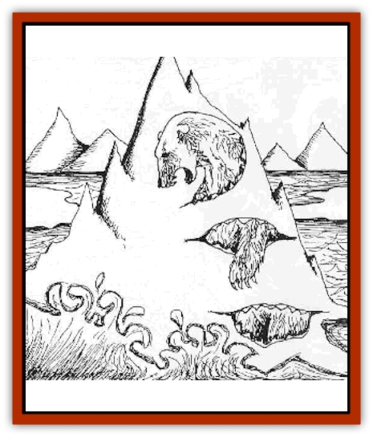
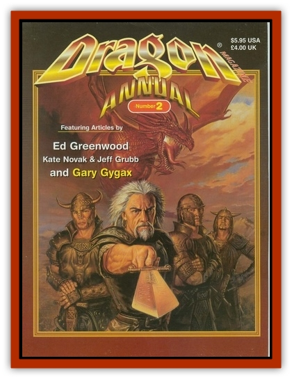

# Growler

| Statistic | **Growler** |
| --- | --- |
| **Activity Cycle:** | Any |
| **Alignment:** | Neutral evil |
| **Armor Class:** | 2 (0) |
| **Climate/Terrain:** | Arctic, aquatic |
| **Damage/Attack:** | Special, see below |
| **Diet:** | Carnivore |
| **Frequency:** | Very rare |
| **Hit Dice:** | 11+3 |
| **Intelligence:** | Average (8-10) |
| **Magic Resistance:** | Nil |
| **Morale:** | Steady (11-12) |
| **Movement:** | Sw 12 |
| **No. Appearing:** | 1 |
| **No. of Attacks:** | See below |
| **Organization:** | Solitary |
| **Size:** | G (40-50' in diameter) |
| **Special Attacks:** | Sonic attack, drowning |
| **Special Defenses:** | Nil |
| **THAC0:** | 10 |
| **Treasure:** | O,R,V |
| **XP Value:** | 7,000 |

Growlers are amorphous beings whose lives are spent at sea. Looking like miniature icebergs, they are often found floating among normal ice formations near shore. Though most of its massive body is sponge-like and rubbery, a growler has a hard, flat, movable plate of cartilage along its back; this plate is AC 0. Around the edges of the plate are rows of heat sensory organs. Growlers have no eyes but use these sensors to detect small amounts of heat and can locate prey out to 100'.

Crawlers can transform from a tall, jagged iceberg to a flat, wide ice floe in one turn. Morphing in this manner helps the growler maneuver. By increasing its vertical dimensions above water, it creates a "sail" to catch the wind. Growlers also move by water propulsion. Water is inhaled through a special valve and exhaled through mini "jets" that line the bottom of the growler. This system doubles as a growler's respiratory system, passing water over its gills. Growlers cannot breathe air.

Because of their understanding of tides and wind, growlers are superior sailors with the equivalent of seamanship and navigation proficiencies at a score of 18 each, making the chance of any ship out-maneuvering them quite slender. Growlers do not sleep and are highly aware of their surroundings, so they can be surprised only on a roll of a natural 1.

Growlers gain their name from the low rumbling noise they make when attacking and feeding. They communicate by a limited form of telepathy. Though growlers have no monetary need nor care for treasure, anything deemed valuable is collected and used as bait to lure unsuspecting victims to their death.

**Combat:** Growlers are aggressive carnivores, relying on their intelligence, cunning, and telepathic abilities to capture prey. Rotting carcasses or other "treasures" are left on their shell-like backs to attract other carnivores such as bears or wolves. Once a creature steps onto the growler, it attacks. By moving air quickly through its body, via air ducts along its surface, a growler makes an ear-shattering sonic attack. Any creature within a 20' radius must make a save vs. death or be stunned for one round and become deaf for 1d4 rounds. A victim with a successful save avoids the stun but is still deafened for 1 d4 rounds. Growlers can attak with a sound burst every other round. Once the victim is stunned, the growler folds its body across the victim, holding it firm against the shell, and submerges just far enough beneath the water to drown the creature. (See the PHB for rules on "Holding Your Breath.") The carcass is then slowly pulled through the exterior skin into the body to be devoured at leisure. A creature may make a Strength check to attempt to pull free of a growler's hold. Growlers have a Strength score of 18. When attempting to break free, both the victim and the growler make ability checks; the highest successful roll wins. Growlers do not absorb living prey. Digestion of medium to large prey takes 1d4 days, after which time a body can not be resurrected. Metal and gemstones are not consumed.

Blunt weapons cause only half damage to growlers. Magic bonuses to blunt weapons still cause damage. Other weapons inflict normal damage.

**Habitat/Society:** Growlers live, reproduce, and die in the arctic seas. They stay close to land, where they feed on [[Bear|bears]], seals, [[Wolf|wolves]], and other sea-reliant creatures. Their preferred prey though, are intelligent beings. [[Giant_Frost|Frost giants]], humans, and demi-humans are all favorites because growlers like the planning needed to capture intelligent creatures. Growlers have been known to torture victims - stunning them, swimming from shore, releasing them, only to stun them again. Growlers are a menace to small boats as well, capsizing craft smaller than themselves. Those who do not freeze immediately in the icy waters are stunned and devoured. Growlers must devour approximately 800 pounds of meat per week.

Growlers do not mate and are genderless. Once a year, during the winter solstice, growlers split in half, creating two identical creatures (size H, 20') of 5 HD, THACO 15. All other attributes are the same. They live approximately 30-40 years.

**Ecology:** Despite their mean disposition, growlers support a number of creatures and plants along their submerged surfaces. Cold water algae and krill are just two of the many small variety of marine life that makes a growier its homebase. A growler will work with other intelligent evil beings provided food is its reward. Such relationships do not last long, for growlers believe themselves too intelligent to slave for another and eventually try to consume their partner.

---
## Discovery & Documentation

**Source Publication:** Dragon Magazine Annual 2 -1997 (1997)
**Campaign Setting:** Dragon Magazine
**Author(s):** Belinda G. Ashley, C.H. Burnett

### Other Creatures Found in This Source Book
   * [[Lizard_Tundra|Lizard, Tundra]]
   * [[Skeleton_Crystal|Skeleton, Crystal]]
