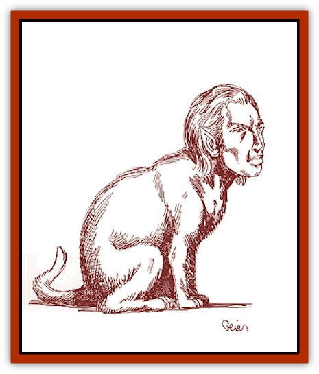

# Grudgling

| Statistic | **Grudgling** |
| --- | --- |
| **Activity Cycle:** | Dusk |
| **Alignment:** | Neutral |
| **Armor Class:** | 6 |
| **Climate/Terrain:** | Any land |
| **Damage/Attack:** | 1d2/1d2/1d4 |
| **Diet:** | Carnivore |
| **Frequency:** | Rare |
| **Hit Dice:** | 2+2 |
| **Intelligence:** | Semi- (2-4) |
| **Magic Resistance:** | Nil |
| **Morale:** | Unsteady (5-7) |
| **Movement:** | 12 |
| **No. Appearing:** | 1d4 |
| **No. of Attacks:** | 3 |
| **Organization:** | Family group |
| **Size:** | S (2-3' long) |
| **Special Attacks:** | Nil |
| **Special Defenses:** | Nil |
| **THAC0:** | 19 |
| **Treasure:** | Nil |
| **XP Value:** | 65 |

These halfling-sized creatures have a combination of feline and human characteristics. Grudglings were originally created to serve as house pets and familiars to [[Rakasta|rakastas]].

Grudglings heads are typically [[Elf|elf]], human, or [[Dwarf|dwarf]] in appearance, though similarities to other races are not unknown. To most grudgling owners, elven ears and dwarven beards on their pets tend to be favorite features. A grudgling's body resembles that of a [[Cat_Great|large cat]], including the natural variations in fur color and thickness. Yellow-orange color and sleek pelts are the most common.

**Combat:** Grudglings are clumsy, awkward beings until threatened or in some way provoked; even then, their low morale ratings usually send them running. When a grudgling does attack, it drops down to all four legs and springs with feline speed and grace. Their weak claws are little threat, but their large fangs - set in an otherwise humanoid mouth - deliver a nasty bite. When a grudgling has a running start, its ability to quickly change direction grants it an additional -1 Armor Class bonus.

**Habitat/Society:** Grudglings were created by a talented - some say insane - rakasta wizard to serve as familiars for the feline humanoids. However, their unsteady morale made them less suitable than desired. Now they survive almost exclusively as pets in rakastan households. Finding a grudgling outside of a rakastan home is very rare, and in the wild rarer still.

Though grudglings have a limited intelligence, these creatures try to assert themselves as being more humanoid than animal, clumsily walking about on their hind legs and using their front paws as hands. These pathetic attempts do appeal to some rakastas, however, who continue to raise and breed them. Despite their delusions, grudglings are almost completely dependent on their rakastan masters.

**Ecology:** Grudglings able to exist outside of domestic living are very rare. They invariably possess a Legacy which helps them to survive and are almost always Afflicted due to a lack of *cinnabryl*. These grudglings are often pitiful, intelligent enough to be unhappy with their plight, but not intelligent enough to do anything about it. A few wild grudglings can be found in the vicinity of most large rakastan settlements, living off refuse or begging for scraps.

---
## Discovery & Documentation

**Source Publication:** Monstrous Compendium Savage Coast Appendix (Online Exclusive) (1995)
**Campaign Setting:** Mystara
**Author(s):** Loren L Coleman, Ted James, Thomas Zuvich, Cindi M. Rice

### Other Creatures Found in This Source Book
   * [[Aranea_Savage_Coast|Aranea (Savage Coast)]]
   * [[Arashaeem|Arashaeem]]
   * [[Batracine|Batracine]]
   * [[Cat_Marine|Cat, Marine]]
   * [[Cinnavixen|Cinnavixen]]
   * [[Clockwork_Swordsman|Clockwork Swordsman]]
   * [[Critter_Temple|Critter, Temple]]
   * [[Cursed_One|Cursed One]]
   * [[Deathmare|Deathmare]]
   * [[Dragon_Savage_Coast_Crimson|Dragon (Savage Coast), Crimson]]
   * [[Dragon_Savage_Coast_Red_Hawk|Dragon (Savage Coast), Red Hawk]]
   * [[Echyan|Echyan]]
   * [[Ee'aar|Ee'aar]]
   * [[Enduk|Enduk]]
   * [[Fachan_Savage_Coast|Fachan (Savage Coast)]]
   * [[Feliquine|Feliquine]]
   * [[Fiend_Narvaezan|Fiend, Narvaezan]]
   * [[Frelôn|Frelôn]]
   * [[Ghriest|Ghriest]]
   * [[Glutton_Sea|Glutton, Sea]]
   * [[Goatman|Goatman]]
   * [[Golem_Naâruk|Golem, Naâruk]]
   * [[Golem_Savage_Coast|Golem (Savage Coast)]]
   * [[Heraldic_Servant_I|Heraldic Servant I]]
   * [[Heraldic_Servant_II|Heraldic Servant II]]
   * [[Heraldic_Servant_III|Heraldic Servant III]]
   * [[Heraldic_Servant_IV|Heraldic Servant IV]]
   * [[Heraldic_Servant_V|Heraldic Servant V]]
   * [[Heraldic_Servant_General_Information|Heraldic Servant, General Information]]
   * [[Hermit_Sea|Hermit, Sea]]
   * [[Jorri|Jorri]]
   * [[Juhrion|Juhrion]]
   * [[Kla'a-tah|Kla'a-tah]]
   * [[Leech_Legacy|Leech, Legacy]]
   * [[Lich_Inheritor|Lich, Inheritor]]
   * [[Lizard_Kin_Savage_Coast|Lizard Kin (Savage Coast)]]
   * [[Lupasus|Lupasus]]
   * [[Lupin|Lupin]]
   * [[Lyra_Bird_Saragón|Lyra Bird, Saragón]]
   * [[Malfera|Malfera]]
   * [[Manscorpion_Nimmurian|Manscorpion, Nimmurian]]
   * [[Mythuínn_Folk|Mythuínn Folk]]
   * [[Neshezu|Neshezu]]
   * [[Nikt'oo|Nikt'oo]]
   * [[Nosferatu|Nosferatu]]
   * [[Omm-wa|Omm-wa]]
   * [[Omshirim|Omshirim]]
   * [[Parasite_Savage_Coast|Parasite (Savage Coast)]]
   * [[Phanaton|Phanaton]]
   * [[Plant_Savage_Coast|Plant (Savage Coast)]]
   * [[Pudding_Vermilion|Pudding, Vermilion]]
   * [[Rakasta|Rakasta]]
   * [[Ray_Forest|Ray, Forest]]
   * [[Shedu_Greater_Savage_Coast|Shedu, Greater (Savage Coast)]]
   * [[Shimmerfish|Shimmerfish]]
   * [[Skinwing|Skinwing]]
   * [[Spawn_of_Nimmur|Spawn of Nimmur]]
   * [[Spider-spy|Spider-spy]]
   * [[Spirit_Heroic|Spirit, Heroic]]
   * [[Spirit_Walleran|Spirit, Walleran]]
   * [[Succulus|Succulus]]
   * [[Swampmare|Swampmare]]
   * [[Symbiont_Shadow|Symbiont, Shadow]]
   * [[Tortle|Tortle]]
   * [[Troll_Legacy|Troll, Legacy]]
   * [[Trosip|Trosip]]
   * [[Tyminid|Tyminid]]
   * [[Utukku|Utukku]]
   * [[Voat|Voat]]
   * [[Voat_Herathian|Voat, Herathian]]
   * [[Vulturehound|Vulturehound]]
   * [[Wallara|Wallara]]
   * [[Wurmling|Wurmling]]
   * [[Wynzet|Wynzet]]
   * [[Yeshom|Yeshom]]
   * [[Zombie_Red|Zombie, Red]]
