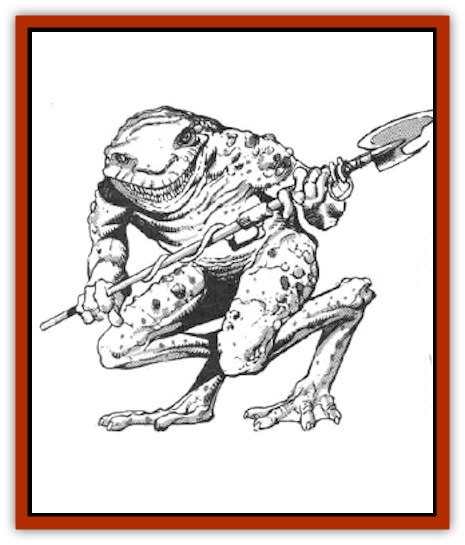

# Grung

| Statistic | **Grung** |
| --- | --- |
| **Activity Cycle:** | Day |
| **Alignment:** | Lawful evil |
| **Armor Class:** | 7 |
| **Climate/Terrain:** | Tropical and subtropical/Swamps |
| **Damage/Attack:** | 1-3 (bite)/1-6 (weapon) |
| **Diet:** | Carnivore |
| **Frequency:** | Uncommon |
| **Hit Dice:** | 1+2 |
| **Intelligence:** | Average (8-10) |
| **Magic Resistance:** | Nil |
| **Morale:** | Elite (13) |
| **Movement:** | 9, Sw 12 |
| **No. Appearing:** | 4-48 |
| **No. of Attacks:** | 2 |
| **Organization:** | Tribal |
| **Size:** | S (3' tall) |
| **Special Attacks:** | Poison |
| **Special Defenses:** | Nil |
| **THAC0:** | 19 |
| **Treasure:** | C |
| **XP Value:** | Normal: 120 / Tadpole: 7 / Juvenile: 35 / Shaman, 1st or 2nd: 175 / Shaman, 3rd: 270 |

Grung are highly territorial, toad-like humanoids that dwell in swamps and marshes.

Standing about three feet tall, grung have lower bodies that strongly resemble those of giant [[Frog|frogs]] or [[Toad_Giant|toads]], with powerful legs and large webbed feet. Their upper bodies, however, are more developed, with muscular forelimbs, opposable thumbs, and smaller, more humanoid looking heads. They stand upright and move in rapid, short hops. They are incapable of the prodigious leaps and jumps of frogs, toads, or [[Bullywug|bullywugs]].

While evolution has given them intelligence and forelimbs capable of using tools, it has taken away the prehensile tongues of frogs. In its place, the grung's wide mouths are full of the sharp teeth needed by carnivores Grung have the slick, wet skin of other amphibians. Since they breathe through their skin, they must keep it moist. Their coloration is like that of bullfrogs - dappled green and brown on their backs, shading to white or yellow on their bellies. Their eyes - smaller than those of frogs and toads and protected by bony ridges - are red with black pupils. Males are slightly smaller than females.

**Combat:** Because they're small, grung prefer ambush to frontal assaults. Their favorite tactic is to lie concealed until their enemies - wheter travelers or a party of grung from another tribe - have wandered well into range, then open fire with short bows and spears. These attacks are particularly deadly against non-grung, because the creatures invariably poison their arrowheads and spear tips. This poison is the sticky fluid constantly secreted by the grung's skin. Before using a weapon, the grung wipe the tip on their skin to rub on the poison. The poison is highly toxic; those who fail the saving throw die in four rounds (no damage if the saving throw is successful). The grung are immune to this particular type of poison (but not to other poisons). The poison breaks down within ten rounds when exposed to air.

Although they prefer to use their bows and spears, grung can deliver a nasty bite. Their saliva contains a weakened form of the same poison their skin secretes. The victim receives a +2 bonus to his saving throw, but he dies in six rounds if the saving throw fails.

Grung die if their skin dries out. They must immerse themselves in water at least once every three hours for a full round or they suffocate.

**Habitat/Society:** Grung are war-like, territorial creatures. They typically claim all territory within at least a mile of their tribal settlements. Anyone unwise enough to enter this territory is a target for immediate attack. Grung from other tribes are also fair game; nasty little border wars between neighboring tribes are the rule, not the exception. Most encounters with grung are with wandering war bands looking for trespassers. Grung are always hostile and cannot be negotiated with.

Grung settlements are untidy collections of crude shelters, sometimes concealed inside large dead trees. tribes number 10d6+40 individuals, with young comprising 25% of that number (AC 10, Sw 12, HD ½, #AT 1, Dmg 1 [no poison], SA nil). Grung lay eggs, and their offspring go through a tadpole stage. For this reason, grung settlements are always next to open water. Within three months of hatching, the tadpoles absorb their tails, develop limbs, and climb out of the water and join the tribe as immature grung. These young grungs have 1-1 Hit Dice but otherwise have the same abilities as adults. They reach full maturity in another six months.

Grung tribes are matriarchal. War chiefs are all female, and the tribal chieftain is the strongest fighter among the war chiefs. Rising through the ranks is by duels to the death, with the victor getting the title. Each tribe also has a single female shaman of up to 3rd level. Her spheres are All, Animal, Combat, Healing (reversed spells only), and Plant.

**Ecology:** Grung eat swamp-dwelling mammals, such as [[Rat|rats]], unwary travelers, even other grung. They have few natural predators due to the toxicity of their flesh. Giant poisonous [[Snake|snakes]] are usually immune to grung poison and actively hunt grung.

The water around grung settlements is tainted by their poisonous secretions. Any non-grung drinking the water must roll a successful saving throw vs. poison (with a +3 bonus) or become nauseated for 2d4 rounds. Nauseated creatures fight with penalties of -1 to their attack rolls and +1 to their Armor Class.

Grung poison is almost impossible to bottle (as any exposure to air causes it to decompose in ten rounds).

---
## Discovery & Documentation

**Source Publication:** MC5 Greyhawk Appendix (1989)
**Campaign Setting:** Advanced Dungeons & Dragons 2nd Edition
**Author(s):** Grant Boucher, William W. Connors, Steve Gilbert, Bruce Nesmith, Chris Mortika, Skip Williams

### Other Creatures Found in This Source Book
   * [[Aspis|Aspis]]
   * [[Beastman|Beastman]]
   * [[Bonesnapper|Bonesnapper]]
   * [[Booka|Booka]]
   * [[Brownie_Buckawn|Brownie, Buckawn]]
   * [[Brownie_Quickling|Brownie, Quickling]]
   * [[Crystalmist|Crystalmist]]
   * [[Dragon_Cloud|Dragon, Cloud]]
   * [[Dragon_Oerth_Greyhawk|Dragon (Oerth), Greyhawk]]
   * [[Dragonfly_Giant|Dragonfly, Giant]]
   * [[Dragonnel|Dragonnel]]
   * [[Elf_Grugach|Elf, Grugach]]
   * [[Elf_Valley|Elf, Valley]]
   * [[Golem_Necrophidius|Golem, Necrophidius]]
   * [[Grell_Wild|Grell, Wild]]
   * [[Hobgoblin_Norker|Hobgoblin, Norker]]
   * [[Hook_Horror|Hook Horror]]
   * [[Horgar|Horgar]]
   * [[Hound_Yeth|Hound, Yeth]]
   * [[Iguana_Giant|Iguana, Giant]]
   * [[Ingundi|Ingundi]]
   * [[Kech|Kech]]
   * [[Kyuss_Son_of|Kyuss, Son of]]
   * [[Mite|Mite]]
   * [[Needleman|Needleman]]
   * [[Plant_Carnivorous_Oerth|Plant, Carnivorous (Oerth)]]
   * [[Plant_Carnivorous_Vampire_Cactus|Plant, Carnivorous, Vampire Cactus]]
   * [[Plasmoid_General_Information|Plasmoid, General Information]]
   * [[Rat_Oerth|Rat (Oerth)]]
   * [[Raven_Crow|Raven/Crow]]
   * [[Scarecrow|Scarecrow]]
   * [[Shadow_Slow|Shadow, Slow]]
   * [[Skulk|Skulk]]
   * [[Snail|Snail]]
   * [[Sprite|Sprite]]
   * [[Taer|Taer]]
   * [[Tentamort|Tentamort]]
   * [[Turtle_Giant|Turtle, Giant]]
   * [[Tyrg|Tyrg]]
   * [[Wolf_Mist|Wolf, Mist]]
   * [[Wraith_Oerth|Wraith (Oerth)]]
   * [[Zygom|Zygom]]
