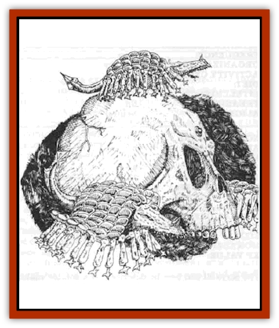
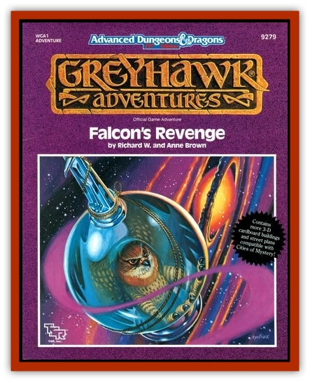

# Grythok

| Statistic | **Grythok** |
| --- | --- |
| **Activity Cycle:** | Any |
| **Alignment:** | Nil |
| **Armor Class:** | 5 |
| **Climate/Terrain:** | Any subterranean |
| **Damage/Attack:** | 1-6 |
| **Diet:** | Omnivore |
| **Frequency:** | Uncommon |
| **Hit Dice:** | 1 |
| **Intelligence:** | Animal (1) |
| **Magic Resistance:** | Nil |
| **Morale:** | Unreliable (2-4) |
| **Movement:** | 1, Fl 9 (D) |
| **No. Appearing:** | 10-80 |
| **No. of Attacks:** | 1 |
| **Organization:** | Swarm |
| **Size:** | T (6&rdquo;) |
| **Special Attacks:** | 10% cause disease |
| **Special Defenses:** | Nil |
| **THAC0:** | 19 |
| **Treasure:** | Nil |
| **XP Value:** | 65 |

Grythok range in size from 2" to 6" long. Their soft bodies are oval-shaped and covered by a tough, leathery shell. All organs snd exposed areas are completely covered by the hemispherical shell.

Beneath the shell are the grythoks mouth, legs, and sensory organs. The mouth is circular and completely surrounded by sharp teeth. The 12 legs are short and sharp, barely functional for movement, but effective for digging in and holding on to any material softer than leather. These legs have adapted to allow the grythok to hold on to its food or prey in order for the mouth to successfully attach. The legs function as barbs and cause no damage if the grythok releases them willingly, as when it is finished with a food source and chooses to move on. However, the legs cause 1-4 hp if the grythok is forcefully removed from its victim.

**Combat:** These creatures generally cling to the walls, floor, and ceiling of underground caverns. When a creature approaches, the grythok is aroused by any aura other than evil that comes within 60'. It immediately takes flight and attacks with all the vigor of an animal in a feeding frenzy. As it does so, it emits a high-pitched shriek that is inaudible to humanoid ears but is a clarion call to other grythok. Its cousins will respond to this "dinner bell" immediately, arriving at a rate of two per round. The shriek is audible to other grythok only within 60�. but as farther grythok respond, they emit their own shrieks and the call carries through tunnels and caverns in a ripple effect.

The grythok is able to smell flesh, whether warm or cold, and attempts to attach itself to any exposed flesh. It immediately digs in with its barbed legs and then attempts to sink its bite into its victim. A successful "to hit" roll by a grythok means that both its legs and mouth have dug into its victim's flesh. It will remain attached until it has finished feeding or has been forcefully dislodged.

The grythok then begins to take circular bites out of its victim, and slowly moves itself along to fresh areas of skin. Its many legs allow it to reposition itself without releasing its iron grip. A single grythok will inflict a maximum of 30 hp before it is "full" and drops off its victim. If anyone makes successful THAC0 and Dexterity rolls, the grythok is dislodged at a cost of 1-4 hp to the victim.

One in ten grythok carry a disease due to their scavenging habits. This is not a result of a spell, but simply due to the filthy conditions in which they live. No saving throw is applicable.

Grythok may be destoyed by any normal means, but attacking a grythok attached to a character also presents a risk of injuring the victim. A successful attack on an attached grythok indicates equal damage to the victim: a miss on an attached grythok requires a "to hit" roll against the victim.

**Habitat/Society:** The grythok are underground scavengers that inhabit dark, musty, dirty places. They are found mainly in sewers, garbage dumps, latrines, and cesspools, but rarely anywhere else, since they require conditions of filth to survive. They will eat almost anything, but prefer meat and meat-like substances, including rodents, insects, worms, and snakes. They would make ideal garbage disposals if it were not for their vicious and frequent attacks.

**Ecology:** Lengthy evolution has rendered these creatures immune to most diseases, although they are carriers and transmitters of many forms of plague and disease. They reproduce via egg-laying twice per year, but their population growth rate is slow since they often accidentally devour their own eggs.

---
## Discovery & Documentation

**Source Publication:** WGA1 Falcon's Revenge (1989)
**Campaign Setting:** Greyhawk
**Author(s):** Richard W and Anne Brown

### Other Creatures Found in This Source Book
   * [[Carpet_Snake|Carpet Snake]]
   * [[Scryxull|Scryxull]]
