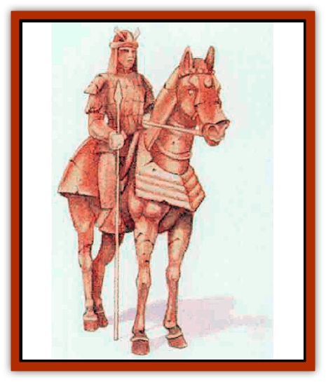

# Guardian Warrior

| Statistic | **Horse** | **Warrior** |
| --- | --- | --- |
| **Activity Cycle:** | Any | Any |
| **Alignment:** | Any neutral | Any neutral |
| **Armor Class:** | 4 | 4 |
| **Climate/Terrain:** | Any land | Any land |
| **Damage/Attack:** | 1d6 (hoof)/1d6 (hoof)/1d4 (bite) | 1d12 (sword) |
| **Diet:** | Nil | Nil |
| **Frequency:** | Very rare | Very rare |
| **Hit Dice:** | 5 | 5 |
| **Intelligence:** | Semi- (2) | Semi- (4) |
| **Magic Resistance:** | Nil | Nil |
| **Morale:** | Fearless (20) | Fearless (20) |
| **Movement:** | 15 | 9 |
| **No. Appearing:** | 1d10 | 1d10 |
| **No. of Attacks:** | 3 | 1 |
| **Organization:** | Solitary | Solitary |
| **Size:** | L (8' long) | M (6' tall) |
| **Special Attacks:** | Nil | Nil |
| **Special Defenses:** | See below | See below |
| **THAC0:** | 15 | 15 |
| **Treasure:** | See below | See below |
| **XP Value:** | 650 | 650 |

The guardian warrior and horse are ceramic constructs created to serve as protectors and bodyguards. Only those who discover the correct magic formula can animate these creatures. Guardians are often a dull red in color. Their equipment and accouterments almost always reflect the fashions of a previous age. Their ceramic eyes and faces seem curiously expressionless, and the figures never bear intricate carvings or beautiful sculpture work. Whenever such guardians move along stone or marble floonng, both warriors and horses alike make eerie, hollow, clopping sounds.

**Combat:** In battle the guardian warrior attacks with its ceramic weapon, normally a broad sword. However, no matter what weapon the construct wields, it inflicts 1d12 points of damage with every successful attack. When commanded by an animator of similar alignment (see "Habitat/Society"), the guardian can obey simple orders, although it is no capable of following compex orders or attack plans.

Guardians are immune to fire-based attacks, although such assaults do cause them to emit a frightening, dul red glow for one turn. They also remain immune to acid, to mind-affecting spells such as sleep and friends, and - since they have no working eyes, as such - to spells affecting vision (light, darkness, etc.) Attacks from edged and piercing weapons inflict only 1 point of damage, although the attacker thinks the weapon causes full damage. Blunt weapons do inflict full damage.

**Habitat/Society:** In their original form, guardian warriors and their steeds were simply ceramic figures sometimes used as symbolic guards of tombs or religigiosus sites. Only a few know the mysterious animation formula; others may find it described on a scroll or on a set of beautiful jade tablets worth 1,000 gold pieces. Animating a guardian cuilminates with pouring a liquid over the lifeless statue. The kind of liquid used determines the alignment of the animated creature: saltwater for lawful neutral, pure water for neutral, and acid for chaotic neutral.

If a guardian warrior (or horse) has the same basic alignment as its animator (fir example, a lawful guardian with a lawful animator), it diligently follows any instructions this figure gives it. It the basic alignments differ by one step (in other words, chaotic/neutral or neutral/lawful), the guardian ignores instructions, and if the alignments oppose each other (lawful/chaotic) the guardian violently attacks the hapless animator as soon its creatlon is complete.

**Ecology:** Guardians usually serve as bodyguards or protectors of great treasures, temples, havens, etc. As constructs, they have no role in the normal ecology of Mystara.

Some 10% of all guardians (warriors and steeds) have gems in place of eyes. Such jewels, normally rubies or garnets, range in value from 100 to 600 gold pieces (1d6x100) each.

**Horse**

  Guardian horses have the same basic immunities as guardian warriors and become animated by the same process. In battle, the steeds utilze their powerful, ceramic front hooves (1d6/1d6 points of damage) and wicked bite (1d4 points of damage).

Usually the number of these steeds, which serve as mounts for guardian warriors, equals the number of warriors found in any one site. An animator of the proper alignment may command the horses to allow other creatures (including the animator) to ride them.

---
## Discovery & Documentation

**Source Publication:** Mystara Appendix (1994)
**Campaign Setting:** Mystara
**Author(s):** John Nephew, Teeuwynn Woodruff, John Terra, Skip Williams

### Other Creatures Found in This Source Book
   * [[Actaeon|Actaeon]]
   * [[Agarat|Agarat]]
   * [[Ash_Crawler|Ash Crawler]]
   * [[Baldandar|Baldandar]]
   * [[Bargda|Bargda]]
   * [[Bhut|Bhut]]
   * [[Bird_Mystara|Bird (Mystara)]]
   * [[Blackball|Blackball]]
   * [[Choker|Choker]]
   * [[Coltpixie|Coltpixie]]
   * [[Crone_of_Chaos|Crone of Chaos]]
   * [[Darkhood|Darkhood]]
   * [[Darkwing|Darkwing]]
   * [[Decapus|Decapus]]
   * [[Deep_Glaurant|Deep Glaurant]]
   * [[Diabolus|Diabolus]]
   * [[Dimensional_Warper|Dimensional Warper]]
   * [[Dragon_Mystara_Crystalline|Dragon (Mystara), Crystalline]]
   * [[Dragon_Mystara_Jade|Dragon (Mystara), Jade]]
   * [[Dragon_Mystara_Onyx|Dragon (Mystara), Onyx]]
   * [[Dragon_Mystara_Ruby|Dragon (Mystara), Ruby]]
   * [[Drake_Mystara|Drake (Mystara)]]
   * [[Dragonfly|Dragonfly]]
   * [[Dusanu|Dusanu]]
   * [[Elemental_of_Chaos_Air_Earth|Elemental of Chaos, Air/Earth]]
   * [[Elemental_of_Chaos_Fire_Water|Elemental of Chaos, Fire/Water]]
   * [[Elemental_of_Law_Air_Earth|Elemental of Law, Air/Earth]]
   * [[Elemental_of_Law_Fire_Water|Elemental of Law, Fire/Water]]
   * [[Familiar_Mystara|Familiar (Mystara)]]
   * [[Frost_Salamander|Frost Salamander]]
   * [[Fundamental_Air_Earth|Fundamental, Air/Earth]]
   * [[Fundamental_Fire_Water|Fundamental, Fire/Water]]
   * [[Gargantua_Mystara|Gargantua (Mystara)]]
   * [[Geonid|Geonid]]
   * [[Ghostly_Horde|Ghostly Horde]]
   * [[Giant_Athach|Giant, Athach]]
   * [[Giant_Hephaeston|Giant, Hephaeston]]
   * [[Golem_Drolem|Golem, Drolem]]
   * [[Golem_Mystara_I|Golem (Mystara) I]]
   * [[Golem_Mystara_II|Golem (Mystara) II]]
   * [[Golem_Mystara_III|Golem (Mystara) III]]
   * [[Gray_Philosopher|Gray Philosopher]]
   * [[Gyerian|Gyerian]]
   * [[Herex|Herex]]
   * [[Hivebrood|Hivebrood]]
   * [[Horde|Horde]]
   * [[Hsiao|Hsiao]]
   * [[Huptzeen|Huptzeen]]
   * [[Hutaakan|Hutaakan]]
   * [[Imp_Mystara|Imp (Mystara)]]
   * [[Jellyfish_Giant_Mystara|Jellyfish, Giant (Mystara)]]
   * [[Kna|Kna]]
   * [[Kopru|Kopru]]
   * [[Lizard_Mystara|Lizard (Mystara)]]
   * [[Lizard-kin_Mystara|Lizard-kin (Mystara)]]
   * [[Lupin|Lupin]]
   * [[Lycanthrope_Werejaguar_Mystara|Lycanthrope, Werejaguar (Mystara)]]
   * [[Lycanthrope_Wereswine|Lycanthrope, Wereswine]]
   * [[Magen|Magen]]
   * [[Manikin|Manikin]]
   * [[Mek|Mek]]
   * [[Mujina|Mujina]]
   * [[Nagpa|Nagpa]]
   * [[Neh-thalggu|Neh-thalggu]]
   * [[Nightshade_Mystara|Nightshade (Mystara)]]
   * [[Nuckalavee|Nuckalavee]]
   * [[Pegataur|Pegataur]]
   * [[Phanaton|Phanaton]]
   * [[Plant_Dangerous_Mystara|Plant, Dangerous (Mystara)]]
   * [[Plasm|Plasm]]
   * [[Rakasta|Rakasta]]
   * [[Rock_Man|Rock Man]]
   * [[Sabreclaw|Sabreclaw]]
   * [[Sacrol|Sacrol]]
   * [[Scamille|Scamille]]
   * [[Shapeshifter|Shapeshifter]]
   * [[Shargugh|Shargugh]]
   * [[Shark-kin|Shark-kin]]
   * [[Sollux|Sollux]]
   * [[Spectral_Death|Spectral Death]]
   * [[Spectral_Hound|Spectral Hound]]
   * [[Spider-kin|Spider-kin]]
   * [[Spirit_Mystara|Spirit (Mystara)]]
   * [[Statue_Living|Statue, Living]]
   * [[Surtaki|Surtaki]]
   * [[Tabi|Tabi]]
   * [[Thoul|Thoul]]
   * [[Thunderhead|Thunderhead]]
   * [[Tiger_Ebon|Tiger, Ebon]]
   * [[Topi|Topi]]
   * [[Tortle|Tortle]]
   * [[Vampire_Velya|Vampire, Velya]]
   * [[White_Fang|White Fang]]
   * [[Worm_Mystara|Worm (Mystara)]]
   * [[Wyrd|Wyrd]]
   * [[Yowler|Yowler]]
   * [[Zombie_Lightning|Zombie, Lightning]]
