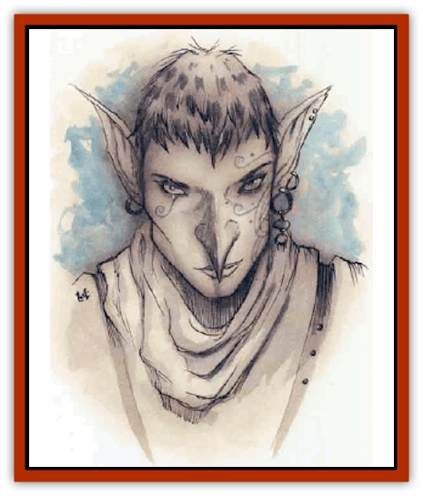

# Guardinal - Avoral

| Statistic | **Guardinal, Avoral** |
| --- | --- |
| **Activity Cycle:** | Day |
| **Alignment:** | Neutral good |
| **Armor Class:** | -1 |
| **Climate/Terrain:** | Elysium |
| **Damage/Attack:** | 1d8/1d8 or 2d6/2d6 |
| **Diet:** | Omnivore |
| **Frequency:** | Uncommon |
| **Hit Dice:** | 7+4 |
| **Intelligence:** | Exceptional (15-16) |
| **Magic Resistance:** | 40% |
| **Morale:** | Champion (15-16) |
| **Movement:** | 15, Fl 36 (B) |
| **No. Appearing:** | 1 (1-4) |
| **No. of Attacks:** | 2 wing buffets or 2 talons |
| **Organization:** | Solitary |
| **Size:** | M (6½' tall, 20' wingspan) |
| **Special Attacks:** | Dive, spell-like powers |
| **Special Defenses:** | Hit only by silver or +1 or better weapons |
| **THAC0:** | 13 |
| **Treasure:** | Incidental |
| **XP Value:** | 8,000 |

Avorals're [[Guardinal_General_Information|guardinals]] with the wings of mighty [[Eagle|eagles]]. They're the scouts and skirmishers of their race, keeping watch over the peaceful skies of Amoria. No other guardinals can fly, so aerial vigilance falls to the avorals who confront any invaders who try that avenue. Avorals are born with a deep-rooted wanderlust that can take them on fantastic journeys through hundreds of worlds. Some leave Elysium and never return because they've just got to see what lies over the next hill or beyond the next sea.

Avorals have the bodies of tall, muscular men or women, but their arms are long, powerful wings and their lower legs feature strong talons and feathery vanes to act as a tail in flight. Their faces are more human than avian, but their hair seems to be a feathery cowl around their heads, and their eyes are bright and golden. Avorals' chests are exceptionally deep and powerful, anchoring their wing muscles; their bones are strong but hollow, so even the largest avorals weigh no more than 120 pounds despite their appearance.

An avoral's wings feature small hands at the midpoints. When its wings are folded beside its body, these wing-hands are carried about where a human's would be, and can do just about anything a human hand could do.

**Combat:** On the ground, the avoral can lash out with its wings and deliver powerful, punishing blows. Just as a swan can kill a man with its wings, an avoral is easily capable of defending itself while on the ground. However, this isn't its preferred mode of combat. The avoral'd much rather meet its foes in the air, where it can employ its rock-hard talons and make full use of its wonderful speed and agility in the air. (The avoral can't make wing-buffet attacks while it's flying; it's too busy using its wings to stay in the air, berk.)

If the avoral can dive 100 feet or more to attack a target standing on the ground, it gains a +2 bonus to hit, and its talons inflict double damage with each successful hit. Normally, the avoral requires a round to climb and circle before it can attempt to stoop on its enemy again. An avoral can carry bashers weighing up to 300 pounds in its talons; it has to hit with both talons in order to get a hold of its foe, and can climb at a rate of 120 feet per round while burdened with an enemy in its grasp. It has to be really angry to drop a nonevil creature from on high.

Avorals also boast several spell-like powers. Once per round they can use *blur*, *command*, *gust of wind*, *hold person*, *light*, or *magic missile* (4 missiles). Once per day they can cast an 8d6 *lightning bolt* or create *fear* in a 20' radius. Their visual acuity is unbelievable; avorals can see detail on objects up to 10 miles away, and can employ true sight to a range of 100 feet by concentrating for one round. It's said the avorals can see the color of a cutter's eyes at 200 paces.

Avorals can be struck only by silver weapons or weapons enchanted to +1 or better.

**Habitat/Society:** Like most guardinals, avorals don't often gather together. They prefer to spend their time soaring on the winds of Elysium. Eronia and Belierin are their favorite layers, since they're particularly fond of the isolation of these wild places. On rare occasions, a family group may be encountered in a temporary aeriyon some spectacular mountain peak.

Avorals are excelent hunters that enjoy stalking small game. They don't kill needlessly or just for sport, however, and prefer their dinners prepare in a civilized fashion.

---
## Discovery & Documentation

**Source Publication:** Planescape II (1996)
**Campaign Setting:** Planescape
**Author(s):** Rich Baker, Karen S. Boomgarden

### Other Creatures Found in This Source Book
   * [[Aasimar|Aasimar]]
   * [[Abrian|Abrian]]
   * [[Arcane|Arcane]]
   * [[Balaena|Balaena]]
   * [[Beholder-kin_Observer|Beholder-kin, Observer]]
   * [[Bloodthorn|Bloodthorn]]
   * [[Bonespear|Bonespear]]
   * [[Darkweaver|Darkweaver]]
   * [[Demarax|Demarax]]
   * [[Dhour|Dhour]]
   * [[Eater_of_Knowledge|Eater of Knowledge]]
   * [[Eladrin_Greater_Firre|Eladrin, Greater, Firre]]
   * [[Eladrin_Greater_Ghaele|Eladrin, Greater, Ghaele]]
   * [[Eladrin_Greater_Tulani|Eladrin, Greater, Tulani]]
   * [[Eladrin_Lesser_Bralani|Eladrin, Lesser, Bralani]]
   * [[Eladrin_Lesser_Coure|Eladrin, Lesser, Coure]]
   * [[Eladrin_Lesser_Noviere|Eladrin, Lesser, Noviere]]
   * [[Eladrin_Lesser_Shiere|Eladrin, Lesser, Shiere]]
   * [[Fhorge|Fhorge]]
   * [[Ghostlight|Ghostlight]]
   * [[Guardinal_Cervidal|Guardinal, Cervidal]]
   * [[Guardinal_General_Information|Guardinal, General Information]]
   * [[Guardinal_Equinal|Guardinal, Equinal]]
   * [[Guardinal_Leonal|Guardinal, Leonal]]
   * [[Guardinal_Lupinal|Guardinal, Lupinal]]
   * [[Guardinal_Ursinal|Guardinal, Ursinal]]
   * [[Hollyphant|Hollyphant]]
   * [[Incantifer|Incantifer]]
   * [[Ironmaw|Ironmaw]]
   * [[Keeper|Keeper]]
   * [[Khaasta|Khaasta]]
   * [[Leomarh|Leomarh]]
   * [[Monster_of_Legend|Monster of Legend]]
   * [[Mortai|Mortai]]
   * [[Noctral|Noctral]]
   * [[Quill|Quill]]
   * [[Razorvine|Razorvine]]
   * [[Reave|Reave]]
   * [[Retriever|Retriever]]
   * [[Rilmani_Abiorach|Rilmani, Abiorach]]
   * [[Rilmani_General_Information|Rilmani, General Information]]
   * [[Rilmani_Argenach|Rilmani, Argenach]]
   * [[Rilmani_Aurumach|Rilmani, Aurumach]]
   * [[Rilmani_Cuprilach|Rilmani, Cuprilach]]
   * [[Rilmani_Ferrumach|Rilmani, Ferrumach]]
   * [[Rilmani_Plumach|Rilmani, Plumach]]
   * [[Shadowdrake|Shadowdrake]]
   * [[Spellhaunt|Spellhaunt]]
   * [[Spider_Hook|Spider, Hook]]
   * [[Sunfly|Sunfly]]
   * [[Sword_Spirit|Sword Spirit]]
   * [[Tanar'ri_Lesser_Bulezau|Tanar'ri, Lesser, Bulezau]]
   * [[Tanar'ri_Lesser_Maurezhi|Tanar'ri, Lesser, Maurezhi]]
   * [[Tanar'ri_Lesser_Yochlol|Tanar'ri, Lesser, Yochlol]]
   * [[Tanar'ri_General_Information|Tanar'ri, General Information]]
   * [[Tanar'ri_True_Alkilith|Tanar'ri, True, Alkilith]]
   * [[Terlen|Terlen]]
   * [[Tso|Tso]]
   * [[T'uen-rin|T'uen-rin]]
   * [[Vaporighu|Vaporighu]]
   * [[Vorr|Vorr]]
   * [[Wastrel|Wastrel]]
   * [[Wraithworm|Wraithworm]]
   * [[Yugoloth_Lesser_Canoloth|Yugoloth, Lesser, Canoloth]]
   * [[Zoveri|Zoveri]]
