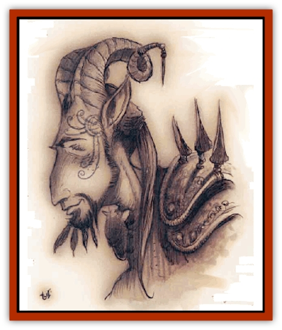

# Guardinal - Cervidal

| Statistic | **Guardinal, Cervidal** |
| --- | --- |
| **Activity Cycle:** | Day |
| **Alignment:** | Neutral good |
| **Armor Class:** | 2 |
| **Climate/Terrain:** | Elysium |
| **Damage/Attack:** | 1d6+2/1d6+2/1d12+3 |
| **Diet:** | Herbivore |
| **Frequency:** | Common |
| **Hit Dice:** | 4+2 |
| **Intelligence:** | High (11-12) |
| **Magic Resistance:** | 20% |
| **Morale:** | Elite (13- 14) |
| **Movement:** | 18, Ju 3 |
| **No. Appearing:** | 1 (2-5) |
| **No. of Attacks:** | 2 hooves and 1 butt |
| **Organization:** | Family |
| **Size:** | M (5%' tall) |
| **Special Attacks:** | Charge |
| **Special Defenses:** | Negate poison or illusion |
| **THAC0:** | 17 |
| **Treasure:** | Incidental |
| **XP Value:** | 3,000 |

Cervidals are the most common of the [[Guardinal_General_Information|guardinals]]. They're the people of Amoria, the uppermost layer of Elysium. In times of war, cervidals and [[Guardinal_Equinal|equinals]] form the backbone of any guardinal army; one-on-one, they're more than a match for the typical rank-and-file of a [[Baatezu_General_Information|baatezu]] or [[Tanar'ri_General_Information|tanar'ri]] force, even if they can't rival the numbers of a fiendish horde. Cervidals are the most peaceful of the guardinals and the last to join a fight, seeking physical violence only when no other solutions present themselves. However, once they're committed, cervidals won't be the first to walk away.

Cervidals bear a passing resemblance to a faun or [[Satyr|satyr]], but are more regal in appearance. They're slim but strong, and their bodies are covered in short, reddish-brown fur. Over their chests, faces, and upper arms the fur thins enough to reveal smooth, golden skin. A cervidal�s head is crowned with magnificent horns or antlers, and his feet are small, hard hooves. The hands of a cervidal are backed by hooflike material, and make for effective bludgeons when closed in a fist, but their preferred weapons're their antlers.

**Combat:** Cervidals attack with two punches or kicks and a head-butt. Their effective Strength is an 18 (no percentage score), and they inflict 1d6+2 points of damage with their hard hooflike fists. The cervidals' remarkable antlers are the equivalent of a +3 weapon for both hit probability and damage.

A cervidal'll usually begin a fight by launching a determined charge, head lowered, that inflicts double antler damage (2d12+3) if it hits, although it can't attack with its hooves in the same round.

Unlike the other guardinals, cervidals don't have a special magical attack such as a whinny or roar. However, they do have three unusual abilities. First of all, the touch of a cervidal's antlers instantly negates the ill effects of anry kind of poison or harmful substance such as acid or contamlnated food or water. By touching an affected creature with its antlers, the cervidal gives it a chance to immediately attempt one additional saving throw with a +6 bonus. Illusions of any type're dispelled automatically by contact with the cervidal�s antlers. Lastly, any *summoned*, *conjured*, or extraplanar creature wounded by a cervidal's antlers must survive an immediate saving throw versus spell or be returned to wherever it came from. (Of course, if the creature's native to the plane the cervidal's currently on, it's not extraplanar!)

In addition to the power of its antlers, cervidals can use the following spell-like abilities at will: *bless*, *command*, *detect poison*, and *light*. Once per day they can *hold person* (one target only), cast a *magic missile* (two missiles), or use *suggestion*. Cervidals can be damaged by any weapon.

**Habitat/Society:** Cervidals gather in small family bands in the forests and woodlands of Elysium. They typically select one area as their home and remain there, rarely moving or wandering away. Most cervidals remain with the same family group for their entire lives, leaving only to find a mate or to enlist in a [[Guardinal_Leonal|leonal]]'s cause.

Along with equinals, cervidals are the commoners of Elysium, but they're much shyer and more reclusive than their boisterous kin. They pefer to keep their own company and don't welcome strangers. In times of war, cervidals are light infantry, skirmishers, and auxiliaries. They'd rather fight a war of maneuver and skill than participate in a bloody slugfest.

---
## Discovery & Documentation

**Source Publication:** Planescape II (1996)
**Campaign Setting:** Planescape
**Author(s):** Rich Baker, Karen S. Boomgarden

### Other Creatures Found in This Source Book
   * [[Aasimar|Aasimar]]
   * [[Abrian|Abrian]]
   * [[Arcane|Arcane]]
   * [[Balaena|Balaena]]
   * [[Beholder-kin_Observer|Beholder-kin, Observer]]
   * [[Bloodthorn|Bloodthorn]]
   * [[Bonespear|Bonespear]]
   * [[Darkweaver|Darkweaver]]
   * [[Demarax|Demarax]]
   * [[Dhour|Dhour]]
   * [[Eater_of_Knowledge|Eater of Knowledge]]
   * [[Eladrin_Greater_Firre|Eladrin, Greater, Firre]]
   * [[Eladrin_Greater_Ghaele|Eladrin, Greater, Ghaele]]
   * [[Eladrin_Greater_Tulani|Eladrin, Greater, Tulani]]
   * [[Eladrin_Lesser_Bralani|Eladrin, Lesser, Bralani]]
   * [[Eladrin_Lesser_Coure|Eladrin, Lesser, Coure]]
   * [[Eladrin_Lesser_Noviere|Eladrin, Lesser, Noviere]]
   * [[Eladrin_Lesser_Shiere|Eladrin, Lesser, Shiere]]
   * [[Fhorge|Fhorge]]
   * [[Ghostlight|Ghostlight]]
   * [[Guardinal_Avoral|Guardinal, Avoral]]
   * [[Guardinal_General_Information|Guardinal, General Information]]
   * [[Guardinal_Equinal|Guardinal, Equinal]]
   * [[Guardinal_Leonal|Guardinal, Leonal]]
   * [[Guardinal_Lupinal|Guardinal, Lupinal]]
   * [[Guardinal_Ursinal|Guardinal, Ursinal]]
   * [[Hollyphant|Hollyphant]]
   * [[Incantifer|Incantifer]]
   * [[Ironmaw|Ironmaw]]
   * [[Keeper|Keeper]]
   * [[Khaasta|Khaasta]]
   * [[Leomarh|Leomarh]]
   * [[Monster_of_Legend|Monster of Legend]]
   * [[Mortai|Mortai]]
   * [[Noctral|Noctral]]
   * [[Quill|Quill]]
   * [[Razorvine|Razorvine]]
   * [[Reave|Reave]]
   * [[Retriever|Retriever]]
   * [[Rilmani_Abiorach|Rilmani, Abiorach]]
   * [[Rilmani_General_Information|Rilmani, General Information]]
   * [[Rilmani_Argenach|Rilmani, Argenach]]
   * [[Rilmani_Aurumach|Rilmani, Aurumach]]
   * [[Rilmani_Cuprilach|Rilmani, Cuprilach]]
   * [[Rilmani_Ferrumach|Rilmani, Ferrumach]]
   * [[Rilmani_Plumach|Rilmani, Plumach]]
   * [[Shadowdrake|Shadowdrake]]
   * [[Spellhaunt|Spellhaunt]]
   * [[Spider_Hook|Spider, Hook]]
   * [[Sunfly|Sunfly]]
   * [[Sword_Spirit|Sword Spirit]]
   * [[Tanar'ri_Lesser_Bulezau|Tanar'ri, Lesser, Bulezau]]
   * [[Tanar'ri_Lesser_Maurezhi|Tanar'ri, Lesser, Maurezhi]]
   * [[Tanar'ri_Lesser_Yochlol|Tanar'ri, Lesser, Yochlol]]
   * [[Tanar'ri_General_Information|Tanar'ri, General Information]]
   * [[Tanar'ri_True_Alkilith|Tanar'ri, True, Alkilith]]
   * [[Terlen|Terlen]]
   * [[Tso|Tso]]
   * [[T'uen-rin|T'uen-rin]]
   * [[Vaporighu|Vaporighu]]
   * [[Vorr|Vorr]]
   * [[Wastrel|Wastrel]]
   * [[Wraithworm|Wraithworm]]
   * [[Yugoloth_Lesser_Canoloth|Yugoloth, Lesser, Canoloth]]
   * [[Zoveri|Zoveri]]
