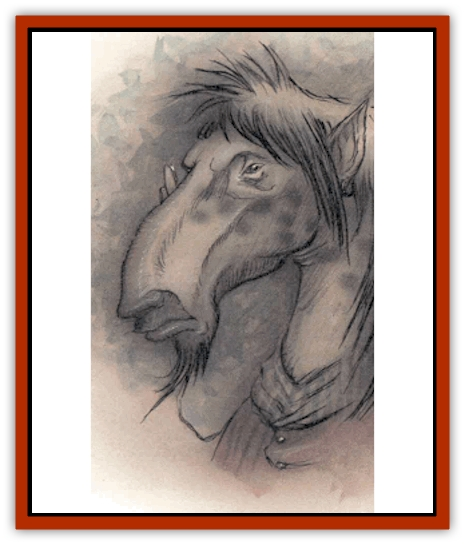

# Guardinal - Equinal

| Statistic | **Guardinal, Equinal** |
| --- | --- |
| **Activity Cycle:** | Day |
| **Alignment:** | Neutral good |
| **Armor Class:** | 0 |
| **Climate/Terrain:** | Elysium |
| **Damage/Attack:** | 1d8+8/1d8+8 |
| **Diet:** | Herbivore |
| **Frequency:** | Common |
| **Hit Dice:** | 6+3 |
| **Intelligence:** | High (13-14) |
| **Magic Resistance:** | 25% |
| **Morale:** | Champion (15-16) |
| **Movement:** | 24 |
| **No. Appearing:** | 1-2 (3-18) |
| **No. of Attacks:** | 2 hoof-strikes |
| **Organization:** | Solitary (Band) |
| **Size:** | L (7½' tall) |
| **Special Attacks:** | Whinny |
| **Special Defenses:** | None |
| **THAC0:** | 15 |
| **Treasure:** | Incidental |
| **XP Value:** | 5,000 |

Equinals are one of the two most common types of [[Guardinal_General_Information|guardinals]]. They resemble huge humans with some of the qualities of a draft [[Horse|horse]]. Their chests and shoulders're of truly heroic proportions, and their long arms end in thick, iron-hard fingers that make a creditable hoof when curled in a fist. The equinal's legs're even more horselike, with a reversed knee and true horse's hooves for feet. Its lower limbs are covered with short, bristly horsehair, and its face is long and narrow. A long, wild mane runs from the crest of their head down to the center of their backs.

Equinals enjoy each other's company and are more likely to be found together than other kinds of guardinals. Their home is the open fields and farmlands of Amoria, and they like to gather in small bands. (Call a group of equinals a "herd", and a body's likely to wake up with hoofprints where his nose used to be.) Equiinals enthusiastically embrace any cause that allows stand hoof-to-toe with evil and beat it senseless.

**Combat:** Equinals are strong - very strong. The typical equinal's got the Strength of a stone giant (20), but an exceptional individual might be a shade stronger (21 or 22). In a fight, they disdain the use of weapons and wade in with a boxerlike routine of devastating jabs and uppercuts. A blow from an equinal's fist can splinter stone or crumple plate armor like paper.

In addition to attacking with its powerful fists, an equinal can whinny once per turn. This piercing shriek can stun creatures of 4 HD or fewer, or deafen creatures of more than 4 HD, if they fail their saving throw versus spell. The effects last 1d6 rounds, and the whinny affects any nonequinal within 20 feet. Deafened creatures suffer a -1 penalty to surprise checks and have a 20% chance to miscast any spell with a verbal component.

An equinal also has the following spell-like powers, usable once per round: *bless*, *command*, *fog cloud*, *light*, and *magic missile* (3 missiles). Once per day equinals can create a *wall of stone* or use *slow*.

Equinals can be damaged by any magical weapon, regardless of its degree of enchantment, or any silver weapon.

**Habitat/Society:** Equinals often settle down in a favorite meadow or glen, living there for months at a time before moving on. They're fond of athletic contests and games of skill, and while away many hours in such pasttimes. They're good-natured creatures who welcome travelles, but they're often a little too boisterous and a basher ought to be careful about joining in equinal games. Equinals love a good brawl, and never back down from a fight - not even when any addlecove can see the equinal's outmatched.

In times of war, equinals are the heavy foot troops of Elysium. They're tough, tenacious, and courageous; once a number of equinals have it in their heads to do something, they'll make herculean efforts to achieve their objective. This can be a fault when equinals disregard new commands to doggedly pursue old ones to their conclusion.

---
## Discovery & Documentation

**Source Publication:** Planescape II (1996)
**Campaign Setting:** Planescape
**Author(s):** Rich Baker, Karen S. Boomgarden

### Other Creatures Found in This Source Book
   * [[Aasimar|Aasimar]]
   * [[Abrian|Abrian]]
   * [[Arcane|Arcane]]
   * [[Balaena|Balaena]]
   * [[Beholder-kin_Observer|Beholder-kin, Observer]]
   * [[Bloodthorn|Bloodthorn]]
   * [[Bonespear|Bonespear]]
   * [[Darkweaver|Darkweaver]]
   * [[Demarax|Demarax]]
   * [[Dhour|Dhour]]
   * [[Eater_of_Knowledge|Eater of Knowledge]]
   * [[Eladrin_Greater_Firre|Eladrin, Greater, Firre]]
   * [[Eladrin_Greater_Ghaele|Eladrin, Greater, Ghaele]]
   * [[Eladrin_Greater_Tulani|Eladrin, Greater, Tulani]]
   * [[Eladrin_Lesser_Bralani|Eladrin, Lesser, Bralani]]
   * [[Eladrin_Lesser_Coure|Eladrin, Lesser, Coure]]
   * [[Eladrin_Lesser_Noviere|Eladrin, Lesser, Noviere]]
   * [[Eladrin_Lesser_Shiere|Eladrin, Lesser, Shiere]]
   * [[Fhorge|Fhorge]]
   * [[Ghostlight|Ghostlight]]
   * [[Guardinal_Avoral|Guardinal, Avoral]]
   * [[Guardinal_Cervidal|Guardinal, Cervidal]]
   * [[Guardinal_General_Information|Guardinal, General Information]]
   * [[Guardinal_Leonal|Guardinal, Leonal]]
   * [[Guardinal_Lupinal|Guardinal, Lupinal]]
   * [[Guardinal_Ursinal|Guardinal, Ursinal]]
   * [[Hollyphant|Hollyphant]]
   * [[Incantifer|Incantifer]]
   * [[Ironmaw|Ironmaw]]
   * [[Keeper|Keeper]]
   * [[Khaasta|Khaasta]]
   * [[Leomarh|Leomarh]]
   * [[Monster_of_Legend|Monster of Legend]]
   * [[Mortai|Mortai]]
   * [[Noctral|Noctral]]
   * [[Quill|Quill]]
   * [[Razorvine|Razorvine]]
   * [[Reave|Reave]]
   * [[Retriever|Retriever]]
   * [[Rilmani_Abiorach|Rilmani, Abiorach]]
   * [[Rilmani_General_Information|Rilmani, General Information]]
   * [[Rilmani_Argenach|Rilmani, Argenach]]
   * [[Rilmani_Aurumach|Rilmani, Aurumach]]
   * [[Rilmani_Cuprilach|Rilmani, Cuprilach]]
   * [[Rilmani_Ferrumach|Rilmani, Ferrumach]]
   * [[Rilmani_Plumach|Rilmani, Plumach]]
   * [[Shadowdrake|Shadowdrake]]
   * [[Spellhaunt|Spellhaunt]]
   * [[Spider_Hook|Spider, Hook]]
   * [[Sunfly|Sunfly]]
   * [[Sword_Spirit|Sword Spirit]]
   * [[Tanar'ri_Lesser_Bulezau|Tanar'ri, Lesser, Bulezau]]
   * [[Tanar'ri_Lesser_Maurezhi|Tanar'ri, Lesser, Maurezhi]]
   * [[Tanar'ri_Lesser_Yochlol|Tanar'ri, Lesser, Yochlol]]
   * [[Tanar'ri_General_Information|Tanar'ri, General Information]]
   * [[Tanar'ri_True_Alkilith|Tanar'ri, True, Alkilith]]
   * [[Terlen|Terlen]]
   * [[Tso|Tso]]
   * [[T'uen-rin|T'uen-rin]]
   * [[Vaporighu|Vaporighu]]
   * [[Vorr|Vorr]]
   * [[Wastrel|Wastrel]]
   * [[Wraithworm|Wraithworm]]
   * [[Yugoloth_Lesser_Canoloth|Yugoloth, Lesser, Canoloth]]
   * [[Zoveri|Zoveri]]
