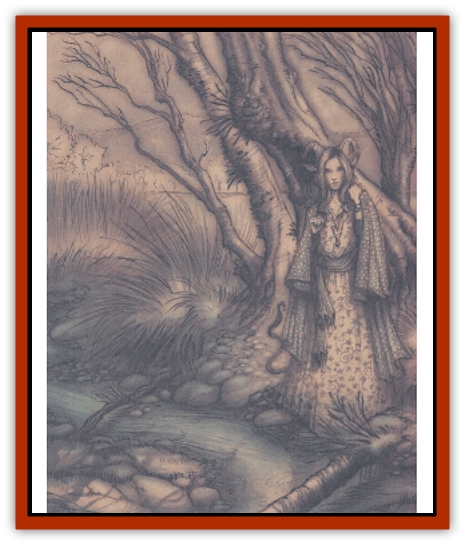

# Guardinal - General Information

* Iron weapons inflict damage only if the guardinal can he hit by normal weapons. Otherwise they have no unusual effect.
** Silver weapons can hit a guardinal regardless of whether or not an enchanted weapon is required.

Guardinals have a special form of telepathy that allows them to communicate with intelligent, nonmonstrous creatures or natural creatures of any kind. A [[Beholder_and_Beholder-kin_I|beholder]] or [[Catoblepas|catoblepas]] wouldn't fall into these categories, but a human, [[Dog|dog]], or [[Eagle|giant eagle]] would. In addition, normal, nonmagical animals or giant animals will never attack a guardinal, even under magical compulsion.

**Planar Travel:** Guardinals're unrestricted in planar travel. They can leave Elysium by an innate ability resembling probability travel, which allows them to enter the Astral Plane with their physical bodies. They can also make use of any gate, portal, or conduit they find. In addition, guardinals can travel directly to the first layer of Bytopia, the Beastlands, or the Outlands from any point in Elysium.

**Habitat/Society:** Guardinals are basically unorganized; in Elysium there's little need for laws or orderly societies. A cutter traveling across Elysium won't find guardinal cities or fortresses scattered across the landscape. Instead, he'll find guardinals living wherever they feel comfortable - some can be found in the peaceful towns of Amoria, others prefer the solitude and beauty of Eronia or Belierin. Guardinals of any type tend to be solitary, introspective creatures who like being left to their own devices when the land�s at peace. On the other hand, they're also capable of handing together with military discipline when evil threatens.

Although the guardinals don't have any real hierarchy or structure, they're led by the mighty [[Guardinal_Leonal|leonals]]. These noble creatures are the most vigilant and powerful of the guardinals and act as gathering points for guardinal causes. A typical cause might he the defeat of a powerful evil empire on the Prime Material Plane, the recovery of a good artifact stolen from its rightful place by fiends, or the monitoring of a powerful organization that might begin to lean toward evil activities. The guardinals associated with a cause rarely abandon it, although they might temporarily turn aside to attend to a more immediate issue.

Guardinals are creatures of exceptional honor and integrity, and do not lie, cheat, or attack needlessly unless the cause at hand is in the direst jeopardy.

**Talisid and the Five Companions:** **Talisid and the Five Companions:** The mightiest guardinal is the leonal prince Talisid, a wise and ancient being who has survived uncounted confrontations with evil. He is accompanied by his Five Companions - the strongest and wisest of the [[Guardinal_Avoral|avorals]], the [[Guardinal_Equinal|equinals]], the [[Guardinal_Lupinal|lupinals]], the [[Guardinal_Cervidal|cervidals]], and the [[Guardinal_Ursinal|ursinals]]. Talisid's abilities and intelligence are on par with some quasi or demipowers, and the pantheons native to Elysium hold him in the highest regard. His companions have powers far beyond those typical of their type, and many songs are sung about their deeds in battle or their wisdom in peacetime.

---
## Discovery & Documentation

**Source Publication:** Planescape II (1996)
**Campaign Setting:** Planescape
**Author(s):** Rich Baker, Karen S. Boomgarden

### Other Creatures Found in This Source Book
   * [[Aasimar|Aasimar]]
   * [[Abrian|Abrian]]
   * [[Arcane|Arcane]]
   * [[Balaena|Balaena]]
   * [[Beholder-kin_Observer|Beholder-kin, Observer]]
   * [[Bloodthorn|Bloodthorn]]
   * [[Bonespear|Bonespear]]
   * [[Darkweaver|Darkweaver]]
   * [[Demarax|Demarax]]
   * [[Dhour|Dhour]]
   * [[Eater_of_Knowledge|Eater of Knowledge]]
   * [[Eladrin_Greater_Firre|Eladrin, Greater, Firre]]
   * [[Eladrin_Greater_Ghaele|Eladrin, Greater, Ghaele]]
   * [[Eladrin_Greater_Tulani|Eladrin, Greater, Tulani]]
   * [[Eladrin_Lesser_Bralani|Eladrin, Lesser, Bralani]]
   * [[Eladrin_Lesser_Coure|Eladrin, Lesser, Coure]]
   * [[Eladrin_Lesser_Noviere|Eladrin, Lesser, Noviere]]
   * [[Eladrin_Lesser_Shiere|Eladrin, Lesser, Shiere]]
   * [[Fhorge|Fhorge]]
   * [[Ghostlight|Ghostlight]]
   * [[Guardinal_Avoral|Guardinal, Avoral]]
   * [[Guardinal_Cervidal|Guardinal, Cervidal]]
   * [[Guardinal_Equinal|Guardinal, Equinal]]
   * [[Guardinal_Leonal|Guardinal, Leonal]]
   * [[Guardinal_Lupinal|Guardinal, Lupinal]]
   * [[Guardinal_Ursinal|Guardinal, Ursinal]]
   * [[Hollyphant|Hollyphant]]
   * [[Incantifer|Incantifer]]
   * [[Ironmaw|Ironmaw]]
   * [[Keeper|Keeper]]
   * [[Khaasta|Khaasta]]
   * [[Leomarh|Leomarh]]
   * [[Monster_of_Legend|Monster of Legend]]
   * [[Mortai|Mortai]]
   * [[Noctral|Noctral]]
   * [[Quill|Quill]]
   * [[Razorvine|Razorvine]]
   * [[Reave|Reave]]
   * [[Retriever|Retriever]]
   * [[Rilmani_Abiorach|Rilmani, Abiorach]]
   * [[Rilmani_General_Information|Rilmani, General Information]]
   * [[Rilmani_Argenach|Rilmani, Argenach]]
   * [[Rilmani_Aurumach|Rilmani, Aurumach]]
   * [[Rilmani_Cuprilach|Rilmani, Cuprilach]]
   * [[Rilmani_Ferrumach|Rilmani, Ferrumach]]
   * [[Rilmani_Plumach|Rilmani, Plumach]]
   * [[Shadowdrake|Shadowdrake]]
   * [[Spellhaunt|Spellhaunt]]
   * [[Spider_Hook|Spider, Hook]]
   * [[Sunfly|Sunfly]]
   * [[Sword_Spirit|Sword Spirit]]
   * [[Tanar'ri_Lesser_Bulezau|Tanar'ri, Lesser, Bulezau]]
   * [[Tanar'ri_Lesser_Maurezhi|Tanar'ri, Lesser, Maurezhi]]
   * [[Tanar'ri_Lesser_Yochlol|Tanar'ri, Lesser, Yochlol]]
   * [[Tanar'ri_General_Information|Tanar'ri, General Information]]
   * [[Tanar'ri_True_Alkilith|Tanar'ri, True, Alkilith]]
   * [[Terlen|Terlen]]
   * [[Tso|Tso]]
   * [[T'uen-rin|T'uen-rin]]
   * [[Vaporighu|Vaporighu]]
   * [[Vorr|Vorr]]
   * [[Wastrel|Wastrel]]
   * [[Wraithworm|Wraithworm]]
   * [[Yugoloth_Lesser_Canoloth|Yugoloth, Lesser, Canoloth]]
   * [[Zoveri|Zoveri]]
