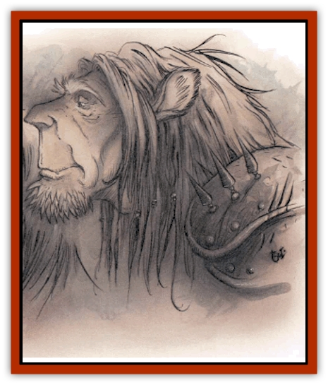

# Guardinal - Leonal

| Statistic | **Guardinal, Leonal** |
| --- | --- |
| **Activity Cycle:** | Any |
| **Alignment:** | Neutral good |
| **Armor Class:** | -5 |
| **Climate/Terrain:** | Elysium |
| **Damage/Attack:** | 2d4+9/2d4+9/1d8 |
| **Diet:** | Omnivore |
| **Frequency:** | Very rare |
| **Hit Dice:** | 12+6 |
| **Intelligence:** | Genius (17-18) |
| **Magic Resistance:** | 50% |
| **Morale:** | Fearless (19-20) |
| **Movement:** | 24 |
| **No. Appearing:** | 1 |
| **No. of Attacks:** | 3 |
| **Organization:** | Solitary |
| **Size:** | M (6' tall) |
| **Special Attacks:** | Roar |
| **Special Defenses:** | See below |
| **THAC0:** | 9 |
| **Treasure:** | Incidental |
| **XP Value:** | 18,000 |

Leonals are the wisest and most powerful of the [[Guardinal_General_Information|guardinals]]. They're chieftains and leaders when guardinals gather, but a leonal prefers to keep to itself when the forces of good allow it to rest. A leonal resembles a tall, muscular human with short, tawny-golden fur covering its body and a great red mane for hair. Its lower legs are formed like a [[Cat_Great|great cat's]], and its arms conceal steal-hard talons. The leonal's face is noble and terrifying at the same time: its mouth and nose meet in a subtle, flattened, lionlike muzzle, and a yawn reveals long, sharp fangs.

Leonals're at home in the wilds of Eronia, but they travel widely throughout Elysium. When they're not marshalling the guardinals against the threat of evil, they're often busy on some important mission or task. At rest, a leonal's a patient and regal creature; but when it confronts the forces of darkness, it's a remorseless and tireless warrior of good.

**Combat:** A word of advice: Don't pick a fight with a leonal. They're superhumanly strong, packing the power of a frost giant (21 Strength) in their compact, athletic frames. Their talons can inflict devastating damage, and their bite can be lethal. Leonals're incredibly fast and agile, and gain a -4 initiative bonus in any round they choose to make physical attacks. This agility allows them to dodge any missile or missilelike magical attack with a successful saving throw versus paralyzation. (This includes any thrown weapon, any missile fired by bow, crossbow, or sling, and spells such as *burning hands*, *flame arrow*, *Melf's acid arrow*, and other physical manifestations of magic except *magic missiles*.)

A leonal can roar three times per day. This roar affects a cone-shaped area 60 feet long and 20 feet wide at the end, and is the equivalent of a *holy word*. In addition, all creatures in this area suffer 2d10 points of damage and must successfully save vs. spell or be *deafened* for a day. (Deafened creatures suffer a -1 penalty to any surprise checks and have a 20% chance to miscast any spell.) Any evil creature within 200 yards must survive an additional saving throw vs. spell or be affected by *fear* for 2d6 rounds.

Leonals are surrounded by an aura of double-strength *protection from evil, 20' radius*. Once per round, they can use the following spell-like powers: *continual light*, *ESP*, cast a 10d6 *fireball*, *hold monster*, *know alignment*, *magic missile* (5 missiles), *polymorph self*, or create a *wall of force*. A leonal can *cure critical wounds*, *cure disease*, or *neutralize poison* three times per day, and once per day it can *heal other*. Once per year the leonal can grant a *wish*.

Leonals are never surprised, and can be hit only by +3 or better magical weapons.

**Habitat/Society:** Even in peaceful Elysium, leonals are loners. They keep to themselves, roaming the forests and mountains of the more remote areas of the plane. Among other guardinals, leonals are considered to be nobility or royalty; at their command, other guardinals embark on missions or organize armies. The leonals use their authority carefully and only when they feel that a matter can't be attended to personally.

Leonals travel the planes extensively, keeping an eye open for trouble and dealing with it whenever they can. On rare occasions a leonal serves under a good power, acting as a proxy or adviser of some kind.

---
## Discovery & Documentation

**Source Publication:** Planescape II (1996)
**Campaign Setting:** Planescape
**Author(s):** Rich Baker, Karen S. Boomgarden

### Other Creatures Found in This Source Book
   * [[Aasimar|Aasimar]]
   * [[Abrian|Abrian]]
   * [[Arcane|Arcane]]
   * [[Balaena|Balaena]]
   * [[Beholder-kin_Observer|Beholder-kin, Observer]]
   * [[Bloodthorn|Bloodthorn]]
   * [[Bonespear|Bonespear]]
   * [[Darkweaver|Darkweaver]]
   * [[Demarax|Demarax]]
   * [[Dhour|Dhour]]
   * [[Eater_of_Knowledge|Eater of Knowledge]]
   * [[Eladrin_Greater_Firre|Eladrin, Greater, Firre]]
   * [[Eladrin_Greater_Ghaele|Eladrin, Greater, Ghaele]]
   * [[Eladrin_Greater_Tulani|Eladrin, Greater, Tulani]]
   * [[Eladrin_Lesser_Bralani|Eladrin, Lesser, Bralani]]
   * [[Eladrin_Lesser_Coure|Eladrin, Lesser, Coure]]
   * [[Eladrin_Lesser_Noviere|Eladrin, Lesser, Noviere]]
   * [[Eladrin_Lesser_Shiere|Eladrin, Lesser, Shiere]]
   * [[Fhorge|Fhorge]]
   * [[Ghostlight|Ghostlight]]
   * [[Guardinal_Avoral|Guardinal, Avoral]]
   * [[Guardinal_Cervidal|Guardinal, Cervidal]]
   * [[Guardinal_General_Information|Guardinal, General Information]]
   * [[Guardinal_Equinal|Guardinal, Equinal]]
   * [[Guardinal_Lupinal|Guardinal, Lupinal]]
   * [[Guardinal_Ursinal|Guardinal, Ursinal]]
   * [[Hollyphant|Hollyphant]]
   * [[Incantifer|Incantifer]]
   * [[Ironmaw|Ironmaw]]
   * [[Keeper|Keeper]]
   * [[Khaasta|Khaasta]]
   * [[Leomarh|Leomarh]]
   * [[Monster_of_Legend|Monster of Legend]]
   * [[Mortai|Mortai]]
   * [[Noctral|Noctral]]
   * [[Quill|Quill]]
   * [[Razorvine|Razorvine]]
   * [[Reave|Reave]]
   * [[Retriever|Retriever]]
   * [[Rilmani_Abiorach|Rilmani, Abiorach]]
   * [[Rilmani_General_Information|Rilmani, General Information]]
   * [[Rilmani_Argenach|Rilmani, Argenach]]
   * [[Rilmani_Aurumach|Rilmani, Aurumach]]
   * [[Rilmani_Cuprilach|Rilmani, Cuprilach]]
   * [[Rilmani_Ferrumach|Rilmani, Ferrumach]]
   * [[Rilmani_Plumach|Rilmani, Plumach]]
   * [[Shadowdrake|Shadowdrake]]
   * [[Spellhaunt|Spellhaunt]]
   * [[Spider_Hook|Spider, Hook]]
   * [[Sunfly|Sunfly]]
   * [[Sword_Spirit|Sword Spirit]]
   * [[Tanar'ri_Lesser_Bulezau|Tanar'ri, Lesser, Bulezau]]
   * [[Tanar'ri_Lesser_Maurezhi|Tanar'ri, Lesser, Maurezhi]]
   * [[Tanar'ri_Lesser_Yochlol|Tanar'ri, Lesser, Yochlol]]
   * [[Tanar'ri_General_Information|Tanar'ri, General Information]]
   * [[Tanar'ri_True_Alkilith|Tanar'ri, True, Alkilith]]
   * [[Terlen|Terlen]]
   * [[Tso|Tso]]
   * [[T'uen-rin|T'uen-rin]]
   * [[Vaporighu|Vaporighu]]
   * [[Vorr|Vorr]]
   * [[Wastrel|Wastrel]]
   * [[Wraithworm|Wraithworm]]
   * [[Yugoloth_Lesser_Canoloth|Yugoloth, Lesser, Canoloth]]
   * [[Zoveri|Zoveri]]
