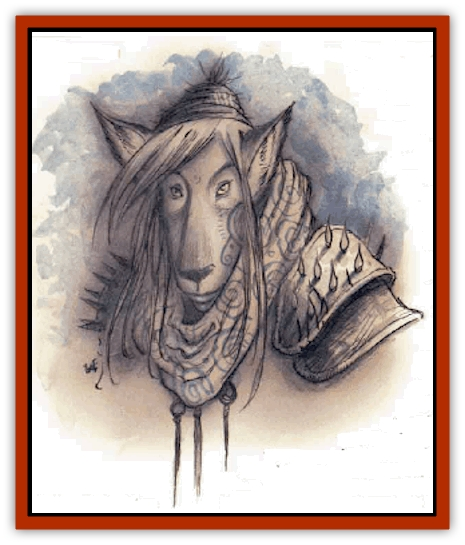

# Guardinal - Lupinal

| Statistic | **Guardinal, Lupinal** |
| --- | --- |
| **Activity Cycle:** | Any |
| **Alignment:** | Neutral good |
| **Armor Class:** | -2 |
| **Climate/Terrain:** | Elysium |
| **Damage/Attack:** | 1d4+4/1d4+4/2d6 |
| **Diet:** | Omnivore |
| **Frequency:** | Rare |
| **Hit Dice:** | 8+4 |
| **Intelligence:** | Exceptional (15-16) |
| **Magic Resistance:** | 35% |
| **Morale:** | Fanatic (17-18) |
| **Movement:** | 18 |
| **No. Appearing:** | 1-8 |
| **No. of Attacks:** | 3 |
| **Organization:** | Pack |
| **Size:** | M (6' tall) |
| **Special Attacks:** | Howl, pull-down |
| **Special Defenses:** | Struck only by silver or +2 or better weapons |
| **THAC0:** | 13 |
| **Treasure:** | Incidental |
| **XP Value:** | 9,000 |

The lupinals're the front-line troops of Elysium. Packs of 'em roam all over the plane, and often into the Outlands, Bytopia, or the Beastlands, searching aggressively for any hint of evil intrusion. While the other [[Guardinal_General_Information|guardinals]] take their rest in Elysium, the lupinals hold themselves ready for battle at a moment's notice. Their organization and outlook are distinctly lawful at times, far more so than those of the other guardinals.

Lupinals are half-man and half-[[Wolf|wolf]]. Their bodies are long, lean, and rangy. Their rear legs are bent like a wolfs, and they have long, pronounced muzzles with rows of sharp teeth. Lupinals are covered in short, fine, silvery-gray fur. At a distance, a lupinal could be taken for a [[Lycanthrope_Werewolf|werewolf]] in its hybrid form, but on closer inspection the lupinal is far less bestial and has a much more intelligent and expressive face - until it finds an evil quarry encroaching on its hunting grounds.

Like the [[Guardinal_Equinal|equinals]], lupinals are social creatures who often gather in small packs that hunt, play, and fight together. However, they're also comfortable being alone, and many lupinals prefer to keep their own company.

**Combat:** Lupinals are exceptionally dangerous in a fight. They are natural-born hunters and stalkers who use terrain, concealment, and ambush to great effect. When the time comes to break cover and join the fray, lupinals fight with a fierce animal savagery. Like [[Guardinal_Leonal|leonals]], they're very quick; they gain a -2 bonus to initiative rolls and can dodge normal, nonmagical missiles by making a successful saving throw versus paralyzation. Lupinals have exceptionally keen senses and are surprised only on a roll of 1.

The natural stalking abilities of a lupinal allow it to track by scent, move silently, or hide in shadows with a 95% chance of success in natural settings. In urban environments the lupinal's abilities are reduced to a 50% chance of success.

Lupinals attack with their front claws and a powerful bite. Their rangy bodies are surprisingly strong; a lupinal's Strength is equal to 18/76. If a lupinal hits with its bite by a margin of 4 or more, it seizes its prey and forces its opponent to make a successful saving throw versus death magic or be dragged to the ground. The lupinal automatically hits with its bite each round thereafter until its foe is helpless or dead, or it's been seriously wounded.

The howl of a lupinal causes fear in any evil creature within 200 yards (unless the target survives a save versus spell, of course.) In addition, the lupinal can use the following spell-like abilities: *blink*, *blur*, *change self*, *darkness 15' radius*, and *wraithform*. Three times per day the lupinal can *cure serious wounds*, *fly* for up to 3 turns (move 30, MC A), cast *magic missile* (4 missiles), or breathe a *cone of cold* 40 feet long and 10 feet wide that inflicts 8d4+8 points of damage. Once per day the lupinal can *cure disease* or *neutralize poison*.

Lupinals can be hit only by silver or +2 or better magical weapons.

**Habitat/Society:** Lupinals like to run in packs, but have little loyalty to any particular group. A lupinal might run with three different groups on three consecutive nights, or stay with the same band for months or years at a time. The most intelligent or wisest lupinal is always recognized as the pack leader, and the others obey him or her without reservation.

Lupinals're naturally suspicious of strangers and evaluate almost any creature they meet in terms of threat potential. They're wary of humans and the like, since they regard any mortal adventurer as a disaster waiting to happen. However, once the friendship of a lupinal is won, a body couldn't have a more loyal or steadfast companion.

Lupinals celebrate the hunt as a social gathering and bonding ritual. They never take sentient prey, but love the challenge and excitement of tracking a quarry that's trying to evade them. Lupinal packs are Elysium's first line of defense against invasion, and they take their responsibilities seriously.

---
## Discovery & Documentation

**Source Publication:** Planescape II (1996)
**Campaign Setting:** Planescape
**Author(s):** Rich Baker, Karen S. Boomgarden

### Other Creatures Found in This Source Book
   * [[Aasimar|Aasimar]]
   * [[Abrian|Abrian]]
   * [[Arcane|Arcane]]
   * [[Balaena|Balaena]]
   * [[Beholder-kin_Observer|Beholder-kin, Observer]]
   * [[Bloodthorn|Bloodthorn]]
   * [[Bonespear|Bonespear]]
   * [[Darkweaver|Darkweaver]]
   * [[Demarax|Demarax]]
   * [[Dhour|Dhour]]
   * [[Eater_of_Knowledge|Eater of Knowledge]]
   * [[Eladrin_Greater_Firre|Eladrin, Greater, Firre]]
   * [[Eladrin_Greater_Ghaele|Eladrin, Greater, Ghaele]]
   * [[Eladrin_Greater_Tulani|Eladrin, Greater, Tulani]]
   * [[Eladrin_Lesser_Bralani|Eladrin, Lesser, Bralani]]
   * [[Eladrin_Lesser_Coure|Eladrin, Lesser, Coure]]
   * [[Eladrin_Lesser_Noviere|Eladrin, Lesser, Noviere]]
   * [[Eladrin_Lesser_Shiere|Eladrin, Lesser, Shiere]]
   * [[Fhorge|Fhorge]]
   * [[Ghostlight|Ghostlight]]
   * [[Guardinal_Avoral|Guardinal, Avoral]]
   * [[Guardinal_Cervidal|Guardinal, Cervidal]]
   * [[Guardinal_General_Information|Guardinal, General Information]]
   * [[Guardinal_Equinal|Guardinal, Equinal]]
   * [[Guardinal_Leonal|Guardinal, Leonal]]
   * [[Guardinal_Ursinal|Guardinal, Ursinal]]
   * [[Hollyphant|Hollyphant]]
   * [[Incantifer|Incantifer]]
   * [[Ironmaw|Ironmaw]]
   * [[Keeper|Keeper]]
   * [[Khaasta|Khaasta]]
   * [[Leomarh|Leomarh]]
   * [[Monster_of_Legend|Monster of Legend]]
   * [[Mortai|Mortai]]
   * [[Noctral|Noctral]]
   * [[Quill|Quill]]
   * [[Razorvine|Razorvine]]
   * [[Reave|Reave]]
   * [[Retriever|Retriever]]
   * [[Rilmani_Abiorach|Rilmani, Abiorach]]
   * [[Rilmani_General_Information|Rilmani, General Information]]
   * [[Rilmani_Argenach|Rilmani, Argenach]]
   * [[Rilmani_Aurumach|Rilmani, Aurumach]]
   * [[Rilmani_Cuprilach|Rilmani, Cuprilach]]
   * [[Rilmani_Ferrumach|Rilmani, Ferrumach]]
   * [[Rilmani_Plumach|Rilmani, Plumach]]
   * [[Shadowdrake|Shadowdrake]]
   * [[Spellhaunt|Spellhaunt]]
   * [[Spider_Hook|Spider, Hook]]
   * [[Sunfly|Sunfly]]
   * [[Sword_Spirit|Sword Spirit]]
   * [[Tanar'ri_Lesser_Bulezau|Tanar'ri, Lesser, Bulezau]]
   * [[Tanar'ri_Lesser_Maurezhi|Tanar'ri, Lesser, Maurezhi]]
   * [[Tanar'ri_Lesser_Yochlol|Tanar'ri, Lesser, Yochlol]]
   * [[Tanar'ri_General_Information|Tanar'ri, General Information]]
   * [[Tanar'ri_True_Alkilith|Tanar'ri, True, Alkilith]]
   * [[Terlen|Terlen]]
   * [[Tso|Tso]]
   * [[T'uen-rin|T'uen-rin]]
   * [[Vaporighu|Vaporighu]]
   * [[Vorr|Vorr]]
   * [[Wastrel|Wastrel]]
   * [[Wraithworm|Wraithworm]]
   * [[Yugoloth_Lesser_Canoloth|Yugoloth, Lesser, Canoloth]]
   * [[Zoveri|Zoveri]]
