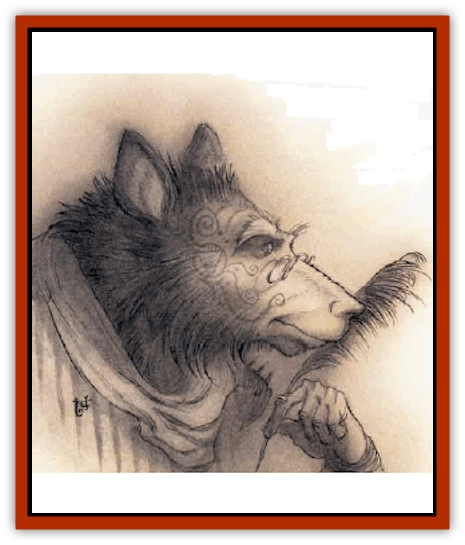

# Guardinal - Ursinal

| Statistic | **Guardinal, Ursinal** |
| --- | --- |
| **Activity Cycle:** | Any |
| **Alignment:** | Neutral good |
| **Armor Class:** | -4 |
| **Climate/Terrain:** | Elysium |
| **Damage/Attack:** | 2d6+7/2d6+7/1d10 |
| **Diet:** | Omnivore |
| **Frequency:** | Rare |
| **Hit Dice:** | 10+5 |
| **Intelligence:** | Genius (17-18) |
| **Magic Resistance:** | 45% |
| **Morale:** | Fanatic (17-18) |
| **Movement:** | 12 |
| **No. Appearing:** | 1 (1-2) |
| **No. of Attacks:** | 3 |
| **Organization:** | Solitary |
| **Size:** | L (8' tall) |
| **Special Attacks:** | Spell-like powers |
| **Special Defenses:** | Struck only by silver weapons or those of +3 or better enchantment |
| **THAC0:** | 11 |
| **Treasure:** | Incidental |
| **XP Value:** | 14,000 |

The scholars and philosophers of the [[Guardinal_General_Information|guardinals]] are the ursinals, benevolent beings who resemble huge men and women with distinctive bearlike attributes. They're advisers to the [[Guardinal_Leonal|leonals]], and the record-keepers and magic-users of their race. Ursinals are open with their knowledge but love to digress endlessly and often free-associate through many iterations until they're holding forth on a subject with no relation to the original topic.

Ursinals stand 8 feet tall, with thick-set bodies. They're covered with light golden, red, or golden-brown fur that's long on their forearms, backs, and lower legs and too fine to see on their torsos and faces. An ursinal's face has a pronounced muzzle and high ear-tufts, but its expression is kindly. It's very difficult to move an ursinal to anger, but the powers pity the poor sod who manages the trick - it's said that a fighting-mad ursinal can tear his way through any three [[Gehreleth|gehreleths]].

**Combat:** Ursinals dislike combat and avoid physical confrontations until they become inevitable. However, a body'd be wise to watch out when the ursinal finally decides to stand his ground. An ursinal's as strong as a hill giant (Strength 19) and can dish out terrible damage with his sharp-clawed paws. If an ursinal hits an enemy with both paws, he can automatically hug his victim for an additional 2d10 points of damage and gains a +4 bonus to his bite attack against the hugged victim.

Ursinals're skillful mages and have the spell powers of a wizard of level 9 to 16 (d8+8). They prefer spells of enchantment, misdirection, or divination, and rarely memorize many heavy-damage spells. Of course, under the right circumstances, an ursinal'll make use of any spell in his books. They're also fond of magical items such as rings, rods, or wands, and miscellaneous magic that enhances their spell-casting ability.

Like the other guardinals, ursinals have several spell-like powers that can be used once per round: *continual light*, *ESP*, *hold monster*, *know alignment*, *polymorph self*, *magic missile* (5 missiles), *sleep* (4d6 Hit Dice worth, affects creatures up to 7 HD), or *create solid fog*. An ursinal can *cure disease*, *heal*, or *neutralize poison* three times per day, and once per day he can speak a *holy word*. Once per year the ursinal can grant a*limited wish*.

Ursinals can be hit only by silver weapons or those that have been enchanted to +3 or better. They're never surprised in Elysium.

**Habitat/Society:** The advice of an ursinal is a much sought-after commodity. As librarians, scholars, and record-keepers, they carefully catalogue and sort all manner of information. They're especially knowledgeable about magical matters and also have a keen interest in prime-material histories and linguistics. In Elysium it's said that if an ursinal doesn't know something, he knows where to go to find out.

Ursinals are solitary creatures, but almost all are linked by constant correspondence and magical communications. They're also fond of the company of lesser guardinals or petitioners who can "benefit" from the ursinal's wisdom. Some view ursinals as intrusive busybodies, but most of their advice is strikingly accurate and always well intended.

---
## Discovery & Documentation

**Source Publication:** Planescape II (1996)
**Campaign Setting:** Planescape
**Author(s):** Rich Baker, Karen S. Boomgarden

### Other Creatures Found in This Source Book
   * [[Aasimar|Aasimar]]
   * [[Abrian|Abrian]]
   * [[Arcane|Arcane]]
   * [[Balaena|Balaena]]
   * [[Beholder-kin_Observer|Beholder-kin, Observer]]
   * [[Bloodthorn|Bloodthorn]]
   * [[Bonespear|Bonespear]]
   * [[Darkweaver|Darkweaver]]
   * [[Demarax|Demarax]]
   * [[Dhour|Dhour]]
   * [[Eater_of_Knowledge|Eater of Knowledge]]
   * [[Eladrin_Greater_Firre|Eladrin, Greater, Firre]]
   * [[Eladrin_Greater_Ghaele|Eladrin, Greater, Ghaele]]
   * [[Eladrin_Greater_Tulani|Eladrin, Greater, Tulani]]
   * [[Eladrin_Lesser_Bralani|Eladrin, Lesser, Bralani]]
   * [[Eladrin_Lesser_Coure|Eladrin, Lesser, Coure]]
   * [[Eladrin_Lesser_Noviere|Eladrin, Lesser, Noviere]]
   * [[Eladrin_Lesser_Shiere|Eladrin, Lesser, Shiere]]
   * [[Fhorge|Fhorge]]
   * [[Ghostlight|Ghostlight]]
   * [[Guardinal_Avoral|Guardinal, Avoral]]
   * [[Guardinal_Cervidal|Guardinal, Cervidal]]
   * [[Guardinal_General_Information|Guardinal, General Information]]
   * [[Guardinal_Equinal|Guardinal, Equinal]]
   * [[Guardinal_Leonal|Guardinal, Leonal]]
   * [[Guardinal_Lupinal|Guardinal, Lupinal]]
   * [[Hollyphant|Hollyphant]]
   * [[Incantifer|Incantifer]]
   * [[Ironmaw|Ironmaw]]
   * [[Keeper|Keeper]]
   * [[Khaasta|Khaasta]]
   * [[Leomarh|Leomarh]]
   * [[Monster_of_Legend|Monster of Legend]]
   * [[Mortai|Mortai]]
   * [[Noctral|Noctral]]
   * [[Quill|Quill]]
   * [[Razorvine|Razorvine]]
   * [[Reave|Reave]]
   * [[Retriever|Retriever]]
   * [[Rilmani_Abiorach|Rilmani, Abiorach]]
   * [[Rilmani_General_Information|Rilmani, General Information]]
   * [[Rilmani_Argenach|Rilmani, Argenach]]
   * [[Rilmani_Aurumach|Rilmani, Aurumach]]
   * [[Rilmani_Cuprilach|Rilmani, Cuprilach]]
   * [[Rilmani_Ferrumach|Rilmani, Ferrumach]]
   * [[Rilmani_Plumach|Rilmani, Plumach]]
   * [[Shadowdrake|Shadowdrake]]
   * [[Spellhaunt|Spellhaunt]]
   * [[Spider_Hook|Spider, Hook]]
   * [[Sunfly|Sunfly]]
   * [[Sword_Spirit|Sword Spirit]]
   * [[Tanar'ri_Lesser_Bulezau|Tanar'ri, Lesser, Bulezau]]
   * [[Tanar'ri_Lesser_Maurezhi|Tanar'ri, Lesser, Maurezhi]]
   * [[Tanar'ri_Lesser_Yochlol|Tanar'ri, Lesser, Yochlol]]
   * [[Tanar'ri_General_Information|Tanar'ri, General Information]]
   * [[Tanar'ri_True_Alkilith|Tanar'ri, True, Alkilith]]
   * [[Terlen|Terlen]]
   * [[Tso|Tso]]
   * [[T'uen-rin|T'uen-rin]]
   * [[Vaporighu|Vaporighu]]
   * [[Vorr|Vorr]]
   * [[Wastrel|Wastrel]]
   * [[Wraithworm|Wraithworm]]
   * [[Yugoloth_Lesser_Canoloth|Yugoloth, Lesser, Canoloth]]
   * [[Zoveri|Zoveri]]
