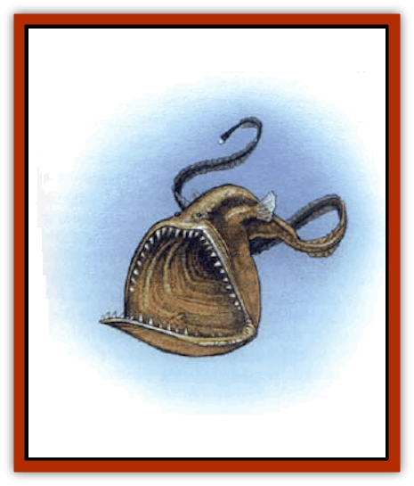

# Gulper

| Statistic | **Gulper** |
| --- | --- |
| **Activity Cycle:** | Any |
| **Alignment:** | Neutral |
| **Armor Class:** | Sw 15 |
| **Climate/Terrain:** | Ocean depths |
| **Damage/Attack:** | Constriction, swallow whole |
| **Diet:** | Carnivore |
| **Frequency:** | Uncommon |
| **Hit Dice:** | 11 |
| **Intelligence:** | Animal (1) |
| **Magic Resistance:** | L (12' long) |
| **Morale:** |  |
| **Movement:** | 9 |
| **No. Appearing:** | 1 |
| **No. of Attacks:** | 2d8 |
| **Organization:** | Solitary |
| **Size:** | -13 |
| **Special Attacks:** | Nil |
| **Special Defenses:** | Nil |
| **THAC0:** | 1 |
| **Treasure:** | Nil |
| **XP Value:** |  |

The gulper variety of [[Fish|fish]] consists of little more than a huge mouth, following by a trailing tail that seems to stretch on forever. This mouth is so huge that it enables the fish to swallow prey several times larger than itself; one species of gulper on Earth is known as the "pelican eel". Gulpers on Earth range in size from 6" (not counting the tail) to 6', but fantasy-world denizens can get up to 12' in length. These creatures have small eyes, set on top of their heads to catch the least little bit of sunlight that filters down from the surface, but they rely almost solely on their lateral lines to feel the approach of prey. Some species even have an electric light at the tip of the tail, apparently to attract potential victims.

**Combat:** The gulper's biting attack, which causes 2d8 hp damage, is inflicted only once on any prey it catches. After that, the victim has been swallowed whole, and the creature's teeth are now reduced to a supportive role, holding the prey in place so it can't get away. Now the damage is caused by the gulper's digestive juices, which inflict 1d8 hp damage per turn until the prey is either digested or released. Release can be tricky, though, as cutting through the gulpers soft flesh means inflicting an equal amount of damage of the cutter's trapped comrade. Both fantasy and real-world gulpers may use their tails for purposes of constriction, inflicting 1d6 hp damage per round to the hapless victim. In general, any creature smaller than size G may strangled by a 12' gulper, the whiplike tail takes up so its length.

**Habitat/Society:** These creatures are solitary, and don't have brains for a rich social life anyway. A 10" "pelican eel" from Earth has a brain case only a quarter-inch in length. Their reproductive cycle is unknown, but it is possible that as is the case with other fish, one of the parents may shelter the newborn young in its mouth for a time. In this case, "survival of the fittest" means knowing enough to leave home hunger overrides parental urges.

**Ecology:** Gulpers will eat anything. In return, they are edible, with literally delicate flesh. In addition, some enterprising magical artificers have used their skin in the construction of - what else? - a bag of holding.

---
## Discovery & Documentation

**Source Publication:** Dragon235 (1996)
**Campaign Setting:** Dragon Magazine
**Author(s):** 

### Other Creatures Found in This Source Book
   * [[Angler_Fish|Angler Fish]]
   * [[Death_Minnow|Death Minnow]]
   * [[Fish_Deep_Ocean|Fish, Deep Ocean]]
   * [[Hide|Hide]]
   * [[Octopus_Octo-Jelly|Octopus, Octo-Jelly]]
