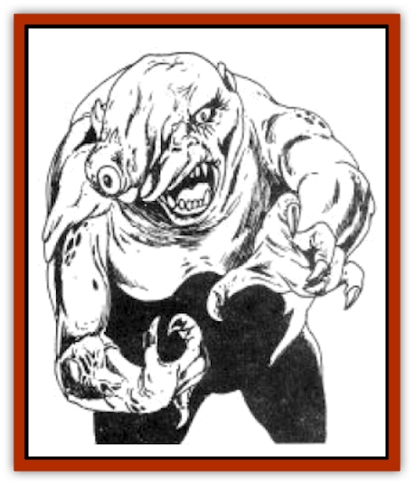

# Gurik Cha'ahl

| Statistic | **Gurik Cha'ahl** |
| --- | --- |
| **Activity Cycle:** | Night |
| **Alignment:** | Chaotic evil |
| **Armor Class:** | 8 |
| **Climate/Terrain:** | Temperate forest |
| **Damage/Attack:** | 1d6 |
| **Diet:** | Omnivore |
| **Frequency:** | Rare |
| **Hit Dice:** | 2 |
| **Intelligence:** | Semi- (2-4) |
| **Magic Resistance:** | Nil |
| **Morale:** | Average (9) |
| **Movement:** | 6 |
| **No. Appearing:** | 1-2 |
| **No. of Attacks:** | 1 |
| **Organization:** | Solitary |
| **Size:** | S (3-4') |
| **Special Attacks:** | Surprise, camouflage |
| **Special Defenses:** | Nil |
| **THAC0:** | 19 |
| **Treasure:** | Nil |
| **XP Value:** | 65 |

The gurik cha'ahl ("ghost people") are the dangerous and unpleasant offspring of the Ilquar [[Goblin|goblins]] of Taladas. They are the ill-favored who, driven out of the villages, have managed to survive in the forests against the odds. They look much like normal goblins, except for some abnormality that marks them.

**Combat:** The ghost people are not brave warriors and are never likely to be. Their survival has been due to their stealth, cunning, and deceitfulness, not their fierce combat prowess.

Gurik cha'ahl are quite stealthy. They move silently 70% of the time and have a natural ability to use camouflage and natural terrain. There is only a 25% chance they are spotted by casual observation. This chance improves by 30% for close scrutiny and an additional 30% if the gurik cha'ahl is moving. (Thus there is a 85% chance of spotting a moving gurik cha'ahl if the character watches carefully.) While the ability to move silently applies to any type of terrain, the camouflage ability requires the presence of some concealing terrain, although it can be quite slight.

A gurik cha'ahl that moves silently imposes a -4 penalty to the party's surprise rolls. One that fails to move silently but iS still unspotted causes a -2 penalty to character surprise rolls.

Once in combat, a gurik cha' ah1 will try to cause as much harm as possible, or steal something useful and escape as quickly as it can. The creatures have no desire to fight it out or battle superior odds. Thus most attacks by the gurik are against lone stragglers or solitary hunters. On rare occasions several gurik will operate together as a group.

**Habitat/Society:** The gurik cha'ahl are solitary dwellers. Rejects of the goblin tribes who live in the Ilquar Mountains, the gurik cha'ahl have managed to survive alone in the wilderness against the odds. Some have dim memories of their childhood, but most were abandoned at too young an age to remember. Nonetheless, the similarity in appearance between themselves and the goblins has not escaped their notice. They have developed an intense hatred of the goblins and delight in causing them harm.

The gurik cha.ahl are loners, without friends or communities. Because of their natures, they do not even trust each other, and classify other gurik with the goblins in general. The few times they do cooperate are when they are faced with a large incursion of goblins. Although they are spiteful and violent, their rage is directed mostly at the goblins. They attack other creatures for food and little else.

**Ecology:** The gurik cha'ahl act as predators and scavengers in their territory. Beyond this, their role in the local culture is strictly as a tool for mothers to scare children, a bogeyman to frighten them into being good or going to sleep.

---
## Discovery & Documentation

**Source Publication:** MC4 Dragonlance Appendix (w/binder #2) (1989)
**Campaign Setting:** Dragonlance
**Author(s):** Rick Swan

### Other Creatures Found in This Source Book
   * [[Anemone_Giant_Sea|Anemone, Giant Sea]]
   * [[Bear_Ice|Bear, Ice]]
   * [[Beast_Undead|Beast, Undead]]
   * [[Bird_Krynn|Bird (Krynn)]]
   * [[Disir|Disir]]
   * [[Draconian_Aurak|Draconian, Aurak]]
   * [[Draconian_Baaz|Draconian, Baaz]]
   * [[Draconian_Bozak|Draconian, Bozak]]
   * [[Draconian_Kapak|Draconian, Kapak]]
   * [[Draconian_General_Information|Draconian, General Information]]
   * [[Draconian_Sivak|Draconian, Sivak]]
   * [[Draconian_Proto-_Traag|Draconian, Proto-, Traag]]
   * [[Dragon_Amphi|Dragon, Amphi]]
   * [[Dragon_Astral|Dragon, Astral]]
   * [[Dragon_Kodragon|Dragon, Kodragon]]
   * [[Dragon_Krynn_Othlorx_General_Information|Dragon (Krynn), Othlorx, General Information]]
   * [[Dragon_Krynn_General_Information|Dragon (Krynn), General Information]]
   * [[Dragon_Sea|Dragon, Sea]]
   * [[Dreamshadow|Dreamshadow]]
   * [[Dreamwraith|Dreamwraith]]
   * [[Dwarf_Daergar|Dwarf, Daergar]]
   * [[Dwarf_Hill_Neidar|Dwarf, Hill, Neidar]]
   * [[Dwarf_Mountain_Hylar|Dwarf, Mountain, Hylar]]
   * [[Dwarf_Theiwar|Dwarf, Theiwar]]
   * [[Dwarf_Zakhar|Dwarf, Zakhar]]
   * [[Elf_Half-|Elf, Half-]]
   * [[Elf_High_Qualinesti|Elf, High, Qualinesti]]
   * [[Elf_High_Silvanesti|Elf, High, Silvanesti]]
   * [[Elf_Sea_Dargonesti|Elf, Sea, Dargonesti]]
   * [[Elf_Sea_Dimernesti|Elf, Sea, Dimernesti]]
   * [[Elf_Wild_Kagonesti|Elf, Wild, Kagonesti]]
   * [[Eyewing|Eyewing]]
   * [[Fetch|Fetch]]
   * [[Fire_Minion|Fire Minion]]
   * [[Fireshadow|Fireshadow]]
   * [[Gnome_Tinker|Gnome, Tinker]]
   * [[Haunt_Knight|Haunt, Knight]]
   * [[Horax|Horax]]
   * [[Human_Krynn|Human (Krynn)]]
   * [[Imp_Blood_Sea|Imp, Blood Sea]]
   * [[Kalothagh|Kalothagh]]
   * [[Kani_Doll|Kani Doll]]
   * [[Kender|Kender]]
   * [[Kyrie|Kyrie]]
   * [[Lizard_Man_Krynn|Lizard Man (Krynn)]]
   * [[Minotaur_Krynn|Minotaur, Krynn]]
   * [[Ogre_High|Ogre, High]]
   * [[Ogre_Krynn|Ogre (Krynn)]]
   * [[Phaethon|Phaethon]]
   * [[Saqualaminoi|Saqualaminoi]]
   * [[Shadowperson|Shadowperson]]
   * [[Shimmerweed|Shimmerweed]]
   * [[Skrit|Skrit]]
   * [[Spectral_Minion|Spectral Minion]]
   * [[Spider_Krynn|Spider (Krynn)]]
   * [[Stag|Stag]]
   * [[Tayling|Tayling]]
   * [[Thanoi|Thanoi]]
   * [[Tylor|Tylor]]
   * [[Wichtlin|Wichtlin]]
   * [[Wyndlass|Wyndlass]]
   * [[Yaggol|Yaggol]]
