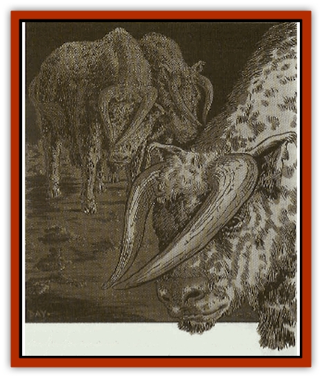

# Guttar

| Statistic | **Guttar** |
| --- | --- |
| **Activity Cycle:** | Varies |
| **Alignment:** | Neutral |
| **Armor Class:** | 7 |
| **Climate/Terrain:** | Any dwarven inhabited |
| **Damage/Attack:** | 1-10 |
| **Diet:** | Herbivore |
| **Frequency:** | Uncommon |
| **Hit Dice:** | 4 |
| **Intelligence:** | Animal (1) |
| **Magic Resistance:** | Nil |
| **Morale:** | Average (10) |
| **Movement:** | 12 |
| **No. Appearing:** | 20-60 |
| **No. of Attacks:** | 1 |
| **Organization:** | Herd |
| **Size:** | L (8' long, 5' high at shoulder) |
| **Special Attacks:** | Charge or stampede |
| **Special Defenses:** | See below |
| **THAC0:** | 17 |
| **Treasure:** | Nil |
| **XP Value:** | 175 |

[[Dwarf|Dwarven]] oxen are bred to live in the underground tunnels or halls that the dwarves call home. Their dwarven name means "thunder" because of the rumbling echoes the herds make as they move through the dwarven tunnels. They have short, coarse hair and large, rugged bodies. Both males and females have horns that curve forward over their noses and come together in the front, a formation bred into them to avoid snagging the horns on narrow tunnel walls.

**Combat:** In melee, the dwarven ox slashes or butts with its horns, causing 1-10 points of damage. If charging from a distance of at least 40 feet, it can cause 2-12 points of impaling damage plus 1-6 points of trampling damage, If a large herd of oxen are frightened, they might stampede, and woe betide whoever stands in their way. Anyone unable to avoid the stampede is hit by the first ox as in a charge (2-16 + 1-4 points of damage), and thhn trampled by 2-8 of the rest of the herd, causing 1-6 points of damage each. A well-known battle tactic of dwarves is to stampede a herd of oxen through a tunnel full of [[Orc|orcs]] or [[Goblin|goblins]], then saunter in to clean up whatever remains, which usually isn't much.

**Habitat/Society:** Dwarven oxen have been bred to live in the subterranean halls and tunnels of their dwarven masters. They shy away from bright sunlight and do not willingly venture outside into broad daylight, although light from a torch or fire does not bother them at all. Their eyesight is limited to a weak form of infravision (30'), and they rely mostly on their keen sensy of smell to find their food.

Their sense of smell is also important in communication within the herd. Because echoes in the dwarven tunnels can be deceiving, the dwarven ox uses a musk to relay emotional states rather than vocalization. Depending on the situation, different chemical combinations within the musk can communicate fear, danger, dominance, calm, or a desire to mate. Dwarves have learned how to use extracted versions of this musk to help control their herds.

Dwarven oxen graze on subterranean fungi and plant life, even those usually hazardous to other animals, and are immune to most of their attacks. There is a 95% chance that any special attack by a subterranean fungus or plant has no effect on a dwarven ox, which then happily munches it up.

Herd size varies depending on available grazing. Herds can be as small as ten animals, whereas some of the larger dwarven halls boast herds numbering hundreds. Conflicts over grazing rights have even started wars between neighboring dwarven settlements. Some non-dwarven villages have awakened to find their hills stripped bare of fodder.

**Ecology:** Dwarven oxen provide dwarves with meat and milk. Their coarse hair can be used to make rope or rough cloth, and their hide makes a tough leather, good for metal-working aprons, gloves, or leather armor. Delicate carvings are often made from the horn of the dwarven ox and given as tokens of love or friendship. Ox horn is also a popular choice of materials for use as hilts for forged weapons and is commonly found in dwarven smithies. The manure of the dwarven ox is also dried and used as fuel for forges or hearth fires. The dwarves believe strongly in using every part of the ox. Even the hooves are boiled for glue or used as chew toys for tunnel hound pups.

Dwarven oxen are also used as beasts of burden, carrying supplies, pulling mining carts, or turning the gears for some large contraption like a mill or mining lift. Sometimes they are even used as mounts by more eccentric dwarves like battleragers, though they are too stupid to serve as war mounts. However, just the sight of a battlerager mounted on a dwarven ox has sent units of goblins fleeing for their lives.

---
## Discovery & Documentation

**Source Publication:** Dragon269 (2000)
**Campaign Setting:** Dragon Magazine
**Author(s):** Jack Pitsker, David Day

### Other Creatures Found in This Source Book
   * [[Brak_Twan_Dwarven_Tunnel_Hound|Brak Twan (Dwarven Tunnel Hound)]]
   * [[Byut_Fey_Deer|Byut (Fey Deer)]]
