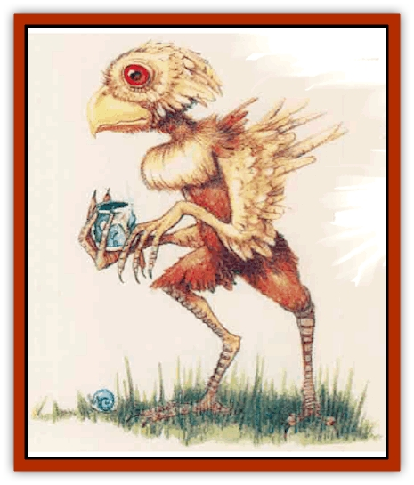

# Gyerian

| Statistic | **Gyerian** |
| --- | --- |
| **Activity Cycle:** | Day |
| **Alignment:** | Chaotic Good |
| **Armor Class:** | 3 |
| **Climate/Terrain:** | Temperate plain or forest |
| **Damage/Attack:** | 1d4 (claw)/1d4 (cIaw)/2d4 (peck) |
| **Diet:** | Omnivore |
| **Frequency:** | Rare |
| **Hit Dice:** | 3 |
| **Intelligence:** | Average (8-10) |
| **Magic Resistance:** | Nil |
| **Morale:** | Average (8) |
| **Movement:** | 15 |
| **No. Appearing:** | 2d4 |
| **No. of Attacks:** | 3 |
| **Organization:** | Flock |
| **Size:** | S-M (3-6' tall) |
| **Special Attacks:** | Sneeze |
| **Special Defenses:** | Nil |
| **THAC0:** | 17 |
| **Treasure:** | K (W) |
| **XP Value:** | 120 / Cockrobin: 270 / Rooster: 1,400 |

Gyerians - excitable, [[Bird|bird]]like humanoids - make their home in the grasslands and forests of Mystara. Although flightless, gyerians are migratory beings that travel in flocks, moving east to west every spring and returning in the fall.

The creatures usually stand 3 to 4 feet tall, but certain specimens may grow as tall as 6 feet. They all have bulging eyes and sharp, hooked beaks. Fine feathers ranging from light tan to deep brown cover their bodies, while their arms sprout longer feathers to give them the appearance of wings. Gyerians possess long, graceful, four-fingered hands and powerful, clawed feet.

**Combat:** The naturally nervous gyerians never seek out fights. Instead, they flee whenever the opportunity presents itself. However, when retreat seems impossible or when their young face a threat, the creatures attack by clawing with their powerful, three-toed feet and jabbing with their hooked, beaklike noses.

While fighting, a gyerian emits a series of loud squeals and cries. Others of its flock (2d4 total) within hearing distance (normally a half mile) come to the aid of their fellow in 1d4 rounds, as long as they make a successful morale check.

Additionally, a very nervous gyerian may emit a tremendous sneeze so powerful that anyone in front of the creature must make a Dexterity check or be bowled over for 1d4 points of damage. Any such unfortunates then must spend the next round recovering their footing. A gyerian may sneeze any time it feels particularly nervous (even when not in battle!), but it cannot use any other attack in the same round.

**Habitat/Society:** As social creatures, gyerians live in flocks of 10d4 individuals. Their settlements, simple affairs known as gyer, are composed of nesting huts woven from straw and branches and daubed with mud. Plains gyerians hide their dwellings among tall grasses, while those in the woods secrete them within tall bushes. They build these homes quickly each year, meaning them to last only until migration. Each flock has its own migratory pattern and settlement areas; a gyerian separated from its flock always can find its way back to one of its flock's nesting grounds.

The extremely shy gyerians generally avoid contact with other humanoids, particularly humans. However, they get along well with [[Elf|elves]], and feel less nervous dealing with humans if elves are present.

Gyerians go through elaborate mating rituals in the early spring. For several weeks, males of the species grow feathers in vivid greens and blues over most of their bodies. During these weeks, the males put on complicated displays ranging from beautiful dances to sparring contests involving two to five creatures. Only during this time of year do male gyerians go out of their way to attack humans or other humanoids. This behavior ends when the maring season does.

Female gyerians lay 1d4 eggs, which they guard fiercely. The eggs hatch in late summer, producing young that quickly become mobile. The fussy gyerian mothers tend to keep their fledglings no more than a few wingspans from themselves.

**Ecology:** Gyerians are restless fishers and gatherers that remain constantly on the lookout for the berries, roots, insects, fish, and snails that make up their diet. A particularly huqgry gyerian wiU resort to eating grasses or even hunting rabbits, giant rats, or other small game.

These creatures treasure gems and other shiny objects solely for their pretty appearance. They often fill their homes with such items, and the higher-ranking members of a flock adorn their bodies with shiny rings, necklaces, etc. Their fascination with such objects can become so extreme that, on occasion, a group of gyerians may enter human encampments in search of baubles.

**Cockrobin**

  One of every 10 gyerians is a larger specimen known as a cockrobin, a foe more formidable than an average gyerian (AC 2; HD 5; damage 1d6/1d6/2d12; size 5+ feet tall).

**Rooster**

  A flock of gyerians always follows a poewrful rooster. These leaders are very tall (6 feet) and strong (AC 1; HD 7; damage 1d8/1d8/2d16), and less likely to flee combat (morale 12). With the rooster present, normal gyerians have a morale of 10.

---
## Discovery & Documentation

**Source Publication:** Mystara Appendix (1994)
**Campaign Setting:** Mystara
**Author(s):** John Nephew, Teeuwynn Woodruff, John Terra, Skip Williams

### Other Creatures Found in This Source Book
   * [[Actaeon|Actaeon]]
   * [[Agarat|Agarat]]
   * [[Ash_Crawler|Ash Crawler]]
   * [[Baldandar|Baldandar]]
   * [[Bargda|Bargda]]
   * [[Bhut|Bhut]]
   * [[Bird_Mystara|Bird (Mystara)]]
   * [[Blackball|Blackball]]
   * [[Choker|Choker]]
   * [[Coltpixie|Coltpixie]]
   * [[Crone_of_Chaos|Crone of Chaos]]
   * [[Darkhood|Darkhood]]
   * [[Darkwing|Darkwing]]
   * [[Decapus|Decapus]]
   * [[Deep_Glaurant|Deep Glaurant]]
   * [[Diabolus|Diabolus]]
   * [[Dimensional_Warper|Dimensional Warper]]
   * [[Dragon_Mystara_Crystalline|Dragon (Mystara), Crystalline]]
   * [[Dragon_Mystara_Jade|Dragon (Mystara), Jade]]
   * [[Dragon_Mystara_Onyx|Dragon (Mystara), Onyx]]
   * [[Dragon_Mystara_Ruby|Dragon (Mystara), Ruby]]
   * [[Drake_Mystara|Drake (Mystara)]]
   * [[Dragonfly|Dragonfly]]
   * [[Dusanu|Dusanu]]
   * [[Elemental_of_Chaos_Air_Earth|Elemental of Chaos, Air/Earth]]
   * [[Elemental_of_Chaos_Fire_Water|Elemental of Chaos, Fire/Water]]
   * [[Elemental_of_Law_Air_Earth|Elemental of Law, Air/Earth]]
   * [[Elemental_of_Law_Fire_Water|Elemental of Law, Fire/Water]]
   * [[Familiar_Mystara|Familiar (Mystara)]]
   * [[Frost_Salamander|Frost Salamander]]
   * [[Fundamental_Air_Earth|Fundamental, Air/Earth]]
   * [[Fundamental_Fire_Water|Fundamental, Fire/Water]]
   * [[Gargantua_Mystara|Gargantua (Mystara)]]
   * [[Geonid|Geonid]]
   * [[Ghostly_Horde|Ghostly Horde]]
   * [[Giant_Athach|Giant, Athach]]
   * [[Giant_Hephaeston|Giant, Hephaeston]]
   * [[Golem_Drolem|Golem, Drolem]]
   * [[Golem_Mystara_I|Golem (Mystara) I]]
   * [[Golem_Mystara_II|Golem (Mystara) II]]
   * [[Golem_Mystara_III|Golem (Mystara) III]]
   * [[Gray_Philosopher|Gray Philosopher]]
   * [[Guardian_Warrior|Guardian Warrior]]
   * [[Herex|Herex]]
   * [[Hivebrood|Hivebrood]]
   * [[Horde|Horde]]
   * [[Hsiao|Hsiao]]
   * [[Huptzeen|Huptzeen]]
   * [[Hutaakan|Hutaakan]]
   * [[Imp_Mystara|Imp (Mystara)]]
   * [[Jellyfish_Giant_Mystara|Jellyfish, Giant (Mystara)]]
   * [[Kna|Kna]]
   * [[Kopru|Kopru]]
   * [[Lizard_Mystara|Lizard (Mystara)]]
   * [[Lizard-kin_Mystara|Lizard-kin (Mystara)]]
   * [[Lupin|Lupin]]
   * [[Lycanthrope_Werejaguar_Mystara|Lycanthrope, Werejaguar (Mystara)]]
   * [[Lycanthrope_Wereswine|Lycanthrope, Wereswine]]
   * [[Magen|Magen]]
   * [[Manikin|Manikin]]
   * [[Mek|Mek]]
   * [[Mujina|Mujina]]
   * [[Nagpa|Nagpa]]
   * [[Neh-thalggu|Neh-thalggu]]
   * [[Nightshade_Mystara|Nightshade (Mystara)]]
   * [[Nuckalavee|Nuckalavee]]
   * [[Pegataur|Pegataur]]
   * [[Phanaton|Phanaton]]
   * [[Plant_Dangerous_Mystara|Plant, Dangerous (Mystara)]]
   * [[Plasm|Plasm]]
   * [[Rakasta|Rakasta]]
   * [[Rock_Man|Rock Man]]
   * [[Sabreclaw|Sabreclaw]]
   * [[Sacrol|Sacrol]]
   * [[Scamille|Scamille]]
   * [[Shapeshifter|Shapeshifter]]
   * [[Shargugh|Shargugh]]
   * [[Shark-kin|Shark-kin]]
   * [[Sollux|Sollux]]
   * [[Spectral_Death|Spectral Death]]
   * [[Spectral_Hound|Spectral Hound]]
   * [[Spider-kin|Spider-kin]]
   * [[Spirit_Mystara|Spirit (Mystara)]]
   * [[Statue_Living|Statue, Living]]
   * [[Surtaki|Surtaki]]
   * [[Tabi|Tabi]]
   * [[Thoul|Thoul]]
   * [[Thunderhead|Thunderhead]]
   * [[Tiger_Ebon|Tiger, Ebon]]
   * [[Topi|Topi]]
   * [[Tortle|Tortle]]
   * [[Vampire_Velya|Vampire, Velya]]
   * [[White_Fang|White Fang]]
   * [[Worm_Mystara|Worm (Mystara)]]
   * [[Wyrd|Wyrd]]
   * [[Yowler|Yowler]]
   * [[Zombie_Lightning|Zombie, Lightning]]
