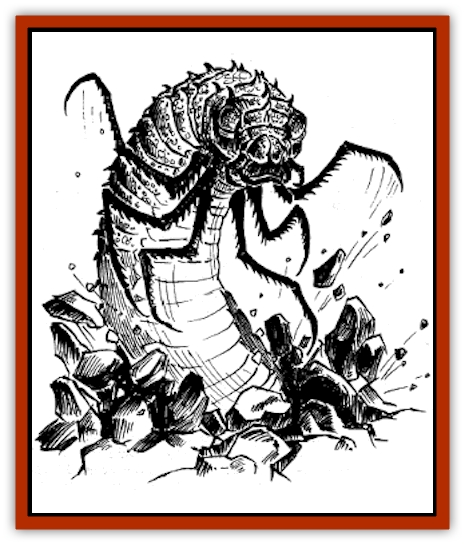

# H'Calos

| Statistic | **H'Calos** |
| --- | --- |
| **Activity Cycle:** | Any |
| **Alignment:** | Chaotic neutral |
| **Armor Class:** | -3 |
| **Climate/Terrain:** | Tropical (Ixtzul) |
| **Damage/Attack:** | 2-20 or 1-6/1-6/1-6/1-6 |
| **Diet:** | Omnivorous |
| **Frequency:** | Very rare (Unique) |
| **Hit Dice:** | 20 |
| **Intelligence:** | Low (4) |
| **Magic Resistance:** | 20% |
| **Morale:** | Fanatic (18) |
| **Movement:** | 9 (6 burrow) |
| **No. Appearing:** | 1 |
| **No. of Attacks:** | 1 or 4 |
| **Organization:** | Singular |
| **Size:** | G (100' long) |
| **Special Attacks:** | Swallow, fear |
| **Special Defenses:** | Immune to gas, fire |
| **THAC0:** | 1 |
| **Treasure:** | H&times;3 |
| **XP Value:** | 20,000 |

H'Calos is a (hopefully) unique creature found in Maztica. It appears as a monstrous [[Centipede|centipede]] with a black, chitinous shell. Its forward end is crowned by two glowing green eyes and a four-hinged jaw capable of swallowing any creature of size L or smaller. The forward two sets of legs have grown in the shape of a praying mantis's forelimbs, perfect for rending larger prey. The forward limbs also allow H'Calos to burrow through earth at normal speed, and through rock at one/third that speed.

**Combat:** H'Calos's favored method of attack is from below. It can sense vibrations through the earth and selects the loudest collection of individuals or people to attack from beneath. H'Calos emerges from the earth at high speed, taking one target with it, rising some forty feet above the ground. The target is subject to a swallow attack (see below - successful saving throw vs. breath weapon means he hasn't been swallowed, merely carried aloft), but even if he lives, he falls from that height unless he hangs on to his attacker.

H'Calos's rising from the ground causes fear (as for [[Dragon_General_Information|dragons]]) in all who witness it for the first time. Intelligent creatures of less than 1 HD flee in panic, with no saving throw. All others must make a saving throw against fear or fight at -2 to hit and damage for the next 10 rounds. The [[Bacar|bacars]] are unaffected as long as the queen is alive, but if dead, the bacars are affected as normal monsters.

The round after rising from the earth, H'Calos plunges back down, trying to take another target with it in a swallow attack. If the original target is still alive, H'Calos tries to rend it with its forelegs instead, but crashes to the ground. H'Calos is unaffected by this maneuver. During its dive it is vulnerable to attack (its entire body must follow it down the hole). A target hit by two of the four claws is secured, and is dragged underground as well.

H'Calos can swallow its prey on a +4 or better attack roll (e.g., if the creature needs a 13 to hit and the roll is a 17 or better). Swallowed prey then takes 2-16 points of (stomach acid) damage each round, automatically, until dead. The prey may use small hand-held weapons in the creature's gullet, though slashing and blunt weapons inflict only 1 point per attack. H'Calos' insides are AC 10. Spellcasters attempting to use spells, wands, or magical items must first make a Dexterity check.

H'Calos's tunnels through normal soil last about 3-18 rounds before caving in. Tunnels carved through stone are permanent, but softer soils (such as swamp) fill in almost immediately.

H'Calos is immune to fire and gas-based attacks, including *cloudkill*.

**Habitat/Society:** H'Calos lives to eat, period, and has spent the past 800 years in hibernation. He awakens with an all-consuming hunger, and eats until he is killed. He eats anything, but prefers animals, if only because they are easier to track through vibrations in the ground.

The breeding or creation of creatures such as H'Calos is unknown, although the idea of more than one of these creatures chills the blood.

**Ecology:** H'Calos the Star Worm fell to earth about a thousand years ago, encased in a meteorite. Whether this spaceborn rock was his lair or his prison is unknown. His landing near the Vale of Ixtzul reverberated around the True World, and his coming may have closed off the last of the dwarven tunnels back to Faer�n.

H'Calos' landing in the True World has had much to do with his long slumber. Without huge underground civilizations (as in Faer�n), no delving society found him by accident. Also, without organized nations, Ixtzul was quickly forgotten. Those who did adventure into the valley of Ixtzul were dealt with by the bacars.

Should H'Calos be freed, he will be at full power, but hungry, such that entire towns and cities will vanish overnight under his assault.

---
## Discovery & Documentation

**Source Publication:** FMA2 Endless Armies (1991)
**Campaign Setting:** Maztica (Forgotten Realms)
**Author(s):** Jeff Grub and Tim Beach

### Other Creatures Found in This Source Book
   * [[Bacar|Bacar]]
