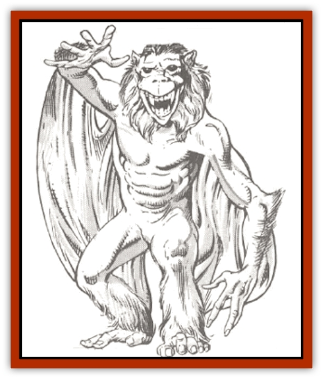

# Hadozee

| Statistic | **Hadozee** |
| --- | --- |
| **Activity Cycle:** | Any |
| **Alignment:** | Neutral |
| **Armor Class:** | 6 |
| **Climate/Terrain:** | Any space |
| **Damage/Attack:** | 1-8 (weapon) |
| **Diet:** | Omnivore |
| **Frequency:** | Uncommon |
| **Hit Dice:** | 3 |
| **Intelligence:** | Average (8-10) |
| **Magic Resistance:** | Nil |
| **Morale:** | Elite (13) |
| **Movement:** | 12 |
| **No. Appearing:** | 3-18 |
| **No. of Attacks:** | 1 |
| **Organization:** | Company |
| **Size:** | M (7' tall) |
| **Special Attacks:** | Nil |
| **Special Defenses:** | Nil |
| **THAC0:** | 17 |
| **Treasure:** | G |
| **XP Value:** | 120 |

Called "deck apes", hadozee are indeed ape-like. Rough taller and more slander than the typical ape, hadozee have brown hair covering their bodies. With a shaggy mane surrounding all of the head except for the face. The mouth is a protruding muzzle with several long fangs.

The most unusual feature of a hadozee is the membrane of skin that normally hangs loosely from the creature's arms and legs. When a hadozee raises its hands over its head, this membrane is stretched taut and the creature has a limited gliding ability, as explained below.

Hadozee are very nimble. They can climb trees, ropes, poles, and sheer surfaces as 10th-level thieves. Their feet are fully as dexterous as their hands, even to the extent of having opposable thumbs. Hadozee are tailless.

Hadozee are often hired as mercenary crews by spacefaring races, though they have no space travel capabilities of their own. Also, the race has a well-known capability for hard work, so they are most commonly encountered as hired crewmen on the vessels of others. They are especially popular with elves, both as crewmen and hired warriors.

**Combat:** Hadozee are  born  warriors, thoroughly at home in melee combat. They can use all weapons that humans can. Indeed, hadozee can wield a weapon in each hand - or in a hand and a foot - without penalty for two-handed combat. Their preferred weapons include long swords, spears, and halberds.

A hadozee can glide through the air by spreading the membranes on its wings, traveling one foot forward for every foot of height it loses.

In addition, hadozee have learned to exploit the gravity plane in their attacks against space vessels. Hadozee dive toward the enemy deck or hull, seeking a place to land and wield their weapons. If no place presents itself, they dive past the vessel and through the gravity plane. They then soar up a distance equal to three-quarters that from which they originally descended, and can maneuver around to dive back at the vessel from the other side of the gravity plane.

**Habitat/Society:** Hadozee of both sexes are eager to be accepted into the companies of sailors and mercenaries that sail among the stars. A group of young adults trains together, forming a company of up to 20 or 30 individuals. They then seek work for the master of a spacefaring vessel. The highest honor for a hadozee is to hire on as crew or warrior for elves.

Only when they grow too old for the life of activity and adventure do hadozee return to a world, where they mate and raise the next generation.

The hadozee relationship with elves goes back to the time of the Unhuman Wars, when the deck apes first showed a level of conscience and culture greater than the orcs and their kin, with which they had previously been grouped. The hadozee aided the elves in that war, and they have bee allied ever since. The elves have willingly employed the talents of the hadozee, and have in return paid them well. The elves in no way consider the hadozee to be an equal race, however.

**Ecology:** Hadozee have the same sustenance and protection needs as humans. Their diets are a little more adaptable - they will eat grubs and insects, for example - and they like their climate warm to tropical. But they can dress for cold weather and eat human food without complaining.

---
## Discovery & Documentation

**Source Publication:** MC7 Spelljammer Appendix I (1990)
**Campaign Setting:** Advanced Dungeons & Dragons 2nd Edition
**Author(s):** various

### Other Creatures Found in This Source Book
   * [[Aartuk|Aartuk]]
   * [[Albari|Albari]]
   * [[Ancient_Mariner|Ancient Mariner]]
   * [[Argos|Argos]]
   * [[Beholder_Abomination_Astereater|Beholder (Abomination), Astereater]]
   * [[Blazozoid|Blazozoid]]
   * [[Chattur|Chattur]]
   * [[Chevall|Chevall]]
   * [[Clockwork_Horror|Clockwork Horror]]
   * [[Colossus|Colossus]]
   * [[Delphinid|Delphinid]]
   * [[Dizantar|Dizantar]]
   * [[Dog|Dog]]
   * [[Dog_Bog_Hound|Dog, Bog Hound]]
   * [[Esthetic|Esthetic]]
   * [[Focoid|Focoid]]
   * [[Fractine|Fractine]]
   * [[Giant_Spacesea|Giant, Spacesea]]
   * [[Golem_Furnace|Golem, Furnace]]
   * [[Golem_Radiant|Golem, Radiant]]
   * [[Gravislayer|Gravislayer]]
   * [[Grommam|Grommam]]
   * [[Hamster_Giant_Space|Hamster, Giant Space]]
   * [[Jammer_Leech|Jammer Leech]]
   * [[Lakshu|Lakshu]]
   * [[Lumineaux|Lumineaux]]
   * [[Lutum|Lutum]]
   * [[Mimic_Space|Mimic, Space]]
   * [[Misi|Misi]]
   * [[Moon_Rogue|Moon, Rogue]]
   * [[Mortiss|Mortiss]]
   * [[Murderoid|Murderoid]]
   * [[Nay-Churr|Nay-Churr]]
   * [[Phlog-Crawler|Phlog-Crawler]]
   * [[Plasman|Plasman]]
   * [[Plasmoid_DeGleash|Plasmoid, DeGleash]]
   * [[Plasmoid_DelNoric|Plasmoid, DelNoric]]
   * [[Plasmoid_General_Information|Plasmoid, General Information]]
   * [[Plasmoid_Ontalak|Plasmoid, Ontalak]]
   * [[Puffer|Puffer]]
   * [[Q'nidar|Q'nidar]]
   * [[Rastipede|Rastipede]]
   * [[Reigar|Reigar]]
   * [[Rock_Hopper|Rock Hopper]]
   * [[Slinker|Slinker]]
   * [[Spider_Asteroid|Spider, Asteroid]]
   * [[Spiritjam|Spiritjam]]
   * [[Survivor|Survivor]]
   * [[Syllix|Syllix]]
   * [[Symbiont_Power|Symbiont, Power]]
   * [[Vine_Infinity|Vine, Infinity]]
   * [[Wiggle|Wiggle]]
   * [[Wizshade|Wizshade]]
   * [[Wryback|Wryback]]
   * [[Zard|Zard]]
   * [[Zodar|Zodar]]
