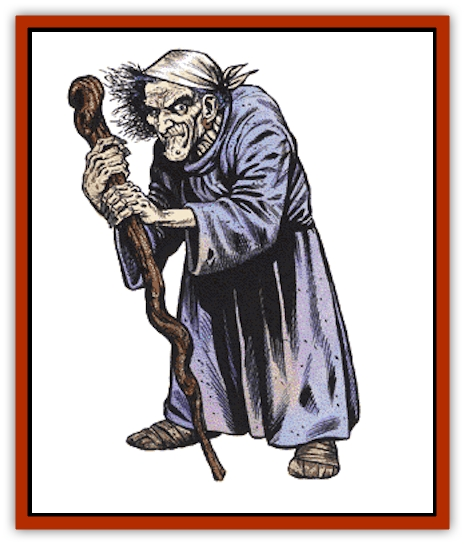

# Hag

| Statistic | **Annis** | **Green** | **Sea** |
| --- | --- | --- | --- |
| **Activity Cycle:** | Night | Night | Night |
| **Alignment:** | Chaotic evil | Neutral evil | Chaotic evil |
| **Armor Class:** | 0 | -2 | 7 |
| **Climate/Terrain:** | Any land | Any land or river | Any water |
| **Damage/Attack:** | 9-16/9-16/3-9 | 7-8/7-8 | 7-10 |
| **Diet:** | Carnivore | Carnivore | Carnivore |
| **Frequency:** | Very rare | Very rare | Rare |
| **Hit Dice:** | 7+7 | 9 | 3 |
| **Intelligence:** | Very (11-12) | Very (11-12) | Average (8-10) |
| **Magic Resistance:** | 20% | 35% | 50% |
| **Morale:** | Champion (15) | Fanatic (17) | Steady (11) |
| **Movement:** | 15 | 12, Sw 12 | Sw 15 |
| **No. Appearing:** | 1-3 | 1-3 | 1-3 |
| **No. of Attacks:** | 3 | 2 | 1 |
| **Organization:** | Covey | Covey | Covey |
| **Size:** | L (8' tall) | M (5-6' tall) | M |
| **Special Attacks:** | See below | See below | See below |
| **Special Defenses:** | See below | See below | See below |
| **THAC0:** | 13 | 11 | 17 |
| **Treasure:** | (D) | (X, F) | (C, Y) |
| **XP Value:** | 4,000 | 4,000 | 1,400 |

Hags are witchlike beings that spread havoc and destruction, working their magics, and slaying all whom they encounter.

Hags appear as wretched old women, with long, frayed hair and withered faces. Horrid moles and warts dot their blotchy skin, their mouths are filled with blackened teeth, and their breath is most foul. Though wrinkled and skinny, hags possess supernatural strength and can easily crush smaller creatures, such as [[Goblin|goblins]], with one hand. Similarly, though hags look decrepit, they run swiftly, easily bounding over rocks or logs in their path. From the long, skinny fingers of hags grow iron-like claws. Hags use these claws (and their supernatural strength) to rend and tear at opponents in combat. Their garb is similar to that of peasant women, but usually much more tattered and filthy.

**Combat:** The combat abilities of hags vary with each type (see below for details), but all hags possess the following: 18/00 Strength or greater, some level of magic resistance, and the spell-like ability to *change self* at will. Hags use this last ability to attract victims, frequently posing as young human or demihuman females, helpless old women, or occasionally as [[Orc|orcs]] or [[Hobgoblin|hobgoblins]]. A disguised hag reveals her true form and leaps to the attack when weak opponents come near. Against well armed and armored parties, hags maintain their disguise and employ further trickery designed to place the intended victim in a more vulnerable position. This trickery can take any of several forms, including verbal persuasion, leading the victim into a prearranged trap, and so on.

The one weakness of hags is their arrogance. Hags have great disdain for the mental abilities of all humans and demihumans and, though hags are masterful employers of disguise, clever characters may be able to glean a hag's true nature through conversation.

**Habitat/Society:** Hags live alone or in coveys of three. They always choose desolate, out-of-the-way places in which to dwell. They sometimes coexist with [[Ogre|ogres]] or evil giants. The former act as servants or guards for hags, but giants are treated with respect (for obvious reasons) and often cooperate with hags to accomplish acts of great evil against the outside world.

While individually powerful, hags are much more dangerous when formed into a covey. A covey is composed of three hags of any combination (e.g., two annis and a green hag, three annis, etc.). Coveys have special powers that individual hags don't possess. These powers include the following spells: *curse*, *polymorph other*, *animate dead*, *dream*, *control weather*, *veil*, *forcecage*, *vision*, and *mind blank*. Covey spells can each be used once per day, and take effect as if they were cast by a 9th-level spellcaster. To cast one of these spells, the members of the covey must all be within 10 feet of each other and the spell being cast must be in lieu of all other attacks.

Coveys never cast these spells in combat, instead these spells are used to help weave wicked plots against neighboring human or demihuman settlements. A common ploy by coveys is to force or trick a victim into performing some heinous deed. This deed usually involves bringing back more victims, some of whom are devoured by the hags; the rest are used on further evil assignments. Any creature fortunate (or unfortunate) enough to resist a covey is immediately devoured.

A covey of hags is 80% likely to be guarded by a mixture of 1d8 ogres and 1d4 evil giants. Coveys often use one or two of their ogres as spies, sending them into the world beyond after polymorphing them into less threatening creatures.

These minions frequently (60%) wear a special magical gem called a *hag eye*. A *hag eye* is made from the real eye of a covey's previous victim. It appears to the casual observer to be no more than a low-value gem (20 gp or less), but if viewed through a *gem of true seeing*, a disembodied eye can be seen trapped in the *hag eye*'s interior. This hidden eye is magically connected to the covey that created the hag eye. All three members of the covey can see whatever the *hag eye* is pointed at. *Hag eyes* are usually placed on a medallion or brooch worn by one of the hag's polymorphed servants. Occasionally *hag eyes* are given as gifts to unsuspecting victims whom the hags want to monitor. Destroying a *hag eye *inflicts 1d10 points of damage to each member of the covey that created it, and one of the three hags is struck blind for 24 hours.

Hags commonly inhabit bone-strewn glens deep within forests. There is an 80% chance that hags are keeping one or two captives in a nearby earthen pit or *forcecage*. These prisoners are held for a purpose known only to the hags themselves, though it will certainly involve spreading chaos into the outside world. Prisoners kept in a pit are guarded by an evil giant or one to two ogres; those in a *forcecage* are left alone.

**Ecology:** Hags have a ravenous appetite and are able to devour man-sized creatures in just 10 rounds. They prefer human flesh, but settle for orc or demihuman when necessary. This wanton destruction has earned hags some powerful enemies. Besides humanity in general, both good giants and good [[Dragon_General_Information|dragons]] hunt hags, slaying them whenever possible. Still, hags multiply rapidly by using their *change self* ability to appear as beautiful maidens to men they encounter alone. Hag offspring are always female. Legends say that hags can change their unborn child for that of a human female while she sleeps. They further state that any mother who brings such a child to term is then slain by the hag-child she carries. Fortunately, such ghastly tales have never been proven.

Hags hoard fine treasure, using the jewelry and coins to decorate the bones of their more powerful victims, and the finer gems (500 gp value or higher) to manufacture magical *hag eyes*.

**Annis**

  The largest and most powerful of all the hags, annis stand seven to eight feet tall. Their skin is deep blue in complexion, while their hair, teeth, and nails are glossy black. The eyes of an annis are dull green or yellow. Annis have normal infravision (60-foot range), but superior hearing and sense of smell. Annis are surprised only on a 1 on 1d10.

An annis attacks using its talons and teeth to inflict horrible wounds. In melee, annis tend to close and grapple. An annis that hits an opponent with all three of its attacks in one round has successfully grappled its opponent. Next round, all attacks by the annis are automatic hits, unless the opponent is stronger, the annis is slain, or the victim uses some magical means to escape the hag. Otherwise, the annis will continue to hold the victim in its grasp, and deliver damage with its raking talons and sharpened teeth each round until the victim is slain.

In addition to normal attacks, annis have the ability to cast *fog cloud* three times per day. This spell is used to confuse resistance or to delay attack by a superior foe. Annis can also *change self* like all hags, appearing as a tall human, ogre, or even a small giant. These spells are cast at 8th level for purposes of determining spell range, duration, etc.

The skin of an annis is iron-hard; thus edged weapons cause 1 less point of damage when they hit these hags. Conversely, blunt weapons (including morning stars) cause 1 additional point of damage against an annis.

Annis speak their own language, as well as ogre, all evil giant tongues, and some common. Some of the most intelligent annis can speak common fluently and know a smattering of various demihuman languages. Annis are believed to live for 500 years.

**Greenhag**

  These wretched creatures live in desolate countryside and amid dense forests and swamps. Greenhags, as their name implies, have a sickly green pallor. Hair color ranges from near black to olive green, and their eyes are amber or orange. Their skin appears withered but is hard and rough like the bark of a tree. Due to their coloration and their ability to move with absolute silence, greenhags impose a -5 penalty to an opponent's surprise roll when in a forest or swamp. They have superior hearing, smell, and sight, including infravision (90-foot range). They are only surprised on a roll of 1 on the 1d10 surprise roll.

Rock-hard talons grow from the long, slender fingers of greenhags. They use these talons to slash and rend their opponents. Smaller than their annis cousins, greenhags nonetheless possess Strength equivalent to that of an ogre (18/00). Because of their great Strength, all their attack rolls gain a +3 bonus and all hits receive a +6 damage bonus.

Greenhags can cast the following spells at will, one spell per round: *audible glamor*, *dancing lights*, *invisibility*, *pass without trace*, *change self*, *speak with monsters*, *water breathing*, and *weakness*. Each spell is employed at 9th level of ability.

To lure victims, greenhags typically use their *mimic* ability. This enables them to imitate the voice of a mature or immature male or female, human or demihuman. Calls for help and crying are common deceptions employed by greenhags. They are also able to mimic most animals.

Greenhags speak their own language (a dialect of annis) as well as all demihuman languages and common. These are the longest lived of all hags - they can live for up to 1,000 years.

**Sea Hag**

  These, the most wretched of all hags, inhabit thickly vegetated shallows in warm seas and, very rarely, overgrown lakes. Warts, bony protrusions, and patches of slimy green scales dot their sickly yellow skin. Their eyes are always red with deep, black pupils. Long, seaweed-like hair hangs limply from their heads, covering their withered bodies.

Sea hags hate beauty, attempting to destroy it wherever it is encountered. Sea hags can change self at will, and often use this ability to draw their victims within 30 feet before revealing themselves. The true appearance of a sea hag is so ghastly that anyone viewing one of these hags grows weak from fright unless a successful saving throw vs. spell is rolled. Beings that fail their saving throw lose ½ of their Strength for 1d6 turns. Worse still, sea hags can cast a deadly glance up to three times a day. This look affects one creature of the sea hag's choosing within 30 feet. To negate the effects of this glance, the victim must successfully save vs. poison. If the saving throw is failed, the victim either dies immediately from fright (25% chance) or falls stricken and is paralyzed for three days (75% chance). Few who survive the glance live to tell of it, for sea hags quickly devour their helpless victims.

 Sea hags always use their deadly glance as their primary form of attack; they will melee, but only if they have the advantage of numbers. Unlike other hags, sea hags use daggers in combat, receiving a +3 bonus to their attack roll and a +6 damage bonus, due to their ogre-like Strength.

Sea hags speak their own language as well as common and the languages of annis, and [[Elf_Aquatic|sea elves]], and live for 800 years.

---
## Discovery & Documentation

**Source Publication:** Monstrous Manual (1995)
**Campaign Setting:** Advanced Dungeons & Dragons 2nd Edition
**Author(s):** Tim Beach

### Other Creatures Found in This Source Book
   * [[Aarakocra|Aarakocra]]
   * [[Aboleth|Aboleth]]
   * [[Ankheg|Ankheg]]
   * [[Arcane|Arcane]]
   * [[Argos|Argos]]
   * [[Aurumvorax|Aurumvorax]]
   * [[Baatezu_Lesser_Abishai|Baatezu, Lesser, Abishai]]
   * [[Baatezu_General_Information|Baatezu, General Information]]
   * [[Baatezu_Greater_Pit_Fiend|Baatezu, Greater, Pit Fiend]]
   * [[Banshee|Banshee]]
   * [[Basilisk|Basilisk]]
   * [[Bat|Bat]]
   * [[Bear|Bear]]
   * [[Beetle_Giant|Beetle, Giant]]
   * [[Behir|Behir]]
   * [[Beholder_and_Beholder-kin_I|Beholder and Beholder-kin I]]
   * [[Beholder_and_Beholder-kin_II|Beholder and Beholder-kin II]]
   * [[Bird|Bird]]
   * [[Brain_Mole|Brain Mole]]
   * [[Broken_One|Broken One]]
   * [[Brownie|Brownie]]
   * [[Bugbear|Bugbear]]
   * [[Bulette|Bulette]]
   * [[Bullywug|Bullywug]]
   * [[Carrion_Crawler|Carrion Crawler]]
   * [[Cat_Great|Cat, Great]]
   * [[Catoblepas|Catoblepas]]
   * [[Cat_Small|Cat, Small]]
   * [[Cave_Fisher|Cave Fisher]]
   * [[Centaur|Centaur]]
   * [[Centipede|Centipede]]
   * [[Chimera|Chimera]]
   * [[Cloaker|Cloaker]]
   * [[Cockatrice|Cockatrice]]
   * [[Couatl|Couatl]]
   * [[Crabman|Crabman]]
   * [[Crawling_Claw|Crawling Claw]]
   * [[Crocodile|Crocodile]]
   * [[Crustacean_Giant|Crustacean, Giant]]
   * [[Crypt_Thing|Crypt Thing]]
   * [[Death_Knight|Death Knight]]
   * [[Deepspawn|Deepspawn]]
   * [[Dinosaur_I|Dinosaur I]]
   * [[Displacer_Beast|Displacer Beast]]
   * [[Dog|Dog]]
   * [[Dog_Moon|Dog, Moon]]
   * [[Dolphin|Dolphin]]
   * [[Doppelganger|Doppelganger]]
   * [[Dracolich|Dracolich]]
   * [[Dragon_Brown|Dragon, Brown]]
   * [[Dragon_Chromatic_Black|Dragon, Chromatic, Black]]
   * [[Dragon_Chromatic_Blue|Dragon, Chromatic, Blue]]
   * [[Dragon_Chromatic_Green|Dragon, Chromatic, Green]]
   * [[Dragon_Cloud|Dragon, Cloud]]
   * [[Dragon_Chromatic_Red|Dragon, Chromatic, Red]]
   * [[Dragon_Chromatic_White|Dragon, Chromatic, White]]
   * [[Dragon_Deep|Dragon, Deep]]
   * [[Dragon_Gem_Amethyst|Dragon, Gem, Amethyst]]
   * [[Dragon_Gem_Crystal|Dragon, Gem, Crystal]]
   * [[Dragon_Gem_Emerald|Dragon, Gem, Emerald]]
   * [[Dragon_Gem_Sapphire|Dragon, Gem, Sapphire]]
   * [[Dragon_Gem_Topaz|Dragon, Gem, Topaz]]
   * [[Dragon_Metallic_Brass|Dragon, Metallic, Brass]]
   * [[Dragon_Metallic_Bronze|Dragon, Metallic, Bronze]]
   * [[Dragon_Metallic_Copper|Dragon, Metallic, Copper]]
   * [[Dragon_Mercury|Dragon, Mercury]]
   * [[Dragon_Metallic_Gold|Dragon, Metallic, Gold]]
   * [[Dragon_Mist|Dragon, Mist]]
   * [[Dragon_Metallic_Silver|Dragon, Metallic, Silver]]
   * [[Dragon_General_Information|Dragon, General Information]]
   * [[Dragon_Shadow|Dragon, Shadow]]
   * [[Dragon_Steel|Dragon, Steel]]
   * [[Dragon_Yellow|Dragon, Yellow]]
   * [[Dragonne|Dragonne]]
   * [[Dragon_Turtle|Dragon Turtle]]
   * [[Dragonet_Faerie_Dragon|Dragonet, Faerie Dragon]]
   * [[Dragonet_Fire_Drake|Dragonet, Fire Drake]]
   * [[Dragonet_Pseudodragon|Dragonet, Pseudodragon]]
   * [[Dryad|Dryad]]
   * [[Dwarf_Derro|Dwarf, Derro]]
   * [[Dwarf|Dwarf]]
   * [[Elemental_Athas_General_Information|Elemental (Athas), General Information]]
   * [[Elemental_Air_Kin|Elemental, Air Kin]]
   * [[Elemental_Earth_Kin|Elemental, Earth Kin]]
   * [[Elemental_Fire_Kin|Elemental, Fire Kin]]
   * [[Elemental_Water_Kin|Elemental, Water Kin]]
   * [[Elemental_of_Chaos_Air_Earth|Elemental of Chaos, Air/Earth]]
   * [[Elemental_of_Chaos_Fire_Water|Elemental of Chaos, Fire/Water]]
   * [[Elemental_Composite|Elemental, Composite]]
   * [[Elemental_Air_Earth|Elemental, Air/Earth]]
   * [[Elemental_Fire_Water|Elemental, Fire/Water]]
   * [[Elemental_General_Information|Elemental, General Information]]
   * [[Elephant|Elephant]]
   * [[Elf|Elf]]
   * [[Elf_Aquatic|Elf, Aquatic]]
   * [[Elf_Drow|Elf, Drow]]
   * [[Ettercap|Ettercap]]
   * [[Eyewing|Eyewing]]
   * [[Feyr|Feyr]]
   * [[Fish|Fish]]
   * [[Frog|Frog]]
   * [[Fungus|Fungus]]
   * [[Galeb_Duhr|Galeb Duhr]]
   * [[Gargantua|Gargantua]]
   * [[Gargoyle_I|Gargoyle I]]
   * [[Genie|Genie]]
   * [[Ghost|Ghost]]
   * [[Ghoul|Ghoul]]
   * [[Giant_Cloud|Giant, Cloud]]
   * [[Giant_Cyclops|Giant, Cyclops]]
   * [[Giant_Desert|Giant, Desert]]
   * [[Giant_Ettin|Giant, Ettin]]
   * [[Giant_Firbolg|Giant, Firbolg]]
   * [[Giant_Fire|Giant, Fire]]
   * [[Giant_Fog|Giant, Fog]]
   * [[Giant_Fomorian|Giant, Fomorian]]
   * [[Giant_Frost|Giant, Frost]]
   * [[Giant_Hill|Giant, Hill]]
   * [[Giant_Jungle|Giant, Jungle]]
   * [[Giant_Mountain|Giant, Mountain]]
   * [[Giant_Reef|Giant, Reef]]
   * [[Giant_Stone|Giant, Stone]]
   * [[Giant_Storm|Giant, Storm]]
   * [[Giant_Verbeeg|Giant, Verbeeg]]
   * [[Giant_Wood|Giant, Wood]]
   * [[Gibberling|Gibberling]]
   * [[Giff|Giff]]
   * [[Gith|Gith]]
   * [[Gith_Pirate_of|Gith, Pirate of]]
   * [[Githyanki|Githyanki]]
   * [[Githzerai|Githzerai]]
   * [[Gloomwing|Gloomwing]]
   * [[Gnoll|Gnoll]]
   * [[Gnome|Gnome]]
   * [[Gnome_Spriggan|Gnome, Spriggan]]
   * [[Goblin|Goblin]]
   * [[Golem_General_Information|Golem, General Information]]
   * [[Golem_I_Greater_Golem|Golem I (Greater Golem)]]
   * [[Golem_II_Lesser_Golem|Golem II (Lesser Golem)]]
   * [[Golem_III|Golem III]]
   * [[Golem_IV|Golem IV]]
   * [[Golem_V|Golem V]]
   * [[Golem_VI_Stone_Variants|Golem VI (Stone Variants)]]
   * [[Gorgon|Gorgon]]
   * [[Grell_Colonial|Grell, Colonial]]
   * [[Gremlin_Jermlaine|Gremlin, Jermlaine]]
   * [[Gremlin|Gremlin]]
   * [[Griffon|Griffon]]
   * [[Grimlock|Grimlock]]
   * [[Grippli|Grippli]]
   * [[Halfling|Halfling]]
   * [[Harpy|Harpy]]
   * [[Hatori|Hatori]]
   * [[Haunt|Haunt]]
   * [[Hell_Hound|Hell Hound]]
   * [[Heucuva|Heucuva]]
   * [[Hippocampus|Hippocampus]]
   * [[Hippogriff|Hippogriff]]
   * [[Hobgoblin|Hobgoblin]]
   * [[Homunculus|Homunculus]]
   * [[Hook_Horror|Hook Horror]]
   * [[Horse|Horse]]
   * [[Human|Human]]
   * [[Hydra|Hydra]]
   * [[Imp|Imp]]
   * [[Insect_Giant|Insect, Giant]]
   * [[Insect_Swarm|Insect Swarm]]
   * [[Intellect_Devourer|Intellect Devourer]]
   * [[Invisible_Stalker|Invisible Stalker]]
   * [[Ixitxachitl|Ixitxachitl]]
   * [[Jackalwere|Jackalwere]]
   * [[Kenku|Kenku]]
   * [[Ki-rin|Ki-rin]]
   * [[Kirre|Kirre]]
   * [[Kobold|Kobold]]
   * [[Kuo-Toa|Kuo-Toa]]
   * [[Lamia|Lamia]]
   * [[Lammasu|Lammasu]]
   * [[Leech|Leech]]
   * [[Leprechaun|Leprechaun]]
   * [[Leucrotta|Leucrotta]]
   * [[Lich|Lich]]
   * [[Living_Wall|Living Wall]]
   * [[Lizard|Lizard]]
   * [[Lizard_Man|Lizard Man]]
   * [[Locathah|Locathah]]
   * [[Lurker|Lurker]]
   * [[Lycanthrope_General_Information|Lycanthrope, General Information]]
   * [[Lycanthrope_Seawolf|Lycanthrope, Seawolf]]
   * [[Lycanthrope_Werebear|Lycanthrope, Werebear]]
   * [[Lycanthrope_Wereboar|Lycanthrope, Wereboar]]
   * [[Lycanthrope_Werebat|Lycanthrope, Werebat]]
   * [[Lycanthrope_Werefox|Lycanthrope, Werefox]]
   * [[Lycanthrope_Wererat|Lycanthrope, Wererat]]
   * [[Lycanthrope_Wereraven|Lycanthrope, Wereraven]]
   * [[Lycanthrope_Weretiger|Lycanthrope, Weretiger]]
   * [[Lycanthrope_Werewolf|Lycanthrope, Werewolf]]
   * [[Mammal|Mammal]]
   * [[Mammal_Giant|Mammal, Giant]]
   * [[Mammal_Herd_I|Mammal, Herd I]]
   * [[Mammal_Small|Mammal, Small]]
   * [[Manscorpion|Manscorpion]]
   * [[Manticore|Manticore]]
   * [[Medusa_Maedar|Medusa, Maedar]]
   * [[Medusa|Medusa]]
   * [[Mephit_General_Information|Mephit, General Information]]
   * [[Merman|Merman]]
   * [[Mimic|Mimic]]
   * [[Mind_Flayer|Mind Flayer]]
   * [[Minotaur|Minotaur]]
   * [[Mist_Crimson_Death|Mist, Crimson Death]]
   * [[Mist_Vampiric|Mist, Vampiric]]
   * [[Mold_I|Mold I]]
   * [[Moldman|Moldman]]
   * [[Mongrelman|Mongrelman]]
   * [[Morkoth|Morkoth]]
   * [[Muckdweller|Muckdweller]]
   * [[Mudman|Mudman]]
   * [[Mummy_Greater|Mummy, Greater]]
   * [[Mummy|Mummy]]
   * [[Myconid|Myconid]]
   * [[Naga|Naga]]
   * [[Naga_Dark|Naga, Dark]]
   * [[Neogi|Neogi]]
   * [[Nightmare|Nightmare]]
   * [[Nymph|Nymph]]
   * [[Octopus_Giant|Octopus, Giant]]
   * [[Ogre|Ogre]]
   * [[Ogre_Half-|Ogre, Half-]]
   * [[Ooze_Slime_Jelly_I|Ooze/Slime/Jelly I]]
   * [[Ooze_Slime_Jelly_II|Ooze/Slime/Jelly II]]
   * [[Ooze_Slime_Jelly_Slithering_Tracker|Ooze/Slime/Jelly, Slithering Tracker]]
   * [[Orc|Orc]]
   * [[Otyugh|Otyugh]]
   * [[Owlbear_I|Owlbear I]]
   * [[Pegasus|Pegasus]]
   * [[Peryton|Peryton]]
   * [[Phantom|Phantom]]
   * [[Phoenix|Phoenix]]
   * [[Piercer|Piercer]]
   * [[Plant_Dangerous_I|Plant, Dangerous I]]
   * [[Plant_Intelligent|Plant, Intelligent]]
   * [[Poltergeist|Poltergeist]]
   * [[Pudding_Deadly|Pudding, Deadly]]
   * [[Quaggoth|Quaggoth]]
   * [[Rakshasa|Rakshasa]]
   * [[Rat|Rat]]
   * [[Rat_Osquip|Rat, Osquip]]
   * [[Remorhaz|Remorhaz]]
   * [[Revenant|Revenant]]
   * [[Roc|Roc]]
   * [[Roper|Roper]]
   * [[Rust_Monster|Rust Monster]]
   * [[Sahuagin|Sahuagin]]
   * [[Satyr|Satyr]]
   * [[Scorpion|Scorpion]]
   * [[Sea_Lion|Sea Lion]]
   * [[Selkie|Selkie]]
   * [[Shadow|Shadow]]
   * [[Shedu|Shedu]]
   * [[Sirine|Sirine]]
   * [[Skeleton|Skeleton]]
   * [[Skeleton_Giant|Skeleton, Giant]]
   * [[Skeleton_Warrior|Skeleton, Warrior]]
   * [[Slaad|Slaad]]
   * [[Slug_Giant|Slug, Giant]]
   * [[Snake|Snake]]
   * [[Snake_Winged|Snake, Winged]]
   * [[Spectre|Spectre]]
   * [[Sphinx|Sphinx]]
   * [[Spider|Spider]]
   * [[Sprite|Sprite]]
   * [[Squid_Giant|Squid, Giant]]
   * [[Stirge|Stirge]]
   * [[Su-Monster|Su-Monster]]
   * [[Swanmay|Swanmay]]
   * [[Tabaxi|Tabaxi]]
   * [[Tako|Tako]]
   * [[Tanar'ri_True_Balor|Tanar'ri, True, Balor]]
   * [[Tanar'ri_True_Marilith|Tanar'ri, True, Marilith]]
   * [[Tarrasque|Tarrasque]]
   * [[Tasloi|Tasloi]]
   * [[Thought_Eater|Thought Eater]]
   * [[Thri-kreen|Thri-kreen]]
   * [[Titan|Titan]]
   * [[Toad_Giant|Toad, Giant]]
   * [[Treant|Treant]]
   * [[Triton|Triton]]
   * [[Troglodyte|Troglodyte]]
   * [[Troll|Troll]]
   * [[Umber_Hulk|Umber Hulk]]
   * [[Unicorn|Unicorn]]
   * [[Urchin|Urchin]]
   * [[Vampire|Vampire]]
   * [[Wemic|Wemic]]
   * [[Whale|Whale]]
   * [[Wight|Wight]]
   * [[Will_O'Wisp|Will O'Wisp]]
   * [[Wolf|Wolf]]
   * [[Wolfwere|Wolfwere]]
   * [[Worm|Worm]]
   * [[Wraith|Wraith]]
   * [[Wyvern|Wyvern]]
   * [[Xorn|Xorn]]
   * [[Yeti|Yeti]]
   * [[Yuan-ti_Histachii|Yuan-ti, Histachii]]
   * [[Yuan-ti|Yuan-ti]]
   * [[Yugoloth_Guardian|Yugoloth, Guardian]]
   * [[Zaratan|Zaratan]]
   * [[Zombie|Zombie]]
