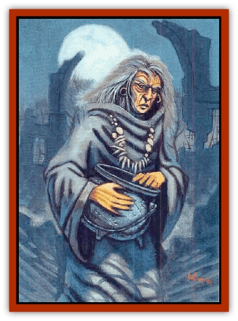

# Hag - Bheur

| Statistic | **Hag, Bheur** |
| --- | --- |
| **Activity Cycle:** | Day or night |
| **Alignment:** | Chaotic evil |
| **Armor Class:** | -3 |
| **Climate/Terrain:** | Cold regions (Rashemen) |
| **Damage/Attack:** | 2d6/2d6 |
| **Diet:** | Carnivore |
| **Frequency:** | Very rare |
| **Hit Dice:** | 10 |
| **Intelligence:** | Very (11-12) |
| **Magic Resistance:** | 40% |
| **Morale:** | Fanatic (17) |
| **Movement:** | 12, fly 48 (A) |
| **No. Appearing:** | 1 |
| **No. of Attacks:** | 2 |
| **Organization:** | Solitary |
| **Size:** | M |
| **Special Attacks:** | <i>Staff of frost</i> |
| **Special Defenses:** | See below |
| **THAC0:** | 11 |
| **Treasure:** | Nil (D) |
| **XP Value:** | 6,000 |

The bheur, or blue [[Hag|hag]], of Rashemaar legend is said to be the bringer of winter, capable of spreading deadly cold over a wide area. Rashemaar tales are uncertain whether there is only one bheur or many, but in all stories she is a powerful and malevolent creature who serves the useful purpose of helping to bring winter. She is invariably defeated add driven off each spring.

In most stories the bheur resembles a hidepus, wrinkled old crone with pale blue-white skin and snow-white hair, wrapped in a tattered gray-blue shawl. She carries a gnarled gray staff taller than she is, and her voice howls of icy winds.

Some stories tell of the bheur and [[Spirit_Ice_Orglash|orglash]] (ice spirits) working in concert to mislead, attack, and devour travelers. No one knows whether these tales of cooperation bepeen the blue hag and orglash are true; witnesses are unlikely to live to tell the tale.

Other legends speak of epic battles betweqn high-ranking *wychlaran* (the Witches of Rashemen) and thy bheur, and of the early onset of spring as a result of victory by the Witches. The Witches themselves believe that the bheur is a natural part of the land and serves a useful purpose, but they will fight the blue hag if she begins to act arbitrarily or cruelly. As the Witches say, winter is the best part of the year, but even winter pales in the month of Hammer.

**Combat:** The bheur fight by laying their cold palms upon victims, causing intense pain and 2d6 points of damage from pure frost. Flame-based creatures take double damage.

A bheur carries her *staff of frost*, which functlons in the same manner as a *wand of frost* save that it never needs recharging. The staff functions only for a bheur; out of her hands, it is useless. If a bheur's staff is lost or destroyed, she must leave the Prime Material Plane for a year in order to regain a new one.

The bheur is entirely immune to all cold-based attacks and suffers only half damage from fire-based attacks, but she sustains double damage from acid and electricity. The bheur is thus reluctant to engage wizards who use such spells in combat.

**Habitat/Society:** Some claim that the bheur themselves bring the cold, others that the cold draws the bheur.

As the skies turn slate-gray and snow swirls down from the sky, driven on howling winds, the Rashemaar shut their doors tightly, make certain that they have laid in enough wood and food for the winter, and cower in the terrible weather. During this time the bheur is abroad, and most Rashemaar fear her greatly. Like the dreaded [[Spirit_Forest_Uthraki|uthraki]] shapechanging spirits, bheur prefer to prey upon lone travelers, freezing them and devouring their frozen bodies. The bheur is also said to sneak into people's homes if the doors and windows are not proper sealed, where they snatch away young children or unsuspecting residents. Such stories are probably cautionary tales against leaving windows and doors open, but they usually do the job keeping young Rashemaar in line for fear of the blue hag.

**Ecology:** No one has ever seen two blue hags together, leading to a widespread belief that there is only one bheur in all of Rashemen. After freezing victims, the bheur dines on the icy corpses, and it is said that anyone who sees a bheur devour its victim may be struck blind or driven mad. Characters who witness such an act must successfully save vs. death magic or be blinded (75%) or driven insane (25%). Insane characters flee (50%), attack anyone nearby, friend or foe (30%), or collapse in a catatonic heap, incapable of speech or movement (20%). The madness lasts 2d6 days unless the victim receives a *cure disease* or *remove curse* spell.

---
## Discovery & Documentation

**Source Publication:** Monstrous Compendium, 1996 Annual, Volume 3 (1995)
**Campaign Setting:** Advanced Dungeons & Dragons 2nd Edition
**Author(s):** Jon Pickens

### Other Creatures Found in This Source Book
   * [[Alaghi|Alaghi]]
   * [[Alhoon|Alhoon]]
   * [[Aranea_Savage_Coast|Aranea (Savage Coast)]]
   * [[Arcane_Head|Arcane Head]]
   * [[Banedead|Banedead]]
   * [[Banelich|Banelich]]
   * [[Bat_Bonebat|Bat, Bonebat]]
   * [[Beetle|Beetle]]
   * [[Belgoi|Belgoi]]
   * [[Bladeling|Bladeling]]
   * [[Braxat|Braxat]]
   * [[Bunyip|Bunyip]]
   * [[Burbur|Burbur]]
   * [[Bvanen|Bvanen]]
   * [[Cat_Great_Snow_Tiger|Cat, Great, Snow Tiger]]
   * [[Chosen_One|Chosen One]]
   * [[Chronovoid|Chronovoid]]
   * [[Cildabrin|Cildabrin]]
   * [[Coffer_Corpse|Coffer Corpse]]
   * [[Disenchanter|Disenchanter]]
   * [[Dog_Temporal|Dog, Temporal]]
   * [[Dragon_Cerilia|Dragon (Cerilia)]]
   * [[Dragon_Ghost|Dragon, Ghost]]
   * [[Dragon_Lesser_Undead|Dragon, Lesser Undead]]
   * [[Dragon_Neutral_Amber|Dragon, Neutral, Amber]]
   * [[Dread_Warrior|Dread Warrior]]
   * [[Dreamweaver|Dreamweaver]]
   * [[Dream_Spawn_Greater_Ennui|Dream Spawn, Greater, Ennui]]
   * [[Dream_Spawn_Lesser_Morph|Dream Spawn, Lesser, Morph]]
   * [[Dwarf_Arctic|Dwarf, Arctic]]
   * [[Dwarf_Urdunnir|Dwarf, Urdunnir]]
   * [[Eel_Giant_Moray|Eel, Giant Moray]]
   * [[Elemental_Fire_Kin_Tome_Guardian|Elemental, Fire Kin, Tome Guardian]]
   * [[Elf_Rockseer|Elf, Rockseer]]
   * [[Ethyk|Ethyk]]
   * [[Faerie_Faerie_Fiddler|Faerie, Faerie Fiddler]]
   * [[Faerie_Petty_Bramble|Faerie, Petty, Bramble]]
   * [[Faerie_Petty_Gorse|Faerie, Petty, Gorse]]
   * [[Faerie_Petty|Faerie, Petty]]
   * [[Firenewt|Firenewt]]
   * [[Formian|Formian]]
   * [[Gargoyle_II|Gargoyle II]]
   * [[Giant_Cerilia|Giant (Cerilia)]]
   * [[Goblin_Cerilia|Goblin (Cerilia)]]
   * [[Golem_Magic|Golem, Magic]]
   * [[Golem_Shaboath|Golem, Shaboath]]
   * [[Hamadryad|Hamadryad]]
   * [[Hound_of_Ill-Omen|Hound of Ill-Omen]]
   * [[Human_Cerilia|Human (Cerilia)]]
   * [[Hybsil|Hybsil]]
   * [[Ibrandlin|Ibrandlin]]
   * [[Imp_Chaos|Imp, Chaos]]
   * [[Ixitxachitl_Ixzan|Ixitxachitl, Ixzan]]
   * [[Jabberwock|Jabberwock]]
   * [[Kyton|Kyton]]
   * [[Kyuss_Son_of|Kyuss, Son of]]
   * [[Lillend|Lillend]]
   * [[Life-Shaped_Creation_Guardian|Life-Shaped Creation, Guardian]]
   * [[Life-Shaped_Creation_Transport|Life-Shaped Creation, Transport]]
   * [[Lycanthrope_Werecrocodile|Lycanthrope, Werecrocodile]]
   * [[Lycanthrope_Werespider|Lycanthrope, Werespider]]
   * [[Magedoom|Magedoom]]
   * [[Manotaur|Manotaur]]
   * [[Mastiff_Shadow|Mastiff, Shadow]]
   * [[Meazel|Meazel]]
   * [[Mist_Scarlet_Dancer|Mist, Scarlet Dancer]]
   * [[Needleman|Needleman]]
   * [[Orc_Neo-Orog|Orc, Neo-Orog]]
   * [[Orc_Ondonti|Orc, Ondonti]]
   * [[Owlbear_II|Owlbear II]]
   * [[Pegataur|Pegataur]]
   * [[Phaerimm|Phaerimm]]
   * [[Reggelid|Reggelid]]
   * [[Render|Render]]
   * [[Saurial|Saurial]]
   * [[Scalamagdrion|Scalamagdrion]]
   * [[Sharn|Sharn]]
   * [[Snake_Messenger|Snake, Messenger]]
   * [[Spirit_Forest_Uthraki|Spirit, Forest, Uthraki]]
   * [[Spirit_Forest_Wood_Man|Spirit, Forest, Wood Man]]
   * [[Spirit_Ice_Orglash|Spirit, Ice, Orglash]]
   * [[Spirit_Rock_Thomil|Spirit, Rock, Thomil]]
   * [[Strider_Giant|Strider, Giant]]
   * [[Tembo|Tembo]]
   * [[Temporal_Glider|Temporal Glider]]
   * [[Temporal_Stalker|Temporal Stalker]]
   * [[Tether_Beast|Tether Beast]]
   * [[Thessalmonster|Thessalmonster]]
   * [[Time_Dimensional|Time Dimensional]]
   * [[Tomb_Tapper|Tomb Tapper]]
   * [[Undead_Dragon_Slayer|Undead Dragon Slayer]]
   * [[Unicorn_Black_Toril|Unicorn, Black (Toril)]]
   * [[Vaath|Vaath]]
   * [[Vortex_Spider|Vortex Spider]]
   * [[Weredragon|Weredragon]]
   * [[Zhentarim_Spirit|Zhentarim Spirit]]
