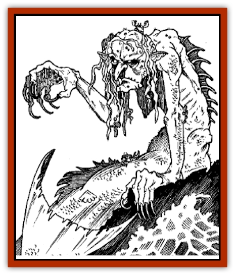
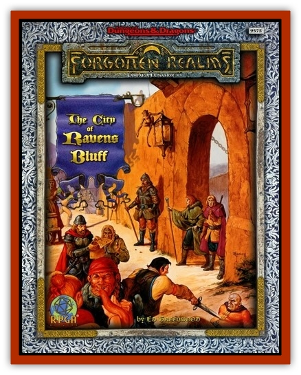

# Hag - Sea - Greater

| Statistic | **Hag, Sea, Greater** |
| --- | --- |
| **Activity Cycle:** | Any |
| **Alignment:** | Chaotic evil |
| **Armor Class:** | 5 |
| **Climate/Terrain:** | Any aquatic |
| **Damage/Attack:** | 1d4+6 (dagger or claw) or 1d6+6 (short sword) |
| **Diet:** | Carnivore |
| **Frequency:** | Very rare |
| **Hit Dice:** | 2-8 |
| **Intelligence:** | Very (11-12) |
| **Magic Resistance:** | 50% |
| **Morale:** | Champion (15) |
| **Movement:** | Swim 15 |
| **No. Appearing:** | 1 |
| **No. of Attacks:** | 1 |
| **Organization:** | Solitary |
| **Size:** | M (3' tall plus 3-foot tail) |
| **Special Attacks:** | Ogre strength (+3 to attack rolls, +6 damage), <i>charm gaze</i>, ghastly visage, spells |
| **Special Defenses:** | <i>Change self</i>, immune to charms, spells |
| **THAC0:** | 19 (2 HD) / 17 (3 &amp; 4 HD) / 15 (5 &amp; 6 HD) / 13 (7 &amp; 8 HD) |
| **Treasure:** | B,C,Y |
| **XP Value:** | 2 Dice: 975 / 3 Hit Dice: 1,400 / 4 Hit Dice: 2,000 / 5 Hit Dice: 3,000 / 6 Hit Dice: 4,000 / 7 Hit Dice: 5,000 / 8 Hit Dice: 6,000 |

One of the most dreaded denizens of the deep, greater sea [[Hag|hags]] are fortunately rare. They are thought by some to have descended from twisted servitor creations of [[Archomental_Evil|Olhydra]], princess of evil water creatures and ruler over the Plane of Elemental Water (which in turn argues that lesser sea hags, and perhaps all other hags, are merely degenerate descendants of greater sea hags).

They appear as wrinkled, withered old crones with seaweed-green hair that covers their green-scaled bodies, iron-like claws, and fiery red eyes. Some can't be distinguished from lesser sea hags, but others are noticeably larger and more charismatic.

**Combat:** Though they lack the death gaze power of their lesser kin, greater sea hags can work a powerful *charm* three times a day by making eye contact with an intelligent creature. Those so *charmed* remain in this state until the hag is killed or the *charm* is magically dispelled; victims do not get additional saves as time passes. Greater sea hags are themselves immune to all *charm*, *suggestion*, and other mind-influencing magics or psionics.

A greater sea hag can cast *change self* so as to resemble any sea creature, usually choosing one as beautiful as she is ugly, such as a [[Merman|mermaid]] or [[Elemental_Water_Kin|nereid]]. This disguise is often used to deceive seafarers into following a dangerous course - onto rocks, reefs, or other hazards - and causing their vessels to be wrecked. The hag then seizes any sunken treasure and devours the drowned seamen at will. The true appearance of a greater sea hag is so ghastly that anyone viewing it must make a saving throw vs. spell or lose half his or her Strength for 1d6 turns.

Greater sea hags are most greatly feared, however, for their magic use. They possess the spellcasting abilities of mages equal in level to their own Hit Dice. The following spells are ones typically used by greater sea hags, although they may know any spells of appropriate level listed in the *Player's Handbook*. DMs interested in underwater spellcasting may wish to consult the appropriate chapter in *DMGR9, Of Ships and the Sea*.

1st level: *audible glamer*, *dancing lights*, *enlarge*, *expeditious retreat**, *magic missile*, *phantasmal force*, *protection from good*, *shield*, *shocking grasp*, *sleep*, *taunt*, *tears of the crocodile***, *ventriloquism*.

2nd level: *blindness*, *blur*, *darkness 15' radius*, *detect good*, *ESP*, *invisibility*, *know alignment*, *levitate*, *locate object*, *mirror image*, *ray of enfeeblement*, *shatter*, *stinking cloud*, *web*.

3rd level: *blink*, *clairaudience*, *clairvoyance*, *dispel magic*, *haste*, *hold person*, *lightning bolt*, *monster summoning I*, *protection from normal missiles*, *slow*, *spectral force*, *suggestion*, *tongues*.

4th level: *charm monster*, *confusion*, *curse*, *dimension door*, *emotion*, *enervation*, *Evard's black tentacles*, *improved invisibility*, *minor globe of invulnerability*, *monster summoning II*, *phantasmal killer*, *plant growth*, *polymorph other*, *polymorph self*, *shout*, *wizard eye*.

* spell from *Player's Option: Spells &amp; Magic*.
** spell from *Of Ships and the Sea*.

A rare few greater sea hags are psionic wild talents. Such individuals always have unpredictable powers, not the abilities exhibited by a being who has developed personal psionic abilities in the usual manner.

If they must battle an opponent directly (something they tend to avoid), greater sea hags use daggers or short swords. When making any physical attack, their great strength (18/00) allows them a +3 bonus to the attack roll and a +6 damage bonus.

**Habitat/Society:** Greater sea hags usually lair in undersea caves filled with the spoils they have salvaged from sunken vessels; sometimes they claim captain's cabins of those ships if the chambers are lavish enough. Much of their time is spent grinding salt through the use of magical rock-crushing devices; greater sea hags derive essential sustenance from sea salt. When not grinding salt or hunting prey, greater sea hags seek to enrich their treasure hoards, often with the help of charmed helpers or evil aquatic creatures. They take pride in knowing their undersea surroundings well and can often spot concealed or magically disguised intruders or newly-arrived items by the change in familiar seafloor topography. On the other hand, greater sea hags won't hesitate to boldly strike forth into new territories, making long forays into strange seas. The waters of the Fire River, flowing out into the Sea of Fallen Stars, seem to attract greater sea hags. In general, they favor regions having "interesting" sea bottoms, such as reefs, underwater crags and rifts, and ship graveyards adorned with lots of wrecks.

**Ecology:** Greater sea hags are thankfully rare and seldom reproduce, being jealous and suspicious of all other life. They sometimes dwell with their lesser kin but never seem to take part in coveys. They can live for as long as a thousand years and speak the tongues of [[Elf_Aquatic|sea elves]], their own language, and annis (the hag languages). Danger and strong foes seem to attract them, and they serve as the ultimate predator of human-sized or smaller opponents. Most [[Shark|sharks]] avoid sea hags, having learned the bite of their fell magic.

---
## Discovery & Documentation

**Source Publication:** The City of Ravens Bluff (1998)
**Campaign Setting:** Forgotten Realms
**Author(s):** Ed Greenwood

### Other Creatures Found in This Source Book
   * [[Dragon_Eormennoth|Dragon, Eormennoth]]
   * [[Dragger|Dragger]]
   * [[Raven_Greater|Raven, Greater]]
