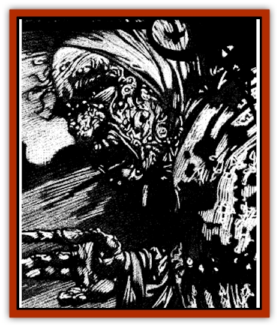

# Hag - Spectral

| Statistic | **Annis** | **Green** | **Sea** |
| --- | --- | --- | --- |
| **Activity Cycle:** | Night | Night | Night |
| **Alignment:** | Chaotic evil | Neutral evil | Chaotic evil |
| **Armor Class:** | 0 | -2 | 2 |
| **Climate/Terrain:** | Any land | Any land or river | Any water |
| **Damage/Attack:** | 1d8+6 | 1d8+6 | 1d8+6 |
| **Diet:** | Nil | Nil | Nil |
| **Frequency:** | Very rare | Very rare | Very rare |
| **Hit Dice:** | 8 | 9 | 6 |
| **Intelligence:** | High (13-14) | High (13-14) | Very (11-12) |
| **Magic Resistance:** | 20% | 35% | 50% |
| **Morale:** | Champion (15-16) | Fanatic (17-18) | Champion (15-16) |
| **Movement:** | 15, Sw 12 | 15, Sw 12 | 15, Sw 15 |
| **No. Appearing:** | 1-3 | 1-3 | 1-3 |
| **No. of Attacks:** | 1 | 1 | 1 |
| **Organization:** | Covey | Covey | Covey |
| **Size:** | L (8' tall) | M (6' tall) | M (6' tall) |
| **Special Attacks:** | See below | See below | See below |
| **Special Defenses:** | See below | See below | See below |
| **THAC0:** | 13 | 11 | 15 |
| **Treasure:** | (D) | (X,F) | (C,Y) |
| **XP Value:** | 7,000 | 7,000 | 5,000 |

A spectral hag is the undead spirit of a [[Hag|hag]] who died during an evil ceremony. Returned to a mockery of the life she once knew, the hag is doomed to inhabit desolate places and seeks only to slaughter all she encounters. Though she retains many of her dread powers and is gifted with those of a [[Spectre|spectre]] as well, she is a miserable creature who hates all life and light.

Spectral hags are translucent reflections of their living forms. All have scraggly hair, withered faces, blackened teeth, and flesh covered with moles and warts. They wear the tottered and filthy garb of peasant women.

As a rule, spectral hags speak common and one or two other languages.

**Combat:** Spectral hags have a Strength score of 18/00, adding +3 to their Attack Rolls and +6 to their Damage Rolls. Their chilling touch does 1d8 points of damage and drains two life energy levels from the victim of the attack. Any being totally drained of life energy by one of these foul hags becomes a full-strength spectre under the control of the crone, In general, any encounter with one of these creatures will also include 3d6 spectres who represent the past enemies of the shrew.

Spectral hags can only be hit by +1 or better weapons and are immune to all *sleep*, *charm*, *hold*, and cold-based spells. Similarly, poisons, disease, and paralyzation cannot harm them.

Being undead, these creatures are subject to the turning ability of priests and paladins. Holy water inflicts 2d4 points of damage per vial splashed upon them and a *raise dead* spell destroys the hag immediately if a saving throw vs. spell is failed and the creature's natural magic resistance is overcome. Daylight makes them powerless by weakening their ties to the Negative Material plane, although it does not actually harm them.

**Habitat/Society:** Although they are usually solitary creatures, there is a chance that any spectral hag who was a member of a covey in life will retain contact with her foul sisters. Indeed, if all were killed while engaged in an evil ceremony, the dark trio might all have attained undead stature and present an even more deadly force for adventurers to deal with. If one member of a covey was killed and later slew her sisters, she is the feaster and the other two are under her control.

**Ecology:** Though partially insubstantial, spectral hags still crave humanoid flesh. The fact that they can neither taste nor consume this vile delicacy causes them no end of suffering.

**Annis**

  The spectral annis is certainly the most terrible of these creatures. In addition to all the powers she had when living, this undead horror has acquired the power to conduct a dark ceremony on the night of the new moon which transforms any single female captive into a living annis under her command. Being utterly evil, these hags use this power to cause as much suffering to the living as they can.

**Green Hag**

  Like annis, green hags who become undead acquire the ability to perform a sinister ceremony by which they create more of their living sisters. In the case of these foul crones, the victim is a young [[Elf|elf]] woman and the ceremony must be held by the light of the full moon.

**Sea Hag**

  As with the other dark sisters, spectral sea hags are able to transform the innocent into wretches like themselves. When a sea hag wishes to employ this power, she seeks out a [[Halfling|halfling]], [[Gnome|gnome]], or [[Dwarf|dwarf]] woman. When the moon slips into an eclipse, the sea hag holds her foul ritual and the helpless captive becomes like her, condemned to an existence of horror and misery.

---
## Discovery & Documentation

**Source Publication:** Ravenloft Appendix III (1991)
**Campaign Setting:** Ravenloft
**Author(s):** Kirk Botulla

### Other Creatures Found in This Source Book
   * [[Akikage|Akikage]]
   * [[Animator_Common|Animator, Common]]
   * [[Animator_Greater|Animator, Greater]]
   * [[Animator_Minor|Animator, Minor]]
   * [[Animator_General_Information|Animator, General Information]]
   * [[Bakhna_Rakhna|Bakhna Rakhna]]
   * [[Baobhan_Sith|Baobhan Sith]]
   * [[Beetle_Scarab|Beetle, Scarab]]
   * [[Boneless|Boneless]]
   * [[Boowray|Boowray]]
   * [[Bruja|Bruja]]
   * [[Carrionette|Carrionette]]
   * [[Carrion_Stalker|Carrion Stalker]]
   * [[Cat_Midnight|Cat, Midnight]]
   * [[Cat_Skeletal|Cat, Skeletal]]
   * [[Cloaker_Resplendent|Cloaker, Resplendent]]
   * [[Cloaker_Shadow|Cloaker, Shadow]]
   * [[Cloaker_Undead|Cloaker, Undead]]
   * [[Corpse_Candle|Corpse Candle]]
   * [[Death's_Head_Tree|Death's Head Tree]]
   * [[Doppelganger_Ravenloft|Doppelganger (Ravenloft)]]
   * [[Familiar_Pseudo-|Familiar, Pseudo-]]
   * [[Familiar_Undead|Familiar, Undead]]
   * [[Feathered_Serpent|Feathered Serpent]]
   * [[Fenhound|Fenhound]]
   * [[Figurine_Ceramic|Figurine, Ceramic]]
   * [[Figurine_Crystal|Figurine, Crystal]]
   * [[Figurine_Ivory|Figurine, Ivory]]
   * [[Figurine_Obsidian|Figurine, Obsidian]]
   * [[Figurine_Porcelain|Figurine, Porcelain]]
   * [[Figurine_General_Information|Figurine, General Information]]
   * [[Fleas_of_Madness|Fleas of Madness]]
   * [[Furies|Furies]]
   * [[Geist|Geist]]
   * [[Ghost_Animal|Ghost, Animal]]
   * [[Golem_Flesh_Ravenloft|Golem, Flesh (Ravenloft)]]
   * [[Golem_Mist_Ravenloft|Golem, Mist (Ravenloft)]]
   * [[Golem_Wax_Ravenloft|Golem, Wax (Ravenloft)]]
   * [[Gremishka|Gremishka]]
   * [[Head_Hunter|Head Hunter]]
   * [[Hearth_Fiend|Hearth Fiend]]
   * [[Hebi-No-Onna|Hebi-No-Onna]]
   * [[Hound_Phantom|Hound, Phantom]]
   * [[Hound_Skeletal|Hound, Skeletal]]
   * [[Imp_Wishing|Imp, Wishing]]
   * [[Ivy_Crawling|Ivy, Crawling]]
   * [[Jack_Frost|Jack Frost]]
   * [[Jolly_Roger|Jolly Roger]]
   * [[Kizoku|Kizoku]]
   * [[Lashweed|Lashweed]]
   * [[Leech_Magical|Leech, Magical]]
   * [[Leech_Psionic|Leech, Psionic]]
   * [[Lich_Defiler|Lich, Defiler]]
   * [[Lich_Drow|Lich, Drow]]
   * [[Lich_Elemental|Lich, Elemental]]
   * [[Lich_Psionic|Lich, Psionic]]
   * [[Living_Tattoo|Living Tattoo]]
   * [[Lycanthrope_Loup-garou|Lycanthrope, Loup-garou]]
   * [[Lycanthrope_Werejackal|Lycanthrope, Werejackal]]
   * [[Lycanthrope_Werejaguar_Ravenloft|Lycanthrope, Werejaguar (Ravenloft)]]
   * [[Lycanthrope_Wereleopard|Lycanthrope, Wereleopard]]
   * [[Lycanthrope_Wereray|Lycanthrope, Wereray]]
   * [[Mist_Ferryman|Mist Ferryman]]
   * [[Moor_Man|Moor Man]]
   * [[Obedient|Obedient]]
   * [[Odem|Odem]]
   * [[Paka|Paka]]
   * [[Plant_Blood_Rose|Plant, Blood Rose]]
   * [[Plant_Fearweed|Plant, Fearweed]]
   * [[Radiant_Spirit|Radiant Spirit]]
   * [[Recluse|Recluse]]
   * [[Remnant_Aquatic|Remnant, Aquatic]]
   * [[Rushlight|Rushlight]]
   * [[Sea_Spawn_Master|Sea Spawn, Master]]
   * [[Sea_Spawn_Minion|Sea Spawn, Minion]]
   * [[Shadow_Asp|Shadow Asp]]
   * [[Shattered_Brethren|Shattered Brethren]]
   * [[Skeleton_Archer|Skeleton, Archer]]
   * [[Skeleton_Insectoid|Skeleton, Insectoid]]
   * [[Skin_Thief|Skin Thief]]
   * [[Spirit_Psionic|Spirit, Psionic]]
   * [[Strahd_Skeleton|Strahd Skeleton]]
   * [[Strahd_Zombie|Strahd Zombie]]
   * [[Unicorn_Shadow|Unicorn, Shadow]]
   * [[Vampire_Drow|Vampire, Drow]]
   * [[Vampire_Nosferatu|Vampire, Nosferatu]]
   * [[Vampire_Oriental|Vampire, Oriental]]
   * [[Virus_General_Information|Virus, General Information]]
   * [[Virus_I|Virus I]]
   * [[Virus_II|Virus II]]
   * [[Virus_III|Virus III]]
   * [[Vorlog|Vorlog]]
   * [[Will_O'Dawn|Will O'Dawn]]
   * [[Will_O'Deep|Will O'Deep]]
   * [[Will_O'Mist|Will O'Mist]]
   * [[Will_O'Sea|Will O'Sea]]
   * [[Zombie_Cannibal|Zombie, Cannibal]]
   * [[Zombie_Desert|Zombie, Desert]]
   * [[Zombie_Wolf|Zombie Wolf]]
   * [[Zombie_Fog|Zombie Fog]]
