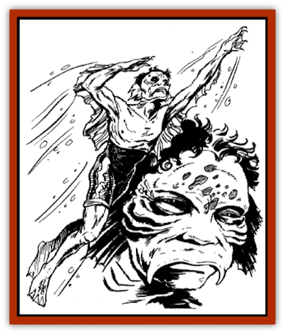

# Hai Nu

| Statistic | **Hai Nu** |
| --- | --- |
| **Activity Cycle:** | Any |
| **Alignment:** | Lawful neutral |
| **Armor Class:** | 7 |
| **Climate/Terrain:** | Subtropical and tropical oceans |
| **Damage/Attack:** | By weapon type |
| **Diet:** | Carnivore |
| **Frequency:** | Rare |
| **Hit Dice:** | 1-4 |
| **Intelligence:** | Average to high (8-14) |
| **Magic Resistance:** | Nil |
| **Morale:** | Steady (11) |
| **Movement:** | 6, Sw15 |
| **No. Appearing:** | 4-40 |
| **No. of Attacks:** | 1 |
| **Organization:** | School |
| **Size:** | M (5' tall) |
| **Special Attacks:** | Nil |
| **Special Defenses:** | Immune to water attacks |
| **THAC0:** | 1 HD: 19 / 2 HD: 19 / 3 HD: 17 / 4 HD: 17 |
| **Treasure:** | U |
| **XP Value:** | 1 HD: 35 / 2 HD: 65 / 3 HD: 120 / 4 HD: 175 |

The hai nu are a race of intelligent aquatic creatures. Though passive by nature, their close relationship with the Lord of the Sea can make them formidable enemies.

Hai nu are humanoids. Their lean, solidly muscled bodies are covered with soft fur in shades of green, blue, and yellow. They have webbed hands and feet, with short, blunt claws extending from their fingers and toes. Bony ridges encircle their sunken black eyes. Rows of thin gill slits extend the lengths of their necks. Hai nu can breathe underwater as well in the air above, but they cannot tolerate long periods on land.

Hai nu can speak the language of their own race and the court language of the Sea Lord.

**Combat:** Peaceful by nature, hai nu prefer solitude. They seldom attack surface vessels. However, they vigorously defend their hunting grounds and homes, fighting to the death if cornered or threatened.

When encountered, a school of hai nu bears the following arms: trident and speargun (treat as spear), 50%; short sword, 20%; trident and dagger, 20%; short sword and net, 10%. The humanoids have excellent relationships with [[Shark|sharks]], porpoises, and [[Whale|whales]]; there is a 40% chance that 3-12 (3d4) of such creatures accompany any school of hai nu. In addition, 2-12 (2d6) tame sharks always defend a hai hu community.

When combat is required, hai nu fight as a team, coordinating their efforts for maximum effect. This typically means surrounding their enemies and attacking from all sides. Their sharks and other aquatic animal allies then attack stray opponents, while distracting and weakening others. Should the opponents surrender, hai nu typically allow them to leave-but not before securing a promise that the opponents will never come back. A hai nu's memory is long. If these opponents violate their promise and return, the hai nu will attack them mercilessly, pursuing them if need be, until the last enemy is destroyed.

Ordinarily, hai nu avoid direct confrontations. They prefer to discourage trespassers and other potential enemies by subtle means. For example, fishermen who ply the waters of the hai nu may find their lines cut and their nets fouled. Sailors may find small leaks in the bottom of their ships. Undersea explorers may find themselves trailed by a school of huge sharks. Should such actions fail, the hai nu may petition the Sea Lord for help, which can result in massive storms or the appearance of a [[Dragon_Oriental_Typhoon_Tun_Mi_Lung|typhoon dragon]] (tan mi lung), which drive away the hai nu's foes.

Hai nu are immune to all forms of water-based attacks, including water-based spells. They suffer twice the normal damage from fire-based attacks, including fire-based spells. From cold-based attacks, they lose 1 additional hit point per die of damage. In addition, they suffer 1 hit point of damage for each round spent totally out of water.

**Habitat/Society:** Hai nu live in the warm, shallow seas of subtropical and tropical regions. They spend their days gathering fish and attending the court of the Sea Lord. They make their simple communities in the hulls of sunken ships and amid strands of thick seaweed on the ocean floor.

A hai nu school typically consists of 4-40 adults. Their society is matriarchal, and 75% of any school is female. Each school is led by a matron with 6 HD and an Armor Class of 5. The school's female adults make decisions by consensus, but the matron reserves the right to veto any judgement with which she disagrees.

A female hai nu spawns about once every two years, laying 2-12 (2d6) eggs at a time, of which only 50% are fertile. Hatchling hai nu are virtually defenseless, as they are less than 6 inches long with 1-2 hit points and an AC of 10. The hatchlings reach maturity in about three years. Until then, they never stray from their mother's side; she will fight to the death to defend them.

Hai nu love bright treasures and have a particular affinity for gems and statuary. Half of all acquired treasure is deposited in crevasses in the ocean floor as a tribute to the Sea Lord. Hai nu gather their treasure from sunken ships, but when a tribute to the Sea Lord is overdue, they have been known to attack passing ships with the express purpose of stealing cargo.

**Ecology:** Hai nu eat nearly all types of sea life, favoring oysters, crabs, fish, and seaweed.

---
## Discovery & Documentation

**Source Publication:** MC6 Kara-Tur Appendix (1990)
**Campaign Setting:** Kara-Tur (Forgotten Realms)
**Author(s):** Rick Swan

### Other Creatures Found in This Source Book
   * [[Bajang|Bajang]]
   * [[Bakemono|Bakemono]]
   * [[Bisan|Bisan]]
   * [[Buso|Buso]]
   * [[Carp_Giant|Carp, Giant]]
   * [[Centipede_Spirit|Centipede, Spirit]]
   * [[Chu-u|Chu-u]]
   * [[Con-tinh|Con-tinh]]
   * [[Doc_cu'o'c|Doc cu'o'c]]
   * [[Duruch'i-lin|Duruch'i-lin]]
   * [[Flame_Spirit|Flame Spirit]]
   * [[Foo_Creature|Foo Creature]]
   * [[Gaki|Gaki]]
   * [[Gargantua|Gargantua]]
   * [[Goblin_Rat|Goblin Rat]]
   * [[Hannya|Hannya]]
   * [[Hengeyokai|Hengeyokai]]
   * [[Hsing-sing|Hsing-sing]]
   * [[Hu_Hsien|Hu Hsien]]
   * [[Human_Kara-Tur|Human (Kara-Tur)]]
   * [[Ikiryo|Ikiryo]]
   * [[Jishin_Mushi|Jishin Mushi]]
   * [[Kala|Kala]]
   * [[Kaluk|Kaluk]]
   * [[Kappa|Kappa]]
   * [[Korobokuru|Korobokuru]]
   * [[Krakentua|Krakentua]]
   * [[Kuei|Kuei]]
   * [[Memedi|Memedi]]
   * [[Men-shen|Men-shen]]
   * [[Nat|Nat]]
   * [[Ningyo|Ningyo]]
   * [[Oni|Oni]]
   * [[P'oh|P'oh]]
   * [[P'oh_Gohei|P'oh, Gohei]]
   * [[Shan_Sao|Shan Sao]]
   * [[Shirokinukatsukami|Shirokinukatsukami]]
   * [[Spirit_Folk|Spirit Folk]]
   * [[Spirit_Nature|Spirit, Nature]]
   * [[Spirit_Stone|Spirit, Stone]]
   * [[Tako|Tako]]
   * [[Tengu|Tengu]]
   * [[Wang-Liang|Wang-Liang]]
   * [[Yuan-ti_Histachii|Yuan-ti, Histachii]]
   * [[Yuki-on-na|Yuki-on-na]]
