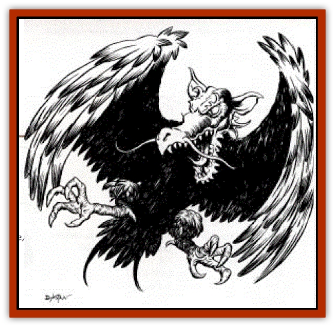

# Hai Riyo

| Statistic | **Hai Riyo** |
| --- | --- |
| **Activity Cycle:** | Day |
| **Alignment:** | Neutral |
| **Armor Class:** | 3 |
| **Climate/Terrain:** | Temperate mountains |
| **Damage/Attack:** | 2-20/2-20 or 3-30 |
| **Diet:** | Carnivore |
| **Frequency:** | Very Rare |
| **Hit Dice:** | 20 |
| **Intelligence:** | Average (8) |
| **Magic Resistance:** | 15% |
| **Morale:** | Fanatic (18) |
| **Movement:** | 3, Fly 30 (E) |
| **No. Appearing:** | 1-2 |
| **No. of Attacks:** | 2 or 1 |
| **Organization:** | Solitary |
| **Size:** | G (80' long + wingspan) |
| **Special Attacks:** | Breath weapon, swallow whole, surprise |
| **Special Defenses:** | Immune to air-based attacks |
| **THAC0:** | 5 |
| **Treasure:** | C |
| **XP Value:** | 23,000 |

The hai riyo is also known as a dragon bird. This inhabitant of Kara-Tur appears to be a massive bird, even larger than a [[Roc|roc]], but with the bewhiskered head of an [[Dragon_Oriental_Lung_General_Information|oriental dragon]]. Its metallic- seeming feathers look almost like scales of copper and are harder than normal feathers, hence its Armor Class of 3. It lives in the eastern lands of Wa and Kozakura.

**Combat:** A hai riyo typically attacks via one of two methods: a pair of claw attacks that cause 2-20 hp damage each, or a bite from the huge dragon jaws that inflict 3-30 hp damage. The hai riyo can also swallow its prey whole on an attack roll of 18+, after which the victim suffers 1d6 hp damage from digestive juices in the creature's stomach. Only creatures of Size L or smaller can be swallowed in this fashion.

Like dragons, the hai riyo has a breath weapon: a coneshaped cloud of scalding steam 20 feet wide at the base and extending to a maximum width of 100 feet at the end, 200 feet away. Anyone caught in this cloud suffers 10d10 hp damage. The hai riyo can breathe this cloud three times per day.

Despite its size, the hai riyo is an excellent flier, if not very maneuverable. Cruising on patrol at heights of up to 5,000 feet, its splendid vision enables it to pick out targets on the ground. Dropping silently down, the dragon bird achieves complete surprise in most cases; there is a +4 penalty to the victim's surprise roll. Because of its a near-elemental affinity for air, the hai riyo is completely immune to all air-based attacks, including *gust of wind* spells and the *divine wind* attack of a [[Dragon_Oriental_Typhoon_Tun_Mi_Lung|tun mi lung]] (typhoon dragon). This is in addition to this magical creature's 15% general magic resistance.

**Habitat/Society:** Dragon birds are solitary creatures, coming together only to guard their nests and young in the breeding season. Because of their heavy food requirements, hai riyos never nest closer to each other than 50 miles, and this only in those regions richest in prey. There is a 20% chance of finding 1d4 eggs in a hai riyo nest, each of which may be sold for 6,000 gp to merchants and other dealers in exotic items. The parents, however, fight to the death to protect their eggs and young, with a +2 bonus to both their morale rating and attack roll. (Hai riyo young take 6 months to reach maturity, the young finally leaving the nest in mid-autumn.) Such treasure as is likely to catch the hai riyo's eye, mainly fine carpeting and similar large items, are scattered haphazardly about the nest.

**Ecology:** A single hai riyo can strip all but the largest territories clean of game, and the creatures attack the largest animals and monsters they can find, including young gargantua. Unfortunately, they attack gatherings of humans or demihumans and herds of livestock with equal rapacity. Indeed, the hai riyo can fairly be said to be the equivalent of an aerial gargantua, both in size and menace. As such, it takes the services of a monster of equivalent size or an entire army of humans or demihumans to fight one. Of course, finding winged monsters of this size, or armies that can fly to get at the thing, is rather difficult.

The feathers of a hai riyo can be used in metallic versions of the *wings* and *broom of flying*, as well as *Quaal's feather tokens*. In addition, because the feathers are so much like metal scales, they can be used for the production of enchanted suits of scale mail. Finally, their blood is a suitable ingredient for ink used in penning scrolls of spells like *gust of wind* and *divine wind*.

---
## Discovery & Documentation

**Source Publication:** Dragon248 (1998)
**Campaign Setting:** Dragon Magazine
**Author(s):** Gregory W. Detwiler, Terry Dykstra

### Other Creatures Found in This Source Book
   * [[Amphitere|Amphitere]]
   * [[Cetus_Lesser|Cetus, Lesser]]
   * [[Dragonet|Dragonet]]
   * [[Dragon_Orange_Sodium|Dragon, Orange (Sodium)]]
   * [[Dragon_Purple_Energy|Dragon, Purple (Energy)]]
   * [[Dragon_Yellow_Salt|Dragon, Yellow (Salt)]]
   * [[Gargouille|Gargouille]]
   * [[Peluda|Peluda]]
   * [[Sirrush|Sirrush]]
   * [[Vore_Lekiniskiy_Master_Fire_Worm|Vore Lekiniskiy, Master Fire Worm]]
