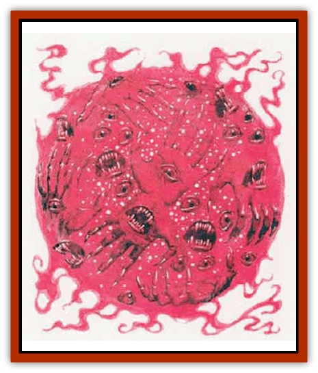

# Hakeashar

| Statistic | **Hakeashar** |
| --- | --- |
| **Activity Cycle:** | Any |
| **Alignment:** | Chaotic neutral |
| **Armor Class:** | 10 |
| **Climate/Terrain:** | Alternate Prime Material Plane |
| **Damage/Attack:** | Nil |
| **Diet:** | Magic |
| **Frequency:** | Very Rare |
| **Hit Dice:** | 9 |
| **Intelligence:** | Highly (13-14) |
| **Magic Resistance:** | See below |
| **Morale:** | Elite (16) |
| **Movement:** | 3 |
| **No. Appearing:** | 1 |
| **No. of Attacks:** | 0 |
| **Organization:** | Solitary |
| **Size:** | L (12' diameter sphere) |
| **Special Attacks:** | Absorb magic |
| **Special Defenses:** | See below |
| **THAC0:** | 11 |
| **Treasure:** | Nil |
| **XP Value:** | 2,000 |

A hakeashar, also known as an eater-of-magic, appears as a bright red sphere. Their bodies pulse and glow as they drift about. They can seep through finger-width cracks with great ease.

Hakeashar are relatives of the [[Nishruu|nishruu]]. These weird, thankfully rare creatures are believed to come from an alternate Prime Material plane. Within the red mist comprising the body of a hakeashar are hundreds of grasping hands, probing eyes, and gaping hungry mouths.

**Combat:** Hakeashar have no attacks. Fire and physical attacks affect them normally; those who are wrapped in a hakeashar are automatically hit by these attack forms.

Hakeashar can sense magic within a 600-foot radius; they always move toward the greatest concentration of magic within that area. Hakeashar move fearlessly and relentlessly toward sources of magic, taking full damage from physical attacks. Mind control spells and illusions have no effect on them.

Spells cast at a hakeashar are absorbed by it, having no effect except to give the creature hit points of life energy equal to the damage the spell normally does. A non-damaging spell gives a hakeashar extra hit points equal to the spells level.

Chargeable magical items are drained of 1d4 charges upon contact with a hakeashar. If contact is continued, the 1d4 drain occurs at the end of every second round.

All magical items and artifacts are nonoperational while in contact with a hakeashar. Artifacts do not function for one round after such contact ceases; magical items have their powers negated for 1d4 rounds after contact ends. If a potion or scroll is used while in contact with a hakeashar, it does not take effect until 1d4 rounds after the contact is broken.

Spellcasters of all classes who are enveloped by a hakeashar lose one memorized spell, determined randomly, at first contact, and one per round after.

Each time a loss occurs, the spellcaster must roll a successful saving throw vs. breath weapon or become *feebleminded*.

When a hakeashar is slain, its body dissipates, losing luminosity and hue, seeming to sink to the ground. Any magical item within its body area when it is slain, or any magical weapon slaying it, even if no longer in contact with the body, receives a magical bonus of 1d6 additional charges, or a second use in the case of a one-shot item, such as a scroll or an arrow. Potions, memorized spells, artifacts, and items that do not have charges are not augmented.

**Habitat/Society:** Hakeashar are not native to this Prime Material plane.

They are solitary creatures.

A hakeashar has the ability to give 20% of the number of spells or charges absorbed to a person. This is done very unwillingly, usually in exchange for being brought to this Prime Material plane.

**Ecology:** Hakeashar feed on magic. Their life spans are measured in centuries.

---
## Discovery & Documentation

**Source Publication:** City of Splendors (1994)
**Campaign Setting:** Forgotten Realms
**Author(s):** Ed Greenwood, Elain Cunningham

### Other Creatures Found in This Source Book
   * [[Curst|Curst]]
   * [[Doppelganger_Greater|Doppelganger, Greater]]
   * [[Duhlarkin|Duhlarkin]]
   * [[Gulguthhydra|Gulguthhydra]]
   * [[Leucrotta_Greater|Leucrotta, Greater]]
   * [[Lycanthrope_Wereshark|Lycanthrope, Wereshark]]
   * [[Nyth|Nyth]]
   * [[Ooze_Slime_Jelly_Ghaunadan|Ooze/Slime/Jelly, Ghaunadan]]
   * [[Palimpsest|Palimpsest]]
   * [[Peltast|Peltast]]
   * [[Raggamoffyn|Raggamoffyn]]
   * [[Shadowrath|Shadowrath]]
   * [[Snake_Sewerm|Snake, Sewerm]]
   * [[Watchspider|Watchspider]]
