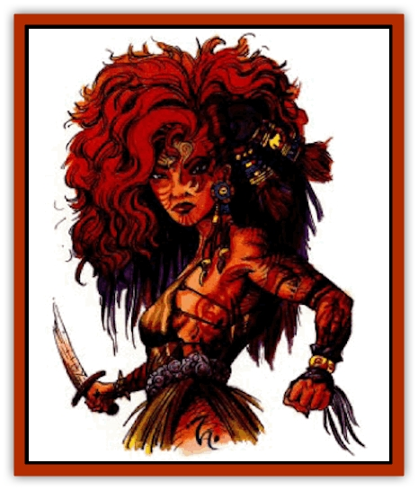

# Halfling - Athas

| Statistic | **Halfling (Athas)** |
| --- | --- |
| **Activity Cycle:** | Any |
| **Alignment:** | Lawful neutral |
| **Armor Class:** | 7 (10) |
| **Climate/Terrain:** | Forest Ridge |
| **Damage/Attack:** | 1d3 or by weapon |
| **Diet:** | Carnivore |
| **Frequency:** | Common |
| **Hit Dice:** | 1 |
| **Intelligence:** | Very (11-12) |
| **Magic Resistance:** | Nil |
| **Morale:** | Steady (11-12) |
| **Movement:** | 6 |
| **No. Appearing:** | 4-32 (4d8) |
| **No. of Attacks:** | 1 |
| **Organization:** | Tribe |
| **Size:** | S (3-4' tall) |
| **Special Attacks:** | Nil |
| **Special Defenses:** | Special resistances |
| **THAC0:** | 19 |
| **Treasure:** | Varies |
| **XP Value:** | Normal: 65 / Hunter-chief: 120 / Forest-chief: 270 / Tribe-chief: 2,000 |

Throughout the Forest Ridge reside the multitude of [[Halfling|halfling]] tribes. Though small, halflings are numerous enough to support their claim to this territory.

Halflings stand an average of 3½' feet tall, rarely straying from their 50 to 60 pounds. Proportioned like humans, they are quick and muscular, possessing a strength that belies their size. The hair, eyes, and skin color of halflings tends to be as varied as their human counterparts. Regardless of a halfling's stage in maturity, their faces look like those of human children.

The halfling language is comprised of a collection of mimicked animal sounds such as whistles, cawing, and chatter. Halflings can also speak the common tongue.

**Combat:** Strict carnivores, halflings tend to view all animals, including humans and their ilk, as lunch. Combat honor is a valueless concept to halflings. In battle, halflings resort to what others might call dirty tricks. Having strong ties to the land, halflings are likely to create their weapons from organic sources. A popular tenet among halfling warriors is that a weapon built from the same material as an opponent offers special advantages to the wielder. For example, a halfling [[Jalath'gak|jalath'gak]] slayer might construct a dagger from one of the bloodwing's talons.

Halfling weapons inflict 1-4 (1d4) or 1-6 (1d6) points of damage. All but the [[Halfling_Renegade|renegade halflings]] prefer small daggers, slings, and spears over forged swords. Halflings receive a +1 attack bonus with any thrown or sling-type weapon. They often use live [[Beetle_Agony|agony beetles]] as sling bullets. Halflings occasionally coat their weapons with a paralytic poison.

Halflings receive a +4 to all saving throws against magical attacks, poisons, and diseases. Consult the *Dark Sun Rules Book* to assign individual halfling bonuses based on their Constitution.

When entire tribes (from 20-200) are encountered, one halfling in ten is a hunter-chief, possessing 3 HD, THAC0 17, and minimal psionic powers (as per a 1st level psionicist). One in 50 is a forest-chief, having 5 HD, THAC0 15, and psionic or clerical abilities (50% chance of either) at two levels below his own HD. Every tribe has a 10 HD tribe-chief with THAC0 11, 5th-level clerical abilities, 1-3 magical items, and the possibility of psionics (30%) as a 6th-level psionicist.

**Habitat/Society:** Most halflings, except the chaotic and more brutal renegades near the Ringing Mountains, share a common outlook on life. This universal perception results in considerable racial unity despite geographical and political separations. It is rare that one halfing will shed the blood of another, even in extreme ideological confrontations.

Other races find halfing culture a difficult concept to understand. Ages of social and spiritual change from a plethora of inspirations have led to only one consistent conclusion - halflings value most the abilities of the inner self as it harmonizes with the environment and the halfling race. More common measurements, such as conquest and plundering. have no place with the halfling.

**Ecology:** Halflings are extremely conscious surrounding environment. They see the ruined land of the scapes and are sickened. They desperately try to avoid having similar circumstances devastate their homelands. This does not mean the countryside is unalterable, but simply that care must be taken to understand and respect what nature means to the life on Athas.

The halfling's meat-only diet means that halflings see all living creatures more as food than as equals. This perception leads them to expect other races to feel similarly. As a result, at no time is a halfling likely to trust any other member of any other species.

Halflings tend to live as long as 140 years.

---
## Discovery & Documentation

**Source Publication:** Dark Sun Appendix II - Terrors Beyond Tyr (1991)
**Campaign Setting:** Dark Sun
**Author(s):** Jim Atkiss, Steve Brown, Timothy B. Brown, Andrew P. Morris, Bruce Nesmith, Wes Nicholson, Bill Slavicsek

### Other Creatures Found in This Source Book
   * [[Aarakocra_Athas|Aarakocra (Athas)]]
   * [[Animal_Domestic_Athas_II|Animal, Domestic (Athas) II]]
   * [[Aviarag|Aviarag]]
   * [[Baazrag|Baazrag]]
   * [[Baazrag_Boneclaw|Baazrag, Boneclaw]]
   * [[Bloodgrass|Bloodgrass]]
   * [[Cactus_Hunting|Cactus, Hunting]]
   * [[Cactus_Rock|Cactus, Rock]]
   * [[Cilops|Cilops]]
   * [[Crodlu|Crodlu]]
   * [[Dagorran|Dagorran]]
   * [[Dhaot|Dhaot]]
   * [[Drake_Lesser_Athas_General_Information|Drake, Lesser (Athas), General Information]]
   * [[Drake_Lesser_Athas_Magma|Drake, Lesser (Athas), Magma]]
   * [[Drake_Lesser_Athas_Rain|Drake, Lesser (Athas), Rain]]
   * [[Drake_Lesser_Athas_Silt|Drake, Lesser (Athas), Silt]]
   * [[Drake_Lesser_Athas_Sun|Drake, Lesser (Athas), Sun]]
   * [[Dray|Dray]]
   * [[Drik|Drik]]
   * [[Dune_Reaper|Dune Reaper]]
   * [[Dwarf_Athas|Dwarf (Athas)]]
   * [[Elemental_Beast_Athas_Air|Elemental Beast (Athas), Air]]
   * [[Elemental_Beast_Athas_Earth|Elemental Beast (Athas), Earth]]
   * [[Elemental_Beast_Athas_Fire|Elemental Beast (Athas), Fire]]
   * [[Elemental_Beast_Athas_Water|Elemental Beast (Athas), Water]]
   * [[Elf_Athas|Elf (Athas)]]
   * [[Fael|Fael]]
   * [[Feylaar|Feylaar]]
   * [[Fordorran|Fordorran]]
   * [[Giant_Half-giant|Giant, Half-giant]]
   * [[Giant_Shadow|Giant, Shadow]]
   * [[Golem_Athas_Magma|Golem (Athas), Magma]]
   * [[Golem_Athas_Salt|Golem (Athas), Salt]]
   * [[Golem_Athas_General_Information|Golem (Athas), General Information]]
   * [[Gorak|Gorak]]
   * [[Human_Athas|Human (Athas)]]
   * [[Jhakar|Jhakar]]
   * [[Kaisharga|Kaisharga]]
   * [[Kes'trekel|Kes'trekel]]
   * [[Klar|Klar]]
   * [[Krag|Krag]]
   * [[Kragling|Kragling]]
   * [[Lirr|Lirr]]
   * [[Mastyrial|Mastyrial]]
   * [[Meorty|Meorty]]
   * [[Mul|Mul]]
   * [[Nikaal|Nikaal]]
   * [[Paraelemental_Beast_General_Information|Paraelemental Beast, General Information]]
   * [[Paraelemental_Beast_Magma|Paraelemental Beast, Magma]]
   * [[Paraelemental_Beast_Rain|Paraelemental Beast, Rain]]
   * [[Paraelemental_Beast_Silt|Paraelemental Beast, Silt]]
   * [[Paraelemental_Beast_Sun|Paraelemental Beast, Sun]]
   * [[Pakubrazi|Pakubrazi]]
   * [[Psionocus|Psionocus]]
   * [[Psurlon|Psurlon]]
   * [[Raaig|Raaig]]
   * [[Retriever_Obsidian|Retriever, Obsidian]]
   * [[Ruktoi|Ruktoi]]
   * [[Ruvoka_Athas|Ruvoka (Athas)]]
   * [[Sand_Howler|Sand Howler]]
   * [[Scorpion_Athas|Scorpion (Athas)]]
   * [[Seed_Brain|Seed, Brain]]
   * [[Silt_Horror_Black|Silt Horror, Black]]
   * [[Silt_Horror_Magma|Silt Horror, Magma]]
   * [[Silt_Horror_Red|Silt Horror, Red]]
   * [[Silt_Spawn|Silt Spawn]]
   * [[Slig|Slig]]
   * [[Spider_Athas|Spider (Athas)]]
   * [[Spinewyrm|Spinewyrm]]
   * [[Ssurran|Ssurran]]
   * [[Stalking_Horror|Stalking Horror]]
   * [[Tarek|Tarek]]
   * [[Tari|Tari]]
   * [[Thri-kreen|Thri-kreen]]
   * [[T'liz|T'liz]]
   * [[Tohr-kreen_II|Tohr-kreen II]]
   * [[Tohr-kreen_III|Tohr-kreen III]]
   * [[Trin|Trin]]
   * [[Tul'k|Tul'k]]
   * [[Undead_Athas_General_Information|Undead (Athas), General Information]]
   * [[Wraith_Athas|Wraith (Athas)]]
   * [[Xerichou|Xerichou]]
   * [[Zombie_Thinking|Zombie, Thinking]]
