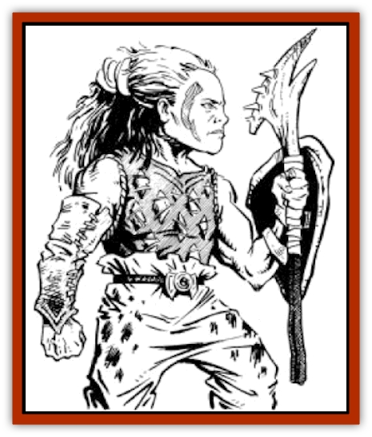

# Halfling - Renegade

| Statistic | **Halfling, Renegade** |
| --- | --- |
| **Activity Cycle:** | Any |
| **Alignment:** | Chaotic Neutral |
| **Armor Class:** | 8 |
| **Climate/Terrain:** | Temperate jungle/Forest ridge |
| **Damage/Attack:** | 1-6 (weapon) |
| **Diet:** | Omnivore |
| **Frequency:** | Rare |
| **Hit Dice:** | 5 |
| **Intelligence:** | Highly (13-14) |
| **Magic Resistance:** | Nil |
| **Morale:** | Average (8-10) |
| **Movement:** | 9 |
| **No. Appearing:** | 2-12 |
| **No. of Attacks:** | 1 |
| **Organization:** | Tribe |
| **Size:** | Small (3' tall) |
| **Special Attacks:** | Psionics |
| **Special Defenses:** | Nil |
| **THAC0:** | 15 |
| **Treasure:** | P (D) |
| **XP Value:** | Non-psionicist: 270 / Psionicist: 420 |

**Psionics Summary**

| Level | Dis/Sci/Dev | Attack/Defense | Score | PSPs |
| --- | --- | --- | --- | --- |
| 6 | 3/4/12 | MT,EW,II/M-,MB,TW | 15 | 130 |

**Psychokinesis -** *Sciences:* detonate, telekinesis; *Devotions:* control flames, levitation, molecular agitation, animate shadow.

**Psychometabolism -** *Science:* shadow form; *Devotions:* flesh armor, body weaponry, heightened senses, double pain.

**Telepathy -** *Sciences:* tower of iron will, mind link; *Devotions:* mind thrust, ego whip, id insinuation, mind blank, mental barrier, contact.

While most [[Halfling_Athas|halflings]] found on Athas belong to the more or less civilized clans located in the Forest Ridge near the Ringing Mountains, there exist tribes of so-called "renegade" [[Halfling|halflings]].

Halflings are very short humanoids, standing about 3 to 4 feet tall. Weighing anywhere from 50 to 60 pounds, halflings live to be as much as 120 years old. While the bodies of halflings are very similar to those of humans (except considerably shorter), they have faces which resemble wise and beautiful children.

The language of halflings is a collection of hoots, howls, shrieks, and whistles that sounds more like the sounds of the forest than an intelligent language.

**Combat:** When tribes of renegade halflings are encountered, they will often be in groups ranging in size from 10 to 60 members. Most of these halflings carry short swords, daggers, or other small-to medium-sized weapons. These weapons are most often made of the bones of animals, but even humanoid bones are used as weapons occasionally. Renegade halflings usually wear leather armor and carry small shields as well. Being naturally gifted in the use of psionics, most of the halflings encountered (75%) will be the equivalent of at least 5th- or 6th-level psionicists. As such, many renegade halflings encountered will use their psionic powers more often than melee or missile weapons. Their natural talents in psionics grant them a +1 bonus when using psionic defense modes against non-halfling psionic users. Also, many renegade halflings encountered will be equipped with esperweed roots, allowing them to boost their already powerful psionic abilities to even higher levels.

**Habitat/Society:** The tribes of renegade halflings usually make their home in remote areas of the forests and jungles near the Ringing Mountains. Renegade halflings eat both plants and animals, but much prefer meat to vegetation.

Though renegade halflings share many characteristics with their more normal Athasian cousins, they are far more brutal. Where as most halflings of Athas share a common sense of racial unity, the tribes of renegade halflings do not. The only loyalty that renegade halflings will ever display is towards their own tribe and its members. Hence, even the presence of a fellow halfling will not deter a renegade tribe from hunting an adventuring party.

A typical tribe will contain from two to twelve families, with each family having from three to five members. The family units of a renegade halfling tribe live in large huts made from small trees and bamboo shoots, covered with ferns and fronds from the tropical plants which grow in the jungles near the Forest Ridge. All the members of a tribe must work towards the goals of the tribe, which are usually as simple as survival, but can also include raids on nearby villages and other halfling tribes. Those members who act against the tribe's interests are outcast; some are even sent into the jungle with only their own survival skills to support them.

Some renegade halfling tribes have developed a method of growing [[Esperweed|esperweed]] plants in large gardens, supplying an usually large amount of this rare plant for the tribe. This gives these tribes valuable trading commodities and also provides them with a powerful tool for dealing with encounters with enemies.

**Ecology:** All Athasian halflings, especially renegades, consider all other animal life a source of food. Most halfling tribes also assume that all other races view them the same way. Because of this attitude, any relationship with renegade halflings should be approached with a great deal of caution.

---
## Discovery & Documentation

**Source Publication:** MC12 Dark Sun Appendix I - Terrors of the Desert (1991)
**Campaign Setting:** Dark Sun
**Author(s):** Tom Prusa, Louis J. Prosperi, Walter M. Baas

### Other Creatures Found in This Source Book
   * [[Animal_Herd_Athas|Animal, Herd (Athas)]]
   * [[Animal_Household_Athas|Animal, Household (Athas)]]
   * [[Antloid_Desert|Antloid, Desert]]
   * [[Banshee_Dwarf|Banshee, Dwarf]]
   * [[Beetle_Agony|Beetle, Agony]]
   * [[Bog_Wader|Bog Wader]]
   * [[Brambleweed|Brambleweed]]
   * [[B'rohg|B'rohg]]
   * [[Burnflower|Burnflower]]
   * [[Cat_Psionic|Cat, Psionic]]
   * [[Cha'thrang|Cha'thrang]]
   * [[Cistern_Fiend|Cistern Fiend]]
   * [[Clam_Giant|Clam, Giant]]
   * [[Cloud_Ray|Cloud Ray]]
   * [[Drake_Athas_Air|Drake (Athas), Air]]
   * [[Drake_Athas_Earth|Drake (Athas), Earth]]
   * [[Drake_Athas_Fire|Drake (Athas), Fire]]
   * [[Drake_Athas_Water|Drake (Athas), Water]]
   * [[Dune_Runner|Dune Runner]]
   * [[Dune_Trapper|Dune Trapper]]
   * [[Elemental_Athas_Greater_Air|Elemental (Athas), Greater, Air]]
   * [[Elemental_Athas_Greater_Earth|Elemental (Athas), Greater, Earth]]
   * [[Elemental_Athas_Greater_Fire|Elemental (Athas), Greater, Fire]]
   * [[Elemental_Athas_Greater_Water|Elemental (Athas), Greater, Water]]
   * [[Elemental_Athas_Lesser_Air_Earth|Elemental (Athas), Lesser, Air/Earth]]
   * [[Elemental_Athas_Lesser_Fire_Water|Elemental (Athas), Lesser, Fire/Water]]
   * [[Elemental_Athas_General_Information|Elemental (Athas), General Information]]
   * [[Erdland|Erdland]]
   * [[Esperweed|Esperweed]]
   * [[Flailer|Flailer]]
   * [[Floater|Floater]]
   * [[Giant_Athas|Giant (Athas)]]
   * [[Golem_Athas_I|Golem (Athas) I]]
   * [[Golem_Athas_II|Golem (Athas) II]]
   * [[Golem_Athas_III|Golem (Athas) III]]
   * [[Golem_Athas_General_Information|Golem (Athas), General Information]]
   * [[Hej-kin|Hej-kin]]
   * [[Id_Fiend|Id Fiend]]
   * [[Insect_Swarm_Athas|Insect Swarm (Athas)]]
   * [[Kank_Wild|Kank, Wild]]
   * [[Kirre|Kirre]]
   * [[Megapede|Megapede]]
   * [[Mul_Wild|Mul, Wild]]
   * [[Nightmare_Beast|Nightmare Beast]]
   * [[Plant_Carnivorous_Athas|Plant, Carnivorous (Athas)]]
   * [[Pterran|Pterran]]
   * [[Pterrax|Pterrax]]
   * [[Pulp_Bee|Pulp Bee]]
   * [[Pyreen|Pyreen]]
   * [[Rasclinn|Rasclinn]]
   * [[Razorwing|Razorwing]]
   * [[Roc_Athas|Roc (Athas)]]
   * [[Sand_Bride|Sand Bride]]
   * [[Sand_Cactus|Sand Cactus]]
   * [[Sand_Vortex|Sand Vortex]]
   * [[Scrab|Scrab]]
   * [[Silt_Horror|Silt Horror]]
   * [[Silt_Runner|Silt Runner]]
   * [[Sink_Worm|Sink Worm]]
   * [[Sloth_Athas|Sloth (Athas)]]
   * [[So-ut|So-ut]]
   * [[Spider_Cactus|Spider Cactus]]
   * [[Spider_Crystal|Spider, Crystal]]
   * [[Spirit_of_the_Land|Spirit of the Land]]
   * [[T'Chowb|T'Chowb]]
   * [[Thrax|Thrax]]
   * [[Tohr-kreen_I|Tohr-kreen I]]
   * [[Villichi|Villichi]]
   * [[Zhackal|Zhackal]]
   * [[Zombie_Plant|Zombie Plant]]
