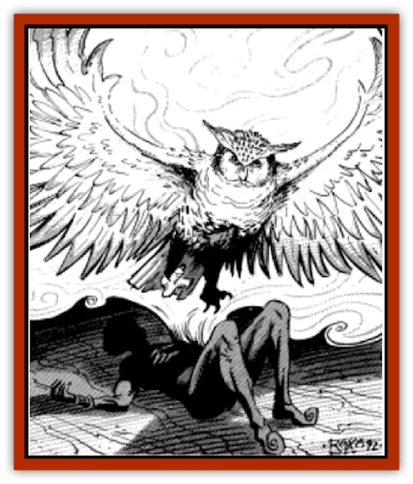

# Hama

| Statistic | **Hama** |
| --- | --- |
| **Activity Cycle:** | Day |
| **Alignment:** | Any |
| **Armor Class:** | 2 (7) |
| **Climate/Terrain:** | Any |
| **Damage/Attack:** | 1-3/1-3 |
| **Diet:** | None |
| **Frequency:** | Rare |
| **Hit Dice:** | 1 |
| **Intelligence:** | Low to Very (5-12) |
| **Magic Resistance:** | Nil |
| **Morale:** | Average (8-10) |
| **Movement:** | 1, Fl 30 |
| **No. Appearing:** | 1 |
| **No. of Attacks:** | 2 |
| **Organization:** | Solitary |
| **Size:** | S |
| **Special Attacks:** | Fear |
| **Special Defenses:** | Immaterial |
| **THAC0:** | 20 |
| **Treasure:** | Nil |
| **XP Value:** | 120 |

Hama are spirit [[Bird|birds]] formed when the soul rises from the body in bird-form upon a person's death. This spirit bird normally then leaves the Prime Material Plane and makes its journey to the afterlife. Those who die by violence or with some important duty unfulfilled leave their hama tethered to the Prime Material Plane, seeking to right things before they leave.

Hama are unable to communicate with speech, but their songs and croakings sometimes offer clues to what they are seeking to accomplish before they pass on. A *speak with animals* spell is not effective in attempting to speak with a hama, though *tongues* is. A hama can understand all forms of speech.

The two most common forms of the hama are the [[Owl|owl]] and the [[Eagle|eagle]], but other bird forms are also possible. Sparrow, nightingale, parrot, falcon, peacock, and even [[Vulture|vulture]] hama have been seen, and the form of a hama invariably reflects the alignment and personality of the soul that formed it. By day, hama appear to be ordinary members of their various species, though they may exhibit behavior unusual for their respective species. By night, hama are almost always semi-transparent, and their faint ghostly glow distinguishes them from other birds. Their eyes are full of bright fire.

**Combat:** Hama attack in a flurry of wispy claws, beaks, and wings, for a total of two effective attacks per round. The spirit forms of hama are difficult to hurt because they are only partially tethered to the Prime Material Plane, thus giving them AC 2. On the Ethereal plane, however, hama are AC 7.

In some ways, hama are similar to [[Ghost|ghosts]]. Seeing one requires a morale check for henchmen and hirelings, and those who fail flee the area as if affected by a *fear* spell. By concentrating, a hama may make its form immaterial, allowing it to pass through walls and other obstacles. It may do this three times per day, with each instance lasting as long as the hama can maintain its concentration. It may fly while concentrating, but any successful attack on the spirit bird disrupts its concentration and makes achieving its immaterial form impossible that round.

Hama rarely leave the area in which they are encountered. And, for purposes of turning by clerics, hama are considered lingering spirits rather than undead (they have no connection to the Negative Material Plane). Thus, they cannot be turned.

**Habitat/Society:** Hama are always solitary and always driven to accomplish some task, usually simple vengeance. There have been cases of hama who await the arrival of a beloved, the return of something that they have lost, or the proper disposal of an estate or inheritance; some simply watch over and protect children they could not bear to leave. The tasks that hold a spirit bird to the world are broad, but in most cases they are centered around a specific person or location.

Helping a good hama accomplish its task may result in the granting of a gift to the helpful party. A hama is always recognized as a spirit by hakima and mystics, and a hama may make it plain to such priests that it owes a debt of gratitude to someone. The help that the priests may render on the hama's behalf varies from good advice to restorative spells. In some cases, a hama may even delay its departure to the outer planes by several days to repay its obligation. In this case the hama may carry messages, act as a scout or lookout, or perform stunts to impress audiences on its benefactor's behalf.

**Ecology:** After their task is accomplished, hama depart for their final reward on the outer planes. Until then they only react to creatures related to their final tasks or creatures able to assist them with their goals.

---
## Discovery & Documentation

**Source Publication:** MC13 Al-Qadim Appendix (1992)
**Campaign Setting:** Al-Qadim (Forgotten Realms)
**Author(s):** C. Terry Phillips

### Other Creatures Found in This Source Book
   * [[Ammut|Ammut]]
   * [[Ashira|Ashira]]
   * [[Asuras|Asuras]]
   * [[Black_Cloud_of_Vengeance|Black Cloud of Vengeance]]
   * [[Buraq|Buraq]]
   * [[Camel|Camel]]
   * [[Camel_of_the_Pearl|Camel of the Pearl]]
   * [[Centaur_Desert|Centaur, Desert]]
   * [[Copper_Automaton|Copper Automaton]]
   * [[Debbi|Debbi]]
   * [[Elephant_Bird|Elephant Bird]]
   * [[Gen|Gen]]
   * [[Genie_Noble_Dao|Genie, Noble Dao]]
   * [[Genie_Noble_Djinni|Genie, Noble Djinni]]
   * [[Genie_Noble_Efreeti|Genie, Noble Efreeti]]
   * [[Genie_Noble_Marid|Genie, Noble Marid]]
   * [[Genie_Tasked_Architect_Builder|Genie, Tasked, Architect/Builder]]
   * [[Genie_Tasked_Artist|Genie, Tasked, Artist]]
   * [[Genie_Tasked_Guardian|Genie, Tasked, Guardian]]
   * [[Genie_Tasked_Herdsman|Genie, Tasked, Herdsman]]
   * [[Genie_Tasked_Slayer|Genie, Tasked, Slayer]]
   * [[Genie_Tasked_Warmonger|Genie, Tasked, Warmonger]]
   * [[Genie_Tasked_Winemaker|Genie, Tasked, Winemaker]]
   * [[Ghost_Mount|Ghost Mount]]
   * [[Ghul|Ghul]]
   * [[Giant_Desert|Giant, Desert]]
   * [[Giant_Jungle|Giant, Jungle]]
   * [[Giant_Reef|Giant, Reef]]
   * [[Giant_Zakhara_General_Information|Giant (Zakhara), General Information]]
   * [[Heway|Heway]]
   * [[Living_Idol|Living Idol]]
   * [[Lycanthrope_Werehyena|Lycanthrope, Werehyena]]
   * [[Lycanthrope_Werelion|Lycanthrope, Werelion]]
   * [[Markeen|Markeen]]
   * [[Maskhi|Maskhi]]
   * [[Mason_Wasp_Giant|Mason Wasp, Giant]]
   * [[Nasnas|Nasnas]]
   * [[Pahari|Pahari]]
   * [[Rom|Rom]]
   * [[Sabu_Lord|Sabu Lord]]
   * [[Sakina|Sakina]]
   * [[Serpent_Lord|Serpent Lord]]
   * [[Serpent_Winged|Serpent, Winged]]
   * [[Silat|Silat]]
   * [[Simurgh|Simurgh]]
   * [[Stone_Maiden|Stone Maiden]]
   * [[Vishap|Vishap]]
   * [[Zaratan|Zaratan]]
   * [[Zin|Zin]]
