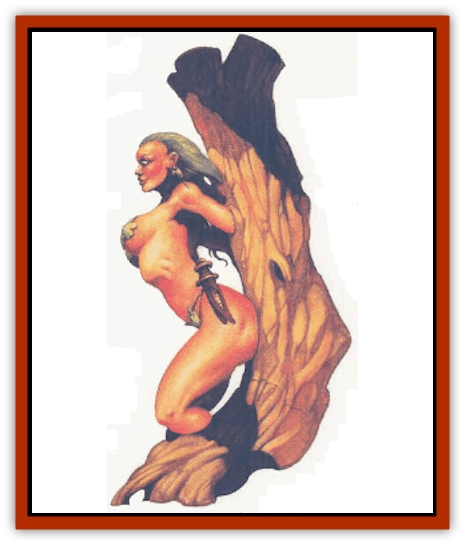

# Hamadryad

| Statistic | **Hamadryad** |
| --- | --- |
| **Activity Cycle:** | Any |
| **Alignment:** | Neutral |
| **Armor Class:** | 7 |
| **Climate/Terrain:** | Temperate, subtropical/forest |
| **Damage/Attack:** | 1-3 (pummel) |
| **Diet:** | Water and sunlight |
| **Frequency:** | Very rare |
| **Hit Dice:** | 4 |
| **Intelligence:** | High (13-14) |
| **Magic Resistance:** | 75% |
| **Morale:** | Steady (11-12) |
| **Movement:** | 15 |
| **No. Appearing:** | 1-2 |
| **No. of Attacks:** | 1 |
| **Organization:** | Solitary |
| **Size:** | M (5-5½' tall) |
| **Special Attacks:** | See below |
| **Special Defenses:** | See below |
| **THAC0:** | 17 |
| **Treasure:** | Nil |
| **XP Value:** | 650 |

These woodland spirits appear to be beautiful [[Elf|elven]] or human females, except that they have deep, sparkling, green eyes and long green hair. They are peaceful, quick-witted, and polite, but shy. They rarely speak to humans and their ilk. Like their cousins the [[Dryad|dryads]], each hamadryad is linked to an individual oak tree; however, a hamadryad can leave the vicinity of her tree.

**Combat:** Hamadryads often carry knives, daggers, or similar weapons, but they shun physical combat and prefer to use their magical abilities instead. Hamadryads can cast *hold plant* once a day and *charm person* three times a day (saving throw has a -3 penalty) as casters at the 11th level of ability. Hamadryads can use, at will, *speak with plants*, *animal friendship*, *entangle*, *pass without trace*, *dimension door* (from tree to tree only, maximum range 660 yards), and *quench fire* (as the reverse of the 7th-level priest spell *fire storm*) as casters of the 11th level of ability.

Hamadryads always successfully *detect snares and pits* and cannot be *entangled*. A hamadryad can automatically discern the nature of magically-created trees or vegetation such as those generated by *massmorph*, *tree*, or *hallucinatory forest* spells. They recognize [[Treant|treants]] and treant-controlled trees on sight. They can enter any living tree using the 6th-level priest spell *transport via plants*, and remain there as long as they wish. If a hamadryad enters a tree containing a spell caster that is using a *plant door*, *pass plant*, or *transport via plants* spell, there always is room in the tree for the hamadryad and she can attempt to *charm* the spell caster. The saving throw vs. this charm has a -6 penalty. These special *charms* can be used at will and in addition to the hamadryad's three *charm person* spells each day. The special *charm* even works on druids of 7th level or higher.

Hamadryads are immune to the effects of the *call woodland beings* spell, but are aware of the spell if they are in its area of effect. Usually (90%) they travel to the caster's location to observe. If the caster's goals are not contrary to the hamadryad's, she serves of her own free will. Hamadryads who are expecting trouble usually gather a cadre of *charmed* people and friendly animals. While these allies fight, the hamadryad *dimension doors* from tree to tree, using *entangle* and *charm* to disorganize and demoralize foes.

**Habitat/Society:** Hamadryads are found only in ancient, vast forests far from civilization. They dislike non-forest environments and almost never willingly leave the woodlands.

Hamadryads speak the languages of dryads, elves, [[Sprite|pixies]], [[Sprite|sprites]], and sometimes (33%) Common, which they learn from *charmed* victims. A hamadryad also is 90% likely to speak the languages of [[Centaur|centaurs]], [[Satyr|fauns]], treants, and the druids.

Hamadryads seldom argue with other woodland creatures. They are fond of dryads and treants and always are on good terms with them. Frequently they use their *quench fire* ability to aid these creatures. They give all treasure they find to their dryad friends for safe keeping. They are uncomfortable leaving treasure in their unguarded trees as they do not wish to encourage greedy beings to chop down large trees in search of wealth. On the other hand, hamadryads know most treasures are eventually found no matter how well hidden and that an item in a dryad's possession cannot be used to hurt the forest.

Like dryads, hamadryads are attracted to comely males. However, they are not possessive of males who succumb to their *charm* abilities. They take charmed victims deep into the forest where the victim is compelled to perform some service, usually protecting the trees from woodcutters and the like. When the service is complete, the hamadryad releases the victim near a dryad's tree, where the victim might be *charmed* again. If not, the victim is free to leave the forest.

**Ecology:** Hamadryads do not eat. They get all the nourishment they need from sunlight, through the chlorophyll in their hair, and from the water they drink. They prefer fresh water from springs or wells, but can survive on water that has been fouled by human or animal wastes. A hamadryad who is imprisoned indoors will die of starvation in 10-20 days unless given access to sunlight for at least one hour a day. A hamadryad shorn of her hair starves unless she is allowed to regrow her hair.

A hamadryad's tree is always huge and old, but does not radiate magic or show other signs of its true nature, though careful questioning with a *speak with plants* spell probably will reveal the tree for what it is.

---
## Discovery & Documentation

**Source Publication:** MC11 Forgotten Realms Appendix II (1991)
**Campaign Setting:** Advanced Dungeons & Dragons 2nd Edition
**Author(s):** Tim Beach, Tim Brown, William W. Connors, Dale Donovan, Ed Greenwood, Jeff Grubb, Bruce Heard, Slade Henson, Rob King, Colin McComb, Roger E. Moore, Bruce Nesmith, Jon Pickens, Jean Rabe, Dori Watry, Skip Williams

### Other Creatures Found in This Source Book
   * [[Alaghi|Alaghi]]
   * [[Alguduir|Alguduir]]
   * [[Beguiler|Beguiler]]
   * [[Bird_Toril|Bird (Toril)]]
   * [[Cantobele|Cantobele]]
   * [[Carapace|Carapace]]
   * [[Cat_Toril|Cat (Toril)]]
   * [[Chitine|Chitine]]
   * [[Cildabrin|Cildabrin]]
   * [[Dimensional_Warper|Dimensional Warper]]
   * [[Dragon_Deep|Dragon, Deep]]
   * [[Fachan_Toril|Fachan (Toril)]]
   * [[Fael|Fael]]
   * [[Feyr|Feyr]]
   * [[Firetail|Firetail]]
   * [[Frost|Frost]]
   * [[Gaund|Gaund]]
   * [[Gloomwing|Gloomwing]]
   * [[Golden_Ammonite|Golden Ammonite]]
   * [[Golem_Lightning|Golem, Lightning]]
   * [[Harrier|Harrier]]
   * [[Harrla|Harrla]]
   * [[Haun|Haun]]
   * [[Haundar|Haundar]]
   * [[Hendar|Hendar]]
   * [[Inquisitor|Inquisitor]]
   * [[Lhiannan_Shee|Lhiannan Shee]]
   * [[Loxo|Loxo]]
   * [[Manni|Manni]]
   * [[Manscorpion|Manscorpion]]
   * [[Mara|Mara]]
   * [[Morin|Morin]]
   * [[Naga_Dark|Naga, Dark]]
   * [[Orpsu|Orpsu]]
   * [[Plant_Carnivorous_Black_Willow|Plant, Carnivorous, Black Willow]]
   * [[Plant_Carnivorous_Toril|Plant, Carnivorous (Toril)]]
   * [[Plant_Dangerous_I|Plant, Dangerous I]]
   * [[Ring-Worm|Ring-Worm]]
   * [[Rohch|Rohch]]
   * [[Sand_Cat|Sand Cat]]
   * [[Saurial|Saurial]]
   * [[Sha'az|Sha'az]]
   * [[Silver_Dog|Silver Dog]]
   * [[Simpathetic|Simpathetic]]
   * [[Skuz|Skuz]]
   * [[Spider_Monkey|Spider, Monkey]]
   * [[Tren|Tren]]
