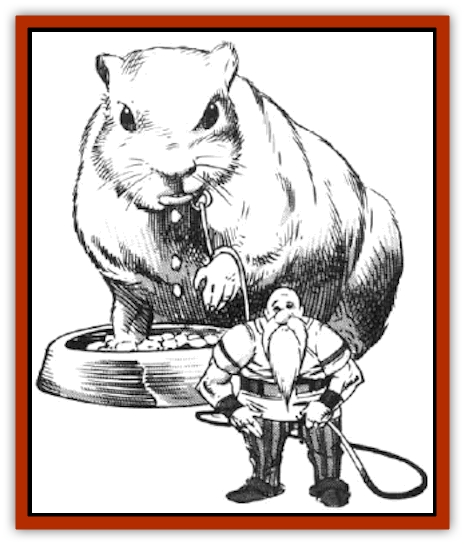

# Hamster - Giant Space

| Statistic | **Hamster, Giant Space** |
| --- | --- |
| **Activity Cycle:** | Night |
| **Alignment:** | Neutral |
| **Armor Class:** | 8 |
| **Climate/Terrain:** | Temperate/Grassy plains and hills |
| **Damage/Attack:** | 2-8 |
| **Diet:** | Omnivore |
| **Frequency:** | Common to very rare |
| **Hit Dice:** | 4 |
| **Intelligence:** | Animal (1) |
| **Magic Resistance:** | Nil |
| **Morale:** | Unsteady (6) (if wild: Average (9)) |
| **Movement:** | 9, Br 3 (hard earth) |
| **No. Appearing:** | See below |
| **No. of Attacks:** | 1 |
| **Organization:** | Small pack |
| **Size:** | L (up to 9' long) |
| **Special Attacks:** | Nil |
| **Special Defenses:** | Immune to disease |
| **THAC0:** | 17 |
| **Treasure:** | Nil |
| **XP Value:** | 175 |

Giant space hamsters are exactly what they sound like-cute but brown-bear-sized rodents with thick fur. They are found on worlds having colonies of Krynnish [[Gnome|gnomes]] (gnomoi and [[Gnome_Tinker|minoi]]). Giant space hamsters come in a variety of colors, but are usually golden brown with white underbellies, bands, and spots. They are well muscled but appear fat. A giant space hamster can store up to 200 lbs. of food in its cheeks.

**Combat:** Giant space hamsters normally have only one mode of attack - a nasty bite. They avoid even this on most occasions, as domestic breeds are quite cowardly. However, wild breeds are more aggressive, and they briefly charge at anyone who approaches a burrow. Domesticated females profiting their litters also have improved morale (9). Careless gnome handlers have sometimes been bitten and (on a successful attack roll of 19 or better) stuffed into a cheek pouch, from which the gnome may escape if he rolls a successful Strength roll to open doors on a subsequent round. Trapped gnomes are merely covered in hamster spit, and are eventually spat out like old chewing gum when the hamster sees food.

**Habitat/Society:** A small pack of giant space hamsters consists of 1d4 adults (select the sexes by starting with a female and alienating thereafter, so a pack of three hamsters consists of two females and a male), with a 20% chance per adult female of 1d4 young being present (AC 10, MV 3, HD 1, #AT nil, Size S 3' long) and another 20% chance per adult female of 1d4 juvenile being present (AC 9, MV 6, HD 2, THAC0 19, #AT 1, Dmg 1d4, Size M 6' long). Gnomes are unable to figure out how to reduce their breeding rate, aside from seperating the sexes (this conclusion was suggested after a 22-year-long research program that included five gnome fatalities). Giant space hamsters can easily have several litters in one year, and they grow to breeding adulthood in but two years. These creatures live 18 years at most, and remain fertile all their adult lives.

**Ecology:** Giant space hamster easily fill the niche ocupied by large browsing animals, such as the [[Elephant|elephant]] and the rhino on Earth, though most of them lack any real means of defending themselves. In the wild, they often die out despite their extraordinary reproductive rate. They are preyed upon by large- and medium-size carnivores, but they are immune to all parasites and diseases, magical or not. Cold weather forces them to hibernate for up to six months until the weather improves.

These creatures did not evolve naturally, as one might guess. They were created by a gnome research committee attempting to develop a relatively passive creature large enough to wind up the giant rubber bands attached to the huge running wheels inside gnomish spelljammer craft. These devices produce internal power from torque. (Teams of gnomes formerly filled this job.) The giant space hamsters produced by the committee ran for hours inside their big wheels, and were eventually spread through space.

Gnomes have found that the meat of giant space hamsters is quite tasty. Space hamster meat is called "spaham", and many gnomes eat large quantities of spaham with every meal. Many hamster ranches simply breed giant space hamsters as livestock.

---
## Discovery & Documentation

**Source Publication:** MC7 Spelljammer Appendix I (1990)
**Campaign Setting:** Advanced Dungeons & Dragons 2nd Edition
**Author(s):** various

### Other Creatures Found in This Source Book
   * [[Aartuk|Aartuk]]
   * [[Albari|Albari]]
   * [[Ancient_Mariner|Ancient Mariner]]
   * [[Argos|Argos]]
   * [[Beholder_Abomination_Astereater|Beholder (Abomination), Astereater]]
   * [[Blazozoid|Blazozoid]]
   * [[Chattur|Chattur]]
   * [[Chevall|Chevall]]
   * [[Clockwork_Horror|Clockwork Horror]]
   * [[Colossus|Colossus]]
   * [[Delphinid|Delphinid]]
   * [[Dizantar|Dizantar]]
   * [[Dog|Dog]]
   * [[Dog_Bog_Hound|Dog, Bog Hound]]
   * [[Esthetic|Esthetic]]
   * [[Focoid|Focoid]]
   * [[Fractine|Fractine]]
   * [[Giant_Spacesea|Giant, Spacesea]]
   * [[Golem_Furnace|Golem, Furnace]]
   * [[Golem_Radiant|Golem, Radiant]]
   * [[Gravislayer|Gravislayer]]
   * [[Grommam|Grommam]]
   * [[Hadozee|Hadozee]]
   * [[Jammer_Leech|Jammer Leech]]
   * [[Lakshu|Lakshu]]
   * [[Lumineaux|Lumineaux]]
   * [[Lutum|Lutum]]
   * [[Mimic_Space|Mimic, Space]]
   * [[Misi|Misi]]
   * [[Moon_Rogue|Moon, Rogue]]
   * [[Mortiss|Mortiss]]
   * [[Murderoid|Murderoid]]
   * [[Nay-Churr|Nay-Churr]]
   * [[Phlog-Crawler|Phlog-Crawler]]
   * [[Plasman|Plasman]]
   * [[Plasmoid_DeGleash|Plasmoid, DeGleash]]
   * [[Plasmoid_DelNoric|Plasmoid, DelNoric]]
   * [[Plasmoid_General_Information|Plasmoid, General Information]]
   * [[Plasmoid_Ontalak|Plasmoid, Ontalak]]
   * [[Puffer|Puffer]]
   * [[Q'nidar|Q'nidar]]
   * [[Rastipede|Rastipede]]
   * [[Reigar|Reigar]]
   * [[Rock_Hopper|Rock Hopper]]
   * [[Slinker|Slinker]]
   * [[Spider_Asteroid|Spider, Asteroid]]
   * [[Spiritjam|Spiritjam]]
   * [[Survivor|Survivor]]
   * [[Syllix|Syllix]]
   * [[Symbiont_Power|Symbiont, Power]]
   * [[Vine_Infinity|Vine, Infinity]]
   * [[Wiggle|Wiggle]]
   * [[Wizshade|Wizshade]]
   * [[Wryback|Wryback]]
   * [[Zard|Zard]]
   * [[Zodar|Zodar]]
