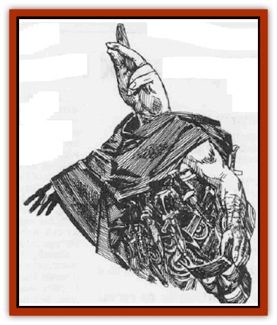
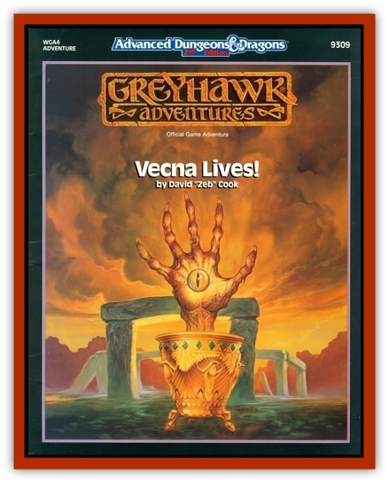

# Hand - The

| Statistic | **Hand, The** |
| --- | --- |
| **Activity Cycle:** | Any |
| **Alignment:** | Lawful evil |
| **Armor Class:** | 0 |
| **Climate/Terrain:** | Any |
| **Damage/Attack:** | 1-8 (&times;2, weapon) +7/1-10+7 |
| **Diet:** | Strength |
| **Frequency:** | Unique |
| **Hit Dice:** | 13 |
| **Intelligence:** | Low (5-7) |
| **Magic Resistance:** | Nil |
| **Morale:** | Champion (15-16) |
| **Movement:** | 12 |
| **No. Appearing:** | 1 |
| **No. of Attacks:** | 3 |
| **Organization:** | Solitary |
| **Size:** | M (4'6&rdquo;) |
| **Special Attacks:** | Strength drain |
| **Special Defenses:** | Nil |
| **THAC0:** | 7 |
| **Treasure:** | Nil |
| **XP Value:** | 7,000 |

The Hand is the second of the cult of Vecna's two lieutenants, the other being [[Eye_The|the Eye]]. Like the Eye, the Hand is a created being, a human modified by powerful spells to become what it is today. Only one has ever been identified, and given the difficulty of creating the Hand, it is likely that only one exists.

The Hand is a squat, heavily-muscled humanoid, almost dwarven in size and shape. As part of the transformation, the Hand no longer has a head. Instead, a giant hand sprouts from its neck. There are  no indications of mouth or sensory organs, yet the Hand does not seem impaired for the lack of these. The Hand dresses in a pleated kilt, decorated with colorful swirls and jagged stripes. A thick leather girdle, festooned with daggers, is its only other garb. In public it wears a blue-green robe with a large hood. It grips an embossed leather mask to hide its "face".

**Combat:** The Hand was intended to fight, to be the muscle of the of the Cult of Vecna. It is well-suited to the task. The Hand has a 19 Strength (+3 to attack rolls and +7 to damage). It fights with weapons in its two normal hands and crushes with the third, strange appendage.

The Hand normally begins a battle by throwing daggers (1d4+7 points of damage), two per turn. It carries 12 daggers on its belt. Just before closing for a melee, it draws the two swords carried on its back. It can fight with both of these with no penalty. The third hand is used to seize and crush the opponent, causing 1d10+7 points of damage with a successful attack (and holding on to squeeze for the same damage each round after a successful attack).

It is by this third attack that the Hand feeds. Lacking a mouth, it finds nourishment by drawing the strength from other things, living and non-living. Gripped in its third hand, steel becomes brittle like glass until it finally crumbles into dust. Living creatures lose 1d6 points of Strength each round they are held. The Hand can maintain its grip from round to round, both causing damage and draining Strength. Held characters can break free by rolling a successful Strength check. If a character is drained to 0 Strength or less, he dies. Lost Strength is regained at the rate of one point per day.

**Habitat/Society:** The Hand was created, through spells, by the wizard-priests of Vecna. The process is incredibly complex and torturously painful - indeed, so much so, that it peels the essence of humanity away from its subject. What is left is a barely intelligent, bestial thing. Unable to speak, the Hand can only express its rages through mute gestures. Like the Eye, the Hand is marked by strange behaviors. Fawning submissiveness, gently stroking a friendly hand, suddenly becomes hysterical rage, as he blindly flings himself at walls. Even when calm, the Hand is never still, trembling and twitching uncontrollably.

Since it lacks mouth and ears, the priests communicate with the Hand via telepathy. Although it lacks sensory organs, the Hand is endowed with magical senses equal to or slightly better than a normal person's. The Hand is immune to darkness, blindness, deafness, and other attacks that would affect a normal creature's sensory organs. A *dispel magic* renders it blind for one round.

**Ecology:** Among the cultists of Vecna, the Hand is ranked after the high priests and the Eye. It is held in great fear by the cult's followers, since it carries out the pronouncements of the high priests, but its brute physical quality does not inspire the icy terror of a more sinister being like the Eye.

---
## Discovery & Documentation

**Source Publication:** WGA4 Vecna Lives! (1990)
**Campaign Setting:** Greyhawk
**Author(s):** David "Zeb" Cook

### Other Creatures Found in This Source Book
   * [[Eye_The|Eye, The]]
